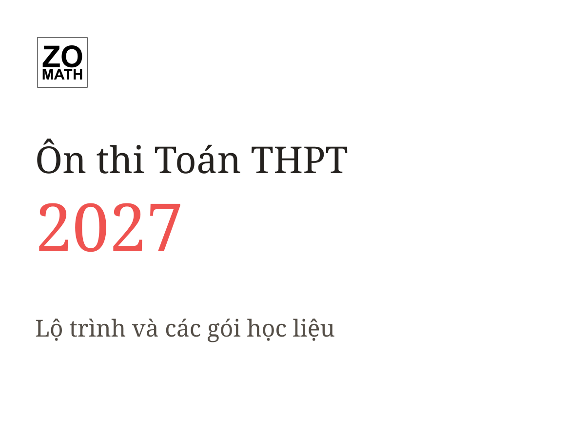

<!-- generated by ZO Math build -->
::: {.zo-on-thi .zo-on-thi-program-feature data-on-thi-home-feature="true" data-on-thi-colors="canonical" style="--zo-on-thi-gray-300: #dfd7ca; --zo-on-thi-gray-800: #3e3a35"}

::: {.zo-on-thi-program-feature__cover}
{alt="Bìa Ôn thi Toán THPT 2027"}
:::

::: {.zo-on-thi-program-feature__copy}

::: {.zo-on-thi-kicker}
Chương trình trọng điểm · Đang triển khai
:::

## Ôn thi Toán THPT 2027

::: {.zo-on-thi-program-feature__tagline}
Học từ chỗ hổng thực sự, củng cố từng nền tảng và theo dõi tiến bộ qua các gói học liệu có cấu trúc.
:::

::: {.zo-on-thi-program-feature__latest}
Gói mới nhất: R1-G02

Giá trị lớn nhất và giá trị nhỏ nhất
:::

[Khám phá chương trình →](content/thpt/on_thi_toan_thpt/tot_nghiep_thpt/2027/index.qmd){.zo-on-thi-link}

:::

:::
