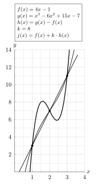

# Ghi chú code PGFPlots cho hình

<p align="center">
  
</p>

# 1. Khung biên dịch và gói lệnh

```tex
\documentclass[border=6pt]{standalone}
\usepackage{tikz}
\usepackage{pgfplots}
\pgfplotsset{compat=1.18}
```

- `standalone`: biên dịch mỗi hình thành một PDF độc lập (rất hợp workflow Quarto).
- `border=6pt`: tạo lề trắng quanh hình (bạn đã chốt dùng cố định).
- `tikz`: nền tảng vẽ hình.
- `pgfplots`: vẽ đồ thị theo hệ trục.
- `compat=1.18`: cố định phiên bản hành vi của PGFPlots (tránh thay đổi khi nâng cấp).

## 2. Môi trường `axis`: thiết lập hệ trục, lưới, nhãn

```tex
\begin{axis}[ ... ]
...
\end{axis}
```

Đây là “khung tọa độ” mà mọi `\addplot` sẽ vẽ vào.

### 2.1. Trục tọa độ

```tex
axis lines=middle,
axis line style={-},
```

- `axis lines=middle`: đưa hai trục Ox, Oy đi qua gốc (0,0) và nằm giữa vùng vẽ.
- `axis line style={-}`: kiểu nét cho trục. (Nếu muốn mũi tên, thường dùng `axis line style={->}` hoặc `<->`.)

### 2.2. Tỉ lệ đơn vị giữa Ox và Oy

```tex
unit vector ratio*=2 1 1,
scale only axis,
```

- `unit vector ratio*=2 1 1`: đặt **tỉ lệ độ dài 1 đơn vị** theo (x:y:z) = (2:1:1). Nghĩa là **1 đơn vị trên Ox dài gấp đôi 1 đơn vị trên Oy**.
- `scale only axis`: đảm bảo việc scale áp vào “vùng trục” (axis box) thay vì tính cả nhãn/legend; giúp hình ổn định khi thay đổi nhãn.

### 2.3. Cửa sổ nhìn (viewport) và vạch chia

```tex
xmin=0, xmax=4,
ymin=0, ymax=14.0,
xtick={0,1,2,3,4},
ytick={0,2,4,6,8,10,12,14},
```

- `xmin/xmax/ymin/ymax`: giới hạn vùng dữ liệu được hiển thị.
- `xtick/ytick`: danh sách các vạch chia chính (major ticks).
  Bạn đang chọn Oy cách 2 đơn vị → phù hợp với bài (giá trị y 3,7,11).

### 2.4. Lưới và vạch phụ (minor ticks)

```tex
grid=both,
major grid style={line width=0.3pt},
minor grid style={line width=0.2pt},
minor tick num=1,
```

- `grid=both`: vẽ lưới theo cả major và minor ticks.
- `major grid style`: kiểu đường lưới chính.
- `minor grid style`: kiểu đường lưới phụ.
- `minor tick num=1`: mỗi khoảng giữa hai major ticks sẽ có **1 vạch phụ** (tức chia đôi).
  Ví dụ: giữa x=1 và x=2 sẽ có x=1.5; giữa y=2 và y=4 sẽ có y=3.

### 2.5. Nhãn trục và vị trí nhãn

```tex
xlabel={$x$},
ylabel={$y$},
xlabel style={right},
ylabel style={above},
```

- `xlabel/ylabel`: nội dung nhãn.
- `xlabel style={right}`: đẩy nhãn “x” về phía phải cuối trục.
- `ylabel style={above}`: đẩy nhãn “y” lên phía trên cuối trục.

### 2.6. Cắt phần vượt khung

```tex
clip=true,
```

- `clip=true`: mọi đường vẽ **vượt ra ngoài khung axis** sẽ bị cắt (tránh tình trạng “tràn” như trước).

## 3. Các lệnh `\addplot`: vẽ hàm số và điểm

### 3.1. Đường thẳng (f(x)=4x-1)

```tex
\addplot[domain=0:3.6, samples=200, thick] {4*x - 1};
```

- `domain=0:3.6`: khoảng x để lấy mẫu vẽ đường.
- `samples=200`: số điểm mẫu (càng nhiều càng mịn).
- `thick`: độ dày nét.
- `{4*x - 1}`: biểu thức theo cú pháp PGFMath (`x` là biến).

### 3.2. Đa thức bậc ba (g(x)=x^3-6x^2+15x-7)

```tex
\addplot[domain=0:3.6, samples=400, thick] {x^3 - 6*x^2 + 15*x - 7};
```

- `samples=400` cao hơn vì đường cong “uốn” nhiều hơn → cần mịn hơn.

### 3.3. Đường (j(x)=f(x)+k h(x)) với (k=8)

```tex
\addplot[domain=0:3.6, samples=600, very thick]
  { (4*x - 1) + 8*(x^3 - 6*x^2 + 11*x - 6) };
```

- `very thick`: nhấn mạnh đường đang “thay đổi theo k”.
- Bạn không vẽ trực tiếp (h(x)) nhưng dùng công thức của nó trong biểu thức.
- `samples=600`: tăng mịn để đường dày vẫn đẹp.

### 3.4. Ba điểm giao (marker)

```tex
\addplot[only marks, mark=*, mark size=1.6pt] coordinates {(1,3) (2,7) (3,11)};
```

- `only marks`: chỉ vẽ điểm, không nối.
- `mark=*`: chấm tròn đặc.
- `coordinates {...}`: tọa độ các điểm.

## 4. Hộp ghi chú `\node`: ý nghĩa và điểm cần lưu ý

Bạn đặt node **sau `\end{axis}`**:

```tex
\end{axis}

\node[...] at (0,10) {...};
```

Điều này có một hệ quả quan trọng:

- **Node này đang dùng hệ tọa độ của `tikzpicture`**, không phải “tọa độ dữ liệu” của trục (`axis cs:`).

Vì vậy, `(0,10)` ở đây **không có nghĩa** “x=0, y=10 theo trục”. Nó là tọa độ canvas TikZ sau khi PGFPlots đặt axis box.
Việc bạn vẫn đặt được đẹp là vì bạn đã “canh mắt” tốt, nhưng nếu sau này đổi kích thước/ratio/xmax/ymax thì node có thể lệch.

### 4.1. Các tùy chọn node

```tex
draw, fill=white, anchor=north west, inner sep=4pt, font=\small
```

- `draw`: vẽ khung hộp.
- `fill=white`: nền trắng.
- `anchor=north west`: điểm neo là góc trên-trái của hộp.
- `inner sep=4pt`: khoảng đệm trong hộp.
- `font=\small`: font nhỏ hơn để gọn.

### 4.2. Nội dung trong hộp: `tabular`

Bạn dùng:

```tex
\begin{tabular}{@{}l@{}}
...
\end{tabular}
```

- `l`: canh trái mỗi dòng.
- `@{} ... @{}`

  - loại bỏ padding trái/phải mặc định của bảng để hộp gọn.

## 5. Nâng cấp nhẹ (nếu sau này muốn node “dính” theo trục một cách ổn định)

Nếu bạn muốn hộp luôn nằm tại “tọa độ dữ liệu” (ví dụ gần góc trên-trái trong hệ trục), hãy đặt node **bên trong `axis`** và dùng `axis cs:`:

```tex
\node[...] at (axis cs:0.1,13.8) {...};
```

Hoặc nếu bạn muốn hộp bám theo khung trục (không phụ thuộc dữ liệu), dùng `axis description cs:`:

```tex
\node[...] at (axis description cs:0.02,0.98) {...};
```

Nhưng hiện tại bạn đã “chốt” bố cục ổn, nên chỉ xem phần này như ghi chú nâng cấp.

---

## Phiên bản `.tex` có chú thích ngay trong code (giữ nguyên logic của bạn)

```tex
\documentclass[border=6pt]{standalone}

\usepackage{tikz}
\usepackage{pgfplots}
\pgfplotsset{compat=1.18}

\begin{document}
\begin{tikzpicture}

\begin{axis}[
  % Trục đi qua gốc (0,0)
  axis lines=middle,
  % Kiểu nét trục
  axis line style={-},

  % Tỉ lệ đơn vị: 1 đơn vị Ox dài gấp đôi 1 đơn vị Oy
  unit vector ratio*=2 1 1,

  % Scale chỉ tính trên vùng trục (ổn định hơn khi có nhãn/ghi chú)
  scale only axis,

  % Cửa sổ hiển thị
  xmin=0, xmax=4,
  ymin=0, ymax=14.0,

  % Vạch chia chính
  xtick={0,1,2,3,4},
  ytick={0,2,4,6,8,10,12,14},

  % Lưới: cả major & minor
  grid=both,
  major grid style={line width=0.3pt},
  minor grid style={line width=0.2pt},
  % 1 vạch phụ giữa 2 vạch chính
  minor tick num=1,

  % Nhãn trục và vị trí nhãn
  xlabel={$x$},
  ylabel={$y$},
  xlabel style={right},
  ylabel style={above},

  % Cắt phần đồ thị vượt khung
  clip=true,
]

% f(x)=4x-1
\addplot[domain=0:3.6, samples=200, thick] {4*x - 1};

% g(x)=x^3-6x^2+15x-7
\addplot[domain=0:3.6, samples=400, thick] {x^3 - 6*x^2 + 15*x - 7};

% j(x)=f(x)+k*h(x), với k=8 và h(x)=x^3-6x^2+11x-6
\addplot[domain=0:3.6, samples=600, very thick]
  { (4*x - 1) + 8*(x^3 - 6*x^2 + 11*x - 6) };

% Các điểm giao (1,3), (2,7), (3,11)
\addplot[only marks, mark=*, mark size=1.6pt]
  coordinates {(1,3) (2,7) (3,11)};

\end{axis}

% Ghi chú: node đặt ngoài axis nên (0,10) là tọa độ canvas TikZ,
% không phải (x,y) theo dữ liệu của trục.
\node[
  draw,
  fill=white,
  anchor=north west,
  inner sep=4pt,
  font=\small
] at (0,10) {%
  \begin{tabular}{@{}l@{}}
    $f(x)=4x-1$\\
    $g(x)=x^3-6x^2+15x-7$\\
    $h(x)=g(x)-f(x)$\\
    $k=8$\\
    $j(x)=f(x)+k\cdot h(x)$
  \end{tabular}%
};

\end{tikzpicture}
\end{document}
```

Nếu bạn muốn, mình có thể viết thêm một đoạn “mẹo” nhỏ trong file `.md` về cách đổi `k` thành một biến (ví dụ dùng `\pgfmathsetmacro{\k}{8}`) để thay đổi nhanh mà không sửa biểu thức dài.
