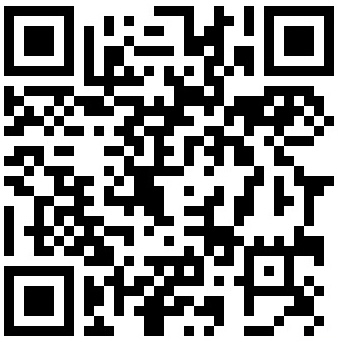

ZO Math được xây dựng như một không gian học Toán chậm rãi, cẩn thận và mở rộng. Đây là nơi dành cho học sinh, giáo viên, người tự học, và cho tất cả những ai muốn ở bên cạnh Toán học dài lâu.

Để một bài viết, một hình vẽ, một trang tài liệu hay một hoạt ảnh có thể thành hình, ZO Math cần thời gian để đọc, nghĩ, thử, sửa, rồi trình bày lại sao cho rõ ràng hơn. Nếu bạn thấy công việc ấy có ích và muốn cùng nâng đỡ nó, bạn có thể bảo trợ tự nguyện cho ZO Math.

Mỗi sự nâng đỡ từ bạn giúp ZO Math có thêm điều kiện để tiếp tục làm việc đều đặn, độc lập và bền bỉ hơn.

## Bảo trợ trực tiếp

::: {.support-box}
::: {.support-qr}
{fig-alt="Mã QR chuyển khoản bảo trợ ZO Math"}
:::

::: {.support-info}
Bạn có thể quét mã QR để bảo trợ ZO Math qua chuyển khoản ngân hàng.

| Thông tin | Nội dung |
|---|---|
| Chủ tài khoản | Nguyễn Tấn Nhựt |
| Số tài khoản | 0601000137768 |
| Ngân hàng | Vietcombank |
| Nội dung gợi ý | `Bao tro ZO Math` |

Khoản bảo trợ là tự nguyện, dành cho hoạt động sáng tạo nội dung giáo dục của ZO Math. Đây không phải là hoạt động vận động từ thiện, cũng không phải một giao dịch mua bán bắt buộc.
:::
:::

## Khoản bảo trợ được dùng cho việc gì?

Các khoản bảo trợ giúp ZO Math duy trì những công việc nền tảng:

- Viết và biên tập các bài học, bài luận, chuyên đề Toán học.
- Thiết kế hình vẽ, đồ thị, bảng biểu và tài liệu học tập.
- Dựng hoạt ảnh, hình động và các nội dung giảng giải trực quan.
- Duy trì trang, tên miền, công cụ làm việc và kho tư liệu.
- Nuôi dưỡng các dự án dài hạn của ZO Math.

## Ghi danh người bảo trợ

ZO Math luôn trân trọng những người đã âm thầm hoặc công khai nâng đỡ dự án. Nếu bạn muốn để lại tên trên trang [Cảm ơn](thanks.qmd), bạn có thể ghi tên hiển thị trong nội dung chuyển khoản, hoặc gửi lời nhắn qua trang [Liên hệ](../contact.qmd) sau khi bảo trợ.

Nếu bạn muốn giữ sự hỗ trợ ấy ở dạng riêng tư, ZO Math cũng trân trọng điều đó và sẽ không công khai bất kỳ thông tin nào khi chưa có sự đồng ý của bạn.

## Lan tỏa ZO Math

Ngoài việc bảo trợ tài chính, bạn cũng có thể giúp ZO Math bằng cách chia sẻ các bài viết, giới thiệu ZO Math cho học sinh, giáo viên, bạn bè, hoặc theo dõi các kênh nội dung của ZO Math.

Mỗi lượt đọc kĩ, mỗi lời góp ý và mỗi lần chia sẻ đều giúp ZO Math tiến xa hơn một chút.

::: {.support-closing}
Sự nâng đỡ từ bạn làm cho sự hiện diện của ZO Math trở nên có ý nghĩa hơn.
:::