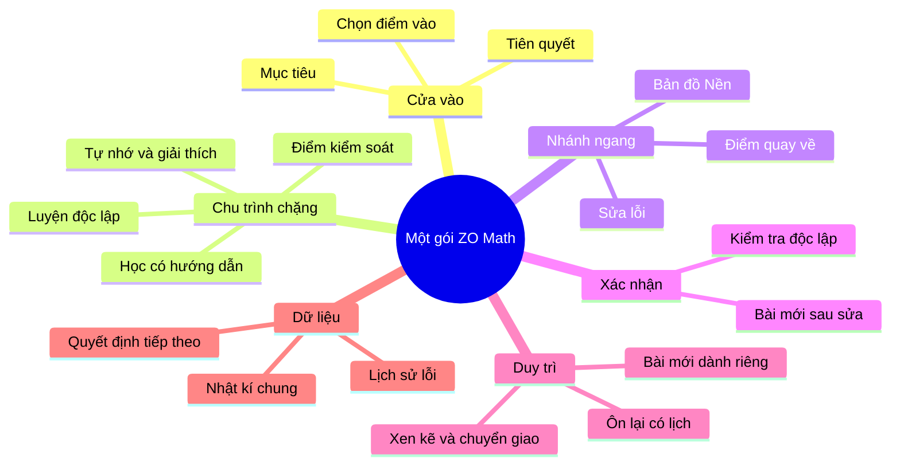
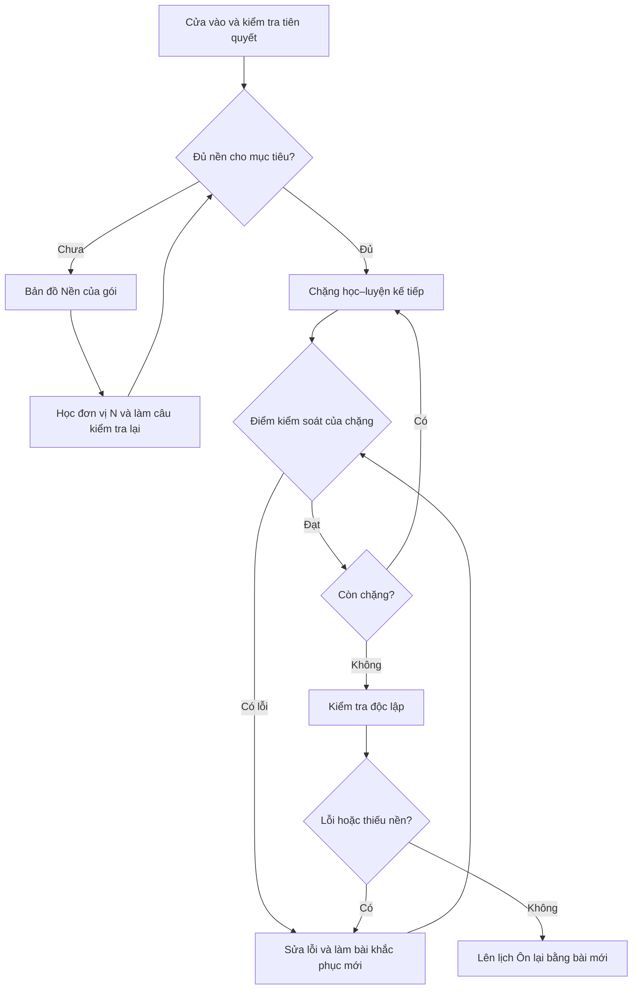
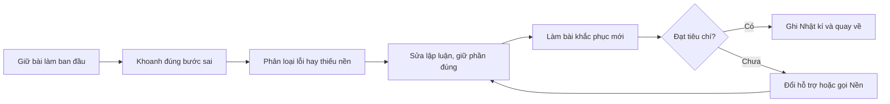
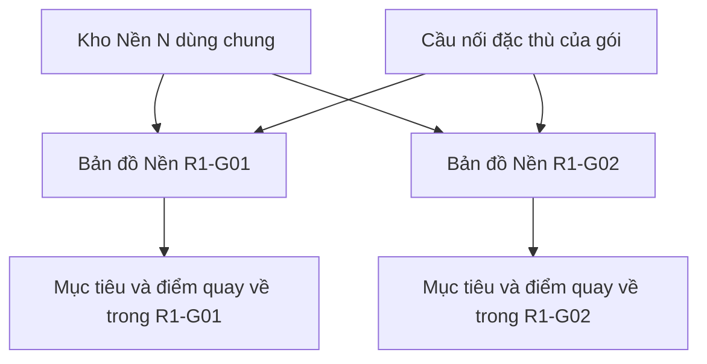
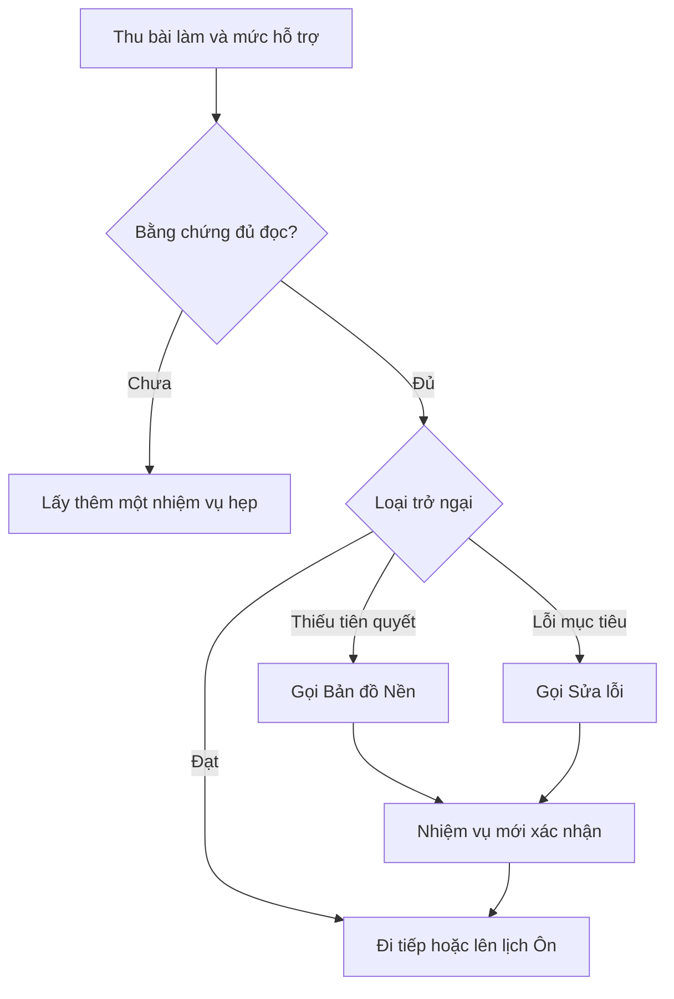

# ZO Math — Đặc tả kiến trúc học tập chung của một gói học liệu

- **Phiên bản:** 0.2
- **Ngày:** 2026-10-03
- **Trạng thái:** Đã được người chủ trì duyệt ngày 2026-10-03
- **Phạm vi áp dụng trước mắt:** R1-G01 và R1-G02; dùng làm chuẩn cho các gói R1-Gxx tiếp theo
- **Tài liệu điều hành canonical:** Kế hoạch thực hiện 2027 phiên bản 0.6
- **Thay thế:** Bản dự thảo 0.1
- **Giới hạn:** Chưa sửa repo, giao diện hoặc nội dung toán học của các gói

---

## 0. Kết luận điều hành

Kiến trúc được chọn là **chu trình học có bằng chứng và vòng sửa tại từng điểm kiểm soát**, không phải chuỗi trang tuyến tính `Bài học → Luyện tập → Kiểm tra → Sửa lỗi → Ôn lại`.

Bốn ý tưởng người chủ trì nêu được xử lí như sau:

| Ý tưởng | Quyết định | Cách đưa vào chuẩn |
|---|---|---|
| Sửa lỗi sau từng chặng Luyện tập và thêm một lượt sau Kiểm tra | **Chấp nhận, có hiệu chỉnh thuật ngữ** | Mỗi chặng Luyện tập kết thúc bằng một **điểm kiểm soát sửa lỗi**. Nếu không có lỗi thì đi tiếp; nếu có lỗi thì kích hoạt vòng Sửa lỗi. Kiểm tra và từng lượt Ôn lại cũng có điểm kiểm soát riêng. |
| Nhật kí phải có mẫu chung và ví dụ giả lập | **Chấp nhận** | Mọi gói dùng cùng schema tối thiểu, cùng quy ước mã và có một bản ghi giả lập hoàn chỉnh; nội dung toán học trong bản ghi thay đổi theo gói. |
| Mỗi gói có một “Nền con” | **Chấp nhận chức năng, không chấp nhận sao chép nội dung** | Mỗi gói có **Bản đồ Nền của gói** trong Tài nguyên hỗ trợ. Bản đồ này chọn và sắp tuyến các đơn vị từ kho Nền N dùng chung; chỉ viết thêm cầu nối đặc thù khi thật sự cần. |
| Ôn lại cần bài tập mới chuẩn bị riêng | **Chấp nhận** | Mỗi gói có ngân hàng Ôn lại dành riêng, chưa lộ ở Bài học, Luyện tập, Sửa lỗi hoặc Kiểm tra. Bài cũ chỉ dùng để xem lại lập luận, không làm bằng chứng chính cho độ bền. |

Điểm quan trọng cần nói thật: không có nghiên cứu nào chứng minh một kiến trúc duy nhất là “hiệu quả nhất thế giới” cho mọi học sinh và mọi chủ đề Toán. Chuẩn này được chọn vì nó là phương án **mạnh nhất theo bằng chứng hiện có, tự vận hành được, kiểm tra được và phù hợp với thời hạn ôn thi THPT Việt Nam**. Những con số như ba chặng, 80% hay mốc 2–3 ngày/7 ngày/3–4 tuần vẫn là tham số cần theo dõi, không phải chân lí nghiên cứu.

## 1. Mục tiêu và ranh giới ổn định

Đặc tả tách bốn lớp không được trộn lẫn:

1. **Kiến trúc học tập:** quan hệ giữa hoạt động, bằng chứng, vòng sửa và điều kiện chuyển tiếp.
2. **Nội dung toán học:** mục tiêu, ví dụ, bài tập, lỗi điển hình và lời giải của từng gói.
3. **Tham số vận hành:** số chặng, số câu, ngưỡng, thời lượng và lịch ôn.
4. **Giao diện xuất bản:** tab, thẻ, nút, sidebar, PDF và HTML.

Mục tiêu của bản 0.2 là khóa lớp thứ nhất đủ chắc để sau này chủ yếu thay nội dung và tham số, không phải thay lại logic học.

### 1.1. Hạt nhân cần giữ ổn định

Các quyết định sau là **hạt nhân kiến trúc**:

- học sinh luôn tạo sản phẩm trước khi xem lời giải;
- mỗi chặng học kết thúc bằng bằng chứng và một quyết định;
- Luyện tập, Kiểm tra và Ôn lại đều có điểm kiểm soát sửa lỗi;
- Sửa lỗi chỉ được xác nhận bằng một nhiệm vụ mới;
- Nền N là tài nguyên dùng chung; mỗi gói chỉ giữ bản đồ gọi Nền và điểm quay về;
- ngân hàng nhiệm vụ cho Luyện tập, Sửa lỗi, Kiểm tra và Ôn lại được tách vai trò;
- Nhật kí dùng schema chung và lưu bằng chứng theo mục tiêu;
- mọi đường rẽ đều có đích thật, nhiệm vụ kiểm tra lại và điểm quay về;
- hoàn tất lượt học chính khác với duy trì sau khoảng trễ.

### 1.2. Những gì được điều chỉnh mà không đổi kiến trúc

- số chặng Luyện tập;
- số câu trong mỗi chặng;
- khoảng cách giữa các lượt Ôn lại;
- ngưỡng giảm luyện riêng;
- quỹ thời gian Sửa lỗi;
- tỉ lệ trắc nghiệm, đúng/sai, trả lời ngắn và tự luận;
- độ khó, dữ kiện, biểu diễn và bối cảnh của bài toán.

## 2. Căn cứ và giới hạn suy luận

### 2.1. Căn cứ nội bộ

- Kế hoạch thực hiện 2027 phiên bản 0.6, nhất là 3.13, 4.5–4.6 và 5.5–5.7;
- checkpoint ngữ cảnh chiến lược trước D0;
- hướng dẫn học một gói hiện hành;
- nội dung đầy đủ của R1-G01 và R1-G02;
- kết quả triển khai, kiểm tra và xuất bản Cụm sửa 01;
- đặc tả kiến trúc học tập chung phiên bản 0.1.

### 2.2. Đối chiếu nghiên cứu bổ sung

Các kết luận thiết kế dưới đây nhất quán với hồ sơ NC01–NC10 trong Kế hoạch 0.6 và được đối chiếu thêm bằng nguồn gốc sau:

- Agarwal, Nunes & Blunt (2021): tổng quan 50 thí nghiệm lớp học cho thấy luyện nhớ lại có lợi trong nhiều điều kiện, nhưng chỉ 6% thí nghiệm ở ngoài nhóm quốc gia WEIRD. DOI: [10.1007/s10648-021-09595-9](https://doi.org/10.1007/s10648-021-09595-9).
- Wisniewski, Zierer & Hattie (2020): phản hồi có hiệu ứng trung bình nhưng rất dị biệt; nội dung thông tin của phản hồi là biến quan trọng. DOI: [10.3389/fpsyg.2019.03087](https://doi.org/10.3389/fpsyg.2019.03087).
- Rohrer, Dedrick & Burgess (2014): thí nghiệm lớp học Toán cho thấy luyện xen kẽ có thể cải thiện việc chọn chiến lược, nhưng đó là một nghiên cứu lớp 7 với phạm vi cụ thể, không phải công thức chung cho THPT Việt Nam. DOI: [10.3758/s13423-014-0588-3](https://doi.org/10.3758/s13423-014-0588-3).
- Pashler và cộng sự (2007), IES: khuyến nghị giãn cách, xen ví dụ đã giải với tự giải, dùng kiểm tra để học và đặt câu hỏi giải thích sâu. [Báo cáo IES](https://ies.ed.gov/ncee/wwc/practiceguide/1).
- Mawson & Kang (2025): phân tích tổng hợp nghiên cứu lớp học về luyện phân tán tìm thấy lợi thế trung bình cho phân tán so với dồn khối, nhưng chỉ có 22 báo cáo/31 kích thước hiệu ứng và chưa xác định được một lịch tối ưu duy nhất. DOI: [10.3390/bs15060771](https://doi.org/10.3390/bs15060771).

### 2.3. Điều bằng chứng cho phép và không cho phép nói

Bằng chứng hỗ trợ việc:

- buộc người học tự nhớ, tự giải hoặc tự giải thích;
- thu bằng chứng thường xuyên với mức cược thấp;
- phản hồi đủ thông tin rồi thử lại;
- quay lại mục tiêu sau khoảng trễ;
- chuyển dần từ bài cùng loại sang lựa chọn chiến lược giữa các loại bài;
- dùng ví dụ đã giải khi học sinh chưa có đủ cấu trúc để tự giải.

Bằng chứng **không** cho phép khẳng định:

- mọi gói phải có đúng ba chặng;
- mọi lỗi phải được sửa ngay sau từng câu;
- một lịch ôn cố định phù hợp cho mọi học sinh;
- đúng 80% đồng nghĩa đã làm chủ hoặc chuyển giao;
- cùng một bài làm đúng lần hai chứng minh ghi nhớ bền vững;
- kiến trúc này tự động làm tăng điểm thi nếu nội dung, thời lượng hoặc việc thực hiện không đạt chuẩn.

## 3. Đơn vị thiết kế cơ bản

Đơn vị thiết kế không phải “trang”, mà là **chu trình học có bằng chứng**:

1. mục tiêu hẹp;
2. kiến thức/biểu diễn cần thiết;
3. hành động tự tạo của học sinh;
4. bằng chứng quan sát được;
5. quyết định đi tiếp, bổ sung Nền hay Sửa lỗi;
6. nhiệm vụ mới xác nhận quyết định.

Một trang có thể chứa nhiều chu trình. Một chu trình cũng có thể dùng nhiều tài nguyên. Vì vậy, vị trí của mục `Sửa lỗi` sau `Kiểm tra` trong mục lục không quyết định thời điểm sử dụng của nó.

## 4. Sơ đồ tư duy kiến trúc

## 5. Dòng học chuẩn của một gói

Đây là một dòng học mặc định có điều kiện. Học sinh có bằng chứng đầu vào mạnh có thể đi thẳng tới Kiểm tra độc lập; nếu kết quả không xác nhận được thì hệ thống đưa em về đúng chặng hoặc đơn vị Nền, không bắt học lại toàn bộ gói.

## 6. Cửa vào

### 6.1. Thành phần bắt buộc

Cửa vào phải cho biết:

- gói giúp làm được gì;
- mục tiêu nào là thiết yếu;
- tiên quyết nào được giả định;
- câu khởi động nào phải tự làm trước;
- kết quả nào dẫn tới Bài học, Luyện tập, Kiểm tra hoặc Nền N;
- nếu rẽ sang tài nguyên khác thì quay về đâu.

### 6.2. Ba đường ra

| Bằng chứng | Quyết định |
|---|---|
| Thiếu tiên quyết | Gọi đúng đơn vị trong Bản đồ Nền, làm câu kiểm tra nền mới rồi quay về |
| Có tiên quyết nhưng chưa có bằng chứng mục tiêu | Vào chặng học–luyện tương ứng |
| Có bằng chứng ban đầu mạnh | Làm Kiểm tra độc lập để xác nhận; không bỏ qua chỉ vì cảm giác quen |

## 7. Chặng học–luyện

Mỗi gói được chia thành các chặng theo cụm mục tiêu và quan hệ phụ thuộc, không chia máy móc theo số trang hoặc số bài.

### 7.1. Cấu trúc một chặng

| Thành phần | Yêu cầu |
|---|---|
| Mục tiêu chặng | Nói rõ sau chặng học sinh tự làm được gì |
| Kích hoạt | Một câu dự đoán, tự nhớ hoặc giải thích trước khi xem |
| Học có hướng dẫn | Khái niệm, điều kiện, biểu diễn, ví dụ đã giải và phản ví dụ cần thiết |
| Tự tạo | Học sinh hoàn thành một bước, giải thích lựa chọn hoặc dựng biểu diễn |
| Luyện độc lập | Một cụm bài đủ để tạo bằng chứng cho mục tiêu chặng |
| Điểm kiểm soát | Đối chiếu theo mục tiêu, nhận diện lỗi, thiếu nền và mức hỗ trợ |
| Quyết định | Đi tiếp; gọi Nền; hoặc kích hoạt Sửa lỗi |

### 7.2. Quan hệ giữa chặng và Sửa lỗi

Nếu Luyện tập có ba chặng thì có ba **điểm kiểm soát sửa lỗi**. Điều đó không có nghĩa mọi học sinh bắt buộc làm ba lượt khắc phục:

- không có lỗi thiết yếu: ghi đạt và đi tiếp;
- có lỗi mục tiêu: vào đúng cụm Sửa lỗi của chặng;
- lỗi do thiếu tiên quyết: đi Bản đồ Nền trước, không ghi nhầm là lỗi mục tiêu;
- chưa đủ bằng chứng: làm thêm một nhiệm vụ lấy bằng chứng, chưa vội kết luận năng lực.

Sửa sau từng câu chỉ dùng khi lỗi có nguy cơ làm hỏng ngay các câu phụ thuộc. Mặc định nên hoàn thành một cụm ngắn rồi mới đối chiếu, để học sinh vẫn phải tự duy trì chiến lược và không lệ thuộc phản hồi liên tục.

## 8. Sửa lỗi là hạ tầng ngang

### 8.1. Điểm kích hoạt

Sửa lỗi được gọi từ:

- cuối mỗi chặng Luyện tập;
- sau Kiểm tra độc lập;
- sau mỗi lượt Ôn lại nếu phát hiện lỗi;
- một điểm dừng trong Bài học chỉ khi học sinh đã được dạy mục tiêu mà lỗi tiếp tục lặp. Sai trước khi được dạy thường dẫn tới giải thích/ví dụ hướng dẫn hoặc Nền N, không vội ghi thành lỗi ổn định.

### 8.2. Hai cách tra cứu bắt buộc trên trang Sửa lỗi

Trang Sửa lỗi không chỉ là danh sách chung. Nó phải có hai chỉ mục trỏ tới cùng một ngân hàng nhiệm vụ:

1. **Theo nơi phát hiện:** chặng Luyện tập 1, 2, 3; Kiểm tra; Ôn lại.
2. **Theo họ lỗi:** sai điều kiện, nhầm đối tượng, sai biến đổi, chọn sai công cụ, sai biểu diễn, thiếu kiểm tra bối cảnh, v.v.

Không nhân bản cùng một bài khắc phục ở nhiều mục. Mỗi lỗi có mã ổn định; các chỉ mục chỉ dẫn tới mã đó.

### 8.3. Hồ sơ tối thiểu của một lỗi

| Trường | Nội dung |
|---|---|
| Mã lỗi | Mã ổn định trong gói, ví dụ `R1G01-E04` |
| Dấu hiệu quan sát | Câu trả lời, dòng biến đổi hoặc kết luận nào cho thấy lỗi |
| Phân biệt | Lỗi mục tiêu, thiếu tiên quyết hay chỉ thiếu bằng chứng |
| Phần đã đúng | Giữ lại điều gì để tránh viết lại toàn bộ |
| Giải thích sửa | Điều kiện/quan hệ phải thay đổi và vì sao |
| Tài nguyên cần xem | Một đoạn, ví dụ đối chứng hoặc đơn vị Nền cụ thể |
| Bài khắc phục | Nhiệm vụ mới cùng mục tiêu nhưng không lặp nguyên dữ kiện |
| Tiêu chí xác nhận | Điều gì phải đúng, có giải thích nào, được phép hỗ trợ đến đâu |
| Điểm quay về | Chặng/câu/hoạt động tiếp theo |
| Hẹn kiểm tra lại | Khi nào lỗi này được thử lại bằng bài khác |

### 8.4. Chu trình Sửa lỗi

### 8.5. Điểm kiểm soát bắt buộc trong một gói ba chặng

| Mã điểm | Nguồn bằng chứng | Hành động nếu có lỗi |
|---|---|---|
| `CP-LT1` | Chặng Luyện tập 1 | Gọi cụm lỗi tương ứng, làm bài khắc phục mới, quay lại đầu chặng 2 hoặc bài nối |
| `CP-LT2` | Chặng Luyện tập 2 | Sửa trước nhiệm vụ phụ thuộc của chặng 3 |
| `CP-LT3` | Chặng Luyện tập 3 | Sửa trước Kiểm tra độc lập |
| `CP-KT` | Kiểm tra độc lập | Sửa theo từng mục tiêu rồi làm câu xác nhận mới; không làm lại nguyên đề |
| `CP-ONx` | Mỗi lượt Ôn lại | Sửa và rút ngắn mốc thử lại của đúng mục tiêu đó |

Số `CP-LT` thay đổi theo số chặng; `CP-KT` và `CP-ONx` luôn tồn tại.

## 9. Kiến trúc Nền N

### 9.1. Quyết định cấu trúc

Nền N có hai tầng:

1. **Kho Nền dùng chung:** nơi lưu nội dung canonical theo đơn vị nhỏ, ví dụ đọc điều kiện, biến đổi phân thức, giải bất phương trình, đọc tập xác định, dùng máy tính đúng mục đích.
2. **Bản đồ Nền của gói:** một tài nguyên hỗ trợ của R1-G01, R1-G02… chỉ ra tiên quyết nào cần cho mục tiêu nào, dấu hiệu kích hoạt, đơn vị Nền cần gọi, câu kiểm tra lại và điểm quay về.

Không tạo các bản sao kiểu “Nền con R1-G01” chứa lại toàn bộ lời giảng của kho Nền. Cách đó sẽ làm một kiến thức có nhiều bản, khó sửa và dễ mâu thuẫn.

### 9.2. Sơ đồ quan hệ

### 9.3. Hợp đồng của một tuyến Nền

| Trường | Nội dung |
|---|---|
| Mục tiêu đang bị chặn | Học sinh đang cố làm gì trong gói chính |
| Dấu hiệu thiếu nền | Bằng chứng cụ thể, không suy từ tổng điểm |
| Đơn vị N canonical | Đích thật trong kho Nền |
| Cầu nối đặc thù | Chỉ có nếu đơn vị chung chưa đủ nối với ngữ cảnh gói |
| Nhiệm vụ kiểm tra lại | Một câu mới, hẹp, không trùng ví dụ |
| Tiêu chí quay lại | Điều kiện tối thiểu để tiếp tục nhiệm vụ gốc |
| Điểm quay về | Anchor/chặng/câu chính xác |

### 9.4. Giai đoạn chưa có kho Nền hoàn chỉnh

Trước khi kho Nền chung được biên soạn, gói được phép có **đơn vị N tạm thời** nếu:

- có mã N canonical dự kiến;
- phạm vi đủ hẹp cho đúng tiên quyết;
- được đánh dấu `tạm thời`;
- có câu kiểm tra lại và điểm quay về;
- khi kho Nền chính thức xuất hiện, nội dung tạm được hợp nhất chứ không giữ hai bản song song.

## 10. Kiểm tra độc lập

Kiểm tra dùng để xác nhận học sinh có thể tự huy động kiến thức khi đóng Bài học, Luyện tập, Sửa lỗi và Lời giải.

Yêu cầu:

- nhiệm vụ chưa lộ lời giải;
- đọc kết quả theo mục tiêu, không chỉ theo tổng điểm;
- giữ bài làm ban đầu, thời gian và mức hỗ trợ;
- có nhiệm vụ chọn công cụ hoặc đọc biểu diễn, không chỉ lặp thao tác;
- sau lỗi, dùng Sửa lỗi rồi làm **câu xác nhận mới**, không làm lại nguyên câu đã nhớ đáp án;
- một mục tiêu độc lập có thể đi tiếp trong khi mục tiêu phụ thuộc đang bổ sung Nền.

Kiểm tra cuối gói không phải nơi đầu tiên học sinh nhận phản hồi. Các điểm kiểm soát của từng chặng phải ngăn lỗi lặp lại suốt toàn gói.

## 11. Ôn lại và ngân hàng bài mới

### 11.1. Vai trò

Ôn lại đo khả năng tự nhớ và sử dụng mục tiêu sau khoảng trễ. Nó không phải đọc lại tóm tắt, cũng không phải chỉ làm lại bài từng sai.

### 11.2. Mỗi lượt Ôn lại phải có

- ngày thực tế và khoảng trễ thực tế;
- một hoạt động tự nhớ trước khi mở tài liệu;
- nhiệm vụ mới dành riêng cho Ôn lại;
- ít nhất một lựa chọn chiến lược khi mục tiêu đã đủ nền;
- ghi mức hỗ trợ;
- điểm kiểm soát `CP-ONx`;
- quyết định giữ lịch, rút ngắn, giãn ra hoặc chuyển sang phối hợp.

### 11.3. Quan hệ giữa bài cũ và bài mới

| Loại nhiệm vụ | Dùng để làm gì | Có phải bằng chứng chính? |
|---|---|---|
| Bài từng sai | Khôi phục ngữ cảnh, xem lại lỗi và lập luận | Không |
| Bài khắc phục sau sửa | Xác nhận lỗi vừa được sửa trong ngắn hạn | Không đủ cho độ bền |
| Bài Ôn lại mới | Đo duy trì sau khoảng trễ | Có |
| Bài phối hợp/chuyển giao | Đo chọn công cụ trong ngữ cảnh mới | Có, cho quyết định phối hợp |

Các mốc 2–3 ngày, khoảng 7 ngày và 3–4 tuần chỉ là lịch mặc định ban đầu của Kế hoạch 0.6. Lịch thật phải thay đổi theo ngày thi, lỗi tái diễn, mức hỗ trợ và bằng chứng sau khoảng trễ.

## 12. Phân tách ngân hàng nhiệm vụ

Một gói phải quản lí tối thiểu sáu vai trò nhiệm vụ:

| Mã vai trò | Ngân hàng | Mục đích | Quy tắc bảo vệ |
|---|---|---|---|
| `H` | Học có hướng dẫn | Hình thành hiểu biết và xem mẫu | Có thể có lời giải từng bước |
| `L` | Luyện tập | Tạo bằng chứng trong từng chặng | Học sinh tự làm trước khi đối chiếu |
| `S` | Sửa lỗi | Khắc phục một họ lỗi cụ thể | Không dùng nguyên câu đã gây lỗi |
| `K` | Kiểm tra | Xác nhận độc lập cuối lượt chính | Không lộ trước trong các phần khác |
| `O` | Ôn lại | Đo duy trì sau khoảng trễ | Được dành riêng đến đúng lượt ôn |
| `P` | Phối hợp/chuyển giao | Chọn công cụ giữa nhiều mục tiêu | Chỉ dùng sau khi đã có nền tối thiểu |

Một bài toán có thể cùng họ với bài khác nhưng không được đồng thời đóng hai vai trò bằng chứng trong cùng một lượt học. Mã bài phải cho biết vai trò để toolchain và checker có thể phát hiện rò rỉ ngân hàng.

## 13. Nhật kí học tập chung

### 13.1. Vai trò

Nhật kí là lớp dữ liệu xuyên Luyện tập, Kiểm tra, Sửa lỗi và Ôn lại. Nó không phải một pha học và không chỉ nằm trong mục Ôn lại.

Nhật kí phải đủ ngắn để học sinh tự dùng, nhưng đủ cấu trúc để trả lời bốn câu:

1. Bằng chứng nào vừa xuất hiện?
2. Lỗi hoặc thiếu nền là gì?
3. Em đã làm gì để sửa?
4. Bằng chứng mới và việc tiếp theo là gì?

### 13.2. Mẫu chung bắt buộc

| Trường | Cách ghi |
|---|---|
| Ngày–giờ | Thời điểm thật |
| Gói / mục tiêu | Mã gói và mã mục tiêu |
| Nguồn phát hiện | `CP-LT1`, `CP-KT`, `CP-ON1`… và mã câu |
| Bài làm ban đầu | Tóm tắt hoặc ảnh/đường dẫn; không xóa bản sai |
| Mức hỗ trợ ban đầu | Không hỗ trợ / gợi ý / mở bài / xem lời giải |
| Bằng chứng quan sát | Dòng sai, điều kiện bỏ sót hoặc phần chưa đủ |
| Phân loại | Lỗi mục tiêu / thiếu Nền / chưa đủ bằng chứng |
| Mã lỗi hoặc mã Nền | Ví dụ `R1G01-E04` hoặc `N-ALG-03` |
| Hành động | Đoạn xem lại, ví dụ đối chứng, đơn vị Nền hoặc quy trình sửa |
| Bài khắc phục mới | Mã bài `S`; kết quả và lí do |
| Trạng thái sau sửa | Chưa xác nhận / đã xác nhận trong lượt |
| Hẹn Ôn lại | Ngày và mã bài `O` dự kiến |
| Kết quả sau khoảng trễ | Đúng/sai, mức hỗ trợ, lỗi tái diễn |
| Quyết định tiếp theo | Đi tiếp, quay lại chặng, rút ngắn lịch hoặc hẹn hỗ trợ |

### 13.3. Ví dụ giả lập hoàn chỉnh

> **Đây là ví dụ hư cấu để minh họa cách ghi, không phải kết quả thật của một học sinh.**

| Trường | Ví dụ ghi |
|---|---|
| Ngày–giờ | 03/10/2026, 19:40 |
| Gói / mục tiêu | R1-G01 / đọc dấu đạo hàm và kết luận cực trị |
| Nguồn phát hiện | `CP-LT2`, câu `R1G01-L05` |
| Bài làm ban đầu | Kết luận “$x=1$ là điểm cực đại vì $f'(1)=0$” |
| Mức hỗ trợ ban đầu | Không hỗ trợ |
| Bằng chứng quan sát | Chỉ dùng điều kiện $f'(1)=0$, chưa kiểm tra đổi dấu |
| Phân loại | Lỗi mục tiêu |
| Mã lỗi | `R1G01-E02` — coi $f'(x_0)=0$ là đủ để có cực trị |
| Hành động | Xem lại cặp đối chứng tại mục 4.2–4.3; viết lại điều kiện đủ bằng dấu |
| Bài khắc phục mới | `R1G01-S02b`; trả lời đúng và giải thích “đạo hàm không đổi dấu nên chưa có cực trị” |
| Trạng thái sau sửa | Đã xác nhận trong lượt, chưa xác nhận độ bền |
| Hẹn Ôn lại | 10/10/2026, bài `R1G01-O1-03` |
| Kết quả sau khoảng trễ | Chưa đến hạn |
| Quyết định tiếp theo | Đi chặng 3; không cần học Nền; kiểm tra lại lỗi này ở `CP-ON1` |

### 13.4. Quy tắc tránh biến Nhật kí thành gánh nặng

- không ghi mọi phép tính nháp;
- chỉ tạo bản ghi đầy đủ cho lỗi thiết yếu, lỗi lặp, thiếu Nền hoặc quyết định đổi lịch;
- một cụm lỗi giống nhau trong cùng chặng có thể dùng một bản ghi và liệt kê nhiều mã câu;
- lời khen, cảm xúc hoặc tổng điểm có thể thêm nhưng không thay các trường bằng chứng;
- ví dụ giả lập phải được đặt cạnh mẫu trống ở mọi định dạng chính.

## 14. Trạng thái và điều kiện chuyển tiếp

| Trạng thái | Ý nghĩa |
|---|---|
| Chưa có bằng chứng | Chưa đủ dữ liệu để quyết định điểm vào hoặc mức làm chủ |
| Đang học chặng | Đang hình thành và luyện mục tiêu |
| Tạm dừng vì Nền | Đã lưu hoạt động gốc và điểm quay về |
| Đang Sửa lỗi | Đã có lỗi cụ thể, đang làm nhiệm vụ khắc phục |
| Đủ vào nhiệm vụ kế tiếp | Mục tiêu/tiên quyết cần thiết cho nhiệm vụ kế tiếp đã có bằng chứng |
| Hoàn tất lượt học chính | Kiểm tra độc lập đạt theo mục tiêu thiết yếu, lỗi chặn đã xử lí, lịch Ôn lại đã đặt |
| Đang duy trì | Đang thực hiện các lượt Ôn lại sau khi đã sang gói khác |
| Cần quay lại | Bằng chứng sau khoảng trễ không còn đủ hoặc lỗi tái diễn |

Ba quyết định không được nhập làm một:

1. **đủ điều kiện đi tiếp** trong chuỗi phụ thuộc;
2. **giảm luyện riêng** và chuyển mục tiêu sang duy trì;
3. **dùng được trong phối hợp mới** khi không được báo sẵn phương pháp.

Tổng điểm hoặc một ngưỡng đơn lẻ không tự quyết định cả ba.

## 15. Logic ra quyết định tại một điểm kiểm soát

Quy tắc dừng:

- không lặp vô hạn cùng một phiếu;
- hết quỹ sửa thì ghi mục tiêu chưa đạt, giảm nhiệm vụ khó phụ thuộc, tiếp tục nhánh độc lập và hẹn hỗ trợ;
- không xóa mục tiêu khỏi sổ độ phủ để làm đẹp tiến độ;
- không đổi nhãn một kết quả trong ngày thành ghi nhớ bền vững.

## 16. Thích nghi với ôn thi Toán THPT Việt Nam

### 16.1. Nội dung trước định dạng thi

Gói học theo mục tiêu toán và quan hệ biểu diễn trước; cấu hình đề thi chỉ điều khiển lớp trình bày và mô phỏng. Nếu quy cách thi đổi mà yêu cầu cần đạt không đổi, không phải thay hạt nhân kiến trúc.

### 16.2. Nhiều dạng đáp ứng

Bằng chứng trong gói phải kết hợp:

- kết quả chính xác;
- điều kiện và lập luận viết được;
- lựa chọn công cụ;
- đọc/đổi giữa công thức, bảng, đồ thị và lời văn;
- thao tác định dạng thi khi bước vào mô phỏng.

Đúng do đoán, đặc biệt ở trắc nghiệm hoặc đúng/sai, không đủ để xác nhận mục tiêu nếu gói đang đánh giá lập luận.

### 16.3. Thời hạn cố định

Do ngày thi tạo giới hạn cứng, kiến trúc phải cho phép:

- sửa mục tiêu phụ thuộc nhưng không chặn nhánh độc lập;
- ưu tiên lỗi cốt lõi và lỗi tái diễn;
- rút ngắn lịch Ôn lại nhưng ghi đúng khoảng trễ thực;
- duy trì độ phủ chương trình thay vì mắc kẹt vô hạn ở một gói;
- chuyển sang luyện thời gian và cấu hình đề chỉ sau khi có nền mục tiêu tối thiểu.

## 17. Áp dụng trước mắt cho R1-G01 và R1-G02

### 17.1. R1-G01

Cần thiết kế lại Luyện tập thành các chặng có mục tiêu rõ; tám bài hiện hành không mặc nhiên là tám chặng. Mỗi chặng phải có `CP-LTx`, liên kết tới mã lỗi và bài khắc phục thích hợp.

Phần Sửa lỗi hiện có tám lỗi là nền tốt để xây chỉ mục kép. Phần Ôn lại cần bổ sung ngân hàng `O` dành riêng; làm lại bài từng sai chỉ là hoạt động hỗ trợ. Nhật kí hiện có phải chuyển thành mẫu chung và thêm ví dụ giả lập.

### 17.2. R1-G02

Các lượt Luyện tập hiện đã có nhịp rõ hơn nhưng vẫn cần điểm kiểm soát và tuyến Sửa lỗi cho từng chặng. Sáu bài khắc phục hiện có cần được ánh xạ theo cả nguồn phát hiện và họ lỗi.

Phần Ôn lại đã có nhiệm vụ mới cụ thể và có thể làm chuẩn nội dung cho R1-G01. Gói cần thêm Nhật kí theo schema chung và ví dụ giả lập.

### 17.3. Cả hai gói

Phải bổ sung:

- Bản đồ Nền của gói;
- mã mục tiêu, mã điểm kiểm soát, mã lỗi và mã vai trò nhiệm vụ;
- điểm quay về thật;
- tách rõ bài `S`, `K`, `O` và `P`;
- câu xác nhận mới sau sửa;
- lịch sử gặp câu để tránh dùng lại một bài làm nhiều loại bằng chứng.

## 18. Chuẩn tệp dữ liệu tối thiểu cho sản xuất

Đặc tả này chưa bắt buộc tên tệp cụ thể, nhưng mỗi gói phải có dữ liệu tương đương:

| Thành phần | Dữ liệu cần quản lí |
|---|---|
| Mục tiêu | Mã, mô tả, tiên quyết, mục tiêu phụ thuộc |
| Chặng | Mã chặng, mục tiêu, danh sách bài `H/L`, điểm kiểm soát |
| Bản đồ Nền | Dấu hiệu, mã N, câu kiểm tra lại, điểm quay về |
| Lỗi | Mã lỗi, dấu hiệu, phân loại, tài nguyên sửa, bài `S`, tiêu chí |
| Kiểm tra | Bài `K`, mục tiêu phủ, độ độc lập, tiêu chí chấm |
| Ôn lại | Bài `O`, ngày/độ trễ dự kiến, mục tiêu phủ, mức xen kẽ |
| Chuyển giao | Bài `P`, các công cụ cạnh tranh, điều kiện được dùng |
| Nhật kí | Schema chung và bản ghi học sinh |

Checker sau này phải phát hiện ít nhất: đích không tồn tại; thiếu điểm quay về; bài bị lộ sai vai trò; lỗi không có bài khắc phục; lượt Ôn lại không có bài mới; mục tiêu thiết yếu không có bằng chứng độc lập.

## 19. Phần bắt buộc dùng chung và phần biến đổi

### 19.1. Bắt buộc dùng chung

- chu trình chặng có điểm kiểm soát;
- Sửa lỗi ngang tại từng `CP-LT`, `CP-KT`, `CP-ON`;
- chỉ mục Sửa lỗi theo nơi phát hiện và theo họ lỗi;
- kho Nền chung + Bản đồ Nền của gói;
- ngân hàng bài theo vai trò `H/L/S/K/O/P`;
- Nhật kí chung có ví dụ giả lập;
- tự làm trước lời giải;
- nhiệm vụ mới sau sửa và trong Ôn lại;
- đọc kết quả theo mục tiêu;
- ba quyết định chuyển tiếp tách biệt;
- giới hạn thời gian sửa và quyền tiếp tục nhánh độc lập.

### 19.2. Được biến đổi theo gói

- số chặng;
- số và loại nhiệm vụ;
- danh sách lỗi;
- đơn vị Nền cần gọi;
- thời lượng Kiểm tra;
- lịch Ôn lại;
- mức xen kẽ và chuyển giao;
- ví dụ giả lập cụ thể;
- tài sản trực quan, video và tệp tải.

## 20. Tiêu chí nghiệm thu một gói theo kiến trúc 0.2

Một gói đạt khi trả lời “có” cho toàn bộ câu hỏi sau:

- [ ] Cửa vào chỉ ra mục tiêu, tiên quyết, đường đi và điểm quay về.
- [ ] Mỗi chặng Luyện tập có mục tiêu và điểm kiểm soát.
- [ ] Nếu có ba chặng, tồn tại ba `CP-LT` và các tuyến Sửa lỗi tương ứng.
- [ ] Có thêm `CP-KT` và `CP-ONx`.
- [ ] Trang Sửa lỗi tra được theo nơi phát hiện và theo họ lỗi.
- [ ] Mỗi lỗi thiết yếu có bài khắc phục mới và tiêu chí xác nhận.
- [ ] Có Bản đồ Nền của gói; không sao chép mù quáng kho Nền chung.
- [ ] Mọi tuyến Nền có câu kiểm tra lại và điểm quay về.
- [ ] Nhật kí dùng schema chung và có ví dụ giả lập được đánh dấu rõ.
- [ ] Bài Luyện tập, Sửa lỗi, Kiểm tra, Ôn lại và Chuyển giao không rò vai trò.
- [ ] Ôn lại dùng bài mới làm bằng chứng chính.
- [ ] Kiểm tra độc lập đọc theo mục tiêu, không chỉ tổng điểm.
- [ ] Có giới hạn thời gian sửa và quy tắc tiếp tục nhánh độc lập.
- [ ] “Hoàn tất lượt chính” không bị hiểu là “không cần ôn lại”.
- [ ] HTML và PDF biểu đạt cùng logic dù bố cục khác nhau.

## 21. Trình tự triển khai sau khi duyệt

1. Lập ma trận mục tiêu–chặng–điểm kiểm soát cho R1-G01 và R1-G02.
2. Kiểm kê toàn bộ bài hiện có theo vai trò `H/L/S/K/O/P`; phát hiện bài bị dùng lẫn.
3. Thiết kế Bản đồ Nền của từng gói và danh sách đơn vị N canonical cần biên soạn.
4. Chuẩn hóa mã lỗi và dựng chỉ mục kép cho trang Sửa lỗi.
5. Viết các bài khắc phục, câu xác nhận và bài Ôn lại còn thiếu.
6. Đưa mẫu Nhật kí chung và ví dụ giả lập vào cả hai gói.
7. Sửa hướng dẫn học một gói để diễn đạt kiến trúc chu trình, không còn chuỗi tuyến tính.
8. Viết checker dữ liệu và liên kết trước khi đổi giao diện.
9. Chỉ sau khi nội dung và đường học đạt checker mới thiết kế lại HTML/PDF.
10. Thử nghiệm vận hành với dữ liệu thật; chỉ tinh chỉnh tham số, không đổi hạt nhân nếu chưa có bằng chứng về lỗi kiến trúc.

## 22. Điều kiện khóa kiến trúc

Sau khi người chủ trì duyệt bản 0.2 và ma trận áp dụng cho cả R1-G01/R1-G02 không phát hiện mâu thuẫn, hạt nhân tại Mục 1.1 được nâng thành **Kiến trúc 1.0**.

Từ đó:

- thay số chặng, ngưỡng, lịch và số câu chỉ là đổi tham số;
- thêm lỗi, bài tập hoặc đơn vị N là đổi nội dung;
- đổi bố cục là đổi giao diện;
- chỉ mở lại kiến trúc khi có bằng chứng một quyết định hạt nhân gây lỗi học tập hoặc không thể vận hành.

Cơ chế này giúp tránh hai cực: tuyên bố kiến trúc bất biến dù có dữ liệu phản bác, hoặc thay kiến trúc mỗi khi muốn đổi một số câu hay một màn hình.

## 23. Ngoài phạm vi bản 0.2

- viết toàn bộ kho Nền N;
- sửa nội dung toán học cụ thể;
- quyết định màu sắc, tab, sidebar hoặc responsive;
- tự động chấm bằng AI;
- tạo tài khoản và đồng bộ tiến độ cá nhân;
- xây cửa vào dành cho giáo viên;
- sửa Kế hoạch 0.6 thành 0.7;
- xác định một lịch ôn tối ưu cố định cho mọi học sinh;
- khẳng định tác động nhân quả lên điểm thi trước khi có dữ liệu thực.

## 24. Quyết định đã được người chủ trì duyệt

Người chủ trì đã duyệt toàn bộ năm quyết định sau ngày 2026-10-03:

- [x] Dùng **chu trình chặng có điểm kiểm soát**, không dùng chuỗi trang tuyến tính.
- [x] Mỗi chặng Luyện tập, Kiểm tra và mỗi lượt Ôn lại đều có điểm kiểm soát Sửa lỗi.
- [x] Dùng **kho Nền chung + Bản đồ Nền của gói**, không nhân bản “gói Nền con”.
- [x] Tách ngân hàng nhiệm vụ `H/L/S/K/O/P`, trong đó Ôn lại luôn có bài mới dành riêng.
- [x] Dùng một schema Nhật kí chung kèm ví dụ giả lập trong mọi gói.

Việc tiếp theo đã được mở: lập ma trận triển khai chi tiết cho R1-G01/R1-G02 trước khi sửa repo.
