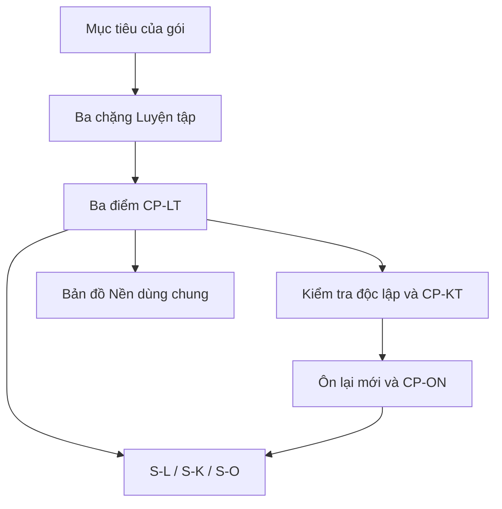

# ZO Math — Ma trận triển khai kiến trúc học tập cho R1-G01 và R1-G02

- **Phiên bản:** 0.1
- **Ngày:** 2026-10-03
- **Trạng thái:** Đã được người chủ trì duyệt làm ma trận triển khai Pha 1 ngày 2026-10-03
- **Căn cứ kiến trúc:** `05_DAC_TA_KIEN_TRUC_HOC_TAP_CHUNG_V0.2.md`, đã duyệt ngày 2026-10-03
- **Căn cứ nội dung:** bản đầy đủ hiện hành của R1-G01 và R1-G02
- **Phạm vi:** lập ma trận trước khi sửa repo; chưa viết lại bài toán, lời giải hoặc giao diện

---

## 0. Kết luận điều hành

Ma trận chọn một phương án triển khai duy nhất:

- **R1-G01 giữ ba chặng Luyện tập hiện có** vì tám bài đã tạo thành ba cụm mục tiêu hợp lí.
- **R1-G02 tổ chức thành ba chặng Luyện tập cốt lõi**; Bài 07–08 được chuyển đúng vai trò sang ngân hàng Chuyển giao `P`, không còn tính như bài Luyện tập cốt lõi.
- Mỗi gói có `CP-LT1`, `CP-LT2`, `CP-LT3`, `CP-KT` và `CP-ONx`.
- Mỗi họ lỗi có ba biến thể khắc phục dành riêng cho nguồn phát hiện: `S-L`, `S-K`, `S-O`. Không dùng lại một bài đã lộ làm bằng chứng mới.
- R1-G01 phải viết ba bài Ôn lại mới; R1-G02 giữ ba bài Ôn lại hiện có nhưng bổ sung mã, điểm kiểm soát và tuyến sửa lỗi.
- R1-G01 thay mẫu Nhật kí cũ bằng schema chung; R1-G02 bổ sung Nhật kí chung và ví dụ giả lập.
- Cả hai gói có Bản đồ Nền riêng nhưng dùng cùng danh mục đơn vị N canonical.

## 1. Quy ước mã dùng trong ma trận

### 1.1. Vai trò nhiệm vụ

| Mã | Vai trò |
|---|---|
| `H` | Học có hướng dẫn, ví dụ, câu dừng trong Bài học |
| `L` | Luyện tập trong một chặng cốt lõi |
| `S-L` | Bài khắc phục dành cho lỗi phát hiện trong Luyện tập |
| `S-K` | Bài khắc phục mới dành cho lỗi phát hiện hoặc tái diễn trong Kiểm tra |
| `S-O` | Bài khắc phục mới dành cho lỗi tái diễn trong Ôn lại |
| `K` | Kiểm tra độc lập cuối lượt học chính |
| `O` | Ôn lại bằng nhiệm vụ mới sau khoảng trễ |
| `P` | Phối hợp hoặc chuyển giao, không báo sẵn phương pháp |
| `N` | Đơn vị Nền canonical được gọi qua Bản đồ Nền của gói |

### 1.2. Điểm kiểm soát

| Mã | Vị trí |
|---|---|
| `CP-LT1` | Cuối chặng Luyện tập 1 |
| `CP-LT2` | Cuối chặng Luyện tập 2 |
| `CP-LT3` | Cuối chặng Luyện tập 3 |
| `CP-KT` | Sau Kiểm tra độc lập |
| `CP-ON1`, `CP-ON2`, `CP-ON3` | Sau từng lượt Ôn lại |
| `CP-P` | Sau nhiệm vụ Chuyển giao, nếu gói có nhánh này |

### 1.3. Quy tắc chống dùng lại bằng chứng

Một nhiệm vụ chỉ giữ một vai trò trong lịch sử gặp câu của học sinh. Nếu em đã làm `S-L-E02`, lần tái diễn ở Kiểm tra phải dùng `S-K-E02`; nếu tái diễn ở Ôn lại phải dùng `S-O-E02`.

Ba biến thể có thể cùng mục tiêu và cùng họ cấu trúc, nhưng phải thay dữ kiện, biểu diễn hoặc yêu cầu giải thích đủ để không thể trả lời chỉ bằng nhớ đáp án.

## 2. Danh mục Nền N dùng chung cần xây

Đây là danh mục canonical tối thiểu cho hai gói. Bản đồ Nền của từng gói chỉ chọn đơn vị cần dùng và ghi điểm quay về.

| Mã N | Đơn vị nền | Bằng chứng thiếu nền | Nhiệm vụ kiểm tra lại tối thiểu |
|---|---|---|---|
| `N-TXĐ-01` | Đọc tập xác định, tập đang xét và quan hệ thuộc | Dùng điểm ngoài tập; đồng nhất công thức với hàm số; nhầm $D$ với $K$ | Xác định $D$, $K$, kiểm tra ba điểm có được dùng hay không |
| `N-ĐH-01` | Tính đạo hàm đa thức và hàm hữu tỉ đơn giản | Không thể bắt đầu xét dấu vì tính sai đạo hàm | Tính đạo hàm một hàm mới và kiểm tra bằng khai triển/thế số |
| `N-ĐH-02` | Đạo hàm lượng giác, số đo radian | Không xử lí được $sin x$, $cos x$ ở nhánh chuyển giao | Tính đạo hàm và xét dấu một biểu thức lượng giác mới trên đoạn hẹp |
| `N-ĐH-03` | Đạo hàm hàm mũ và lôgarit | Không xử lí được $e^x$, $ln x$ ở nhánh chuyển giao | Tính đạo hàm, ghi tập xác định và tìm nghiệm đạo hàm của hai hàm mới |
| `N-DẤU-01` | Xét dấu tích, thương và lũy thừa chẵn | Có đạo hàm đúng nhưng bảng dấu sai | Lập bảng dấu một biểu thức mới và giải thích mốc không đổi dấu |
| `N-BBT-01` | Đọc và dựng bảng biến thiên | Nhầm hàng $x$, $f^prime(x)$, $f(x)$; sai mũi tên | Hoàn thành một bảng thiếu từ dữ kiện ngắn |
| `N-ĐT-01` | Đọc đồ thị $f$, $f^prime$; điểm kín, điểm hở | Lấy tung độ trên đồ thị đạo hàm làm giá trị hàm; dùng điểm hở như điểm đạt | Đọc nhãn hai hình mới và xác định dữ kiện được phép suy ra |
| `N-LT-01` | Liên tục, đạo hàm một phía và điểm ghép | Dùng định lí đổi dấu qua điểm chưa biết liên tục; bỏ điểm không có đạo hàm | Kiểm tra liên tục và đạo hàm tại điểm ghép của hàm từng đoạn mới |
| `N-LG-01` | Mệnh đề “và”, “hoặc”, điều kiện đủ/cần, phản ví dụ | Đánh giá đúng/sai theo trực giác; bỏ vế đúng khi sửa | Đánh giá bốn mệnh đề ngắn và sửa câu sai mà giữ phần đúng |
| `N-GH-01` | Cận, giới hạn và sự đạt được | Đồng nhất cận với giá trị lớn nhất/nhỏ nhất | Cho một hàm trên khoảng hở, xác định cận và kiểm tra có điểm đạt hay không |
| `N-MH-01` | Doanh thu, tổng chi phí, chi phí bình quân, lợi nhuận, đơn vị | Lập sai hàm mục tiêu hoặc bỏ đơn vị | Lập hàm lợi nhuận từ dữ kiện mới, chưa cần tối ưu |
| `N-NGUYÊN-01` | Tối ưu khi biến nhận giá trị nguyên | Làm tròn nghiệm thực hoặc giữ nghiệm không được phép | So sánh các ứng viên nguyên quanh điểm tối ưu của hàm phụ |

## 3. Ma trận R1-G01 — Kết nối đạo hàm, bảng biến thiên và đồ thị

### 3.1. Mã mục tiêu

| Mã | Mục tiêu quan sát được | Bằng chứng độc lập cần có |
|---|---|---|
| `G01-M1` | Ghi đúng tập xác định, khoảng xét và điều kiện áp dụng định lí dấu đạo hàm | Lập luận nêu đủ khoảng, tính liên tục/khả vi khi cần và dấu trên khoảng |
| `G01-M2` | Nối công thức → đạo hàm → dấu → chiều biến thiên → bảng → dáng điệu đồ thị | Tự dựng hoặc chọn chuỗi biểu diễn khớp và bác bỏ biểu diễn sai |
| `G01-M3` | Xét cực trị và phân biệt điểm cực trị, giá trị cực trị, điểm trên đồ thị | Gọi đúng ba đối tượng và không suy cực trị chỉ từ $f^prime(x_0)=0$ |
| `G01-M4` | Đọc ngược từ bảng/đồ thị mà không thêm dữ kiện | Nêu được điều chắc chắn, điều chỉ có thể và điều chưa biết |
| `G01-M5` | Đánh giá, phản biện và sửa một lập luận | Giữ phần đúng, chỉ đúng điều kiện thiếu, viết lại và làm câu mới |

### 3.2. Ba chặng Luyện tập

| Chặng | Mục tiêu chính | Nội dung H liên quan | Nhiệm vụ L hiện có | Điểm kiểm soát | Quyết định đi tiếp |
|---|---|---|---|---|---|
| `G01-C1` — Dựng và đọc chuỗi biểu diễn | `M1`, `M2`, `M3` | Mục 1–5; đặc biệt dấu đạo hàm, bảng biến thiên, cực trị và điểm không có đạo hàm | `L01`–`L04` | `CP-LT1` | Đạt các điều kiện thiết yếu của chuỗi biểu diễn; lỗi thì dùng `S-L`, thiếu nền thì gọi N |
| `G01-C2` — Giới hạn của đọc ngược | `M1`, `M4` | Mục 6: bảng không có hàng đạo hàm, đồ thị $f$/$f^prime$, khoảng rời | `L05`–`L06` | `CP-LT2` | Không tự gán dấu nghiêm ngặt, công thức hoặc kết luận xuyên khoảng rời |
| `G01-C3` — Đánh giá và sửa lập luận | `M3`, `M4`, `M5` | Mục 7 và các đối chứng trước đó | `L07`–`L08` | `CP-LT3` | Đánh giá từng mệnh đề có lí do; sửa mà giữ phần đúng; làm bài mới |

Không đổi thứ tự tám bài ở lượt đầu. Chỉ thêm nhãn chặng, bảng tự kiểm và đường gọi Sửa lỗi ở cuối mỗi chặng.

### 3.3. Ma trận nhiệm vụ Luyện tập

| Nhiệm vụ | Vai trò sau chuẩn hóa | Mục tiêu | Họ lỗi dễ lộ | Điểm kiểm soát |
|---|---|---|---|---|
| `G01-L01` | `L` | `M1`, `M2`, `M3` | `E01`, `E02`, `E04` | `CP-LT1` |
| `G01-L02` | `L` | `M1`, `M3`, `M5` | `E02`, `E06` | `CP-LT1` |
| `G01-L03` | `L` | `M2`, `M3`, `M4` | `E02`, `E04`, `E07` | `CP-LT1` |
| `G01-L04` | `L` | `M1`, `M3`, `M4` | `E01`, `E03` | `CP-LT1` |
| `G01-L05` | `L` | `M3`, `M4` | `E04`, `E06`, `E07` | `CP-LT2` |
| `G01-L06` | `L` | `M1`, `M4` | `E01`, `E05` | `CP-LT2` |
| `G01-L07` | `L` | `M3`, `M5` | `E02`, `E06`, `E08` | `CP-LT3` |
| `G01-L08` | `L` | `M3`, `M5` | `E02`, `E04`, `E08` | `CP-LT3` |

### 3.4. Danh mục lỗi và ba tầng bài khắc phục

| Mã lỗi | Dấu hiệu | Điểm phát hiện chính | `S-L` | `S-K` cần có | `S-O` cần có |
|---|---|---|---|---|---|
| `G01-E01` | Bỏ tập xác định/khoảng xét hoặc dùng điểm bị loại | `CP-LT1`, `CP-LT2`, `CP-KT` | Giữ `sc01` làm biến thể L | Viết mới một bài có mốc bị loại khác | Viết mới một bài ngắn dùng điểm hở/điểm kín |
| `G01-E02` | Thấy $f^prime(x_0)=0$ rồi kết luận có cực trị | `CP-LT1`, `CP-LT3`, `CP-KT` | Giữ `sc02` | Viết mới bằng đồ thị $f^prime$ | Viết mới trong bài xen kẽ có cả mốc đổi dấu và không đổi dấu |
| `G01-E03` | Không có đạo hàm nên không có cực trị | `CP-LT1`, `CP-KT` | Giữ `sc03` | Viết mới bằng hàm giá trị tuyệt đối/từng đoạn | Viết mới có điểm ghép và yêu cầu định nghĩa cực trị |
| `G01-E04` | Nhầm điểm cực trị, giá trị cực trị và tọa độ | Mọi `CP` | Giữ `sc04` | Viết mới từ bảng biến thiên khác | Viết mới kết hợp hình $f$ và hình $f^prime$ |
| `G01-E05` | Gộp khoảng rời mà không so sánh chéo | `CP-LT2`, `CP-KT` | Giữ `sc05` | Viết mới với hai nhánh cùng chiều nhưng lệch tung độ | Viết mới yêu cầu tự tìm cặp phản chứng hoặc chứng minh chéo |
| `G01-E06` | Đảo đồng biến thành $f^prime>0$ ở mọi điểm | `CP-LT2`, `CP-LT3`, `CP-KT` | Giữ `sc06` | Viết mới với đạo hàm có lũy thừa chẵn | Viết mới trong cụm đúng/sai xen kẽ |
| `G01-E07` | Suy quá dữ kiện của bảng hoặc đồ thị | `CP-LT1`, `CP-LT2`, `CP-KT` | Giữ `sc07` | Viết mới với hai hàm sai khác hằng số | Viết mới yêu cầu phân loại “biết/chưa biết/có thể” |
| `G01-E08` | Sai logic hoặc bỏ vế đúng khi sửa | `CP-LT3`, `CP-KT` | Giữ `sc08` | Viết mới với mệnh đề “và/hoặc” khác | Viết mới trong một lời giải có hai bước đúng, một bước sai |
| `G01-E09` | Dùng đổi dấu đạo hàm qua điểm chưa biết liên tục | `CP-KT`, `CP-ON` | Không cần ép xuất hiện ở L | Viết mới riêng; không dùng lại `sc03` như bằng chứng thứ hai | Viết mới bằng hàm từng đoạn có tham số giá trị tại điểm ghép |

Quyết định sản xuất: giữ nguyên tám bài `sc01`–`sc08` làm tầng `S-L`; viết chín bài `S-K` và chín bài `S-O`. Các bài mới có thể là vi nhiệm vụ, không cần dài bằng bài Luyện tập.

### 3.5. Ma trận Kiểm tra

| Nhiệm vụ K | Mục tiêu phủ | Họ lỗi quan sát | Tuyến sau chấm |
|---|---|---|---|
| `G01-K01` | `M1`, `M2`, `M3` | `E01`, `E02`, `E04` | `CP-KT` → `S-K-E01/E02/E04` |
| `G01-K02` | `M1`, `M2`, `M3`, `M4` | `E02`, `E06`, `E07` | `CP-KT` → đúng biến thể chưa lộ |
| `G01-K03` | `M3`, `M4`, `M5` | `E04`, `E06`, `E07`, `E08` | Đọc theo từng ý, không gộp tổng điểm |
| `G01-K04` | `M1`, `M3`, `M4`, `M5` | `E01`, `E03`, `E05`, `E08` | Nếu thiếu nền, gọi `N-TXĐ-01` hoặc `N-LT-01` trước `S-K` |
| `G01-K05` | `M1`, `M3`, `M4`, `M5` | `E04`, `E07`, `E09` | Bắt buộc tách dữ kiện ban đầu với giả thiết bổ sung |

Năm bài Kiểm tra hiện hành đã phủ mục tiêu tốt; không cần thêm bài K mới. Cần đổi bảng chấm từ tổng điểm làm trung tâm sang ma trận mục tiêu và họ lỗi.

### 3.6. Ma trận Ôn lại cần viết mới

| Nhiệm vụ O mới | Thời điểm mặc định | Mục tiêu | Đặc tả nhiệm vụ | Điểm kiểm soát |
|---|---|---|---|---|
| `G01-O01` | Khoảng 2–3 ngày | `M1`, `M2`, `M3` | Một đồ thị $f^prime$ mới có một nghiệm đổi dấu và một nghiệm không đổi dấu; yêu cầu đơn điệu, cực trị và giới hạn dữ kiện | `CP-ON1` |
| `G01-O02` | Khoảng 7 ngày | `M1`, `M3`, `M4`, `M5` | Một bảng biến thiên không có hàng đạo hàm trên tập gồm hai thành phần; đánh giá ba phát biểu và sửa câu sai | `CP-ON2` |
| `G01-O03` | Khoảng 3–4 tuần | Toàn bộ `M1`–`M5` | Một nhiệm vụ phối hợp mới: từ công thức hoặc hàm từng đoạn, tự chọn chuỗi biểu diễn, phát hiện một kết luận thiếu căn cứ và viết lại | `CP-ON3` |

Không dùng “làm lại một bài từng sai” làm nhiệm vụ O. Bài từng sai chỉ được đặt cạnh Nhật kí để xem lại nguyên nhân.

### 3.7. Bản đồ Nền của R1-G01

| Dấu hiệu | Đơn vị N | Kiểm tra lại | Điểm quay về |
|---|---|---|---|
| Sai tập xác định hoặc dùng mốc bị loại | `N-TXĐ-01` | Một câu mới về $D$, khoảng xét và điểm bị loại | Câu đang làm ở `C1/C2/K` |
| Tính sai đạo hàm đa thức/hữu tỉ | `N-ĐH-01` | Một đạo hàm mới | Bước xét dấu của nhiệm vụ gốc |
| Không xét được dấu | `N-DẤU-01` | Bảng dấu mới | Ngay trước kết luận đơn điệu |
| Nhầm hàng hoặc mũi tên BBT | `N-BBT-01` | Hoàn thành bảng thiếu | Nhiệm vụ chuỗi biểu diễn |
| Nhầm $f$ với $f^prime$, điểm hở/kín | `N-ĐT-01` | Đọc hai hình mới | Nhiệm vụ đọc hình |
| Không kiểm tra liên tục/đạo hàm tại điểm ghép | `N-LT-01` | Hàm từng đoạn mới | `L04`, `K04`, `K05` hoặc bài O tương ứng |
| Sai “và/hoặc”, không biết dùng phản ví dụ | `N-LG-01` | Bốn mệnh đề ngắn | `C3` hoặc ý Kiểm tra đang tạm dừng |

### 3.8. Nhật kí R1-G01

Mẫu sáu cột hiện có chưa đủ schema đã duyệt. Cần thay bằng mẫu chung tại Đặc tả 0.2, giữ ví dụ giả lập `G01-E02` và đặt liên kết ghi Nhật kí tại mọi `CP-LT`, `CP-KT`, `CP-ON`.

## 4. Ma trận R1-G02 — Giá trị lớn nhất và giá trị nhỏ nhất

### 4.1. Mã mục tiêu

| Mã | Mục tiêu quan sát được | Bằng chứng độc lập cần có |
|---|---|---|
| `G02-M1` | Xác định đúng hàm số, tập xác định $D$ và tập đang xét $K$ | Chỉ dùng các điểm thuộc $K$ và phân biệt phép thay vào biểu thức với giá trị hàm |
| `G02-M2` | Phân biệt cực trị với giá trị lớn nhất/nhỏ nhất; kiểm tra cả so sánh và sự đạt được | Không lấy cực đại thay giá trị lớn nhất; ghi điểm đạt nếu tồn tại |
| `G02-M3` | Tìm giá trị lớn nhất/nhỏ nhất trên đoạn đóng | Xét đủ đầu mút, điểm có đạo hàm bằng $0$, điểm không có đạo hàm và so sánh giá trị |
| `G02-M4` | Giải thích tồn tại hoặc không tồn tại trên khoảng hở, tập rời hoặc không bị chặn | Phân biệt cận/giới hạn với giá trị đạt được; xét đủ các thành phần |
| `G02-M5` | Chọn công cụ, lập hàm mục tiêu và xử lí ràng buộc thực/nguyên | Lập đúng lợi nhuận, giữ đơn vị và kiểm tra ứng viên được phép |
| `G02-M6` | Chuyển giao quy trình sang họ hàm lượng giác, mũ và lôgarit | Tự chọn đạo hàm, ứng viên và kiểm tra kết quả trên hàm mới |

### 4.2. Ba chặng Luyện tập cốt lõi

| Chặng | Mục tiêu chính | Nhiệm vụ hiện có | Điều chỉnh bắt buộc | Điểm kiểm soát |
|---|---|---|---|---|
| `G02-C1` — Đúng đối tượng và quy trình trên đoạn | `M1`, `M2`, `M3` | `L01`, `L02`, `L10` | Giữ nguyên nội dung; thêm bảng tự kiểm “đủ ứng viên, đúng điểm đạt” | `CP-LT1` |
| `G02-C2` — Sự tồn tại trên tập khác đoạn đóng | `M1`, `M2`, `M4` | `L03`, `L04`, `L06`, `L09` | Giữ nguyên; gom thành một chặng về khoảng hở, tập rời, tập không bị chặn và điều kiện | `CP-LT2` |
| `G02-C3` — Mô hình và ràng buộc | `M3`, `M5` | `L05` và câu dừng về làm tròn trong Bài học | Viết thêm `G02-L11`: một bài đầy đủ với chi phí bình quân và biến nguyên trước khi gặp `K04` | `CP-LT3` |

`L07` và `L08` không thuộc ba chặng cốt lõi. Chúng được đổi mã vai trò thành `G02-P01` và `G02-P02`.

### 4.3. Ma trận nhiệm vụ Luyện tập và Chuyển giao

| Nhiệm vụ hiện tại | Vai trò mới | Mục tiêu | Họ lỗi dễ lộ | Điểm kiểm soát |
|---|---|---|---|---|
| `L01` | `G02-L01` | `M2`, `M3` | `E01` | `CP-LT1` |
| `L02` | `G02-L02` | `M2`, `M3` | `E03` | `CP-LT1` |
| `L10` | `G02-L10` | `M1`, `M2`, `M3` | `E01`, `E02` | `CP-LT1` |
| `L03` | `G02-L03` | `M2`, `M4` | `E02`, `E06` | `CP-LT2` |
| `L04` | `G02-L04` | `M1`, `M4` | `E02`, `E04` | `CP-LT2` |
| `L06` | `G02-L06` | `M1`, `M2`, `M4` | `E02`, `E03`, `E04` | `CP-LT2` |
| `L09` | `G02-L09` | `M1`, `M2`, `M4` | `E02`, `E04` | `CP-LT2` |
| `L05` | `G02-L05` | `M3`, `M5` | `E05` | `CP-LT3` |
| Viết mới | `G02-L11` | `M1`, `M3`, `M5` | `E05` | `CP-LT3` |
| `L07` | `G02-P01` | `M3`, `M6` | thiếu `N-ĐH-02` hoặc sai chọn ứng viên | `CP-P` |
| `L08` | `G02-P02` | `M1`, `M3`, `M6` | thiếu `N-ĐH-03`, bỏ tập xác định | `CP-P` |

### 4.4. Danh mục lỗi và ba tầng bài khắc phục

| Mã lỗi | Dấu hiệu | Điểm phát hiện chính | `S-L` | `S-K` cần có | `S-O` cần có |
|---|---|---|---|---|---|
| `G02-E01` | Thấy cực đại rồi kết luận lớn nhất; quên đầu mút hoặc điểm đạt khác | `CP-LT1`, `CP-KT` | Giữ `s00` | Viết mới trên đoạn có nhiều điểm đạt | Viết mới trong bài xen kẽ cực trị–giá trị lớn nhất |
| `G02-E02` | Nhầm $D$ với $K$; dùng điểm ngoài tập; coi cận là giá trị đạt | `CP-LT1`, `CP-LT2`, `CP-KT` | Giữ `s01` | Viết mới với cùng công thức nhưng hai tập xác định khác | Viết mới trên khoảng nửa kín |
| `G02-E03` | Bỏ điểm không có đạo hàm; nhầm hoành độ, tung độ hoặc đồ thị $f^prime$ | `CP-LT1`, `CP-LT2`, `CP-KT` | Giữ `s02` | Viết mới với hàm từng đoạn/giá trị tuyệt đối | Viết mới kết hợp điểm gãy và đồ thị |
| `G02-E04` | Bỏ một thành phần; đọc giới hạn thành giá trị; xử lí điểm hở sai | `CP-LT2`, `CP-KT` | Giữ `s03` | Viết mới với hai thành phần có cùng một giá trị đạt | Viết mới từ bảng biến thiên trên tập rời |
| `G02-E05` | Lập sai lợi nhuận; nhầm chi phí bình quân; làm tròn biến nguyên | `CP-LT3`, `CP-KT` | Giữ `s04` | Viết mới với điểm tối ưu thực nằm giữa hai số nguyên | Viết mới có đơn vị và hai loại ràng buộc |
| `G02-E06` | Dùng định lí tồn tại khi thiếu liên tục hoặc thấy thiếu điều kiện rồi kết luận không tồn tại | `CP-LT2`, `CP-KT` | Giữ `s05` | Viết mới trên đoạn đóng với hàm gián đoạn | Viết mới yêu cầu quay về định nghĩa |

Quyết định sản xuất: giữ sáu bài `s00`–`s05` làm tầng `S-L`; viết sáu bài `S-K` và sáu bài `S-O`.

### 4.5. Ma trận Kiểm tra

| Nhiệm vụ K | Mục tiêu phủ | Họ lỗi quan sát | Tuyến sau chấm |
|---|---|---|---|
| `G02-K01` | `M1`, `M2`, `M4` | `E02`, `E04` | `CP-KT` → `S-K-E02/E04` |
| `G02-K02` | `M2`, `M3` | `E01` | `CP-KT` → `S-K-E01` |
| `G02-K03` | `M1`, `M2`, `M4` | `E02`, `E04`, `E06` | Tách hai tình huống; không gộp thành một điểm |
| `G02-K04` | `M1`, `M5` | `E05` | Nếu sai kiến thức nền mô hình, gọi `N-MH-01/N-NGUYÊN-01` trước `S-K-E05` |
| `G02-K05` | `M2`, `M3`, `M5` | `E03` | `CP-KT` → `S-K-E03` |

Năm bài K hiện hành đủ cho mục tiêu cốt lõi `M1`–`M5`. `M6` được kiểm ở nhánh `P`, không đưa vào điều kiện bắt buộc hoàn tất lượt chính nếu học sinh chưa có nền đạo hàm tương ứng.

### 4.6. Nhánh Chuyển giao

| Mã P | Điều kiện vào | Nhiệm vụ | Nếu thiếu nền | Bài thử lại |
|---|---|---|---|---|
| `G02-P01` | Đã đạt `M1`–`M3`; có đạo hàm lượng giác | Bài 07 hiện có | `N-ĐH-02`, rồi câu kiểm tra lại | Giữ câu $a(x)=\sin 2x-x$ hiện có làm `S-P01` |
| `G02-P02` | Đã đạt `M1`–`M3`; có đạo hàm mũ–lôgarit | Bài 08 hiện có | `N-ĐH-03`, rồi câu kiểm tra lại | Viết mới `S-P02` gồm một hàm mũ hoặc lôgarit khác |

Không dùng `P01/P02` để hạ kết quả cốt lõi của học sinh khi nguyên nhân là chưa học hoặc chưa có nền đạo hàm của họ hàm tương ứng.

### 4.7. Ma trận Ôn lại hiện có

| Nhiệm vụ O | Mục tiêu | Trạng thái nội dung | Điều chỉnh |
|---|---|---|---|
| `G02-O01` — khoảng 2–3 ngày | `M1`, `M2`, `M4` | Đã có bài mới phù hợp | Gắn `CP-ON1`; sai thì đi `S-O-E02` |
| `G02-O02` — khoảng 7 ngày | `M2`, `M4` | Đã có bài mới phù hợp | Gắn `CP-ON2`; sai thì phân biệt `E02/E06` |
| `G02-O03` — khoảng 3–4 tuần | `M3`, `M5`, khả năng chọn công cụ | Đã có nhiệm vụ chuyển bối cảnh chuyển động | Gắn `CP-ON3`; kiểm tra rõ đại lượng cần tối ưu và đơn vị trước khi chấm kĩ thuật |

Ba bài Ôn lại không cần thay. Cần tách thành ba mã, ba liên kết lời giải và ba điểm kiểm soát độc lập nếu hiện đang dùng chung một anchor.

### 4.8. Bản đồ Nền của R1-G02

| Dấu hiệu | Đơn vị N | Kiểm tra lại | Điểm quay về |
|---|---|---|---|
| Nhầm $D$, $K$, điểm đạt | `N-TXĐ-01` | Một câu mới về hai hàm cùng công thức, khác tập xác định | `C1/C2/K/O` đang làm |
| Tính sai đạo hàm cơ bản | `N-ĐH-01` | Một đạo hàm mới | Bước lập danh sách ứng viên |
| Bỏ điểm không có đạo hàm | `N-LT-01` | Hàm từng đoạn/giá trị tuyệt đối mới | `L02`, `K05` hoặc bài O tương ứng |
| Không phân biệt cận và giá trị đạt | `N-GH-01` | Một khoảng hở mới | `C2`, `K01/K03`, `O01/O02` |
| Nhầm đồ thị $f$ với $f^prime$ hoặc điểm hở/kín | `N-ĐT-01` | Đọc hai hình mới | `L06`, `K01` |
| Lập sai hàm lợi nhuận/đơn vị | `N-MH-01` | Lập hàm mới | `C3`, `K04` |
| Làm tròn biến nguyên | `N-NGUYÊN-01` | So sánh ứng viên nguyên mới | `L11`, `K04` |
| Thiếu đạo hàm lượng giác | `N-ĐH-02` | Một câu kiểm tra đạo hàm và dấu | `P01` |
| Thiếu đạo hàm mũ–lôgarit | `N-ĐH-03` | Hai câu hẹp về $e^x$, $\ln x$ | `P02` |

### 4.9. Nhật kí R1-G02

R1-G02 chưa có bảng Nhật kí tương ứng. Cần thêm schema chung ngay sau hướng dẫn tổng quát hoặc tại một mục dùng chung được liên kết từ mọi điểm kiểm soát; kèm ví dụ giả lập về `G02-E02` để minh họa phân biệt phép thay vào biểu thức, giá trị hàm và điểm đạt trên $K$.

## 5. Ma trận đối chiếu hai gói

| Thành phần | R1-G01 | R1-G02 | Quyết định chung |
|---|---|---|---|
| Số chặng L cốt lõi | 3, đã có phân nhóm 4–2–2 | 3, chuẩn hóa thành 3–4–2 nhiệm vụ sau khi thêm `L11` | Cùng ba điểm `CP-LT`, không buộc cùng số bài |
| Kiểm tra | 5 bài, phủ tốt `M1`–`M5` | 5 bài, phủ tốt `M1`–`M5` | Giữ nội dung; chấm theo mục tiêu và lỗi |
| Sửa lỗi hiện có | 8 bài | 6 bài + một câu thử lại chuyển giao | Các bài hiện có trở thành `S-L`; bổ sung `S-K`, `S-O` |
| Ôn lại | Chưa có bài mới cụ thể | Có 3 bài mới | Viết 3 bài O cho G01; giữ 3 bài O của G02 |
| Chuyển giao | Nằm rải trong đọc ngược/đánh giá | L07–08 thực chất là P | G02 tách P; G01 chưa cần nhánh P riêng trong đợt này |
| Nhật kí | Có mẫu cũ, thiếu trường | Chưa có mẫu | Cùng schema và ví dụ giả lập |
| Bản đồ Nền | Chỉ dẫn nội bộ từ Khởi động | Chỉ dẫn nội bộ từ Khởi động | Tạo bản đồ N canonical, có kiểm tra lại và điểm quay về |

## 6. Khối lượng nội dung mới tối thiểu

| Gói | Nội dung giữ nguyên | Nội dung cần viết mới |
|---|---|---|
| R1-G01 | 8 bài L, 5 bài K, 8 bài `S-L` | 9 bài `S-K`; 9 vi nhiệm vụ `S-O`; 3 bài O; Bản đồ N; Nhật kí chung và ví dụ |
| R1-G02 | 8 bài L cốt lõi, 2 bài P, 5 bài K, 6 bài `S-L`, 3 bài O | 1 bài `L11`; 6 bài `S-K`; 6 vi nhiệm vụ `S-O`; 1 bài `S-P02`; Bản đồ N; Nhật kí chung và ví dụ |
| Dùng chung | Các giải thích nền đang nằm trong hai gói | 12 đơn vị N canonical ở mức tối thiểu hoặc các đơn vị N tạm thời có mã và kế hoạch hợp nhất |

Các con số trên là số **ô nhiệm vụ**, không đồng nghĩa số bài dài. `S-K` và `S-O` nên là vi nhiệm vụ tập trung vào đúng lỗi để tránh phình gói.

## 7. Dữ liệu cần đưa vào nguồn sản xuất

Mỗi gói cần có dữ liệu tương đương các bảng sau, dù tên tệp cụ thể được quyết định khi triển khai repo:

### 7.1. `objectives`

| Trường | Bắt buộc |
|---|---|
| `id` | Có |
| `description` | Có |
| `essential` | Có |
| `prerequisites` | Có |
| `evidence_tasks` | Có |

### 7.2. `stages`

| Trường | Bắt buộc |
|---|---|
| `id` | Có |
| `objective_ids` | Có |
| `learning_sections` | Có |
| `practice_tasks` | Có |
| `checkpoint_id` | Có |
| `next_on_pass` | Có |

### 7.3. `errors`

| Trường | Bắt buộc |
|---|---|
| `id` | Có |
| `symptoms` | Có |
| `classification_rule` | Có |
| `review_target` | Có |
| `foundation_route` | Có nếu liên quan |
| `remediation_l` | Có nếu lỗi có thể xuất hiện ở L |
| `remediation_k` | Có nếu lỗi có thể xuất hiện ở K |
| `remediation_o` | Có nếu lỗi có thể tái diễn ở O |
| `return_anchor` | Có |

### 7.4. `tasks`

| Trường | Bắt buộc |
|---|---|
| `id` | Có |
| `role` | Một trong `H/L/S-L/S-K/S-O/K/O/P/N` |
| `objective_ids` | Có |
| `error_ids` | Có khi dùng chẩn đoán/khắc phục |
| `answer_anchor` | Có |
| `exposure_policy` | Có |
| `next_on_pass` / `next_on_error` | Có |

## 8. Checker bắt buộc trước khi render

Checker phải chặn bản dựng nếu:

- một chặng thiếu `CP-LT`;
- điểm kiểm soát không có đường đi khi đạt, có lỗi hoặc thiếu nền;
- lỗi có trong ma trận nhưng không có bài khắc phục đúng tầng;
- cùng một mã bài bị dùng làm hai vai trò bằng chứng;
- nhiệm vụ `K` hoặc `O` đã lộ trong `H/L/S`;
- tuyến N thiếu nhiệm vụ kiểm tra lại hoặc điểm quay về;
- nhiệm vụ O không có ngày/độ trễ và mức hỗ trợ;
- mục tiêu thiết yếu không có bằng chứng K độc lập;
- Nhật kí thiếu trường bắt buộc;
- liên kết lời giải hoặc anchor quay về không tồn tại.

## 9. Thứ tự triển khai repo sau khi ma trận được duyệt

1. Tạo schema và mã cho mục tiêu, chặng, điểm kiểm soát, lỗi, nhiệm vụ.
2. Gắn mã cho toàn bộ bài hiện có mà chưa đổi nội dung toán học.
3. Viết Bản đồ N của hai gói và đơn vị N tạm thời/canonical cần thiết.
4. Viết nội dung mới theo Mục 6, ưu tiên khoảng trống cốt lõi: `G02-L11`, ba bài O của G01, các bài `S-K`.
5. Bổ sung `S-O` và bài thử lại `S-P02`.
6. Chuẩn hóa Nhật kí và ví dụ giả lập.
7. Viết checker rồi mới sửa điều hướng và giao diện.
8. Render HTML/PDF, kiểm tra toán học, liên kết, vai trò bài và đường quay về.

Không nên sửa giao diện trước bước 7; nếu không, các nút và thẻ sẽ được dựng trước khi đích và trạng thái học có dữ liệu ổn định.

## 10. Tiêu chí nghiệm thu ma trận

- [ ] Năm quyết định của Đặc tả 0.2 được thể hiện đầy đủ.
- [ ] R1-G01 và R1-G02 đều có đúng ba chặng L cốt lõi và các điểm kiểm soát.
- [ ] Hai bài 07–08 của R1-G02 được xếp đúng vai trò P.
- [ ] Mọi bài hiện có được gắn ít nhất một mục tiêu và một vai trò.
- [ ] Mọi họ lỗi có dấu hiệu, nguồn phát hiện và ba tầng khắc phục cần thiết.
- [ ] R1-G01 có đặc tả ba bài O mới.
- [ ] R1-G02 giữ được ba bài O tốt hiện có.
- [ ] Bản đồ N dùng mã chung, không sao chép thành nhiều gói Nền độc lập.
- [ ] Khối lượng nội dung mới được nêu rõ và không che dưới nhãn “chỉnh hướng dẫn”.
- [ ] Thứ tự triển khai đặt dữ liệu/checker trước giao diện.

## 11. Việc kế tiếp duy nhất sau khi duyệt

Giao Codex một nhiệm vụ triển khai **Pha 1 — dữ liệu kiến trúc**, chỉ gồm:

- thêm mã mục tiêu, chặng, vai trò nhiệm vụ, điểm kiểm soát và họ lỗi;
- tạo Bản đồ N dạng dữ liệu với đích tạm thời rõ ràng;
- viết checker cấu trúc;
- chưa viết hàng loạt bài mới và chưa thiết kế lại giao diện.

Pha 1 phải tạo được báo cáo chính xác các ô nội dung còn thiếu theo Mục 6. Khi báo cáo và checker đạt, mới mở Pha 2 để biên soạn nhiệm vụ mới.
