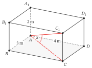

<!-- D0_APPROVED_CONTENT: canonical text source; approval receipt is provenance, not a second editable source. -->

::::::::::::::::::::::::::::::::::::::::::::::::::::::::::::::::::::::::::::::::::::::::::::::::::::::::::::::::::::::::::::::::::::::::::::::: {.zo-on-thi-package .d0-package d0-title="Khảo sát và định vị đầu vào"}
## Em muốn bắt đầu từ đâu? {#bat-dau}

**Em có thể bắt đầu ôn ngay mà không làm bài khảo sát này.** Nếu đã muốn học một nội dung, em cứ chọn mạch ôn đó. Nếu chưa biết bắt đầu từ đâu, bài khảo sát giúp em gợi nhớ kiến thức và chọn mạch đầu tiên. Em cũng có thể thử một mạch rồi quay lại khảo sát khi cần.

Bài khảo sát không phải đề thi thử và không dùng để xếp loại em. Em không cần làm hết 24 bài, đạt một số câu đúng hay điền một phiếu nào để được bắt đầu học.

Nếu muốn khảo sát, em chọn vài câu khảo sát sử dụng kiến thức đã từng học ở trường hoặc tự học trước đây. Tự làm trước, đối chiếu sau, rồi chọn một hoặc hai nội dung muốn ôn. Em có thể dừng khảo sát để chuyển sang học bất cứ lúc nào.

**"Chưa học" khác với "đã học nhưng chưa làm được".** Một nội dung em chưa từng học không được xem là điểm yếu.

[Vào trang ôn thi để bắt đầu học](../../tot_nghiep_thpt/2027/index.qmd#hoc-lieu-hien-co){.primary-link} · [Tôi muốn thử khảo sát](#khai-bao-pham-vi)

## Chuẩn bị và chọn câu khảo sát {#khai-bao-pham-vi}

Chuẩn bị giấy hoặc vở, bút và máy tính cầm tay nếu cần tính số gần đúng. Ghi ngày làm khảo sát.

Trong phần **Làm khảo sát**, mỗi mục được đánh số "Bài 01", "Bài 02"... là một **câu khảo sát** để em thử làm. Khi nói đến **bài học**, trang này chỉ phần kiến thức trong sách giáo khoa, vở ghi hoặc học liệu ôn tập.

### Chọn câu khảo sát

Đọc dòng **Kiến thức cần dùng** bên dưới tên câu khảo sát. Dòng này nêu những kiến thức toán mà em sẽ sử dụng để giải câu đó.

- Nếu đã học những kiến thức được nêu, em có thể thử giải câu khảo sát ấy, kể cả khi đang quên cách làm.
- Nếu chưa học, em có thể bỏ qua câu đó. Nếu muốn ghi lại, viết "Chưa học kiến thức này".
- Nếu không nhớ mình đã học hay chưa, tìm nội dung được nêu trong dòng **Kiến thức cần dùng** ở mục lục sách giáo khoa hoặc vở ghi. Em cũng có thể chọn một câu khảo sát khác để làm trước.

Mỗi nhóm nội dung có ba câu khảo sát. Em có thể chọn một nhóm mình muốn thử, làm một hoặc vài câu trong nhóm đó, rồi mở phần **Đối chiếu bài làm**. Không cần làm hết một nhóm hoặc làm theo thứ tự các nhóm.

### Ghi bài làm thế nào?

- Ghi tên nhóm nội dung và số ghi trên câu khảo sát, chẳng hạn "Hàm số, đạo hàm, đồ thị --- Bài 03".
- Tự giải trên giấy trước khi mở hướng dẫn đối chiếu. Viết các bước tính hoặc lập luận chính và phần giải thích mà câu hỏi yêu cầu.
- Nếu viết một bước nhưng chưa giải thích được vì sao bước ấy đúng, đặt dấu hỏi bên cạnh bước đó.
- Nếu chưa giải xong, ghi đúng tình huống của mình: "Chưa biết bắt đầu", "Đang vướng ở bước..." hoặc "Chưa kịp làm". Với "Đang vướng ở bước...", viết thêm em đang định làm gì nhưng chưa làm được.
- Thời gian gợi ý của từng câu khảo sát không phải giới hạn bắt buộc.

Nếu trước đây đã giải **chính câu khảo sát này**, ghi "Đã làm trước đây". Nếu đã đọc lời giải của chính câu này, ghi "Đã xem lời giải trước đây". Chỉ thấy dạng toán quen thuộc thì không cần ghi.

Nếu trong lúc giải em xem tài liệu hoặc được người khác chỉ cách làm, đánh dấu bước bắt đầu dùng sự hỗ trợ đó. Giữ lại phần đã tự làm trước bước ấy.

### Thử hình dung một lượt khảo sát {#vi-du-gia-lap}

Dưới đây là một câu minh họa thuộc mạch Hàm số, đạo hàm, đồ thị. Em có thể thử làm để biết cách dùng bài khảo sát; câu này không tính vào 24 câu chính.

::::: {#cau-minh-hoa .zo-learning-task .zo-learning-task--item .d0-example-task d0-id="D0-R1-00"}
[Bài 00]{.d0-task-number} [Hàm số, đạo hàm, đồ thị]{.d0-task-code}

#### Căn bậc hai và dấu của số {#can-bac-hai-va-dau-cua-so}

::: d0-task-meta
**Kiến thức cần dùng:** Căn bậc hai số học và bình phương một số ở THCS.

**Cách trả lời:** Ghi kết quả tính và giải thích một nhận định.

**Thời gian gợi ý:** 3 phút
:::

::: d0-task-prompt
Với $x=-3$, tính $\sqrt{x^2}$. Một bạn nói: "Vì căn bậc hai và bình phương triệt tiêu nhau nên $\sqrt{x^2}=x$ với mọi số thực $x$." Em có đồng ý không? Dùng kết quả vừa tính để giải thích.
:::
:::::

Giả sử Minh đã học căn bậc hai và bình phương, nhưng đang nhớ không chắc quy tắc. Minh thử làm và ghi:

> **Hàm số, đạo hàm, đồ thị --- Bài 00**\
> $x=-3$, nên $x^2=9$.\
> Em nghĩ $\sqrt{x^2}=x=-3$.\
> **?** Căn bậc hai số học của 9 có nhận giá trị âm không?\
> Em chưa xem hướng dẫn đối chiếu.

Đây là bài làm ban đầu còn chỗ phân vân, không phải lời giải mẫu. Minh giữ nguyên phép tính đã viết và đặt dấu hỏi bên cạnh bước chưa chắc. Sau khi tự làm, Minh mở phần đối chiếu dưới đây.

:::: {#doi-chieu-minh-hoa .zo-learning-solution .r1-details .r1-solution}
::: zo-learning-summary
Đối chiếu Bài 00 sau khi tự làm
:::

Với $x=-3$, ta có $x^2=9$ và $\sqrt{x^2}=\sqrt9=3$, không phải $-3$. Vì vậy, nhận định "$\sqrt{x^2}=x$ với mọi số thực $x$" là sai; $x=-3$ là một ví dụ bác bỏ nhận định đó.

Căn bậc hai số học luôn không âm. Với mọi số thực $x$, công thức đúng là $\sqrt{x^2}=\lvert x\rvert$. Khi $x\geq0$, giá trị này bằng $x$; khi $x<0$, giá trị này bằng $-x$.

**Minh đối chiếu từng bước:** bình phương $-3$ được 9 là đúng; bước nhận căn bậc hai số học bằng $-3$ là sai. Minh dùng bút màu khác ghi thêm: "Căn bậc hai số học không âm, nên kết quả là 3. Cần nhớ $\sqrt{x^2}=\lvert x\rvert$."

Minh không xóa bài làm ban đầu. Nhờ đó, Minh biết mình tính được bình phương nhưng còn nhầm dấu khi lấy căn bậc hai. Nếu muốn ôn phần này, Minh có thể bắt đầu với mạch **Hàm số, đạo hàm, đồ thị**; không cần làm hết 24 câu trước.
::::

Không xóa bài làm ban đầu. Phần em viết trước khi xem hướng dẫn giúp em biết mình đã tự làm được gì và còn vướng ở đâu.

[Chọn câu khảo sát để làm](#khao-sat)

## Làm khảo sát {#khao-sat}

::: {.lesson-toc .d0-survey-toc}
Mục lục

- [R1 — Hàm số, đạo hàm, đồ thị](#mach-r1)
- [R2 — Thống kê và đọc dữ liệu](#mach-r2)
- [R3 — Hình học, vectơ và tọa độ](#mach-r3)
- [R4 — Đếm và xác suất](#mach-r4)
- [R5 — Dãy số, mũ và lôgarit](#mach-r5)
- [R6 — Hàm số lượng giác và phương trình lượng giác](#mach-r6)
- [R7 — Nguyên hàm, tích phân và ứng dụng](#mach-r7)
- [R8 — Mô hình hóa, tối ưu và tổng hợp](#mach-r8)
:::

### R1 — Hàm số, đạo hàm, đồ thị {#mach-r1}

::::::::: {#d0-r1-01 .zo-learning-task .zo-learning-task--item .d0-primary-task d0-family="HO-D0-R1-01" d0-id="D0-R1-01"}
[Bài 01]{.d0-task-number} [R1]{.d0-task-code}

#### Điều kiện xác định

::: d0-task-meta
**Kiến thức cần dùng:** Lớp 10: tập xác định; nền THCS về căn bậc hai và phân thức.

**Cách trả lời:** Chọn một đáp án và giải thích

**Thời gian gợi ý:** 3 phút
:::

::::::: d0-task-prompt
Cho $f(x)=\frac{\sqrt{x+2}}{x-1}$. Chọn **một** tập xác định đúng và viết hai điều kiện mà em đã dùng.

::: d0-response-option
A. $[-2;+\infty)$.
:::

::: d0-response-option
B. $(-2;1)\cup(1;+\infty)$.
:::

::: d0-response-option
C. $[-2;1)\cup(1;+\infty)$.
:::

::: d0-response-option
D. $\mathbb{R}\setminus\{1\}$.
:::
:::::::
:::::::::

[Đối chiếu bài này sau khi tự làm](#doi-chieu-r1-01)

::::: {#d0-r1-02 .zo-learning-task .zo-learning-task--item .d0-primary-task d0-family="HO-D0-R1-02" d0-id="D0-R1-02"}
[Bài 02]{.d0-task-number} [R1]{.d0-task-code}

#### Đạo hàm và tiếp tuyến

::: d0-task-meta
**Kiến thức cần dùng:** Lớp 11: quy tắc đạo hàm và phương trình tiếp tuyến.

**Cách trả lời:** Ghi kết quả và trình bày các bước tính

**Thời gian gợi ý:** 4 phút
:::

::: d0-task-prompt
Cho $f(x)=x^3-3x$. Tính $f^\prime(1)$ và viết phương trình tiếp tuyến của đồ thị tại điểm có hoành độ 1. Ghi rõ tọa độ tiếp điểm.
:::
:::::

[Đối chiếu bài này sau khi tự làm](#doi-chieu-r1-02)

::::::: {#d0-r1-03 .zo-learning-task .zo-learning-task--item .d0-primary-task d0-family="HO-D0-R1-03" d0-id="D0-R1-03"}
[Bài 03]{.d0-task-number} [R1]{.d0-task-code}

#### Đọc dấu đạo hàm

::: d0-task-meta
**Kiến thức cần dùng:** Lớp 12: đơn điệu và cực trị bằng dấu đạo hàm.

**Cách trả lời:** Xét đúng hoặc sai cho từng ý và giải thích

**Thời gian gợi ý:** 5 phút
:::

::::: d0-task-prompt
Hàm số $f$ có đạo hàm trên $\mathbb{R}$ với bảng dấu sau:

::: {.zo-variation bbt="BBT01"}
:::

Xét đúng/sai từng khẳng định và giải thích ngắn từ bảng dấu:

::: d0-response-options
a.  $f$ đạt cực tiểu tại $x=-2$.

b.  $f$ đạt cực đại tại $x=1$.

c.  $f$ đồng biến trên $(-2;+\infty)$.

d.  $f(-3)<f(-2)$.
:::
:::::
:::::::

[Đối chiếu bài này sau khi tự làm](#doi-chieu-r1-03)

### R2 — Thống kê và đọc dữ liệu {#mach-r2}

::::: {#d0-r2-01 .zo-learning-task .zo-learning-task--item .d0-primary-task d0-family="HO-D0-R2-01" d0-id="D0-R2-01"}
[Bài 01]{.d0-task-number} [R2]{.d0-task-code}

#### Thước đo phù hợp

::: d0-task-meta
**Kiến thức cần dùng:** Lớp 10: số trung bình, trung vị của mẫu không ghép nhóm.

**Cách trả lời:** Ghi kết quả và giải thích

**Thời gian gợi ý:** 4 phút
:::

::: d0-task-prompt
Năm lần chờ xe có thời gian (phút): $4;5;5;6;30$. Tính số trung bình và trung vị. Nếu muốn mô tả thời gian chờ điển hình của phần lớn năm lần này, em chọn số nào trong hai số ấy? Giải thích dựa vào dữ liệu.
:::
:::::

[Đối chiếu bài này sau khi tự làm](#doi-chieu-r2-01)

::::: {#d0-r2-02 .zo-learning-task .zo-learning-task--item .d0-primary-task d0-family="HO-D0-R2-02" d0-id="D0-R2-02"}
[Bài 02]{.d0-task-number} [R2]{.d0-task-code}

#### Trung bình ghép nhóm

::: d0-task-meta
**Kiến thức cần dùng:** Lớp 11: mẫu ghép nhóm và số trung bình.

**Cách trả lời:** Ghi kết quả và giải thích

**Thời gian gợi ý:** 4 phút
:::

::: d0-task-prompt
Thời gian hoàn thành một công việc được ghi như sau:

  Thời gian (phút)    $[0;10)$   $[10;20)$   $[20;30)$
  ------------------ ---------- ----------- -----------
  Số người               2           5           3

Tính số trung bình của mẫu ghép nhóm bằng giá trị đại diện là trung điểm nhóm. Có thể khẳng định đây là số trung bình chính xác của dữ liệu gốc không? Vì sao?
:::
:::::

[Đối chiếu bài này sau khi tự làm](#doi-chieu-r2-02)

::::: {#d0-r2-03 .zo-learning-task .zo-learning-task--item .d0-primary-task d0-family="HO-D0-R2-03" d0-id="D0-R2-03"}
[Bài 03]{.d0-task-number} [R2]{.d0-task-code}

#### Cùng trung bình, khác phân tán

::: d0-task-meta
**Kiến thức cần dùng:** Lớp 12: phương sai mẫu ghép nhóm; lớp 11: trung bình ghép nhóm.

**Cách trả lời:** Trình bày lời giải ngắn

**Thời gian gợi ý:** 6 phút
:::

::: d0-task-prompt
Hai nhóm có thời gian hoàn thành công việc được ghép như sau:

  Thời gian (phút)    $[0;10)$   $[10;20)$   $[20;30)$
  ------------------ ---------- ----------- -----------
  Nhóm A                 2           6           2
  Nhóm B                 4           2           4

Tính trung bình và phương sai của mỗi mẫu ghép nhóm (dùng mẫu số $n$). Một bạn nói: "Hai nhóm có cùng trung bình nên mức độ phân tán cũng như nhau." Em có đồng ý không? Chỉ kết luận trong phạm vi các mẫu này.
:::
:::::

[Đối chiếu bài này sau khi tự làm](#doi-chieu-r2-03)

### R3 — Hình học, vectơ và tọa độ {#mach-r3}

::::: {#d0-r3-01 .zo-learning-task .zo-learning-task--item .d0-primary-task d0-family="HO-D0-R3-01" d0-id="D0-R3-01"}
[Bài 01]{.d0-task-number} [R3]{.d0-task-code}

#### Cùng phương khi có tọa độ bằng 0

::: d0-task-meta
**Kiến thức cần dùng:** Lớp 10: nhân vectơ với số và tọa độ vectơ.

**Cách trả lời:** Trình bày lời giải ngắn

**Thời gian gợi ý:** 3 phút
:::

::: d0-task-prompt
Cho $\vec u=(0;2)$ và $\vec v=(0;-3)$. Hai vectơ có cùng phương không? Nếu có, tìm $k$ để $\vec u=k\vec v$ và cho biết chúng cùng hướng hay ngược hướng. Có được viết $\frac{0}{0}=\frac{2}{-3}$ để kiểm tra không?
:::
:::::

[Đối chiếu bài này sau khi tự làm](#doi-chieu-r3-01)

::::: {#d0-r3-02 .zo-learning-task .zo-learning-task--item .d0-primary-task d0-family="HO-D0-R3-02" d0-id="D0-R3-02"}
[Bài 02]{.d0-task-number} [R3]{.d0-task-code}

#### Khoảng cách điểm đến mặt phẳng

::: d0-task-meta
**Kiến thức cần dùng:** Lớp 12: tọa độ không gian, phương trình mặt phẳng và khoảng cách.

**Cách trả lời:** Ghi kết quả và trình bày các bước tính

**Thời gian gợi ý:** 4 phút
:::

::: d0-task-prompt
Trong không gian $Oxyz$, cho $A(1;2;3)$ và mặt phẳng $(P):x+2y+2z-5=0$. Nêu một vectơ pháp tuyến của $(P)$ và tính khoảng cách từ $A$ đến $(P)$. Đơn vị tọa độ là mét.
:::
:::::

[Đối chiếu bài này sau khi tự làm](#doi-chieu-r3-02)

:::::: {#d0-r3-03 .zo-learning-task .zo-learning-task--item .d0-primary-task d0-family="HO-D0-R3-03" d0-id="D0-R3-03"}
[Bài 03]{.d0-task-number} [R3]{.d0-task-code}

#### Góc của đường chéo

::: d0-task-meta
**Kiến thức cần dùng:** Lớp 11: hình hộp chữ nhật, hình chiếu, góc đường--mặt; lượng giác tam giác vuông.

**Cách trả lời:** Trình bày lời giải ngắn, kèm hình vẽ

**Thời gian gợi ý:** 5 phút
:::

:::: d0-task-prompt
Cho hình hộp chữ nhật $ABCD.A_1B_1C_1D_1$ có $AB=3$ m, $AD=4$ m, $AA_1=2$ m; các đỉnh có chỉ số 1 nằm thẳng đứng trên các đỉnh tương ứng. Xác định góc giữa $AC_1$ và mặt phẳng $(ABCD)$, rồi tính số đo góc đó đến $0{,}1^\circ$. Giải thích vì sao em chọn được góc ấy.

::: {.quarto-figure .quarto-figure-center}
<figure class="figure">

<figcaption>Hình biểu diễn hình hộp, không theo tỉ lệ.</figcaption>
</figure>
:::
::::
::::::

[Đối chiếu bài này sau khi tự làm](#doi-chieu-r3-03)

### R4 — Đếm và xác suất {#mach-r4}

:::::: {#d0-r4-01 .zo-learning-task .zo-learning-task--item .d0-primary-task d0-family="HO-D0-R4-01" d0-id="D0-R4-01"}
[Bài 01]{.d0-task-number} [R4]{.d0-task-code}

#### Độc lập và xung khắc

::: d0-task-meta
**Kiến thức cần dùng:** Lớp 11: giao, hợp, độc lập, xung khắc; xác suất cổ điển lớp 10.

**Cách trả lời:** Xét đúng hoặc sai cho từng ý và giải thích

**Thời gian gợi ý:** 5 phút
:::

:::: d0-task-prompt
Tung một đồng xu cân đối hai lần độc lập. Gọi $A$ là biến cố "lần đầu ngửa", $B$ là biến cố "lần thứ hai ngửa". Xét đúng/sai từng ý, kèm giải thích hoặc liệt kê kết quả:

::: d0-response-options
a.  $P(A\cap B)=1/4$.

b.  $A$ và $B$ xung khắc.

c.  $A$ và $B$ độc lập.

d.  $P(A\cup B)=1$.
:::
::::
::::::

[Đối chiếu bài này sau khi tự làm](#doi-chieu-r4-01)

::::: {#d0-r4-02 .zo-learning-task .zo-learning-task--item .d0-primary-task d0-family="HO-D0-R4-02" d0-id="D0-R4-02"}
[Bài 02]{.d0-task-number} [R4]{.d0-task-code}

#### Chọn hai viên khác màu

::: d0-task-meta
**Kiến thức cần dùng:** Lớp 10: tổ hợp, xác suất cổ điển.

**Cách trả lời:** Ghi kết quả và trình bày cách lập luận

**Thời gian gợi ý:** 4 phút
:::

::: d0-task-prompt
Hộp có 4 viên đỏ và 3 viên xanh, các viên cùng kích thước và khối lượng. Chọn ngẫu nhiên đồng thời 2 viên, mọi cặp viên đều có khả năng được chọn như nhau. Tính xác suất chọn được hai viên khác màu. Nêu số trường hợp có thể và thuận lợi.
:::
:::::

[Đối chiếu bài này sau khi tự làm](#doi-chieu-r4-02)

:::::: {#d0-r4-03 .zo-learning-task .zo-learning-task--item .d0-primary-task d0-family="HO-D0-R4-03" d0-id="D0-R4-03"}
[Bài 03]{.d0-task-number} [R4]{.d0-task-code}

#### Đổi chiều điều kiện

::: d0-task-meta
**Kiến thức cần dùng:** Lớp 12: xác suất có điều kiện và bảng hai chiều.

**Cách trả lời:** Trình bày lời giải ngắn dựa vào bảng dữ liệu

**Thời gian gợi ý:** 5 phút
:::

:::: d0-task-prompt
Một lớp có bảng tham gia câu lạc bộ như sau:

         Có tham gia   Không tham gia
  ----- ------------- ----------------
  Nữ         18              12
  Nam         6              14

Chọn ngẫu nhiên một học sinh, mọi học sinh có khả năng được chọn như nhau.

::: d0-response-options
a.  Biết học sinh được chọn có tham gia câu lạc bộ, tính xác suất đó là nữ.

b.  Biết học sinh được chọn là nữ, tính xác suất bạn ấy có tham gia. Giải thích vì sao hai mẫu số khác nhau.
:::
::::
::::::

[Đối chiếu bài này sau khi tự làm](#doi-chieu-r4-03)

### R5 — Dãy số, mũ và lôgarit {#mach-r5}

::::: {#d0-r5-01 .zo-learning-task .zo-learning-task--item .d0-primary-task d0-family="HO-D0-R5-01" d0-id="D0-R5-01"}
[Bài 01]{.d0-task-number} [R5]{.d0-task-code}

#### Tăng theo lượng hay theo tỉ lệ

::: d0-task-meta
**Kiến thức cần dùng:** Lớp 11: cấp số cộng, cấp số nhân.

**Cách trả lời:** Ghi kết quả và giải thích

**Thời gian gợi ý:** 3 phút
:::

::: d0-task-prompt
Với $n=0,1,2,\ldots$, hai dãy được cho bởi $a_n=100+20n$, $b_n=100(1{,}2)^n$. Dãy nào là cấp số cộng, dãy nào là cấp số nhân? Nêu công sai hoặc công bội và giải thích dãy nào tăng 20% sau mỗi bước.
:::
:::::

[Đối chiếu bài này sau khi tự làm](#doi-chieu-r5-01)

::::: {#d0-r5-02 .zo-learning-task .zo-learning-task--item .d0-primary-task d0-family="HO-D0-R5-02" d0-id="D0-R5-02"}
[Bài 02]{.d0-task-number} [R5]{.d0-task-code}

#### Lôgarit và nghiệm ngoại lai

::: d0-task-meta
**Kiến thức cần dùng:** Lớp 11: tính chất lôgarit, phương trình lôgarit; phương trình bậc hai.

**Cách trả lời:** Trình bày lời giải ngắn

**Thời gian gợi ý:** 4 phút
:::

::: d0-task-prompt
Giải phương trình $\log_2(x-1)+\log_2(x-3)=3$. Ghi điều kiện trước khi biến đổi và kiểm tra từng nghiệm của phương trình đại số thu được.
:::
:::::

[Đối chiếu bài này sau khi tự làm](#doi-chieu-r5-02)

::::: {#d0-r5-03 .zo-learning-task .zo-learning-task--item .d0-primary-task d0-family="HO-D0-R5-03" d0-id="D0-R5-03"}
[Bài 03]{.d0-task-number} [R5]{.d0-task-code}

#### Thời điểm đạt ngưỡng

::: d0-task-meta
**Kiến thức cần dùng:** Lớp 11: cấp số nhân, tăng trưởng; có thể dùng bảng lũy thừa hoặc lôgarit.

**Cách trả lời:** Trình bày lời giải ngắn

**Thời gian gợi ý:** 5 phút
:::

::: d0-task-prompt
Trong một mô hình giả định, diện tích bèo ban đầu là $100$ cm$^2$ và sau mỗi ngày bằng $120\%$ diện tích ngày trước. Chỉ quan sát ở cuối từng ngày, với ngày ban đầu là $n=0$. Viết diện tích sau $n$ ngày và tìm số ngày nguyên nhỏ nhất để diện tích đạt ít nhất $200$ cm$^2$. Kiểm tra cả ngày đó và ngày liền trước.
:::
:::::

[Đối chiếu bài này sau khi tự làm](#doi-chieu-r5-03)

### R6 — Hàm số lượng giác và phương trình lượng giác {#mach-r6}

::::::::: {#d0-r6-01 .zo-learning-task .zo-learning-task--item .d0-primary-task d0-family="HO-D0-R6-01" d0-id="D0-R6-01"}
[Bài 01]{.d0-task-number} [R6]{.d0-task-code}

#### Độ, radian và dấu

::: d0-task-meta
**Kiến thức cần dùng:** Lớp 11: radian, đường tròn lượng giác; góc phần tư.

**Cách trả lời:** Chọn một đáp án và giải thích

**Thời gian gợi ý:** 3 phút
:::

::::::: d0-task-prompt
Với $\alpha=150^\circ$, chọn **một** phương án đúng về số đo radian và dấu của $\cos\alpha$. Giải thích ngắn.

::: d0-response-option
A. $\alpha=5\pi/6$; $\cos\alpha<0$.
:::

::: d0-response-option
B. $\alpha=5\pi/6$; $\cos\alpha>0$.
:::

::: d0-response-option
C. $\alpha=5\pi/3$; $\cos\alpha<0$.
:::

::: d0-response-option
D. $\alpha=\pi/6$; $\cos\alpha>0$.
:::
:::::::
:::::::::

[Đối chiếu bài này sau khi tự làm](#doi-chieu-r6-01)

::::: {#d0-r6-02 .zo-learning-task .zo-learning-task--item .d0-primary-task d0-family="HO-D0-R6-02" d0-id="D0-R6-02"}
[Bài 02]{.d0-task-number} [R6]{.d0-task-code}

#### Họ nghiệm và khoảng xét

::: d0-task-meta
**Kiến thức cần dùng:** Lớp 11: phương trình lượng giác cơ bản; góc tính bằng radian.

**Cách trả lời:** Viết họ nghiệm tổng quát rồi liệt kê nghiệm trong khoảng

**Thời gian gợi ý:** 5 phút
:::

::: d0-task-prompt
Giải $\sin(2x)=\frac{\sqrt3}{2}$ với $x\in[0;2\pi)$. Viết họ nghiệm tổng quát trước khi liệt kê nghiệm trong khoảng. Góc tính bằng radian.
:::
:::::

[Đối chiếu bài này sau khi tự làm](#doi-chieu-r6-02)

::::: {#d0-r6-03 .zo-learning-task .zo-learning-task--item .d0-primary-task d0-family="HO-D0-R6-03" d0-id="D0-R6-03"}
[Bài 03]{.d0-task-number} [R6]{.d0-task-code}

#### Một mô hình tuần hoàn

::: d0-task-meta
**Kiến thức cần dùng:** Lớp 11: hàm sin, chu kì, phương trình sin cơ bản.

**Cách trả lời:** Trình bày lời giải ngắn

**Thời gian gợi ý:** 5 phút
:::

::: d0-task-prompt
Một mô hình mực nước cho $h(t)=3+2\sin(\pi t/6)$ mét, với $t\geq0$ tính bằng giờ; đối số của sin tính bằng radian. Tìm chu kì dương nhỏ nhất, khoảng giá trị của h và thời điểm đầu tiên mực nước đạt 5 m. Giải thích ngắn.
:::
:::::

[Đối chiếu bài này sau khi tự làm](#doi-chieu-r6-03)

### R7 — Nguyên hàm, tích phân và ứng dụng {#mach-r7}

::::: {#d0-r7-01 .zo-learning-task .zo-learning-task--item .d0-primary-task d0-family="HO-D0-R7-01" d0-id="D0-R7-01"}
[Bài 01]{.d0-task-number} [R7]{.d0-task-code}

#### Nhận diện nguyên hàm

::: d0-task-meta
**Kiến thức cần dùng:** Lớp 12: định nghĩa và họ nguyên hàm; đạo hàm lớp 11.

**Cách trả lời:** Chọn tất cả biểu thức đúng và giải thích

**Thời gian gợi ý:** 3 phút
:::

::: d0-task-prompt
Trong bốn hàm trên $\mathbb R$ dưới đây, hãy chọn **tất cả** hàm là nguyên hàm của $f(x)=2x$, rồi giải thích bằng đạo hàm:

$F_1(x)=x^2+3$;

$F_2(x)=x^2-5$;

$F_3(x)=2x^2$;

$F_4(x)=x^2+x$.

Đây là câu chọn nhiều biểu thức, không phải trắc nghiệm một đáp án.
:::
:::::

[Đối chiếu bài này sau khi tự làm](#doi-chieu-r7-01)

::::: {#d0-r7-02 .zo-learning-task .zo-learning-task--item .d0-primary-task d0-family="HO-D0-R7-02" d0-id="D0-R7-02"}
[Bài 02]{.d0-task-number} [R7]{.d0-task-code}

#### Điều kiện đầu

::: d0-task-meta
**Kiến thức cần dùng:** Lớp 12: nguyên hàm đa thức và điều kiện đầu.

**Cách trả lời:** Ghi kết quả và trình bày các bước tính

**Thời gian gợi ý:** 4 phút
:::

::: d0-task-prompt
Cho $F^\prime(x)=3x^2-2$ trên $\mathbb R$ và $F(1)=4$. Tìm $F(x)$ rồi tính $F(2)$.
:::
:::::

[Đối chiếu bài này sau khi tự làm](#doi-chieu-r7-02)

:::::: {#d0-r7-03 .zo-learning-task .zo-learning-task--item .d0-primary-task d0-family="HO-D0-R7-03" d0-id="D0-R7-03"}
[Bài 03]{.d0-task-number} [R7]{.d0-task-code}

#### Độ dời và quãng đường

::: d0-task-meta
**Kiến thức cần dùng:** Lớp 12: tích phân, dấu hàm, vận tốc và quãng đường.

**Cách trả lời:** Trình bày lời giải ngắn

**Thời gian gợi ý:** 6 phút
:::

:::: d0-task-prompt
Một vật chuyển động trên trục thẳng, vận tốc $v(t)=t-2$ m/s trong $0\leq t\leq5$ giây. Viết biểu thức tích phân **trước khi tính** để tìm:

::: d0-response-options
a.  độ dời từ t=0 đến t=5;

b.  tổng quãng đường đi được. Giải thích vì sao hai kết quả khác nhau.
:::
::::
::::::

[Đối chiếu bài này sau khi tự làm](#doi-chieu-r7-03)

### R8 — Mô hình hóa, tối ưu và tổng hợp {#mach-r8}

::::: {#d0-r8-01 .zo-learning-task .zo-learning-task--item .d0-primary-task d0-family="HO-D0-R8-01" d0-id="D0-R8-01"}
[Bài 01]{.d0-task-number} [R8]{.d0-task-code}

#### Biến và miền hợp lệ

::: d0-task-meta
**Kiến thức cần dùng:** Lớp 10: hàm số bậc hai; nền chu vi và diện tích hình chữ nhật.

**Cách trả lời:** Trình bày lời giải ngắn

**Thời gian gợi ý:** 4 phút
:::

::: d0-task-prompt
Một mảnh vườn hình chữ nhật có một cạnh tựa vào bức tường thẳng đủ dài. Dùng đúng 20 m hàng rào cho **ba cạnh còn lại**, không chừa lối mở. Gọi x là chiều dài mỗi cạnh vuông góc với tường, y là cạnh song song với tường. Viết ràng buộc giữa x,y; miền hợp lệ của x; và diện tích A theo x để chuẩn bị tìm diện tích lớn nhất. **Chưa cần giải bài toán tối ưu.**
:::
:::::

[Đối chiếu bài này sau khi tự làm](#doi-chieu-r8-01)

::::: {#d0-r8-02 .zo-learning-task .zo-learning-task--item .d0-primary-task d0-family="HO-D0-R8-02" d0-id="D0-R8-02"}
[Bài 02]{.d0-task-number} [R8]{.d0-task-code}

#### Từ giá cước đến khoảng cách

::: d0-task-meta
**Kiến thức cần dùng:** Lớp 10: mô hình hàm số và bất phương trình bậc nhất; nền đơn vị.

**Cách trả lời:** Trình bày lời giải ngắn

**Thời gian gợi ý:** 4 phút
:::

::: d0-task-prompt
Một mô hình cước xe giả định tính 18 nghìn đồng cho kilômét đầu tiên; phần vượt 1 km tính 11 nghìn đồng/km, theo đúng độ dài thực, không làm tròn số kilômét và không có phụ phí. Một chuyến đi dài $d\geq1$ km có ngân sách 73 nghìn đồng. Lập công thức chi phí rồi tìm quãng đường lớn nhất có thể đi; kiểm tra kết quả theo quy tắc tính cước.
:::
:::::

[Đối chiếu bài này sau khi tự làm](#doi-chieu-r8-02)

::::: {#d0-r8-03 .zo-learning-task .zo-learning-task--item .d0-primary-task d0-family="HO-D0-R8-03" d0-id="D0-R8-03"}
[Bài 03]{.d0-task-number} [R8]{.d0-task-code}

#### Chọn phương án khả thi

::: d0-task-meta
**Kiến thức cần dùng:** Lớp 10: hệ bất phương trình hai ẩn; lập bảng hữu hạn, số nguyên không âm.

**Cách trả lời:** Trình bày lời giải ngắn

**Thời gian gợi ý:** 7 phút
:::

::: d0-task-prompt
Một nhóm làm hai loại bộ quà A và B. Dữ liệu cho một bộ:

  Loại    Vật liệu (đơn vị)   Thời gian (giờ)   Lãi (nghìn đồng)
  ------ ------------------- ----------------- ------------------
  A               2                  1                 30
  B               1                  2                 40

Có tối đa 8 đơn vị vật liệu và 8 giờ. Chỉ làm số nguyên không âm các bộ; tất cả bộ làm ra đều bán được, lãi cộng theo bảng. Hãy tìm số bộ mỗi loại để tổng lãi lớn nhất. Em tự chọn cách giải, viết các ràng buộc và giải thích vì sao không bỏ sót phương án tốt hơn.
:::
:::::

[Đối chiếu bài này sau khi tự làm](#doi-chieu-r8-03)

## Đối chiếu bài làm {#doc-ket-qua}

Chỉ mở hướng dẫn của những bài em đã thử làm. Đây là đáp án và một cách giải; cách khác vẫn đúng nếu lập luận hợp lí và đáp ứng yêu cầu của đề. Trang không tự chấm bài làm trên giấy.

:::: {#doi-chieu-r1-01 .zo-learning-solution .r1-details .r1-solution}
::: zo-learning-summary
Hàm số, đạo hàm, đồ thị --- Bài 01
:::

**Đáp án C.** Căn bậc hai cần $x+2\geq0$, còn mẫu số cần $x-1\ne0$. Kết hợp: $x\geq-2$ và $x\ne1$, nên tập xác định là $[-2;1)\cup(1;+\infty)$.

**Đối chiếu:** Em đã viết cả hai điều kiện chưa? Điểm $-2$ được nhận vì căn bằng 0; điểm 1 bị loại vì mẫu bằng 0. Chọn đúng nhưng không nêu được hai điều kiện thì em còn cần ôn cách xác định tập xác định.

**Nội dung cần ôn nếu còn vướng:** Tập xác định; điều kiện của căn bậc hai và mẫu số.

Em có thể đọc lại cách giải trên ngay tại đây, tìm bước còn vướng rồi tự giải thích bước đó. Nếu cần ôn đầy đủ hơn, dùng tên nội dung này để tìm bài học tương ứng trong sách giáo khoa hoặc chọn mạch ở phần [Chọn mạch ôn](#chon-mach).

[Quay lại đề bài](#d0-r1-01)
::::

:::: {#doi-chieu-r1-02 .zo-learning-solution .r1-details .r1-solution}
::: zo-learning-summary
Hàm số, đạo hàm, đồ thị --- Bài 02
:::

$f^\prime(x)=3x^2-3$, nên $f^\prime(1)=0$. Vì $f(1)=-2$, tiếp điểm là $(1;-2)$. Tiếp tuyến có phương trình $y=f^\prime(1)(x-1)+f(1)=-2$.

**Đối chiếu:** Đạo hàm cho hệ số góc, còn giá trị hàm số cho tung độ tiếp điểm. Em cần có đủ tiếp điểm và phương trình $y=-2$, không chỉ ghi hệ số góc bằng 0.

**Nội dung cần ôn nếu còn vướng:** Đạo hàm và phương trình tiếp tuyến.

Em có thể đọc lại cách giải trên ngay tại đây, tìm bước còn vướng rồi tự giải thích bước đó. Nếu cần ôn đầy đủ hơn, dùng tên nội dung này để tìm bài học tương ứng trong sách giáo khoa hoặc chọn mạch ở phần [Chọn mạch ôn](#chon-mach).

[Quay lại đề bài](#d0-r1-02)
::::

:::: {#doi-chieu-r1-03 .zo-learning-solution .r1-details .r1-solution}
::: zo-learning-summary
Hàm số, đạo hàm, đồ thị --- Bài 03
:::

**a đúng; b sai; c đúng; d sai.** Tại $-2$, đạo hàm đổi dấu từ âm sang dương nên hàm số đạt cực tiểu. Tại 1, đạo hàm không đổi dấu nên không có cực trị. Trên $(-2;+\infty)$, đạo hàm dương trừ tại 1 nên hàm số đồng biến. Trên $(-\infty;-2)$ hàm số nghịch biến; do đó $f(-3)>f(-2)$.

**Đối chiếu:** Đạo hàm bằng 0 chưa đủ để kết luận có cực trị; cần kiểm tra dấu ở hai phía. Khi so sánh giá trị hàm số, em phải dùng đúng chiều biến thiên.

**Nội dung cần ôn nếu còn vướng:** Dấu đạo hàm, tính đơn điệu và cực trị.

Em có thể đọc lại cách giải trên ngay tại đây, tìm bước còn vướng rồi tự giải thích bước đó. Nếu cần ôn đầy đủ hơn, dùng tên nội dung này để tìm bài học tương ứng trong sách giáo khoa hoặc chọn mạch ở phần [Chọn mạch ôn](#chon-mach).

[Quay lại đề bài](#d0-r1-03)
::::

:::: {#doi-chieu-r2-01 .zo-learning-solution .r1-details .r1-solution}
::: zo-learning-summary
Thống kê và đọc dữ liệu --- Bài 01
:::

Số trung bình là $\frac{4+5+5+6+30}{5}=10$ phút. Dữ liệu đã được sắp tăng dần, nên trung vị là số ở giữa: 5 phút. Chọn trung vị để mô tả thời gian chờ điển hình: bốn lần chỉ từ 4 đến 6 phút, còn lần 30 phút kéo số trung bình lên cao.

**Đối chiếu:** Em cần tính đúng cả hai số và giải thích lựa chọn bằng dữ liệu, không chỉ nói "trung vị tốt hơn".

**Nội dung cần ôn nếu còn vướng:** Số trung bình, trung vị và ảnh hưởng của giá trị lớn bất thường.

Em có thể đọc lại cách giải trên ngay tại đây, tìm bước còn vướng rồi tự giải thích bước đó. Nếu cần ôn đầy đủ hơn, dùng tên nội dung này để tìm bài học tương ứng trong sách giáo khoa hoặc chọn mạch ở phần [Chọn mạch ôn](#chon-mach).

[Quay lại đề bài](#d0-r2-01)
::::

:::: {#doi-chieu-r2-02 .zo-learning-solution .r1-details .r1-solution}
::: zo-learning-summary
Thống kê và đọc dữ liệu --- Bài 02
:::

Trung điểm ba nhóm lần lượt là 5, 15, 25 phút. Tổng số người là 10. Số trung bình ghép nhóm là $\frac{2\cdot5+5\cdot15+3\cdot25}{10}=16$ phút. Đây là giá trị tính bằng các trung điểm thay cho số liệu từng người; không thể khẳng định nó bằng số trung bình chính xác của dữ liệu gốc.

**Đối chiếu:** Em có nhân trung điểm với số người trong nhóm và chia cho tổng số người không? Phần giải thích cần nêu rằng bảng không cho các thời gian riêng lẻ.

**Nội dung cần ôn nếu còn vướng:** Trung điểm nhóm và số trung bình của mẫu ghép nhóm.

Em có thể đọc lại cách giải trên ngay tại đây, tìm bước còn vướng rồi tự giải thích bước đó. Nếu cần ôn đầy đủ hơn, dùng tên nội dung này để tìm bài học tương ứng trong sách giáo khoa hoặc chọn mạch ở phần [Chọn mạch ôn](#chon-mach).

[Quay lại đề bài](#d0-r2-02)
::::

:::: {#doi-chieu-r2-03 .zo-learning-solution .r1-details .r1-solution}
::: zo-learning-summary
Thống kê và đọc dữ liệu --- Bài 03
:::

Dùng trung điểm 5, 15, 25. Mỗi nhóm có 10 người và đều có số trung bình 15 phút: nhóm A có tổng $2\cdot5+6\cdot15+2\cdot25=150$; nhóm B có tổng $4\cdot5+2\cdot15+4\cdot25=150$.

Phương sai nhóm A là $\frac{2(5-15)^2+6(15-15)^2+2(25-15)^2}{10}=40$ phút bình phương. Phương sai nhóm B là $\frac{4(5-15)^2+2(15-15)^2+4(25-15)^2}{10}=80$ phút bình phương. Nhận định của bạn là sai: trong hai mẫu ghép nhóm này, nhóm B phân tán hơn theo phương sai.

**Đối chiếu:** Em cần dùng đúng tần số và mẫu số 10; cùng trung bình không có nghĩa là cùng phương sai. Không suy rộng kết luận này cho mọi lần thực hiện công việc.

**Nội dung cần ôn nếu còn vướng:** Phương sai của mẫu ghép nhóm.

Em có thể đọc lại cách giải trên ngay tại đây, tìm bước còn vướng rồi tự giải thích bước đó. Nếu cần ôn đầy đủ hơn, dùng tên nội dung này để tìm bài học tương ứng trong sách giáo khoa hoặc chọn mạch ở phần [Chọn mạch ôn](#chon-mach).

[Quay lại đề bài](#d0-r2-03)
::::

:::: {#doi-chieu-r3-01 .zo-learning-solution .r1-details .r1-solution}
::: zo-learning-summary
Hình học, vectơ và tọa độ --- Bài 01
:::

Hai vectơ cùng phương vì $\vec u=-\frac{2}{3}\vec v$. Thật vậy, nhân từng tọa độ của $\vec v$ với $-\frac{2}{3}$ cho $(0;2)$. Do hệ số âm và hai vectơ đều khác vectơ không, chúng ngược hướng. Không được viết $\frac{0}{0}$: phép chia này không xác định.

**Đối chiếu:** Kiểm tra bằng phép nhân với một số tránh được phép chia cho 0. Em cần nêu cả hệ số và hướng.

**Nội dung cần ôn nếu còn vướng:** Nhân vectơ với một số; cùng phương và cùng hướng.

Em có thể đọc lại cách giải trên ngay tại đây, tìm bước còn vướng rồi tự giải thích bước đó. Nếu cần ôn đầy đủ hơn, dùng tên nội dung này để tìm bài học tương ứng trong sách giáo khoa hoặc chọn mạch ở phần [Chọn mạch ôn](#chon-mach).

[Quay lại đề bài](#d0-r3-01)
::::

:::: {#doi-chieu-r3-02 .zo-learning-solution .r1-details .r1-solution}
::: zo-learning-summary
Hình học, vectơ và tọa độ --- Bài 02
:::

Một vectơ pháp tuyến là $\vec n=(1;2;2)$. Khoảng cách cần tìm là $\frac{\lvert1+2\cdot2+2\cdot3-5\rvert}{\sqrt{1^2+2^2+2^2}}=\frac{6}{3}=2$ m.

**Đối chiếu:** Vectơ pháp tuyến lấy từ các hệ số của ba tọa độ. Tử số phải có giá trị tuyệt đối; mẫu là độ dài vectơ pháp tuyến, không phải tổng các hệ số.

**Nội dung cần ôn nếu còn vướng:** Vectơ pháp tuyến và khoảng cách từ điểm đến mặt phẳng.

Em có thể đọc lại cách giải trên ngay tại đây, tìm bước còn vướng rồi tự giải thích bước đó. Nếu cần ôn đầy đủ hơn, dùng tên nội dung này để tìm bài học tương ứng trong sách giáo khoa hoặc chọn mạch ở phần [Chọn mạch ôn](#chon-mach).

[Quay lại đề bài](#d0-r3-02)
::::

:::: {#doi-chieu-r3-03 .zo-learning-solution .r1-details .r1-solution}
::: zo-learning-summary
Hình học, vectơ và tọa độ --- Bài 03
:::

Hình chiếu vuông góc của $C_1$ lên đáy là $C$; $A$ nằm trên đáy nên hình chiếu của $AC_1$ là $AC$. Góc cần tìm là $\widehat{C_1AC}$. Ta có $AC=\sqrt{3^2+4^2}=5$ m và $CC_1=2$ m. Trong tam giác vuông $ACC_1$, $\tan\widehat{C_1AC}=\frac{2}{5}$, nên góc xấp xỉ $21{,}8^\circ$.

**Đối chiếu:** Em cần xác định hình chiếu trước khi tính góc. Khi dùng máy tính cho số đo theo độ, kiểm tra chế độ DEG.

**Nội dung cần ôn nếu còn vướng:** Hình chiếu và góc giữa đường thẳng với mặt phẳng.

Em có thể đọc lại cách giải trên ngay tại đây, tìm bước còn vướng rồi tự giải thích bước đó. Nếu cần ôn đầy đủ hơn, dùng tên nội dung này để tìm bài học tương ứng trong sách giáo khoa hoặc chọn mạch ở phần [Chọn mạch ôn](#chon-mach).

[Quay lại đề bài](#d0-r3-03)
::::

:::: {#doi-chieu-r4-01 .zo-learning-solution .r1-details .r1-solution}
::: zo-learning-summary
Đếm và xác suất --- Bài 01
:::

**a đúng; b sai; c đúng; d sai.** Viết N là ngửa, S là sấp. Bốn kết quả đồng khả năng là NN, NS, SN, SS. Biến cố $A$ gồm NN, NS; $B$ gồm NN, SN. Vì giao gồm NN nên $P(A\cap B)=\frac14$, không bằng 0: hai biến cố không xung khắc. Ta có $P(A)=P(B)=\frac12$ và $P(A\cap B)=P(A)P(B)$ nên chúng độc lập. Hợp gồm ba kết quả nên $P(A\cup B)=\frac34$.

**Đối chiếu:** "Độc lập" khác "xung khắc". Liệt kê kết quả giúp em kiểm tra giao và hợp trước khi kết luận.

**Nội dung cần ôn nếu còn vướng:** Giao, hợp, biến cố độc lập và xung khắc.

Em có thể đọc lại cách giải trên ngay tại đây, tìm bước còn vướng rồi tự giải thích bước đó. Nếu cần ôn đầy đủ hơn, dùng tên nội dung này để tìm bài học tương ứng trong sách giáo khoa hoặc chọn mạch ở phần [Chọn mạch ôn](#chon-mach).

[Quay lại đề bài](#d0-r4-01)
::::

:::: {#doi-chieu-r4-02 .zo-learning-solution .r1-details .r1-solution}
::: zo-learning-summary
Đếm và xác suất --- Bài 02
:::

Số cặp có thể chọn là $\frac{7\cdot6}{2}=21$. Số cặp khác màu là $4\cdot3=12$. Xác suất là $\frac{12}{21}=\frac47$.

**Đối chiếu:** Chọn đồng thời nên mỗi cặp không có thứ tự. Nếu em đếm có thứ tự, phải đếm nhất quán ở cả tử và mẫu.

**Nội dung cần ôn nếu còn vướng:** Đếm cặp không có thứ tự và xác suất cổ điển.

Em có thể đọc lại cách giải trên ngay tại đây, tìm bước còn vướng rồi tự giải thích bước đó. Nếu cần ôn đầy đủ hơn, dùng tên nội dung này để tìm bài học tương ứng trong sách giáo khoa hoặc chọn mạch ở phần [Chọn mạch ôn](#chon-mach).

[Quay lại đề bài](#d0-r4-02)
::::

:::: {#doi-chieu-r4-03 .zo-learning-solution .r1-details .r1-solution}
::: zo-learning-summary
Đếm và xác suất --- Bài 03
:::

a.  Trong 24 học sinh có tham gia, có 18 nữ: xác suất là $\frac{18}{24}=\frac34$.

b.  Trong 30 học sinh nữ, có 18 người tham gia: xác suất là $\frac{18}{30}=\frac35$.

**Đối chiếu:** Mẫu số là số học sinh thỏa điều kiện đã biết. Câu a giới hạn trong nhóm tham gia; câu b giới hạn trong nhóm nữ. Đổi điều kiện làm đổi nhóm đang xét.

**Nội dung cần ôn nếu còn vướng:** Xác suất có điều kiện và đọc bảng hai chiều.

Em có thể đọc lại cách giải trên ngay tại đây, tìm bước còn vướng rồi tự giải thích bước đó. Nếu cần ôn đầy đủ hơn, dùng tên nội dung này để tìm bài học tương ứng trong sách giáo khoa hoặc chọn mạch ở phần [Chọn mạch ôn](#chon-mach).

[Quay lại đề bài](#d0-r4-03)
::::

:::: {#doi-chieu-r5-01 .zo-learning-solution .r1-details .r1-solution}
::: zo-learning-summary
Dãy số, mũ và lôgarit --- Bài 01
:::

$a_{n+1}-a_n=20$, nên dãy thứ nhất là cấp số cộng, công sai 20. $\frac{b_{n+1}}{b_n}=1{,}2$, nên dãy thứ hai là cấp số nhân, công bội $1{,}2$. Dãy thứ hai tăng 20% sau mỗi bước vì số mới bằng $1{,}2$ lần số trước. Dãy thứ nhất tăng một lượng cố định 20, không phải một tỉ lệ cố định 20%.

**Đối chiếu:** Phân biệt "cộng thêm 20" với "tăng thêm 20% của giá trị trước".

**Nội dung cần ôn nếu còn vướng:** Cấp số cộng, cấp số nhân và tăng theo tỉ lệ.

Em có thể đọc lại cách giải trên ngay tại đây, tìm bước còn vướng rồi tự giải thích bước đó. Nếu cần ôn đầy đủ hơn, dùng tên nội dung này để tìm bài học tương ứng trong sách giáo khoa hoặc chọn mạch ở phần [Chọn mạch ôn](#chon-mach).

[Quay lại đề bài](#d0-r5-01)
::::

:::: {#doi-chieu-r5-02 .zo-learning-solution .r1-details .r1-solution}
::: zo-learning-summary
Dãy số, mũ và lôgarit --- Bài 02
:::

Điều kiện: $x-1>0$ và $x-3>0$, tức $x>3$. Khi đó, phương trình tương đương $\log_2((x-1)(x-3))=3$, rồi $(x-1)(x-3)=8$. Suy ra $x^2-4x-5=0$, có nghiệm 5 và $-1$. Chỉ 5 thỏa $x>3$. Kiểm tra: $\log_2 4+\log_2 2=2+1=3$. Vậy nghiệm là $x=5$.

**Đối chiếu:** Tích hai biểu thức dương không thay thế được điều kiện từng biểu thức trong lôgarit phải dương. Nghiệm $-1$ phải bị loại.

**Nội dung cần ôn nếu còn vướng:** Điều kiện và tính chất lôgarit; kiểm tra nghiệm.

Em có thể đọc lại cách giải trên ngay tại đây, tìm bước còn vướng rồi tự giải thích bước đó. Nếu cần ôn đầy đủ hơn, dùng tên nội dung này để tìm bài học tương ứng trong sách giáo khoa hoặc chọn mạch ở phần [Chọn mạch ôn](#chon-mach).

[Quay lại đề bài](#d0-r5-02)
::::

:::: {#doi-chieu-r5-03 .zo-learning-solution .r1-details .r1-solution}
::: zo-learning-summary
Dãy số, mũ và lôgarit --- Bài 03
:::

Diện tích sau $n$ ngày là $S_n=100(1{,}2)^n$ cm², với $n$ nguyên không âm. Cần $(1{,}2)^n\geq2$. Ngày 3: $S_3=172{,}8<200$; ngày 4: $S_4=207{,}36\geq200$. Dãy tăng vì công bội lớn hơn 1, nên ngày nguyên nhỏ nhất là 4.

**Đối chiếu:** Phải kiểm tra cả ngày đạt ngưỡng và ngày liền trước. Bài chỉ xét cuối ngày nên một thời điểm không nguyên không phải đáp án.

**Nội dung cần ôn nếu còn vướng:** Mô hình cấp số nhân và ngưỡng tại thời điểm nguyên.

Em có thể đọc lại cách giải trên ngay tại đây, tìm bước còn vướng rồi tự giải thích bước đó. Nếu cần ôn đầy đủ hơn, dùng tên nội dung này để tìm bài học tương ứng trong sách giáo khoa hoặc chọn mạch ở phần [Chọn mạch ôn](#chon-mach).

[Quay lại đề bài](#d0-r5-03)
::::

:::: {#doi-chieu-r6-01 .zo-learning-solution .r1-details .r1-solution}
::: zo-learning-summary
Hàm số lượng giác và phương trình lượng giác --- Bài 01
:::

**Đáp án A.** $150^\circ$ tương ứng $150\cdot\frac{\pi}{180}=\frac{5\pi}{6}$ radian. Góc ở góc phần tư II nên cos âm.

**Đối chiếu:** Em cần kiểm tra cả đổi đơn vị góc và dấu của cos, không chỉ một trong hai.

**Nội dung cần ôn nếu còn vướng:** Đổi độ sang radian và dấu trên đường tròn lượng giác.

Em có thể đọc lại cách giải trên ngay tại đây, tìm bước còn vướng rồi tự giải thích bước đó. Nếu cần ôn đầy đủ hơn, dùng tên nội dung này để tìm bài học tương ứng trong sách giáo khoa hoặc chọn mạch ở phần [Chọn mạch ôn](#chon-mach).

[Quay lại đề bài](#d0-r6-01)
::::

:::: {#doi-chieu-r6-02 .zo-learning-solution .r1-details .r1-solution}
::: zo-learning-summary
Hàm số lượng giác và phương trình lượng giác --- Bài 02
:::

Ta có $2x=\frac\pi3+2k\pi$ hoặc $2x=\frac{2\pi}{3}+2k\pi$, với $k\in\mathbb Z$. Vì vậy $x=\frac\pi6+k\pi$ hoặc $x=\frac\pi3+k\pi$. Trong $[0;2\pi)$, các nghiệm là $\frac\pi6$, $\frac\pi3$, $\frac{7\pi}{6}$, $\frac{4\pi}{3}$.

**Đối chiếu:** Chia cả góc và phần $2k\pi$ cho 2. Giữ đủ hai họ rồi lọc nghiệm theo khoảng đã cho.

**Nội dung cần ôn nếu còn vướng:** Phương trình sin cơ bản và lọc nghiệm trong khoảng.

Em có thể đọc lại cách giải trên ngay tại đây, tìm bước còn vướng rồi tự giải thích bước đó. Nếu cần ôn đầy đủ hơn, dùng tên nội dung này để tìm bài học tương ứng trong sách giáo khoa hoặc chọn mạch ở phần [Chọn mạch ôn](#chon-mach).

[Quay lại đề bài](#d0-r6-02)
::::

:::: {#doi-chieu-r6-03 .zo-learning-solution .r1-details .r1-solution}
::: zo-learning-summary
Hàm số lượng giác và phương trình lượng giác --- Bài 03
:::

Chu kì dương nhỏ nhất là $T=\frac{2\pi}{\pi/6}=12$ giờ. Vì sin nhận các giá trị từ $-1$ đến 1, mực nước nhận các giá trị từ 1 đến 5 m. Đạt 5 m khi $\sin(\frac{\pi t}{6})=1$, tức $\frac{\pi t}{6}=\frac\pi2+2k\pi$, hay $t=3+12k$. Với $t\geq0$, thời điểm đầu tiên là 3 giờ.

**Đối chiếu:** Phân biệt chu kì 12 giờ với thời điểm đạt cực đại đầu tiên 3 giờ. Khoảng giá trị phải tính cả mức nền 3 m và biên độ 2 m.

**Nội dung cần ôn nếu còn vướng:** Chu kì, khoảng giá trị và phương trình trong mô hình hàm sin.

Em có thể đọc lại cách giải trên ngay tại đây, tìm bước còn vướng rồi tự giải thích bước đó. Nếu cần ôn đầy đủ hơn, dùng tên nội dung này để tìm bài học tương ứng trong sách giáo khoa hoặc chọn mạch ở phần [Chọn mạch ôn](#chon-mach).

[Quay lại đề bài](#d0-r6-03)
::::

:::: {#doi-chieu-r7-01 .zo-learning-solution .r1-details .r1-solution}
::: zo-learning-summary
Nguyên hàm, tích phân và ứng dụng --- Bài 01
:::

Chọn $F_1$ và $F_2$. Đạo hàm của hai hàm này đều là $2x$. Trong khi đó $F_3^\prime(x)=4x$ và $F_4^\prime(x)=2x+1$, nên không bằng $f(x)=2x$ trên toàn bộ $\mathbb R$. Họ nguyên hàm của $2x$ là $x^2+C$.

**Đối chiếu:** Một nguyên hàm phải có đạo hàm bằng hàm đã cho. Các hằng số khác nhau không làm thay đổi đạo hàm.

**Nội dung cần ôn nếu còn vướng:** Định nghĩa và họ nguyên hàm.

Em có thể đọc lại cách giải trên ngay tại đây, tìm bước còn vướng rồi tự giải thích bước đó. Nếu cần ôn đầy đủ hơn, dùng tên nội dung này để tìm bài học tương ứng trong sách giáo khoa hoặc chọn mạch ở phần [Chọn mạch ôn](#chon-mach).

[Quay lại đề bài](#d0-r7-01)
::::

:::: {#doi-chieu-r7-02 .zo-learning-solution .r1-details .r1-solution}
::: zo-learning-summary
Nguyên hàm, tích phân và ứng dụng --- Bài 02
:::

Lấy nguyên hàm: $F(x)=x^3-2x+C$. Thay $x=1$: $1-2+C=4$, nên $C=5$. Vậy $F(x)=x^3-2x+5$ và $F(2)=8-4+5=9$.

**Đối chiếu:** Đừng bỏ hằng số trước khi dùng điều kiện $F(1)=4$. Có thể kiểm tra lại cả đạo hàm và giá trị tại 1.

**Nội dung cần ôn nếu còn vướng:** Nguyên hàm đa thức và xác định hằng số.

Em có thể đọc lại cách giải trên ngay tại đây, tìm bước còn vướng rồi tự giải thích bước đó. Nếu cần ôn đầy đủ hơn, dùng tên nội dung này để tìm bài học tương ứng trong sách giáo khoa hoặc chọn mạch ở phần [Chọn mạch ôn](#chon-mach).

[Quay lại đề bài](#d0-r7-02)
::::

:::: {#doi-chieu-r7-03 .zo-learning-solution .r1-details .r1-solution}
::: zo-learning-summary
Nguyên hàm, tích phân và ứng dụng --- Bài 03
:::

Độ dời là $\int_0^5(t-2)\,dt=[\frac{t^2}{2}-2t]_0^5=\frac52$ m.

Quãng đường là $\int_0^5\lvert t-2\rvert\,dt=\int_0^2(2-t)\,dt+\int_2^5(t-2)\,dt=2+\frac92=\frac{13}{2}$ m. Vận tốc âm trước giây thứ 2, dương sau đó: vật đổi chiều. Độ dời tính sự thay đổi vị trí có dấu; quãng đường cộng độ dài cả hai chặng.

**Đối chiếu:** Phải viết đúng hai tích phân trước khi tính. Lấy giá trị tuyệt đối của kết quả độ dời không cho tổng quãng đường.

**Nội dung cần ôn nếu còn vướng:** Tích phân vận tốc; độ dời và quãng đường.

Em có thể đọc lại cách giải trên ngay tại đây, tìm bước còn vướng rồi tự giải thích bước đó. Nếu cần ôn đầy đủ hơn, dùng tên nội dung này để tìm bài học tương ứng trong sách giáo khoa hoặc chọn mạch ở phần [Chọn mạch ôn](#chon-mach).

[Quay lại đề bài](#d0-r7-03)
::::

:::: {#doi-chieu-r8-01 .zo-learning-solution .r1-details .r1-solution}
::: zo-learning-summary
Mô hình hóa, tối ưu và tổng hợp --- Bài 01
:::

Ba cạnh hàng rào có tổng $2x+y=20$. Cả hai kích thước phải dương, nên $y=20-2x>0$ và $0<x<10$. Diện tích là $A(x)=xy=x(20-2x)$, tính bằng m². Đề chưa yêu cầu tìm diện tích lớn nhất.

**Đối chiếu:** Có hai cạnh dài $x$ nhưng chỉ một cạnh dài $y$ cần rào. Không nhận $x=0$ hoặc $x=10$ vì khi đó hình chữ nhật bị suy biến.

**Nội dung cần ôn nếu còn vướng:** Chọn biến, ràng buộc và tập giá trị hợp lệ của biến.

Em có thể đọc lại cách giải trên ngay tại đây, tìm bước còn vướng rồi tự giải thích bước đó. Nếu cần ôn đầy đủ hơn, dùng tên nội dung này để tìm bài học tương ứng trong sách giáo khoa hoặc chọn mạch ở phần [Chọn mạch ôn](#chon-mach).

[Quay lại đề bài](#d0-r8-01)
::::

:::: {#doi-chieu-r8-02 .zo-learning-solution .r1-details .r1-solution}
::: zo-learning-summary
Mô hình hóa, tối ưu và tổng hợp --- Bài 02
:::

Với $d\geq1$, chi phí tính bằng nghìn đồng là $C(d)=18+11(d-1)$. Ngân sách cho $18+11(d-1)\leq73$, suy ra $d\leq6$. Quãng đường lớn nhất là 6 km. Kiểm tra: kilômét đầu 18 nghìn, 5 km còn lại là 55 nghìn, tổng 73 nghìn. Vì cước tăng theo quãng đường, đi xa hơn sẽ vượt ngân sách.

**Đối chiếu:** Phần tính 11 nghìn đồng/km chỉ là $d-1$ km; phải giữ đúng đơn vị nghìn đồng.

**Nội dung cần ôn nếu còn vướng:** Lập hàm chi phí và bất phương trình theo ngân sách.

Em có thể đọc lại cách giải trên ngay tại đây, tìm bước còn vướng rồi tự giải thích bước đó. Nếu cần ôn đầy đủ hơn, dùng tên nội dung này để tìm bài học tương ứng trong sách giáo khoa hoặc chọn mạch ở phần [Chọn mạch ôn](#chon-mach).

[Quay lại đề bài](#d0-r8-02)
::::

:::: {#doi-chieu-r8-03 .zo-learning-solution .r1-details .r1-solution}
::: zo-learning-summary
Mô hình hóa, tối ưu và tổng hợp --- Bài 03
:::

Gọi $a,b$ là số bộ A, B. Các ràng buộc là $2a+b\leq8$, $a+2b\leq8$, với $a,b$ nguyên không âm. Tổng lãi là $L=30a+40b$ nghìn đồng.

Từ $a+2b\leq8$, chỉ cần xét $b=0,1,2,3,4$. Với mỗi $b$, vì lãi tăng khi tăng $a$, chọn $a$ lớn nhất còn thỏa cả hai ràng buộc:

  Số bộ B   Số bộ A lớn nhất   Lãi (nghìn đồng)
  --------- ------------------ ------------------
  0         4                  120
  1         3                  130
  2         3                  170
  3         2                  180
  4         0                  160

Vậy làm 2 bộ A và 3 bộ B, lãi lớn nhất 180 nghìn đồng. Phương án dùng 7 đơn vị vật liệu và 8 giờ. Bảng đã xét mọi giá trị có thể của $b$; với từng giá trị, phương án khác có ít bộ A hơn nên không thể cho lãi lớn hơn.

**Đối chiếu:** Phải kiểm tra đồng thời vật liệu, thời gian và số nguyên. Chỉ thử vài phương án tốt chưa chứng minh được không có phương án tốt hơn.

**Nội dung cần ôn nếu còn vướng:** Ràng buộc hai biến và tìm tối ưu trên các phương án nguyên.

Em có thể đọc lại cách giải trên ngay tại đây, tìm bước còn vướng rồi tự giải thích bước đó. Nếu cần ôn đầy đủ hơn, dùng tên nội dung này để tìm bài học tương ứng trong sách giáo khoa hoặc chọn mạch ở phần [Chọn mạch ôn](#chon-mach).

[Quay lại đề bài](#d0-r8-03)
::::

### Ghi điều em nhận ra

Sau khi đối chiếu một câu khảo sát, em chỉ cần ghi một dòng trong vở:

**Tên nhóm, số bài --- Em tự làm được đến đâu? --- Còn vướng ở bước nào?**

Ví dụ: "Hàm số, đạo hàm, đồ thị --- Bài 01: tìm được điều kiện của căn, nhưng quên loại giá trị làm mẫu bằng 0."

Nếu em giải đúng câu khảo sát và em giải thích được các bước, ghi "Tự làm đúng và giải thích được". Nếu chỉ giải được một phần, ghi rõ bước còn vướng. Nếu chưa làm xong, giữ nhận xét "Chưa làm xong"; không tự xem toàn bộ kiến thức của bài là điểm yếu.

Nếu đã xem lời giải trước đây hoặc dùng hỗ trợ trong lúc làm, ghi riêng điều đó. Kết quả đúng khi có hỗ trợ chưa đủ để xác nhận em tự làm được từ đầu.

Không cần nhận xét các câu khảo sát chưa làm. Một vài bài không đủ để đánh giá toàn bộ một mạch hay dự báo điểm thi.

[Chọn nội dung ôn tiếp](#chon-mach)

## Chọn mạch ôn và bắt đầu {#chon-mach}

**Em muốn bắt đầu ôn mạch nào?**

Bảng dưới đây giới thiệu tám mạch ôn của chương trình. Em hãy xem tên mạch và các nội dung trong từng mạch, rồi chọn **một mạch để bắt đầu**.

Nếu đã làm khảo sát, em có thể chọn mạch tương ứng với nhóm câu mình còn vướng. Nếu chưa làm khảo sát, em cứ chọn mạch đang học ở trường hoặc muốn thử trước.

Em không cần chắc chắn ngay rằng mình đã chọn mạch phù hợp nhất. Trong lúc học, em có thể đổi mạch.

::: d0-live-materials
Học liệu hiện có

- [Kết nối hàm số, bảng biến thiên và đồ thị](../r1_g01/index.qmd)
- [Giá trị lớn nhất và giá trị nhỏ nhất của hàm số](../r1_g02/index.qmd)

R2--R8: chưa có học liệu để mở.
:::

  Mạch ôn                                        Những nội dung giúp em nhận ra mạch phù hợp
  ---------------------------------------------- ------------------------------------------------------------------------------------------------------------------------------------------------------------------------
  Hàm số, đạo hàm, đồ thị                        Tập xác định; điều kiện của căn bậc hai và mẫu số; Đạo hàm và phương trình tiếp tuyến; Dấu đạo hàm, tính đơn điệu và cực trị
  Thống kê và đọc dữ liệu                        Số trung bình, trung vị và ảnh hưởng của giá trị lớn bất thường; Trung điểm nhóm và số trung bình của mẫu ghép nhóm; Phương sai của mẫu ghép nhóm
  Hình học, vectơ và tọa độ                      Nhân vectơ với một số; cùng phương và cùng hướng; Vectơ pháp tuyến và khoảng cách từ điểm đến mặt phẳng; Hình chiếu và góc giữa đường thẳng với mặt phẳng
  Đếm và xác suất                                Giao, hợp, biến cố độc lập và xung khắc; Đếm cặp không có thứ tự và xác suất cổ điển; Xác suất có điều kiện và đọc bảng hai chiều
  Dãy số, mũ và lôgarit                          Cấp số cộng, cấp số nhân và tăng theo tỉ lệ; Điều kiện và tính chất lôgarit; kiểm tra nghiệm; Mô hình cấp số nhân và ngưỡng tại thời điểm nguyên
  Hàm số lượng giác và phương trình lượng giác   Đổi độ sang radian và dấu trên đường tròn lượng giác; Phương trình sin cơ bản và lọc nghiệm trong khoảng; Chu kì, khoảng giá trị và phương trình trong mô hình hàm sin
  Nguyên hàm, tích phân và ứng dụng              Định nghĩa và họ nguyên hàm; Nguyên hàm đa thức và xác định hằng số; Tích phân vận tốc; độ dời và quãng đường
  Mô hình hóa, tối ưu và tổng hợp                Chọn biến, ràng buộc và tập giá trị hợp lệ của biến; Lập hàm chi phí và bất phương trình theo ngân sách; Ràng buộc hai biến và tìm tối ưu trên các phương án nguyên

### Mở mạch đã chọn

Bấm liên kết dưới đây để vào trang ôn thi Toán THPT 2027, rồi tìm tên mạch em đã chọn trong bảng. Em có thể bắt đầu học ngay, không cần làm thêm câu khảo sát hoặc ghi thêm phiếu kết quả.

[Vào trang ôn thi Toán THPT 2027](../../tot_nghiep_thpt/2027/index.qmd#hoc-lieu-hien-co){.primary-link}
:::::::::::::::::::::::::::::::::::::::::::::::::::::::::::::::::::::::::::::::::::::::::::::::::::::::::::::::::::::::::::::::::::::::::::::::
