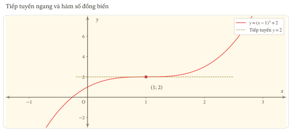
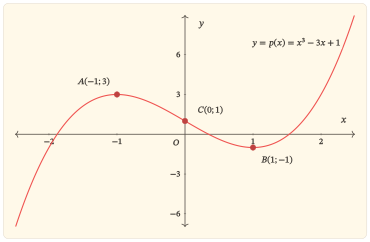
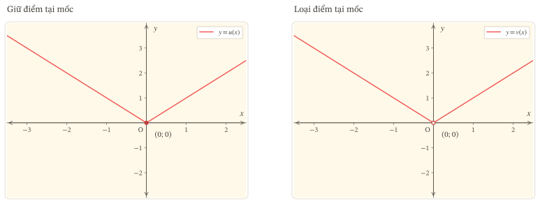
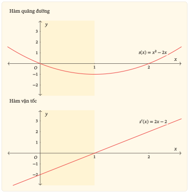
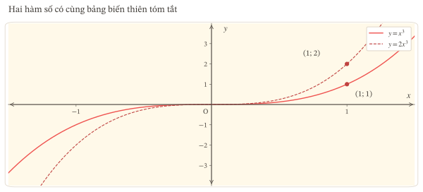
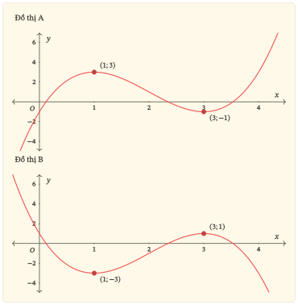
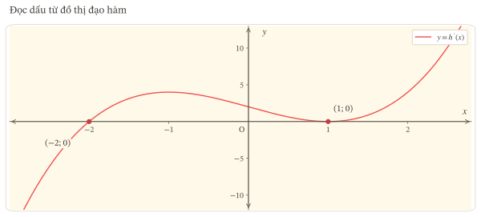
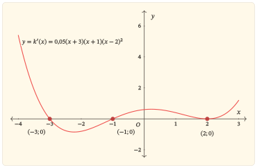
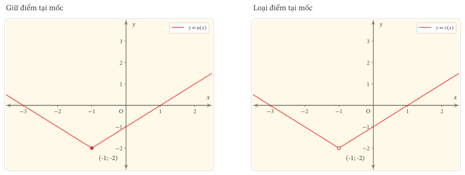
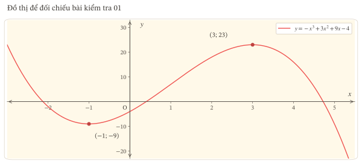

::::::::::::::::::::::::::::::::::::::::::::::::::::::::::::::::::::::::::::::::::::::::::::::::::::::::::::::::::::::::::::::::::::::::::::::: {.zo-on-thi-package .r1-g01 r1-code="R1-G01" r1-title="Kết nối hàm số, bảng biến thiên và đồ thị"}
::: {#bat-dau .r1-status}
Có thể học
:::

Học liệu “Kết nối hàm số, bảng biến thiên và đồ thị” là gói củng cố kiến thức nền và chẩn đoán lỗi thuộc chương trình [Ôn thi Toán THPT 2027](../../tot_nghiep_thpt/2027/index.qmd). Học liệu giúp em đọc đúng công thức, bảng biến thiên và đồ thị; dùng dấu đạo hàm để giải thích kết luận về tính đơn điệu và cực trị. Em cần biết tính đạo hàm đa thức, xét dấu biểu thức và nhận biết tính liên tục tại một điểm. Bốn câu hỏi khởi động sẽ giúp em xác định phần cần ôn. Bài kiểm tra cuối gói nhằm xác định mức độ em làm chủ những nội dung này; đây không phải là đề mô phỏng cấu trúc đề thi tốt nghiệp THPT.

## Cách học với tài liệu này {#cách-học-với-tài-liệu-này}

Chuẩn bị giấy để tự làm trước khi mở lời giải. Em có thể học qua nhiều buổi; sau mỗi buổi, ghi vị trí dừng và điều cần hỏi vào nhật kí học tập.

::: {#r1-table-t01 .table-scroll}
| Phần | Em thực hiện | Kết quả cần giữ lại |
|------------------------|------------------------|------------------------|
| Học | Làm bốn câu hỏi khởi động; đọc các mục cần thiết; tự làm câu hỏi trong bài rồi đối chiếu lời giải. | Lập luận của em và điều kiện đã sử dụng. |
| Luyện tập | Làm tám bài theo thứ tự ở lượt đầu. Đối chiếu từng bài sau khi đã tự giải. | Bài làm và chỗ còn sai hoặc chưa giải thích được. |
| Kiểm tra | Làm năm bài độc lập, dự kiến 45 phút; đóng bài học và lời giải. | Bài làm ban đầu, thời gian và điểm từng ý. |
| Sửa lỗi | Giữ bài làm ban đầu; nêu lỗi, sửa lập luận rồi làm bài tập khắc phục tương ứng. | Lí do sửa và kết quả tự làm câu mới. |
| Ôn lại | Hẹn một buổi sau để tự nhớ lại kiến thức và kiểm tra phần từng sai. | Ngày ôn, kết quả và phần còn cần luyện. |
:::

Thời gian 45 phút là thời lượng đề xuất cho bài kiểm tra của học liệu này, có thể điều chỉnh sau khi sử dụng. Tổng điểm 20 dùng để phân tích bài làm, không mô phỏng thang điểm của kì thi THPT.

:::: {#cach-thuc-hien-su-dung-tai-lieu .r1-details .r1-guidance .zo-learning-guidance}
::: {.r1-summary .zo-learning-summary}
Cách thực hiện
:::

- Tải bản học và bài tập để tự làm.
- Dùng bản đầy đủ khi cần đối chiếu lời giải.
- Trên màn hình, dùng các liên kết lời giải để mở đúng phần tương ứng.
::::

## Bài học {#bai-hoc}

::: lesson-toc
:::

### 0. Bắt đầu từ đâu? {#bắt-đầu-từ-đâu}

:::: {#cach-thuc-hien-bat-dau .r1-details .r1-guidance .zo-learning-guidance}
::: {.r1-summary .zo-learning-summary}
Cách thực hiện
:::

1.  Làm bốn câu hỏi khởi động trên giấy.
2.  Đối chiếu lời giải rồi dùng bảng chỉ dẫn để ôn đúng phần còn vướng.

Đọc các mục tiêu để biết mình cần làm được gì.
::::

#### Câu hỏi dẫn đường {#câu-hỏi-dẫn-đường}

Một công thức đạo hàm, một bảng biến thiên và một đồ thị có thể cùng nói về một hàm số. Nhưng chúng không nói cùng một lượng thông tin. Làm thế nào để chuyển từ biểu diễn này sang biểu diễn khác mà không kết luận thêm điều dữ kiện chưa cho phép?

Trong bài này, em sẽ tập trả lời ba câu hỏi trước mỗi kết luận:

1.  Ta đang xét hàm số nào, trên tập xác định và khoảng nào?
2.  Dữ kiện đang nói về $f$, về $f^\prime$, hay chỉ về chiều biến thiên?
3.  Điều kiện nào cho phép đi từ dữ kiện đến kết luận?

#### Học xong, em cần làm được gì? {#học-xong-em-cần-làm-được-gì}

::: {#r1-table-t02 .table-scroll}
| Mục tiêu | Việc em cần làm được |
|------------------------------------|------------------------------------|
| Kết nối các biểu diễn của hàm số | Nối công thức, dấu đạo hàm, bảng biến thiên và dáng điệu đồ thị; phát hiện hai biểu diễn không khớp |
| Xét tính đơn điệu bằng đạo hàm | Nêu khoảng xét và các điều kiện cần kiểm tra; dùng dấu đạo hàm để kết luận hàm số đồng biến hoặc nghịch biến. |
| Xác định cực trị | Kiểm tra điều kiện; phân biệt điểm cực trị của hàm số, giá trị cực trị và điểm cực trị của đồ thị. |
| Đúng/sai có lí do | Đánh giá từ giả thiết đã cho; dùng lập luận hoặc phản ví dụ phù hợp |
| Sửa lỗi và vận dụng lại | Chỉ ra lỗi, viết lại cho đúng rồi làm một câu mới kiểm tra chính lỗi đó |
:::

Bài này không học giá trị lớn nhất, giá trị nhỏ nhất, tiệm cận, tối ưu hoặc toàn bộ quy trình khảo sát hàm số. Chỉ ôn lại kiến thức nền đúng lúc cần dùng.

#### Câu hỏi khởi động {#bốn-câu-thử-nền-tn01-đến-tn04}

Hãy thử trước khi đọc đáp án trong mục “Lời giải các câu hỏi và bài tập trong bài học” ở phần Lời giải cuối tài liệu. Không cần tính điểm; câu nào chưa làm được sẽ chỉ ra phần cần ôn nhanh.

:::: {.zo-learning-task .zo-learning-task--pause}

- **Câu hỏi khởi động 01.** Hàm số $r(x)=\frac{1}{x-2}$ có tập xác định nào? Có thể áp dụng định lí dấu đạo hàm cho $r$ trên cả khoảng $(1;3)$ không?
- **Câu hỏi khởi động 02.** Tính đạo hàm của $s(x)=x^2-2x$ và xác định dấu của đạo hàm ở hai phía của $x=1$.
- **Câu hỏi khởi động 03.** Một bảng biến thiên cho biết $f$ đồng biến trên $(-2;0)$, đạt giá trị $3$ tại $x=0$, rồi nghịch biến trên $(0;2)$. Khi đi từ trái sang phải, mũi tên ở hai khoảng phải hướng thế nào? Số $3$ nằm ở hàng $x$ hay hàng $f(x)$?
- **Câu hỏi khởi động 04.** Một hình được ghi nhãn $y=f^\prime(x)$. Trên khoảng $K$, toàn bộ đường biểu diễn nằm dưới trục hoành. Dữ kiện này nói $f(x)<0$ hay $f^\prime(x)<0$?

::: answer-link
[Xem lời giải](#lg-khoi-dong)
:::
::::

#### Chọn đúng phần cần ôn {#chọn-đúng-phần-cần-ôn}

::: {#r1-table-t03 .table-scroll}
| Nếu còn vướng | Ôn nhanh điều này | Quay lại |
|------------------------|------------------------|------------------------|
| Câu hỏi khởi động 01 | Mẫu số phải khác $0$; một khoảng xét phải nằm trong tập xác định | Mục 1.1 và 6.4 |
| Câu hỏi khởi động 02 | Đạo hàm đa thức; dấu của biểu thức bậc nhất | Mục 2.1 rồi 3.2 |
| Câu hỏi khởi động 03 | Hàng $x$ ghi vị trí; hàng $f(x)$ ghi giá trị và chiều biến thiên | Mục 3.3 |
| Câu hỏi khởi động 04 | Phân biệt nhãn $y=f(x)$ với $y=f^\prime(x)$ | Mục 6.2 |
:::

Nếu bốn câu đã rõ, đi thẳng vào Mục 1. Nếu thiếu một kĩ thuật nền, chỉ bổ sung kĩ thuật đó; không cần học lại cả chương đạo hàm.

### 1. Đơn điệu nói điều gì? {#đơn-điệu-nói-điều-gì}

:::: {#cach-thuc-hien-don-dieu .r1-details .r1-guidance .zo-learning-guidance}
::: {.r1-summary .zo-learning-summary}
Cách thực hiện
:::

1.  Trả lời câu hỏi mở đầu bằng lời của em.
2.  Đọc định nghĩa và Ví dụ 01, rồi tự làm Câu hỏi tự kiểm tra 01.
3.  Khi đối chiếu, kiểm tra xem lập luận đã bao quát mọi cặp điểm trên khoảng xét chưa.
::::

:::: {#thử-nghĩ-trước .r1-task .zo-learning-task .zo-learning-task--pause}
[**Thử nghĩ trước**]{.r1-task-label}

Em tính được $f(0)<f(1)<f(2)$. Chừng đó đã đủ để khẳng định $f$ đồng biến trên $(0;2)$ chưa?
::::

Chưa. Ba giá trị chỉ mô tả ba vị trí. Một kết luận về cả khoảng phải kiểm soát mọi cặp điểm thích hợp trong khoảng ấy.

#### 1.1. Từ “đi lên” đến định nghĩa {#từ-đi-lên-đến-định-nghĩa}

Cho hàm số $y=f(x)$ có tập xác định $D$. Xét $K$ là một khoảng, một đoạn hoặc một nửa khoảng nằm trong $D$.

::::: {.zo-block .zo-block-red}
:::: {.zo-block-title}
Đơn điệu: Định nghĩa hàm số đồng biến và nghịch biến
::::

- Hàm số **đồng biến** trên $K$ nếu với mọi $x_1,x_2$ thuộc $K$, khi $x_1<x_2$ thì $f(x_1)<f(x_2)$.

- Hàm số **nghịch biến** trên $K$ nếu với mọi $x_1,x_2$ thuộc $K$, khi $x_1<x_2$ thì $f(x_1)>f(x_2)$.

:::::

Hai điều phải giữ nguyên là “với mọi cặp điểm” và “trên $K$”. Khi đọc đồ thị từ trái sang phải, “đi lên” hay “đi xuống” là cách hình dung hai quan hệ ấy, không phải một cách thay thế điều kiện của định nghĩa. [Nguồn đối chiếu: Sách giáo khoa Toán 12, tập một, bài 1, trang 6.]{.zo-source-note}

#### 1.2. Ví dụ 01 — Chứng minh mà chưa dùng đạo hàm {#ví-dụ-v01-chứng-minh-mà-chưa-dùng-đạo-hàm .r1-example-heading .zo-learning-example-heading}

:::: {.zo-learning-example}
Xét $f(x)=2x-1$ trên $\mathbb{R}$. Lấy bất kì $x_1<x_2$. Ta có

$$f(x_2)-f(x_1)=2(x_2-x_1)>0.$$

Vì vậy $f(x_1)<f(x_2)$. Hàm số đồng biến trên $\mathbb{R}$.

Nếu thay bằng $g(x)=-2x+1$ thì

$$g(x_2)-g(x_1)=-2(x_2-x_1)<0.$$

Hàm số $g$ nghịch biến trên $\mathbb{R}$.

Lập luận này dùng đúng định nghĩa. Đạo hàm sẽ giúp ta xử lí những công thức phức tạp hơn, nhưng không làm thay đổi ý nghĩa của đồng biến, nghịch biến.
::::

:::: {#dừng-lại-1-d01 .r1-task .zo-learning-task .zo-learning-task--pause}
[**Câu hỏi tự kiểm tra 01**]{.r1-task-label}

Một bạn viết: “Hàm số $f$ đồng biến trên $(a;b)$ vì $f(a)<f(b)$.” Chỉ ra hai điều chưa ổn trong lập luận này, kể cả khi hai giá trị ở đầu mút tình cờ tồn tại.

::: answer-link
[Xem lời giải](#lg-d01)
:::
::::

### 2. Dấu đạo hàm cho phép kết luận gì? {#dấu-đạo-hàm-cho-phép-kết-luận-gì}

:::: {#cach-thuc-hien-dau-dao-ham .r1-details .r1-guidance .zo-learning-guidance}
::: {.r1-summary .zo-learning-summary}
Cách thực hiện
:::

- Đọc giả thiết của định lí trước kết luận.
- Với Ví dụ 02, đối chiếu dấu đạo hàm, mũi tên trong bảng và đồ thị.
- Tự làm Câu hỏi tự kiểm tra 02.

Phần giải thích bằng giới hạn được đặt trong mục đọc thêm.
::::

:::: {#thử-nghĩ-trước-1 .r1-task .zo-learning-task .zo-learning-task--pause}
[**Thử nghĩ trước**]{.r1-task-label}

Nếu đạo hàm dương ở một điểm thì ta biết điều gì ở điểm đó? Nếu đạo hàm dương trên cả một khoảng thì ta được kết luận thêm điều gì?
::::

Đạo hàm tại một điểm cho biết hệ số góc của tiếp tuyến tại điểm ấy khi đạo hàm tồn tại. Định lí sau đây mới là căn cứ để đi từ dấu đạo hàm trên một khoảng đến chiều biến thiên trên khoảng đó.

#### 2.1. Định lí và phạm vi áp dụng {#định-lí-và-phạm-vi-áp-dụng}

Cho $f$ có đạo hàm trên khoảng $K$.

::::: {.zo-block .zo-block-red}
:::: {.zo-block-title}
Đơn điệu: Dấu đạo hàm và chiều biến thiên
::::

- Nếu $f^\prime(x)>0$ với mọi $x$ thuộc $K$ thì $f$ đồng biến trên $K$.
- Nếu $f^\prime(x)<0$ với mọi $x$ thuộc $K$ thì $f$ nghịch biến trên $K$.

:::::

Khi áp dụng, viết đủ ba ý: hàm số có đạo hàm trên khoảng đang xét; dấu của đạo hàm trên cả khoảng; kết luận chiều biến thiên trên chính khoảng đó. [Nguồn đối chiếu: Sách giáo khoa Toán 12, tập một, bài 1, trang 7.]{.zo-source-note}

Chẳng hạn, với $s(x)=x^2-2x$, ta có $D=\mathbb{R}$ và $s^\prime(x)=2(x-1)$. Đạo hàm âm trên $(-\infty;1)$, dương trên $(1;+\infty)$. Do đó $s$ nghịch biến trên $(-\infty;1)$ và đồng biến trên $(1;+\infty)$.

Chú ý cách nói: dấu của $s^\prime$ cho biết chiều biến thiên của $s$. Không viết “đạo hàm đồng biến nên hàm số đồng biến”; sự tăng giảm của đạo hàm là thông tin khác với dấu của đạo hàm.

#### 2.2. Một số hữu hạn điểm đạo hàm bằng 0 {#một-số-hữu-hạn-điểm-đạo-hàm-bằng-0}

Vẫn giả sử $f$ có đạo hàm trên khoảng $K$. Kết luận trên vẫn đúng nếu đạo hàm giữ dấu nghiêm ngặt tương ứng, chỉ bằng $0$ tại một số hữu hạn điểm trong khoảng. Cụ thể:

::::: {.zo-block .zo-block-red}
:::: {.zo-block-title}
Đơn điệu: Đạo hàm bằng $0$ tại một số hữu hạn điểm
::::

- $f^\prime(x)\geq 0$ trên $K$, và chỉ bằng $0$ tại một số hữu hạn điểm, thì $f$ đồng biến trên $K$.
- $f^\prime(x)\leq 0$ trên $K$, và chỉ bằng $0$ tại một số hữu hạn điểm, thì $f$ nghịch biến trên $K$.

:::::

Không được rút gọn thành “đạo hàm có hữu hạn nghiệm thì hàm số đơn điệu”: còn phải kiểm tra dấu ở các điểm còn lại. Cũng không được bỏ điều kiện về các điểm bằng $0$ rồi khẳng định đồng biến chỉ từ $f^\prime(x)\geq 0$. Ví dụ hàm hằng $f(x)=5$ có đạo hàm bằng $0$ ở mọi điểm nhưng không đồng biến theo định nghĩa nghiêm ngặt ở Mục 1. [Nguồn đối chiếu: Sách giáo khoa Toán 12, tập một, bài 1, trang 7.]{.zo-source-note}

#### 2.3. Ví dụ 02 — Đạo hàm bằng 0 nhưng không đổi chiều {#đối-chứng-v02-đạo-hàm-bằng-0-nhưng-không-đổi-chiều}

:::: {.zo-learning-example}
Xét hàm số sau:

$$f(x)=(x-1)^3+2.$$

Hàm số có đạo hàm trên $\mathbb{R}$ và

$$f^\prime(x)=3(x-1)^2.$$

Đạo hàm dương với mọi $x\ne 1$, chỉ bằng $0$ tại $x=1$. Bởi chú ý vừa nêu, $f$ đồng biến trên toàn bộ $\mathbb{R}$.

Giữ mốc $x=1$ trong bảng để thấy điều gì xảy ra ở đó:

:::: table-scroll
::: {.r1-bbt bbt="BBT01" caption="Bảng biến thiên."}
ZO BBT placeholder
:::
::::

Hai mũi tên đều đi lên, gặp nhau ở giá trị $f(1)=2$. Tiếp tuyến tại điểm $(1;2)$ nằm ngang vì hệ số góc bằng $f^\prime(1)=0$, nhưng hàm số không chuyển từ tăng sang giảm hay ngược lại.

Một điểm có tiếp tuyến ngang không làm cho cả một khoảng trở thành đoạn nằm ngang.

:::: r1-figure
{loading="lazy"}

::: r1-figcaption
Hình 01 — Tiếp tuyến ngang tại (1;2), hàm số vẫn tăng ở hai phía.
:::
::::
::::

#### 2.4. Vì sao không được đảo thành điều kiện nghiêm ngặt? {#vì-sao-không-được-đảo-thành-điều-kiện-nghiêm-ngặt}

[**Không đảo định lí thành dấu nghiêm ngặt.**]{.r1-unboxed-label}

Ví dụ 02 bác bỏ phát biểu: “Nếu $f$ đồng biến và có đạo hàm trên $K$ thì $f^\prime(x)>0$ tại mọi điểm của $K$.” Hàm số trong ví dụ đồng biến trên $\mathbb{R}$ nhưng $f^\prime(1)=0$.

Phát biểu đúng là: nếu $f$ đồng biến và có đạo hàm trên khoảng $K$, thì $f^\prime(x)\geq 0$ với mọi $x$ thuộc $K$. Với hàm nghịch biến và có đạo hàm, kết luận tương ứng là $f^\prime(x)\leq 0$.

:::: {.r1-details .zo-learning-context-note}
::: {.r1-summary .zo-learning-summary}
Đọc thêm — Giải thích bằng định nghĩa đạo hàm
:::

Có thể hiểu dấu không nghiêm ngặt này từ định nghĩa đạo hàm. Cố định $x_0$ trong $K$. Với $h\ne 0$ đủ nhỏ, tính đồng biến cho

$$\frac{f(x_0+h)-f(x_0)}{h}>0.$$

Khi $h$ tiến đến $0$, giới hạn của các số dương có thể bằng $0$. Vì vậy không thể buộc giới hạn ấy phải dương nghiêm ngặt. Đây là giải thích bổ sung của bài học, không phải phát biểu trích nguyên văn định lí ở SGK.
::::

:::: {#dừng-lại-2-d02 .r1-task .zo-learning-task .zo-learning-task--pause}
[**Câu hỏi tự kiểm tra 02**]{.r1-task-label}

Cho $h$ có đạo hàm trên $\mathbb{R}$ và $h^\prime(x)=(x+2)^2$. Hãy kết luận chiều biến thiên trên $\mathbb{R}$ và phản biện câu: “Phải tách thành hai khoảng đơn điệu vì đạo hàm bằng $0$ tại $-2$.”

::: answer-link
[Xem lời giải](#lg-d02)
:::
::::

### 3. Một chuỗi biểu diễn được dựng thế nào? {#một-chuỗi-biểu-diễn-được-dựng-thế-nào}

:::: {#cach-thuc-hien-chuoi-bieu-dien .r1-details .r1-guidance .zo-learning-guidance}
::: {.r1-summary .zo-learning-summary}
Cách thực hiện
:::

1.  Với Ví dụ 03, tự tính đạo hàm và xét dấu trước khi xem bảng. Tính giá trị tại các mốc.
2.  Lập bảng biến thiên rồi phác đồ thị.
3.  Làm Câu hỏi tự kiểm tra 03 để kiểm tra sự phù hợp giữa bảng và hình.
::::

:::: {#thử-nghĩ-trước-2 .r1-task .zo-learning-task .zo-learning-task--pause}
[**Thử nghĩ trước**]{.r1-task-label}

Nếu đã có bảng dấu đạo hàm thì còn thiếu gì để viết được giá trị hàm số tại các mốc? Nếu đã có bảng biến thiên thì đã có duy nhất một đồ thị chính xác chưa?
::::

Ta theo dõi một ví dụ xuyên suốt để thấy mỗi bước dùng và bổ sung thông tin nào.

#### 3.1. Ví dụ 03 — Bắt đầu từ công thức {#ví-dụ-v03-bắt-đầu-từ-công-thức}

:::: {.zo-learning-example}
Xét

$$p(x)=x^3-3x+1.$$

Đây là hàm đa thức nên có tập xác định $\mathbb{R}$, liên tục và có đạo hàm trên $\mathbb{R}$. Đạo hàm là

$$p^\prime(x)=3x^2-3=3(x-1)(x+1).$$

Các nghiệm của $p^\prime(x)=0$ là $-1$ và $1$. Hai mốc này chia trục số thành ba khoảng cần xét dấu.
::::

#### 3.2. Từ đạo hàm đến dấu và chiều biến thiên {#từ-đạo-hàm-đến-dấu-và-chiều-biến-thiên}

::: {#r1-table-t04 .table-scroll}
| Khoảng | Dấu $x+1$ | Dấu $x-1$ | Dấu $p^\prime(x)$ | Kết luận về $p$ |
|----|----|----|----|----|
| $(-\infty;-1)$ | Âm | Âm | Dương | Đồng biến |
| $(-1;1)$ | Dương | Âm | Âm | Nghịch biến |
| $(1;+\infty)$ | Dương | Dương | Dương | Đồng biến |
:::

Kết luận này dựa trên dấu trên từng khoảng, không chỉ trên hai đẳng thức $p^\prime(-1)=0$ và $p^\prime(1)=0$.

#### 3.3. Từ chiều biến thiên đến bảng biến thiên {#từ-chiều-biến-thiên-đến-bảng-biến-thiên}

Tính các giá trị ở mốc:

$$p(-1)=3,\quad p(1)=-1.$$

Ngoài ra, từ biểu thức đa thức bậc ba, ta có

$$\lim_{x\to-\infty}p(x)=-\infty,\quad \lim_{x\to+\infty}p(x)=+\infty.$$

Những giới hạn này được xác định từ công thức, không suy ra chỉ từ dấu của đạo hàm. Nếu chưa vững, có thể kiểm tra bằng cách viết $p(x)=x^3(1-3/x^2+1/x^3)$ với $x\ne 0$.

Bảng biến thiên là:

:::: table-scroll
::: {.r1-bbt bbt="BBT02" caption="Bảng biến thiên."}
ZO BBT placeholder
:::
::::

Đọc từng hàng theo đúng chức năng:

- Hàng $x$ ghi các mốc theo thứ tự tăng dần.
- Hàng $p^\prime(x)$ ghi dấu trên khoảng và giá trị đạo hàm tại các mốc đã tính.
- Hàng $p(x)$ ghi giá trị hoặc giới hạn đã biết, cùng mũi tên biểu thị chiều biến thiên.

Số $-1$ xuất hiện ở cả hai hàng nhưng không luôn chỉ cùng một đối tượng: $x=-1$ là một vị trí, còn $p(1)=-1$ là một giá trị hàm số.

#### 3.4. Từ bảng đến dáng điệu đồ thị {#từ-bảng-đến-dáng-điệu-đồ-thị}

Từ công thức, tính thêm $p(0)=1$. Vì vậy đồ thị đi qua $C(0;1)$, là giao điểm với trục tung. Điểm này giúp định vị đồ thị; nó không phải mốc đổi chiều trong bảng biến thiên.

Đồ thị $y=p(x)$ phải phù hợp với các thông tin sau:

- Trên $(-\infty;-1)$, đường biểu diễn đi lên khi đọc từ trái sang phải và tiến đến điểm $A(-1;3)$.
- Trên $(-1;1)$, đường biểu diễn đi xuống từ $A$ đến $B(1;-1)$; nó đi qua $C(0;1)$ do giá trị đã tính từ công thức.
- Trên $(1;+\infty)$, đường biểu diễn đi lên từ $B$.
- Đồ thị liền tại hai mốc vì $p$ liên tục; các tiếp tuyến tại $A$ và $B$ nằm ngang vì đạo hàm tại đó bằng $0$.

Đây là những ràng buộc để phác đúng dáng điệu, chưa phải toàn bộ quy trình khảo sát hàm số. Không tự thêm một giao điểm, tọa độ hoặc tính chất hình học chưa có căn cứ.

Nếu một hình gắn nhãn $y=p(x)$ lại đi lên trên $(-1;1)$, hình ấy mâu thuẫn với bảng. Nếu một bảng đặt $p(-1)=-1$, bảng ấy mâu thuẫn với công thức. Kiểm tra chéo giúp tìm lỗi ngay tại mắt xích tạo ra nó. [Nguồn đối chiếu: Sách giáo khoa Toán 12, tập một, bài 1, trang 7–8; Sách giáo khoa Toán 12, tập một, bài 4, trang 26–27.]{.zo-source-note}

:::: r1-figure
{loading="lazy"}

::: r1-figcaption
Hình 02 — Đồ thị khớp bảng biến thiên của p.
:::
::::

:::: {#dừng-lại-3-d03 .r1-task .zo-learning-task .zo-learning-task--pause}
[**Câu hỏi tự kiểm tra 03**]{.r1-task-label}

Một bản vẽ cho Ví dụ 03 đi qua đúng $A(-1;3)$ và $B(1;-1)$, nhưng có một đoạn đi lên nằm bên trong $(-1;1)$. Bản vẽ có thể được chấp nhận vì đã đặt đúng hai điểm mốc không? Nêu dữ kiện quyết định.

::: answer-link
[Xem lời giải](#lg-d03)
:::
::::

### 4. Điều gì xảy ra tại một điểm cần xét? {#điều-gì-xảy-ra-tại-một-điểm-cần-xét}

:::: {#cach-thuc-hien-diem-can-xet .r1-details .r1-guidance .zo-learning-guidance}
::: {.r1-summary .zo-learning-summary}
Cách thực hiện
:::

- So sánh lần lượt bốn tình huống: đổi dấu, không đổi dấu, không có đạo hàm tại mốc, và mốc không thuộc tập xác định.
- Mỗi lần kết luận, chỉ rõ tính liên tục và dấu ở hai phía.
- Cuối mục, tự làm Câu hỏi tự kiểm tra 04.
::::

:::: {#thử-nghĩ-trước-3 .r1-task .zo-learning-task .zo-learning-task--pause}
[**Thử nghĩ trước**]{.r1-task-label}

Cùng có đạo hàm bằng $0$, tại sao có điểm làm hàm số đổi chiều còn có điểm không? Một điểm không có đạo hàm có thể vẫn là nơi hàm số đổi chiều không?
::::

Trước hết, hãy hình dung: khi hàm số đạt cực đại tại một điểm, giá trị tại đó lớn hơn các giá trị tại những điểm khác ở đủ gần hai phía. Với cực tiểu, giá trị tại điểm đang xét nhỏ hơn các giá trị ở những điểm khác đủ gần hai phía. Định nghĩa đầy đủ và cách gọi tên sẽ được viết ở Mục 5.

#### 4.1. Điều kiện đủ qua dấu đạo hàm {#điều-kiện-đủ-qua-dấu-đạo-hàm}

Giả sử $f$ liên tục trên khoảng $(a;b)$ chứa $x_0$ và có đạo hàm trên hai khoảng $(a;x_0)$, $(x_0;b)$.

::::: {.zo-block .zo-block-red}
:::: {.zo-block-title}
Cực trị: Điều kiện đủ qua dấu đạo hàm
::::

- Nếu $f^\prime(x)>0$ trên $(a;x_0)$ và $f^\prime(x)<0$ trên $(x_0;b)$, hàm số đạt cực đại tại $x_0$.
- Nếu $f^\prime(x)<0$ trên $(a;x_0)$ và $f^\prime(x)>0$ trên $(x_0;b)$, hàm số đạt cực tiểu tại $x_0$.

:::::

Đó là định lí điều kiện đủ đang dùng. Định lí không đòi hỏi đạo hàm phải tồn tại tại chính $x_0$. Tính liên tục tại $x_0$ phải được kiểm tra; việc có đạo hàm ở hai phía không tự bảo đảm điều đó. [Nguồn đối chiếu: Sách giáo khoa Toán 12, tập một, bài 1, trang 10.]{.zo-source-note}

Khi các điều kiện trên đã được bảo đảm, có thể tóm tắt hành vi như sau:

::: {#r1-table-t05 .table-scroll}
| Dấu đạo hàm bên trái | Dấu đạo hàm bên phải | Chiều biến thiên quanh $x_0$ | Kết luận tại $x_0$ |
|------------------|------------------|------------------|------------------|
| Dương trên cả khoảng bên trái | Âm trên cả khoảng bên phải | Tăng rồi giảm | Cực đại |
| Âm trên cả khoảng bên trái | Dương trên cả khoảng bên phải | Giảm rồi tăng | Cực tiểu |
| Dương trên cả khoảng bên trái | Dương trên cả khoảng bên phải | Giữ chiều tăng | Không có cực trị |
| Âm trên cả khoảng bên trái | Âm trên cả khoảng bên phải | Giữ chiều giảm | Không có cực trị |
:::

Hai dòng cuối là kết luận trong tình huống có dấu nghiêm ngặt ở mỗi phía và liên tục tại điểm nối. Không dùng câu tắt “không đổi dấu thì không có cực trị” cho một bảng thiếu điều kiện hoặc chưa xác định được dấu trên cả hai khoảng.

#### 4.2. Đối chứng thứ nhất — Đổi dấu và có cực trị {#đối-chứng-thứ-nhất-đổi-dấu-và-có-cực-trị}

:::: {.zo-learning-example}
Với $p(x)=x^3-3x+1$ trong Ví dụ 03, tính liên tục đã có vì $p$ là đa thức.

Qua $x=-1$, đạo hàm đổi dấu từ dương sang âm. Hàm số đạt cực đại tại $x=-1$, với giá trị $p(-1)=3$.

Qua $x=1$, đạo hàm đổi dấu từ âm sang dương. Hàm số đạt cực tiểu tại $x=1$, với giá trị $p(1)=-1$.

Ta không kết luận có cực trị chỉ vì giải được phương trình $p^\prime(x)=0$. Bước quyết định là kiểm tra dấu hai phía trong những điều kiện phù hợp.
::::

#### 4.3. Đối chứng thứ hai — Bằng 0 nhưng không có cực trị {#đối-chứng-thứ-hai-bằng-0-nhưng-không-có-cực-trị}

:::: {.zo-learning-example}
Trở lại $f(x)=(x-1)^3+2$ trong Ví dụ 02. Hàm số liên tục tại $1$, đạo hàm dương trên cả hai phía của $1$ và bằng $0$ tại $1$.

Với $x<1$, ta có $f(x)<2$. Với $x>1$, ta có $f(x)>2$. Do đó, dù xét gần $1$ đến đâu, vẫn có giá trị nhỏ hơn $f(1)$ ở bên trái và lớn hơn $f(1)$ ở bên phải. Hàm số không đạt cực đại hoặc cực tiểu tại $1$.

Kết luận cần nhớ là: $f^\prime(x_0)=0$ tạo ra một điểm cần xét, không tự xác nhận một điểm cực trị. [Nguồn đối chiếu: chú ý về $x^3$ trong Sách giáo khoa Toán 12, tập một, bài 1, trang 11.]{.zo-source-note}
::::

#### 4.4. Đối chứng thứ ba — Không có đạo hàm nhưng có cực trị {#đối-chứng-thứ-ba-không-có-đạo-hàm-nhưng-có-cực-trị}

:::: {.zo-learning-example}
Xét Ví dụ 04:

$$u(x)=\lvert x\rvert.$$

Hàm số xác định và liên tục trên $\mathbb{R}$, với $u(0)=0$. Trên hai phía của $0$:

- Nếu $x<0$ thì $u(x)=-x$, nên $u^\prime(x)=-1$.
- Nếu $x>0$ thì $u(x)=x$, nên $u^\prime(x)=1$.

Tại $0$, thương sai phân là

$$\frac{u(h)-u(0)}{h}=\frac{\lvert h\rvert}{h}.$$

Thương này bằng $-1$ khi $h<0$ và bằng $1$ khi $h>0$. Hai giới hạn một phía khác nhau nên $u^\prime(0)$ không tồn tại.

Tuy nhiên, đạo hàm đổi từ âm sang dương qua $0$, và $u$ liên tục tại $0$. Theo định lí, $u$ đạt cực tiểu tại $0$. Có thể kiểm tra trực tiếp: với mọi $x\ne 0$, $u(x)=\lvert x\rvert>0=u(0)$, nên điều kiện so sánh nghiêm ngặt quanh $0$ được thỏa mãn. [Nguồn đối chiếu: Sách giáo khoa Toán 12, tập một, bài 1, trang 6 và 14.]{.zo-source-note}

::::: table-scroll
:::: table-scroll
::: {.r1-bbt bbt="BBT12" caption="Bảng biến thiên của u(x) = |x|."}
ZO BBT placeholder
:::
::::
:::::

Hàng đạo hàm không có giá trị tại $0$, nhưng hàng hàm số vẫn có $u(0)=0$. Không được dùng vạch ngăn tại điểm không thuộc tập xác định ở hàng hàm số để xóa mất điểm này. Đồ thị có một góc tại $(0;0)$; đó không phải một điểm bị bỏ khỏi đồ thị.
::::

#### 4.5. Tách riêng điểm không thuộc tập xác định {#tách-riêng-điểm-không-thuộc-tập-xác-định}

[**Điểm không thuộc tập xác định.**]{.r1-unboxed-label}

Xét $v(x)=\lvert x\rvert$ nhưng chỉ trên tập xác định $D=\mathbb{R}\setminus\{0\}$. Trên mỗi phía của $0$, công thức và dấu đạo hàm giống Ví dụ 04. Tuy nhiên, $v(0)$ không tồn tại vì $0$ đã bị loại khỏi tập xác định.

Vì vậy, $0$ không thể là điểm cực trị của $v$. Dấu âm bên trái và dấu dương bên phải không tạo ra một giá trị hàm số tại vị trí không thuộc tập xác định.

:::: table-scroll
::: {.r1-bbt bbt="BBT13" caption="Bảng biến thiên khi loại 0 khỏi tập xác định."}
ZO BBT placeholder
:::
::::

Hai số 0 ở hai phía của vạch ngăn là giới hạn một phía. Hàm số không có giá trị tại 0.

Khi dựng bảng, phải thể hiện vạch ngăn tại điểm không thuộc tập xác định qua hàng hàm số; nếu ghi giới hạn tại mốc thì đó là giới hạn, không phải $v(0)$. Khi dựng đồ thị, vị trí $(0;0)$ phải là điểm hở. Đây là sự khác biệt quyết định với Ví dụ 04.

:::: r1-figure
{loading="lazy"}

::: r1-figcaption
Hình 03 — Cùng đường nét hai phía nhưng khác việc giữ hay bỏ điểm tại gốc.
:::
::::

#### 4.6. Trình tự xét một mốc {#trình-tự-xét-một-mốc}

[**Trình tự xét một mốc.**]{.r1-unboxed-label}

1.  Mốc có thuộc tập xác định không? Nếu không, loại khỏi danh sách điểm cực trị.
2.  Có một khoảng quanh mốc đáp ứng các điều kiện của định lí không? Kiểm tra riêng tính liên tục tại mốc.
3.  Đạo hàm mang dấu gì trên từng khoảng ở hai phía?
4.  Hàm số đổi chiều hay giữ chiều? Kết luận theo trường hợp đã kiểm tra.
5.  Nếu có cực trị, tính giá trị hàm số và gọi đúng đối tượng.

Nếu thiếu giả thiết, ghi “chưa đủ điều kiện áp dụng định lí”; không chuyển câu đó thành “chắc chắn không có cực trị”.

:::: {#dừng-lại-4-d04 .r1-task .zo-learning-task .zo-learning-task--pause}
[**Câu hỏi tự kiểm tra 04**]{.r1-task-label}

Cho $w$ liên tục trên $(-2;2)$, có đạo hàm trên $(-2;0)$ và $(0;2)$; đạo hàm dương trên khoảng bên trái, âm trên khoảng bên phải. Biết $w(0)=5$ nhưng chưa biết $w^\prime(0)$ có tồn tại hay không. Có kết luận được cực trị tại $0$ không? Vì sao?

::: answer-link
[Xem lời giải](#lg-d04)
:::
::::

### 5. Cực trị được gọi tên thế nào? {#cực-trị-được-gọi-tên-thế-nào}

:::: {#cach-thuc-hien-goi-ten-cuc-tri .r1-details .r1-guidance .zo-learning-guidance}
::: {.r1-summary .zo-learning-summary}
Cách thực hiện
:::

1.  Đọc định nghĩa rồi trở lại Ví dụ 03.
2.  Viết riêng ba đối tượng: điểm cực trị của hàm số, giá trị cực trị và điểm cực trị của đồ thị.
3.  Hoàn thành Câu hỏi tự kiểm tra 05 để kiểm tra cách dùng thuật ngữ.
::::

:::: {#thử-nghĩ-trước-4 .r1-task .zo-learning-task .zo-learning-task--pause}
[**Thử nghĩ trước**]{.r1-task-label}

Với Ví dụ 03, câu “cực đại là $-1$” có đủ rõ không? Người viết đang nói về hoành độ, giá trị hàm số hay một điểm trên đồ thị?
::::

#### 5.1. Định nghĩa theo so sánh trong một lân cận {#định-nghĩa-theo-so-sánh-trong-một-lân-cận}

Xét $f$ xác định và liên tục trên khoảng $(a;b)$, với $x_0$ thuộc khoảng đó.

::::: {.zo-block .zo-block-red}
:::: {.zo-block-title}
Cực trị: Định nghĩa trong một lân cận
::::

- Hàm số đạt **cực đại tại $x_0$** nếu có số $h>0$ sao cho $(x_0-h;x_0+h)$ nằm trong $(a;b)$, và với mọi $x$ trong khoảng nhỏ này, khác $x_0$, ta có

  $$f(x)<f(x_0).$$

- Hàm số đạt **cực tiểu tại $x_0$** nếu tồn tại một khoảng nhỏ như trên mà với mọi $x\ne x_0$ trong khoảng ấy, ta có

  $$f(x)>f(x_0).$$

:::::

Từ “gần” được làm chính xác bằng việc tồn tại một khoảng nhỏ quanh $x_0$. Các bất đẳng thức là nghiêm ngặt. Không cần so sánh với mọi điểm trong toàn bộ tập xác định. [Nguồn đối chiếu: Sách giáo khoa Toán 12, tập một, bài 1, trang 9.]{.zo-source-note}

Trong bài học này, ta dùng định nghĩa hai phía trên khoảng như trên. Một đầu mút của tập xác định không được tự động phân loại là cực trị bằng quy tắc hai phía. Những quy ước mở rộng khác không thuộc phạm vi bản học liệu này.

#### 5.2. Ba đối tượng cần tách biệt {#ba-đối-tượng-cần-tách-biệt}

::: {#r1-table-t06 .table-scroll}
| Đối tượng | Dạng viết | Cực đại của Ví dụ 03 | Cực tiểu của Ví dụ 03 |
|------------------|------------------|------------------|------------------|
| Điểm cực trị của hàm số | Hoành độ $x_0$ | $x=-1$ | $x=1$ |
| Giá trị cực trị của hàm số | Giá trị $f(x_0)$ | $p(-1)=3$ | $p(1)=-1$ |
| Điểm cực trị của đồ thị | Điểm có hai tọa độ | $A(-1;3)$ | $B(1;-1)$ |
:::

Cách viết rõ ràng là: “Hàm số $p$ đạt cực đại tại $x=-1$, giá trị cực đại bằng $3$; điểm cực đại của đồ thị là $A(-1;3)$.” [Nguồn đối chiếu: Sách giáo khoa Toán 12, tập một, bài 1, trang 9.]{.zo-source-note}

Trong suy luận qua dấu đạo hàm, chủ thể được kết luận đạt cực trị là hàm số $p$, không phải tự động là hàm đạo hàm $p^\prime$. Đạo hàm cũng là một hàm số, nhưng nếu muốn bàn về cực trị của nó thì đó là một câu hỏi khác.

#### 5.3. “Cục bộ” có ý nghĩa gì? {#cục-bộ-có-ý-nghĩa-gì}

[**Ý nghĩa của “cục bộ”.**]{.r1-unboxed-label}

Trong Ví dụ 03, $p$ đạt cực đại tại $-1$ với giá trị $3$. Nhưng $p(3)=19>3$. Điều này không mâu thuẫn: cực đại ở $-1$ chỉ yêu cầu so sánh với các điểm đủ gần $-1$.

Tương tự, từ việc $p$ đạt cực tiểu tại $1$, không được kết luận mọi giá trị của $p$ trên $\mathbb{R}$ đều lớn hơn hoặc bằng $p(1)$. Chúng ta dừng ở ý nghĩa cục bộ, không chuyển sang bài toán so sánh trên toàn tập xác định.

:::: {#dừng-lại-5-d05 .r1-task .zo-learning-task .zo-learning-task--pause}
[**Câu hỏi tự kiểm tra 05**]{.r1-task-label}

Sửa câu sau mà vẫn giữ các số đúng: “Đồ thị của $p(x)=x^3-3x+1$ có điểm cực tiểu bằng $-1$ tại giá trị $1$.” Hãy viết riêng điểm cực tiểu của hàm số, giá trị cực tiểu và điểm cực tiểu của đồ thị.

::: answer-link
[Xem lời giải](#lg-d05)
:::
::::

### 6. Có thể đọc ngược đến đâu? {#có-thể-đọc-ngược-đến-đâu}

Ở Mục 5, em đã tập gọi đúng đối tượng cực trị. Bây giờ cần kiểm tra thêm một việc: từ bảng, hình hoặc đạo hàm đã cho, ta thực sự biết được bao nhiêu về những đối tượng ấy?

:::: {#cach-thuc-hien-doc-nguoc .r1-details .r1-guidance .zo-learning-guidance}
::: {.r1-summary .zo-learning-summary}
Cách thực hiện
:::

- Trước mỗi bảng hoặc hình, đọc nhãn và xác định dữ kiện nói về hàm số hay đạo hàm.
- Với mỗi kết luận, nêu dữ kiện làm căn cứ.
- Tự làm Câu hỏi tự kiểm tra 06; không dùng tung độ trên đồ thị đạo hàm thay cho giá trị của hàm số.
::::

:::: {#thử-nghĩ-trước-5 .r1-task .zo-learning-task .zo-learning-task--pause}
[**Thử nghĩ trước**]{.r1-task-label}

Một mũi tên đi lên trong bảng biến thiên có đủ để viết dấu $+$ ở mọi điểm của hàng đạo hàm không? Một đường cong đang đi xuống có luôn biểu diễn một hàm số âm không?
::::

Hai câu hỏi này buộc ta tách chiều biến thiên khỏi dấu của giá trị, đồng thời đọc đúng đối tượng được biểu diễn.

Trong cả Mục 6, mỗi lần đọc ngược, hãy dừng ở ba câu hỏi:

1.  Dữ kiện đang nói về $f$, $f^\prime$ hay chỉ về chiều biến thiên?
2.  Kết luận nào theo trực tiếp từ dữ kiện ấy?
3.  Muốn kết luận thêm thì còn thiếu giả thiết hoặc giá trị nào?

#### 6.1. Bảng có hàng đạo hàm và bảng chỉ có chiều biến thiên {#bảng-có-hàng-đạo-hàm-và-bảng-chỉ-có-chiều-biến-thiên}

[**Phân biệt dữ kiện về đạo hàm và chiều biến thiên.**]{.r1-unboxed-label}

Nếu bảng ghi rõ $f^\prime(x)>0$ trên một khoảng, đó là dữ kiện về đạo hàm. Nếu bảng chỉ có mũi tên đi lên ở hàng $f(x)$, ta biết hàm số đồng biến trên khoảng được biểu diễn; chưa được tự thêm dấu đạo hàm nghiêm ngặt tại mọi điểm.

Nếu có thêm giả thiết hàm số có đạo hàm trên khoảng ấy, ta kết luận được $f^\prime(x)\geq 0$. Ví dụ 02 cho thấy dấu bằng có thể xảy ra ở một điểm trong khi mũi tên vẫn đi lên ở cả hai phía.

Khi một ô không có số, hãy xác định đó là ô không cần ghi, chưa có dữ kiện, hay đạo hàm không tồn tại. Không có quy tắc “ô trống nghĩa là bằng $0$”. Trong bản này, trường hợp không tồn tại được ghi bằng chữ để tránh nhầm lẫn.

#### 6.2. Đồ thị của $f$ khác đồ thị của $f^\prime$ {#đồ-thị-của-f-khác-đồ-thị-của-fprime}

::: {#r1-table-t07 .table-scroll}
| Điều quan sát được trên khoảng $K$ | Nếu nhãn là $y=f(x)$ | Nếu nhãn là $y=f^\prime(x)$ |
|------------------------|------------------------|------------------------|
| Đường biểu diễn nằm trên trục hoành | $f(x)>0$ | $f^\prime(x)>0$; từ đó kết luận $f$ đồng biến trên $K$ |
| Đường biểu diễn nằm dưới trục hoành | $f(x)<0$ | $f^\prime(x)<0$; từ đó kết luận $f$ nghịch biến trên $K$ |
| Đường biểu diễn đi lên từ trái sang phải | $f$ đồng biến | $f^\prime$ đồng biến; riêng điều này chưa quyết định $f$ đồng biến hay nghịch biến |
| Đường biểu diễn đi qua một điểm có tung độ $0$ | Giá trị của $f$ tại đó bằng $0$ | Đạo hàm của $f$ tại đó bằng $0$; cần xem thêm dấu hai phía để xét cực trị của $f$ |
:::

Các kết luận đọc hình được hiểu trên phần tập xác định và với độ chính xác mà đề bài thực sự cung cấp. Hình chỉ có tính minh họa, không ghi tọa độ chính xác thì không đủ để buộc một đáp số chính xác.

:::: {.r1-example .zo-learning-example}
[**Ví dụ 05 — Đạo hàm đang tăng nhưng hàm số đang giảm.**]{.r1-example-label}

Xét lại $s(x)=x^2-2x$. Đồ thị đạo hàm là đường thẳng $y=2x-2$, đi lên từ trái sang phải. Tuy nhiên, trên $(0;1)$ đường thẳng này nằm dưới trục hoành: $s^\prime(x)<0$. Do đó $s$ nghịch biến trên $(0;1)$.

Cần đọc vị trí của đồ thị $s^\prime$ so với trục hoành để tìm dấu, không dùng việc đường thẳng ấy đang đi lên để kết luận chiều biến thiên của $s$. [Nguồn đối chiếu: dạng bài đọc đồ thị đạo hàm trong Sách giáo khoa Toán 12, tập một, bài 1, trang 14, bài tập 1.6.]{.zo-source-note}

:::: r1-figure
{loading="lazy"}

::: r1-figcaption
Hình 04 — Hai nhãn khác nhau: s đang giảm trong khi s′ đang tăng và mang giá trị âm trên (0;1).
:::
::::
::::

#### 6.3. Cùng bảng tóm tắt không có nghĩa cùng công thức {#cùng-bảng-tóm-tắt-không-có-nghĩa-cùng-công-thức}

:::: {.r1-example .zo-learning-example}
**Cùng bảng tóm tắt.** Xét hai hàm số trong [Ví dụ 06:]{.r1-example-label}

$$a(x)=x^3,\quad b(x)=2x^3.$$

Chúng có cùng tập xác định $\mathbb{R}$, cùng dấu đạo hàm dương ở hai phía của $0$, đạo hàm bằng $0$ tại $0$, cùng giá trị bằng $0$ tại đó và cùng các giới hạn ở hai đầu. Vì vậy chúng có cùng bảng biến thiên tóm tắt sau, với $F$ lần lượt là $a$ hoặc $b$:

:::: table-scroll
::: {.r1-bbt bbt="BBT03" caption="Bảng biến thiên."}
ZO BBT placeholder
:::
::::

Nhưng $a(1)=1$ còn $b(1)=2$, nên hai đồ thị không trùng nhau. Một bảng ghi dấu, mốc và chiều biến thiên không đủ để xác định duy nhất công thức hàm số.

**Biết chính xác đạo hàm vẫn chưa đủ biết mọi giá trị của hàm số.** Cũng cần phân biệt “biết dấu của đạo hàm” với “biết chính xác hàm đạo hàm”. Hai dữ kiện ấy không tương đương. Chẳng hạn $x^3$ và $x^3+4$ có cùng đạo hàm nhưng khác giá trị tại $0$, nên riêng đạo hàm chưa xác định được vị trí đứng của đồ thị hàm số. Bài này không đặt nhiệm vụ khôi phục công thức từ đạo hàm.

:::: r1-figure
{loading="lazy"}

::: r1-figcaption
Hình 05 — Hai hàm khác nhau có cùng bảng biến thiên tóm tắt.
:::
::::
::::

#### 6.4. Vì sao không tự gộp các khoảng rời nhau? {#vì-sao-không-tự-gộp-các-khoảng-rời-nhau}

:::: {.r1-example .zo-learning-example}
Xét [Ví dụ 07]{.r1-example-label} với tập xác định $D=\mathbb{R}\setminus\{0\}$:

- $q(x)=x+2$ khi $x<0$;
- $q(x)=x-2$ khi $x>0$.

Trên mỗi khoảng $(-\infty;0)$ và $(0;+\infty)$, đạo hàm đều bằng $1$. Do đó $q$ đồng biến trên từng khoảng ấy.

Tuy nhiên, lấy hai điểm thuộc hai khoảng khác nhau:

$$-1<1,\quad q(-1)=1>-1=q(1).$$

Vì vậy, nếu mở rộng yêu cầu so sánh mọi cặp điểm ra toàn tập $D$, tính đồng biến không được thỏa mãn. Định lí trên một khoảng không cho phép tự động nối hai kết luận riêng thành một kết luận trên hợp các khoảng.

Trong bài làm của gói này, cách kết luận chuẩn là: “$q$ đồng biến trên từng khoảng $(-\infty;0)$ và $(0;+\infty)$.” Không gọi hợp hai khoảng ấy là “một khoảng”.

Đừng thay lỗi “luôn gộp được” bằng một quy tắc sai khác là “hợp các khoảng luôn sai”. Kí hiệu hợp không tự làm mọi phát biểu sai. Ví dụ, $r(x)=x$ trên $\mathbb{R}\setminus\{0\}$ vẫn thỏa mãn so sánh đồng biến cho mọi cặp điểm thuộc tập xác định. Điểm mấu chốt là phải kiểm tra cả các cặp nằm ở hai thành phần khác nhau; không chỉ xét dấu đạo hàm riêng từng nhánh.
::::

#### 6.5. Bản đồ giới hạn suy luận {#bản-đồ-giới-hạn-suy-luận}

::: {#r1-table-t08 .table-scroll}
| Dữ kiện xuất phát | Kết luận có căn cứ | Điều không được tự thêm |
|------------------------|------------------------|------------------------|
| Công thức $f$ và tập xác định | Giá trị, đạo hàm, dấu và chiều biến thiên sau khi tính, kiểm tra | Một kết luận đơn điệu hoặc cực trị chưa có lập luận |
| Dấu của $f^\prime$ trên các khoảng | Chiều biến thiên; vị trí cực trị nếu đủ điều kiện | Giá trị cực trị, giao điểm hoặc giới hạn chưa được cho hoặc tính |
| Bảng biến thiên | Chiều biến thiên, mốc và giá trị được ghi; cực trị nếu dữ kiện cho phép | Công thức duy nhất; mọi giá trị đạo hàm chính xác |
| Đồ thị $f$ | Đơn điệu, cực trị và tọa độ trong giới hạn thông tin của hình | Có đạo hàm tại một điểm góc; dấu đạo hàm nghiêm ngặt từ riêng nét đi lên |
| Đồ thị $f^\prime$ | Dấu của đạo hàm; chiều biến thiên của $f$ và xét cực trị khi đủ điều kiện | Coi tung độ của hình là giá trị $f(x)$ |
:::

:::: {#dừng-lại-6-d06 .r1-task .zo-learning-task .zo-learning-task--pause}
[**Câu hỏi tự kiểm tra 06**]{.r1-task-label}

Cho $f$ có đạo hàm trên $\mathbb{R}$. Đồ thị $y=f^\prime(x)$ nằm dưới trục hoành khi $x<2$, đi qua $(2;0)$ và nằm trên trục hoành khi $x>2$.

Hãy cho biết khoảng đơn điệu và vị trí cực trị của $f$. Có đủ dữ kiện để kết luận giá trị cực trị bằng $0$ không?

::: answer-link
[Xem lời giải](#lg-d06)
:::
::::

### 7. Làm sao biết mình đã sửa được lỗi? {#làm-sao-biết-mình-đã-sửa-được-lỗi}

:::: {#cach-thuc-hien-sua-duoc-loi .r1-details .r1-guidance .zo-learning-guidance}
::: {.r1-summary .zo-learning-summary}
Cách thực hiện
:::

1.  Phân tích phát biểu sai trong Ví dụ 08 và giữ lại phần đúng.
2.  Tự làm bài tập khắc phục lỗi mẫu trước khi mở lời giải.
3.  Ghi rõ điều đã sửa và câu mới em đã tự làm vào nhật kí học tập.
::::

:::: {#thử-nghĩ-trước-6 .r1-task .zo-learning-task .zo-learning-task--pause}
[**Thử nghĩ trước**]{.r1-task-label}

Em đã đọc lời giải và thấy hợp lí. Điều đó có chứng minh em sẽ không mắc lại lỗi khi câu hỏi đổi từ công thức sang bảng dấu không?
::::

Chưa. Đọc hiểu lời chữa và tự làm đúng một câu mới là hai bằng chứng khác nhau. Mục này hướng dẫn cách sửa lỗi đầy đủ, không chỉ đổi nhãn “sai” thành “đúng”.

Mục 6 giúp em kiểm tra một kết luận có vượt quá dữ kiện hay không. Mục 7 dùng chính cách kiểm tra ấy để tách từng vế của một phát biểu, giữ phần đúng và sửa đúng chỗ sai.

#### 7.1. Đánh giá từ đúng giả thiết {#phán-quyết-từ-đúng-giả-thiết}

[**Đánh giá từng kết luận từ giả thiết đã cho.**]{.r1-unboxed-label}

Với một cụm phát biểu dùng chung giả thiết, xét từng ý độc lập từ giả thiết đó. Không xem kết luận của ý trước là dữ kiện cho ý sau, nhất là khi ý trước chính là điều đang cần kiểm tra.

Trước khi đánh giá, viết nháp ba dòng: tập xác định và khoảng; dữ kiện đã cho; kết luận đang được hỏi. Sau đó mới chọn định nghĩa, định lí hoặc phản ví dụ phù hợp.

::: {#r1-table-t09 .table-scroll}
| Cấu trúc phát biểu | Khi nào đúng? | Căn cứ đủ để bác bỏ |
|------------------------|------------------------|------------------------|
| “A và B” | Cả A và B đều đúng | Chỉ ra ít nhất một vế sai |
| “A hoặc B” | Ít nhất một vế đúng | Phải chỉ ra cả A và B đều sai |
| “Với mọi trường hợp…” | Có lập luận bao quát mọi trường hợp trong giả thiết | Một phản ví dụ thỏa giả thiết nhưng vi phạm kết luận |
:::

Ở đây “hoặc” được dùng theo nghĩa ít nhất một vế đúng, không mặc định loại trừ trường hợp cả hai đúng. Một số ví dụ đúng không chứng minh được phát biểu “mọi”; một phản ví dụ phù hợp có thể bác bỏ phát biểu ấy.

#### 7.2. Ví dụ 08 — Giữ phần đúng khi sửa {#ví-dụ-v08-giữ-phần-đúng-khi-sửa}

:::: {.zo-learning-example}
Cho $f(x)=(x-1)^3+2$ trên $\mathbb{R}$. Xét phát biểu:

> Hàm số $f$ đồng biến trên $\mathbb{R}$ và đạt cực đại tại $x=1$ vì $f^\prime(1)=0$.

**Đánh giá:** sai.

**Tách các vế:** vế đồng biến đúng theo Ví dụ 02; vế đạt cực đại tại $1$ sai vì đạo hàm dương ở cả hai phía và hàm số không đổi chiều.

**Lỗi quyết định:** xem phương trình $f^\prime(1)=0$ như điều kiện đủ của cực trị. Nếu xóa luôn vế đồng biến khi chữa, ta còn làm mất một phần vốn đúng.

**Viết lại hoàn chỉnh:** “Hàm số $f$ đồng biến trên $\mathbb{R}$ và không đạt cực trị tại $x=1$; mặc dù $f^\prime(1)=0$, đạo hàm vẫn dương ở cả hai phía của $1$.”

Lời chữa cần có lí do. Chỉ viết “không có cực trị” thì chưa cho thấy em đã thay đổi cách suy luận.
::::

#### 7.3. Bài tập khắc phục lỗi mẫu {#câu-sau-chữa-cg01}

:::: {.zo-learning-task .zo-learning-task--pause}
Đổi dạng dữ kiện từ công thức hàm số sang công thức đạo hàm. Cho $g$ có đạo hàm trên $\mathbb{R}$ và

$$g^\prime(x)=(x-2)^2(x+1).$$

Chưa cho giá trị nào của $g$. Hãy tự làm bốn việc:

**Lượt 1 — Xét dấu và cực trị**

1.  Lập bảng dấu $g^\prime$ với các mốc $-1$ và $2$.
2.  Kết luận các khoảng đơn điệu; xem có thể kết luận đồng biến trên toàn khoảng $(-1;+\infty)$ không.
3.  Xác định mốc nào là điểm cực trị, mốc nào không; nêu lí do.

**Lượt 2 — Kiểm tra giới hạn của dữ kiện**

4.  Chưa cho giá trị nào của $g$. Có tính được giá trị cực trị chỉ từ công thức $g^\prime$ hay không?

Chỉ mở lời giải Bài tập khắc phục lỗi mẫu trong mục “Lời giải các câu hỏi và bài tập trong bài học” ở phần Lời giải cuối tài liệu sau khi đã tự viết. Câu này kiểm tra lại lỗi “điểm có đạo hàm bằng 0 là điểm cực trị”, đồng thời yêu cầu không tự thêm giá trị hàm số từ dữ kiện về đạo hàm. Nó không chỉ thay số trong Ví dụ 08.

::: answer-link
[Xem lời giải](#lg-cg01)
:::
::::

#### 7.4. Một dòng ghi lỗi có ích {#một-dòng-ghi-lỗi-có-ích}

[**Một dòng ghi lỗi có ích.**]{.r1-unboxed-label}

Sau khi đối chiếu, ghi ngắn gọn theo mẫu:

::: {#r1-table-t10 .table-scroll}
| Nội dung cần ghi | Minh họa cho lỗi “coi đạo hàm bằng 0 là đủ để có cực trị” |
|------------------------------------|------------------------------------|
| Bước đã sai | Kết luận có hai điểm cực trị vì đạo hàm có hai nghiệm |
| Điều đã bỏ | Chưa kiểm tra dấu hai phía của từng nghiệm |
| Cách sửa | Xét dấu; chỉ dùng định lí khi đủ giả thiết và có đổi dấu phù hợp |
| Câu kiểm tra lại | Bài tập khắc phục lỗi mẫu |
| Bằng chứng | Ghi kết quả bài tự làm và lí do ở từng mốc, không chép sẵn “đã đúng” |
| Việc tiếp theo | Nếu còn nhầm tại $2$, quay lại Ví dụ 02 rồi làm một câu mới khác; nếu đã rõ, chuyển sang nhiệm vụ phối hợp |
:::

Chỉ ghi “đã sửa trong lượt này” khi câu mới được làm đúng với lí do phù hợp. Một lượt đúng chưa thay thế cho việc kiểm tra độc lập và ôn lại sau đó. Ngày ôn lại được ghi từ lỗi và kết quả thực tế, không ấn định cùng một lịch cho mọi người.

#### 7.5. Tám lỗi để tự nhận diện {#tám-lỗi-để-tự-nhận-diện}

::: {#r1-table-t11 .table-scroll}
| Số | Dấu hiệu của lỗi | Câu hỏi giúp tự sửa |
|------------------------|------------------------|------------------------|
| 1 | Bỏ tập xác định hoặc khoảng xét | Mọi điểm đang dùng có thuộc tập xác định không? |
| 2 | Đạo hàm bằng $0$ nên có cực trị | Dấu ở hai phía là gì? |
| 3 | Không có đạo hàm nên không có cực trị | Hàm có xác định, liên tục và đổi chiều phù hợp tại đó không? |
| 4 | Nhầm hoành độ, giá trị và điểm đồ thị | Câu hỏi đang đòi $x_0$, $f(x_0)$ hay cả cặp tọa độ? |
| 5 | Gộp các khoảng rời một cách tự động | Đã kiểm tra cặp điểm thuộc hai nhánh khác nhau chưa? |
| 6 | Đảo định lí thành dấu nghiêm ngặt | Ví dụ 02 có bác bỏ kết luận này không? |
| 7 | Thêm thông tin không có trong hình hoặc bảng | Dữ kiện nào thực sự cho biết điều vừa viết? |
| 8 | Xử lí sai “và”, “hoặc”, “mọi”, hoặc làm mất phần đúng khi chữa | Từng vế đúng hay sai, và kết nối logic yêu cầu điều gì? |
:::

Hãy nhận diện lỗi trong từng lập luận, rồi chọn việc cần sửa.

### Khép lại bài học {#khép-lại-bài-học}

Một lời giải tốt không chỉ kết thúc bằng “đồng biến”, “nghịch biến” hoặc “cực trị”. Nó cho thấy đúng hàm số, đúng tập xác định, đúng điều kiện và đúng chiều suy luận.

Trước khi chuyển sang phần luyện tập, hãy tự nói lại năm điều:

1.  Đơn điệu được định nghĩa bằng so sánh giá trị trên một tập đang xét; dấu đạo hàm là công cụ để kết luận khi đủ điều kiện.
2.  Một điểm đạo hàm bằng $0$ chưa quyết định được cực trị; một điểm không có đạo hàm cũng chưa loại trừ cực trị.
3.  Bảng dấu, bảng biến thiên và đồ thị phải nhất quán về đối tượng, tập xác định, mốc và chiều biến thiên.
4.  Một bảng hoặc hình không cho phép suy ra mọi điều về hàm số; phải phân biệt điều được cho với điều tự thêm.
5.  Sửa lỗi cần kết thúc bằng một câu mới tự làm, không chỉ bằng việc đọc lời giải.

Nếu chưa giải thích được một ý, quay lại ví dụ tương ứng trước khi làm nhiệm vụ phối hợp. Các câu hỏi tự kiểm tra trong bài chỉ giúp kiểm tra ngay sau khi học; chúng không phải bằng chứng độc lập rằng em đã đạt tất cả mục tiêu của bài học.

## Luyện tập {#phieu-luyen}

Dùng các số liệu trong hình có nhãn như dữ kiện chính xác; chỉ xét phần tập xác định được đề bài chỉ rõ. Không dùng kết luận của một câu như giả thiết của câu khác.

:::: {#cach-thuc-hien-luyen-tap .r1-details .r1-guidance .zo-learning-guidance}
::: {.r1-summary .zo-learning-summary}
Cách thực hiện
:::

- Ở lượt đầu, làm các bài theo ba chặng: Bài 01–04 củng cố chuỗi công thức–dấu–biến thiên–cực trị; Bài 05–06 luyện đọc ngược mà không thêm dữ kiện; Bài 07–08 luyện đánh giá và sửa lỗi.
- Sau mỗi chặng, ghi lại lỗi còn lặp rồi mới chuyển tiếp.
- Ghi tập xác định, khoảng và lí do trước khi kết luận.
- Chỉ mở lời giải ở phần Lời giải và hướng dẫn chấm của bản đầy đủ.
::::

### Bài luyện tập 01. Ghép công thức, bảng và đồ thị {#lt01 .zo-learning-task .zo-learning-task--item}

Cho $f(x)=x^3-6x^2+9x-1$ trên $\mathbb{R}$.

1.  Tính $f^\prime(x)$, xét dấu và kết luận các khoảng đơn điệu.
2.  Trong hai bảng dưới đây, chọn bảng phù hợp; chỉ ra lỗi quyết định của bảng còn lại.
3.  Chọn hình A hoặc B phù hợp với công thức. Kiểm tra bằng cả chiều biến thiên và giá trị tại các mốc.
4.  Viết điểm cực đại, giá trị cực đại và điểm cực đại của đồ thị; làm tương tự cho cực tiểu.

**Bảng I**

:::: table-scroll
::: {.r1-bbt bbt="BBT04" caption="Bảng biến thiên."}
ZO BBT placeholder
:::
::::

**Bảng II**

:::: table-scroll
::: {.r1-bbt bbt="BBT05" caption="Bảng biến thiên."}
ZO BBT placeholder
:::
::::

:::: r1-figure
{loading="lazy"}

::: r1-figcaption
Bài luyện tập 01 — Hai hình để chọn; các điểm được ghi tọa độ chính xác.
:::
::::

::: answer-link
[Xem lời giải](#loi-giai-2)
:::

### Bài luyện tập 02. Có cần ngắt khoảng ở mọi điểm có đạo hàm bằng 0? {#lt02 .zo-learning-task .zo-learning-task--item}

Cho $g$ có đạo hàm trên $\mathbb{R}$ và $g^\prime(x)=-(x+1)^2$.

Một bạn kết luận: “$g$ nghịch biến trên $(-\infty;-1)$ và $(-1;+\infty)$ nhưng không thể kết luận nghịch biến trên $\mathbb{R}$. Tại $-1$, hàm số có cực trị vì đạo hàm bằng $0$.”

Hãy giữ phần đúng, sửa phần sai và giải thích tại sao có thể hoặc không thể gộp kết luận đơn điệu qua $-1$.

::: answer-link
[Xem lời giải](#loi-giai-3)
:::

### Bài luyện tập 03. Đọc đồ thị đạo hàm {#lt03 .zo-learning-task .zo-learning-task--item}

Cho $h$ có đạo hàm trên $\mathbb{R}$. Hình sau biểu diễn $y=h^\prime(x)$; các nghiệm duy nhất của đạo hàm là $-2$ và $1$. Ngoài khung hình, đạo hàm tiếp tục âm khi $x<-2$ và dương khi $x>1$. Biết thêm $h(-2)=4$.

:::: r1-figure
{loading="lazy"}

::: r1-figcaption
Bài luyện tập 03 — Đồ thị của đạo hàm, không phải đồ thị của h.
:::
::::

1.  Lập bảng dấu đạo hàm và xác định các khoảng đơn điệu của $h$.
2.  Xét cực trị của $h$ tại từng nghiệm của đạo hàm.
3.  Xác định tọa độ điểm cực trị của đồ thị $h$ mà dữ kiện cho phép biết.
4.  Một bạn đọc điểm $(1;0)$ trên hình và ghi $h(1)=0$. Cách đọc đó đúng không?

::: answer-link
[Xem lời giải](#loi-giai-4)
:::

### Bài luyện tập 04. Một góc và một điểm bị bỏ {#lt04 .zo-learning-task .zo-learning-task--item}

Xét $u(x)=\lvert x+1\rvert-2$ trên $\mathbb{R}$. Xét thêm $v$ có cùng công thức nhưng chỉ xác định trên $\mathbb{R}\setminus\{-1\}$.

1.  Kiểm tra tính liên tục và sự tồn tại của đạo hàm của $u$ tại $-1$; xét cực trị tại đó.
2.  $-1$ có phải điểm cực trị của $v$ không?
3.  Phác hai đồ thị, ghi rõ điểm kín hoặc điểm hở tại vị trí $(-1;-2)$; giải thích khác biệt ở hàng hàm số trong hai bảng biến thiên.

::: answer-link
[Xem lời giải](#loi-giai-5)
:::

### Bài luyện tập 05. Đọc bảng không có hàng đạo hàm {#lt05 .zo-learning-task .zo-learning-task--item}

Cho $r$ liên tục trên $[-3;4]$, có bảng biến thiên sau. Không có giả thiết về đạo hàm.

:::: table-scroll
::: {.r1-bbt bbt="BBT06" caption="Bảng biến thiên."}
ZO BBT placeholder
:::
::::

1.  Nêu các khoảng đơn điệu và các cực trị ở bên trong tập xác định.
2.  Viết tọa độ các điểm cực trị của đồ thị.
3.  Có được tự điền $r^\prime(x)>0$ với mọi $x\in(0;2)$ không? Nếu biết thêm $r$ có đạo hàm trên $(0;2)$ thì kết luận được gì về dấu đạo hàm?
4.  Bảng có xác định duy nhất công thức $r$ không? Nêu lí do.

::: answer-link
[Xem lời giải](#loi-giai-6)
:::

### Bài luyện tập 06. Hai nhánh cùng đi lên {#lt06 .zo-learning-task .zo-learning-task--item}

Cho $q$ xác định trên $D=\mathbb{R}\setminus\{1\}$ bởi $q(x)=x+3$ khi $x<1$ và $q(x)=x-3$ khi $x>1$.

1.  Kết luận chiều biến thiên trên từng khoảng của tập xác định.
2.  Kiểm tra phát biểu “$q$ đồng biến trên toàn $D$” theo yêu cầu so sánh mọi cặp điểm thuộc $D$. Dùng một cặp điểm cụ thể nếu cần bác bỏ.
3.  Điểm $1$ có thể là điểm cực trị của $q$ không? Giải thích.

::: answer-link
[Xem lời giải](#loi-giai-7)
:::

### Bài luyện tập 07. Đúng/sai với cùng một giả thiết {#lt07 .zo-learning-task .zo-learning-task--item}

Cho $t(x)=(x+2)^3-1$ trên $\mathbb{R}$. Xét từng ý độc lập; “hoặc” có nghĩa ít nhất một vế đúng.

a.  $t$ đồng biến trên $\mathbb{R}$ và $t^\prime(-2)>0$.

b.  $t^\prime(-2)=0$ hoặc $t$ đạt cực đại tại $-2$.

c.  Với mọi $x\in\mathbb{R}$, ta có $t^\prime(x)>0$.

d.  $t$ có cực trị tại $-2$ hoặc $t^\prime(-2)<0$.

Với mỗi ý, ghi đúng/sai và lí do. Với ý sai, viết lại cả câu thành một phát biểu đúng, giữ những vế vốn đúng.

::: answer-link
[Xem lời giải](#loi-giai-8)
:::

### Bài luyện tập 08. Sửa một lời giải rồi làm câu mới {#lt08 .zo-learning-task .zo-learning-task--item}

Cho $r$ liên tục trên $\mathbb{R}$, có đạo hàm trên $\mathbb{R}$ và bảng dấu sau; biết $r(-3)=5$, $r(1)=-2$.

:::: table-scroll
::: {.r1-bbt bbt="BBT07" caption="Bảng dấu đạo hàm."}
ZO BBT placeholder
:::
::::

Lời giải của một bạn:

> Đạo hàm có hai nghiệm nên hàm số có hai điểm cực trị. Hàm số có điểm cực đại là $5$ và điểm cực tiểu là $-2$.

Chỉ ra từng lỗi, viết lại kết luận đúng và phân biệt ba đối tượng ở cực trị thực sự. Sau khi chữa, tự làm Bài tập khắc phục lỗi 02 trong phần Sửa lỗi; không xem trước lời giải Bài tập khắc phục lỗi 02.

::: answer-link
[Xem lời giải](#loi-giai-9)
:::

## Kiểm tra {#tu-kiem-tra}

:::: {#cach-thuc-hien-kiem-tra .r1-details .r1-guidance .zo-learning-guidance}
::: {.r1-summary .zo-learning-summary}
Cách thực hiện
:::

**Thời gian đề xuất: 45 phút · Tổng điểm: 20.**

Làm năm bài trên giấy, ghi cả lập luận và điều kiện áp dụng. Chỉ mở hướng dẫn chấm sau khi hoàn thành.

Thang điểm này phục vụ tự đánh giá trong học liệu ZO Math.
::::

### Bài kiểm tra 01. Dựng chuỗi biểu diễn — 5 điểm {#kt01 .zo-learning-task .zo-learning-task--item}

Cho $f(x)=-x^3+3x^2+9x-4$ trên $\mathbb{R}$.

a.  Xác định tập xác định và tính đạo hàm.

b.  Xét dấu đạo hàm.

c.  Nêu các khoảng đơn điệu.

d.  Lập bảng biến thiên có giá trị ở các mốc và giới hạn ở hai đầu; phác dáng điệu đồ thị khớp bảng, đánh dấu các điểm cực trị.

e.  Viết rõ điểm cực đại, giá trị cực đại, điểm cực tiểu và giá trị cực tiểu của hàm số.

::: answer-link
[Xem lời giải](#loi-giai-10)
:::

### Bài kiểm tra 02. Đọc một biểu diễn mới — 4 điểm {#kt02 .zo-learning-task .zo-learning-task--item}

Cho $k$ có đạo hàm trên khoảng $K=(-4;3)$. Hình sau biểu diễn $y=k^\prime(x)$ trên $K$. Các giao điểm có nhãn là chính xác; đây là toàn bộ các nghiệm của đạo hàm trong $K$.

:::: r1-figure
{loading="lazy"}

::: r1-figcaption
Bài kiểm tra 02 — Đồ thị đạo hàm trên khoảng (-4;3).
:::
::::

a.  Xác định các khoảng đơn điệu của $k$; có thể kết luận trên một khoảng lớn hơn đi xuyên qua $2$ không?

b.  Xác định các điểm cực đại và cực tiểu của $k$ trong $K$.

c.  $2$ có phải điểm cực trị không? Nêu lí do.

d.  Chỉ từ hình này, có biết được các giá trị cực trị của $k$ không? Giải thích bằng lượng dữ kiện đã cho.

::: answer-link
[Xem lời giải](#loi-giai-11)
:::

### Bài kiểm tra 03. Kiểm từng phát biểu — 4 điểm {#kt03 .zo-learning-task .zo-learning-task--item}

Cho $r$ liên tục trên $[-4;5]$ và có bảng biến thiên dưới đây; không có thêm giả thiết về đạo hàm. Xét mỗi ý độc lập từ giả thiết chung.

Với các ý nói về điều “có thể khẳng định từ giả thiết”, đánh giá tính có căn cứ của kết luận. Việc chưa đủ dữ kiện để khẳng định một tính chất không có nghĩa tính chất ấy chắc chắn không xảy ra.

:::: table-scroll
::: {.r1-bbt bbt="BBT08" caption="Bảng biến thiên."}
ZO BBT placeholder
:::
::::

a.  Đồ thị $r$ có điểm cực tiểu $(-1;-3)$.

b.  Từ giả thiết đã cho, có thể khẳng định rằng $r^\prime(x)>0$ tại mọi $x$ thuộc $(-1;2)$.

c.  Giá trị cực đại của $r$ bằng $2$ hoặc giá trị cực tiểu của $r$ bằng $-3$.

d.  Bảng xác định duy nhất công thức của $r$.

Ghi đúng/sai và lí do cho từng ý; chỉ chọn nhãn không được trọn điểm.

::: answer-link
[Xem lời giải](#loi-giai-12)
:::

### Bài kiểm tra 04. Tập xác định và điểm không có đạo hàm — 4 điểm {#kt04 .zo-learning-task .zo-learning-task--item}

Cho $u(x)=\lvert x-3\rvert+2$ trên $\mathbb{R}$ và $v$ có cùng công thức trên $\mathbb{R}\setminus\{3\}$.

a.  Xét sự tồn tại của $u^\prime(3)$ và cực trị của $u$ tại $3$, có giải thích.

b.  Xét khả năng $3$ là điểm cực trị của $v$.

c.  Một hàm khác $w$ có tập xác định $\mathbb{R}\setminus\{0\}$, với $w(x)=x+4$ khi $x<0$ và $w(x)=x-4$ khi $x>0$. Kết luận đơn điệu trên từng khoảng; kiểm tra việc gộp thành một kết luận trên cả tập xác định bằng so sánh chéo.

d.  Sửa toàn bộ câu “$u^\prime(3)$ không tồn tại và $u$ không có cực trị tại $3$”, giữ vế đúng.

::: answer-link
[Xem lời giải](#loi-giai-13)
:::

### Bài kiểm tra 05. Một kết luận đã đủ căn cứ chưa? — 3 điểm {#kt05 .zo-learning-task .zo-learning-task--item}

Cho $F$ xác định trên $(-1;1)$ và có đạo hàm trên $(-1;0)$, $(0;1)$. Biết $F^\prime(x)>0$ ở khoảng bên trái và $F^\prime(x)<0$ ở khoảng bên phải. Đề không cho giá trị $F(0)$ hoặc tính liên tục tại $0$.

Một bạn viết: “Theo định lí đổi dấu đạo hàm, $F$ đạt cực đại tại $0$ và giá trị cực đại bằng $0$.”

a.  Chỉ ra điều kiện còn thiếu để áp dụng định lí xét cực trị bằng dấu đạo hàm. Có đủ căn cứ để kết luận giá trị cực đại bằng $0$ không?

b.  **Nếu bổ sung giả thiết $F$ liên tục tại $0$**, hãy phát biểu kết luận đúng về cực trị tại $0$ và nêu điều chưa xác định được bằng số.

Ở ý a, chỉ dùng dữ kiện ban đầu. Ở ý b, tính liên tục tại $0$ là giả thiết được bổ sung công khai cho một tình huống mới.

::: answer-link
[Xem lời giải](#loi-giai-14)
:::

### Sau khi hoàn thành bài kiểm tra {#sau-khi-nộp-bài-cho-chính-mình}

:::: {#cach-thuc-hien-sau-kiem-tra .r1-details .r1-guidance .zo-learning-guidance}
::: {.r1-summary .zo-learning-summary}
Cách thực hiện
:::

1.  Mở hướng dẫn chấm và ghi điểm từng ý.
2.  Giữ nguyên bài làm ban đầu để nhận diện chỗ sai, sau đó dùng bảng ở phần Sửa lỗi để chọn bài tập khắc phục.
3.  Thể hiện việc sửa lỗi bằng bài làm mới; không chỉ đọc quy trình để xác nhận đã sửa được lỗi.
::::

## Sửa lỗi {#sua-loi}

:::: {#cach-thuc-hien-sua-loi .r1-details .r1-guidance .zo-learning-guidance}
::: {.r1-summary .zo-learning-summary}
Cách thực hiện
:::

Mỗi lượt:

1.  Giữ bài làm sai ban đầu.
2.  Chỉ ra điều kiện hoặc bước suy luận bị bỏ.
3.  Viết lại cho đúng.
4.  Làm bài tập khắc phục lỗi tương ứng khi chưa mở đáp án.

Nếu một bài mắc nhiều lỗi, làm các bài tập khắc phục lỗi tương ứng, không chỉ chọn lỗi dễ nhất.
::::

### Chọn bài tập khắc phục lỗi {#chọn-câu-sau-chữa}

::: {#r1-table-t12 .table-scroll}
| Lỗi đã ghi | Quay lại đọc | Câu mới cần làm |
|------------------------|------------------------|------------------------|
| Bỏ tập xác định hoặc khoảng xét | Mục 0 và 4.5 | Bài tập khắc phục lỗi 01 |
| Có điểm có đạo hàm bằng 0 nên có cực trị | Mục 2.3 và 4.3 | Bài tập khắc phục lỗi 02 |
| Không có đạo hàm nên không có cực trị | Mục 4.4 | Bài tập khắc phục lỗi 03 |
| Nhầm điểm, giá trị và tọa độ | Mục 5.2 | Bài tập khắc phục lỗi 04 |
| Gộp khoảng rời mà không so sánh chéo | Mục 6.4 | Bài tập khắc phục lỗi 05 |
| Đảo thành dấu đạo hàm nghiêm ngặt | Mục 2.4 | Bài tập khắc phục lỗi 06 |
| Suy quá dữ kiện của bảng hoặc hình | Mục 6 | Bài tập khắc phục lỗi 07 |
| Sai logic hoặc bỏ vế đúng khi chữa | Mục 7.1–7.2 | Bài tập khắc phục lỗi 08 |
| Thiếu kiểm tra liên tục khi dùng định lí | Mục 4.1, ghi rõ lỗi này bằng chữ | Bài tập khắc phục lỗi 03; thêm Bài tập khắc phục lỗi 07 nếu còn tự gán giá trị |
:::

### Bài tập khắc phục lỗi 01. Mốc bị loại khỏi tập xác định {#sc01 .zo-learning-task .zo-learning-task--item}

Cho $a(x)=(x-2)^2$ với tập xác định $D=\mathbb{R}\setminus\{2\}$. Xét dấu đạo hàm trên từng khoảng của tập xác định. Sửa câu “đạo hàm đổi từ âm sang dương qua $2$, nên hàm số có cực tiểu tại $2$”. Hình đồ thị cần có điểm kín hay điểm hở ở $(2;0)$?

::: answer-link
[Xem lời giải](#lg-sc01)
:::

### Bài tập khắc phục lỗi 02. Điểm có đạo hàm bằng 0 có quyết định cực trị? {#sc02 .zo-learning-task .zo-learning-task--item}

Cho $b$ có đạo hàm trên $\mathbb{R}$ và $b^\prime(x)=-(x-1)^4$. Hãy kết luận đơn điệu trên $\mathbb{R}$, xét cực trị tại $1$ và giải thích vì sao điểm có đạo hàm bằng 0 không đủ để kết luận cực trị.

::: answer-link
[Xem lời giải](#lg-sc02)
:::

### Bài tập khắc phục lỗi 03. Hai công thức nối tại một điểm {#sc03 .zo-learning-task .zo-learning-task--item}

Cho $c(x)=x^2$ khi $x\leq 0$ và $c(x)=x$ khi $x>0$.

Kiểm tra tính liên tục tại $0$, sự tồn tại của $c^\prime(0)$ và cực trị tại $0$. Nêu rõ điều kiện nào đã cho phép dùng dấu đạo hàm ở hai phía. Có thể kiểm tra thêm bằng định nghĩa cực trị.

::: answer-link
[Xem lời giải](#lg-sc03)
:::

### Bài tập khắc phục lỗi 04. Đọc đúng ba đối tượng {#sc04 .zo-learning-task .zo-learning-task--item}

Cho $d$ liên tục trên $[-4;3]$ với bảng biến thiên:

:::: table-scroll
::: {.r1-bbt bbt="BBT09" caption="Bảng biến thiên."}
ZO BBT placeholder
:::
::::

Viết điểm cực đại của hàm số, giá trị cực đại, điểm cực đại của đồ thị và ba đối tượng tương ứng ở cực tiểu. Không phân loại các đầu mút bằng định nghĩa hai phía.

::: answer-link
[Xem lời giải](#lg-sc04)
:::

### Bài tập khắc phục lỗi 05. Hợp các khoảng có phải lúc nào cũng sai? {#sc05 .zo-learning-task .zo-learning-task--item}

Cho $e(x)=x$ khi $x<0$ và $e(x)=x+1$ khi $x>0$, với $D=\mathbb{R}\setminus\{0\}$.

Hàm số đồng biến trên từng khoảng của tập xác định. Nếu xét yêu cầu so sánh $e(x_1)<e(x_2)$ với mọi $x_1<x_2$ thuộc cả tập $D$, yêu cầu ấy có được thỏa mãn không? Chứng minh cho các cặp cùng một khoảng và các cặp thuộc hai phần khác nhau. Không chỉ thử một cặp số.

::: answer-link
[Xem lời giải](#lg-sc05)
:::

### Bài tập khắc phục lỗi 06. Đọc ngược từ đồng biến {#sc06 .zo-learning-task .zo-learning-task--item}

Một hàm $f$ đồng biến và có đạo hàm trên $(-2;2)$. Dữ kiện bổ sung $f^\prime(0)=0$ có mâu thuẫn không? Nêu một hàm cụ thể chứng minh câu trả lời và phát biểu đúng về dấu $f^\prime$ trên khoảng.

::: answer-link
[Xem lời giải](#lg-sc06)
:::

### Bài tập khắc phục lỗi 07. Hai hàm cùng đạo hàm {#sc07 .zo-learning-task .zo-learning-task--item}

Đạo hàm của một hàm số trên $\mathbb{R}$ có công thức $r^\prime(x)=2x$. Hai ứng viên là $r_1(x)=x^2$ và $r_2(x)=x^2+7$.

Ứng viên nào phù hợp với dữ kiện? Chúng có cùng điểm cực tiểu và cùng giá trị cực tiểu không? Dùng kết quả để giải thích vì sao chỉ đọc một đồ thị đạo hàm chưa biết giá trị của hàm số tại mốc cực trị.

::: answer-link
[Xem lời giải](#lg-sc07)
:::

### Bài tập khắc phục lỗi 08. Đổi cách nối hai vế {#sc08 .zo-learning-task .zo-learning-task--item}

Cho $s(x)=x^3+6$ trên $\mathbb{R}$. Đặt A là phát biểu “$s^\prime(0)=0$”, B là phát biểu “$s$ đạt cực trị tại $0$”.

Xét A, B, “A và B”, “A hoặc B”. Sau đó sửa câu “A và B” thành một câu đúng, giữ vế A. Mỗi đánh giá phải có lí do.

::: answer-link
[Xem lời giải](#lg-sc08)
:::

## Ôn lại {#on-lai}

:::: {#cach-thuc-hien-on-lai .r1-details .r1-guidance .zo-learning-guidance}
::: {.r1-summary .zo-learning-summary}
Cách thực hiện
:::

1.  Sau khi sửa bài, chọn ngày quay lại và ghi vào nhật kí.
2.  Ở buổi ôn, đóng tài liệu rồi tự nêu điều kiện của định lí đơn điệu, điều kiện xét cực trị và ba cách gọi đối tượng liên quan đến cực trị.
3.  Tự giải lại một bài từng sai và giải thích từng bước.

Nếu đã nhớ lời giải của bài cũ, việc làm lại chủ yếu kiểm tra khả năng nhớ và trình bày.

Để kiểm tra khả năng vận dụng, làm một bài chưa đọc lời giải cùng mục tiêu; có thể chọn bài còn lại trong phần luyện tập hoặc nhờ giáo viên giao thêm.

Nếu còn lặp lỗi, ghi rõ lỗi và quay lại đúng mục liên quan.
::::

### Nhật kí học tập {#nhat-ky}

Sao chép bảng này ra giấy hoặc công cụ ghi chú. Không có ô nào được điền sẵn “đã đạt”.

::: {#r1-table-t13 .table-scroll}
| Ngày / câu | Bài làm ban đầu đã sai ở đâu? | Lỗi hoặc điều kiện bị bỏ | Cách sửa | Bài tập khắc phục lỗi và kết quả | Ngày hẹn ôn lại / kết quả |
|------------|------------|------------|------------|------------|------------|
| … | … | … | … | … | … |
| … | … | … | … | … | … |
| … | … | … | … | … | … |
:::

Nếu bài tập khắc phục lỗi còn sai, quay lại đúng phần nền và chưa đánh dấu lỗi đã sửa; ưu tiên xử lí ở buổi học tiếp theo. Nếu làm đúng và giải thích được, ghi “đã sửa trong lượt này” rồi tự chọn một buổi sau để kiểm tra lại khi không nhìn lời giải. Nếu tiếp tục đúng, đưa mục tiêu đó vào lượt luyện phối hợp; không cần tiếp tục làm nhiều câu giống hệt chỉ để tăng số lượng.

## Lời giải và hướng dẫn chấm {#loi-giai}

:::: {#cach-thuc-hien-dung-loi-giai .r1-details .r1-guidance .zo-learning-guidance}
::: {.r1-summary .zo-learning-summary}
Cách thực hiện
:::

Chỉ mở lời giải của câu đã tự làm. Khi đối chiếu, kiểm tra điều kiện và lí do trước khi đối chiếu đáp số.

Lời giải và thang chấm sau đây do ZO Math biên soạn.
::::

:::::: {#loi-giai-1 .r1-details .r1-solution .zo-learning-solution}
::: {.r1-summary .zo-learning-summary}
Lời giải các câu hỏi và bài tập trong bài học
:::

Chỉ đọc mục tương ứng sau khi đã thử. Đây là lời giải của các câu nhúng trong bài học, chưa phải tập lời giải cho phần luyện tập hoặc cụm kiểm tra cuối gói.

### Lời giải câu hỏi khởi động {#b.1.-câu-thử-nền}

:::: {#lg-khoi-dong .r1-solution-item}
**Câu hỏi khởi động 01.** $D=\mathbb{R}\setminus\{2\}$. Không áp dụng định lí trên cả $(1;3)$ vì khoảng này chứa $2$, tại đó hàm số không xác định. Cần xét riêng những khoảng nằm trong tập xác định. Lỗi cần phát hiện: “bỏ sót tập xác định hoặc khoảng xét”.

**Câu hỏi khởi động 02.** $s^\prime(x)=2x-2=2(x-1)$. Đạo hàm âm khi $x<1$, bằng $0$ khi $x=1$, dương khi $x>1$. Nếu tính sai, ôn lại đạo hàm đa thức; nếu xét dấu sai, kiểm tra dấu của $x-1$.

**Câu hỏi khởi động 03.** Mũi tên đi lên trên $(-2;0)$ và đi xuống trên $(0;2)$. Số $3$ thuộc hàng $f(x)$, ở cột $x=0$; đó là $f(0)$, không phải một hoành độ.

**Câu hỏi khởi động 04.** Dữ kiện nói $f^\prime(x)<0$ trên $K$, không nói $f(x)<0$. Từ đó có thể kết luận $f$ nghịch biến trên $K$. Lỗi cần phát hiện: “kết luận vượt quá dữ kiện”.

::: answer-link
[Xem đề bài](#bốn-câu-thử-nền-tn01-đến-tn04)
:::
::::

### Lời giải câu hỏi tự kiểm tra {#b.2.-các-điểm-dừng}

:::: {#lg-d01 .r1-solution-item}
**Câu hỏi tự kiểm tra 01.** Thứ nhất, hàm số chỉ được xét trên khoảng mở $(a;b)$ nên chưa chắc có các giá trị $f(a)$, $f(b)$. Thứ hai, ngay cả khi hai giá trị ấy tồn tại, một phép so sánh hai đầu mút vẫn không kiểm soát mọi cặp điểm trong khoảng. Chẳng hạn $f(x)=x^3-3x+1$ có $f(-2)=-1<3=f(2)$ nhưng lại nghịch biến trên $(-1;1)$; nó không đồng biến trên $(-2;2)$. Lỗi: “bỏ sót tập xác định hoặc khoảng xét”, “kết luận vượt quá dữ kiện”.

::: answer-link
[Xem đề bài](#dừng-lại-1-d01)
:::
::::

:::: {#lg-d02 .r1-solution-item}
**Câu hỏi tự kiểm tra 02.** Vì $h$ có đạo hàm trên $\mathbb{R}$, $h^\prime(x)>0$ khi $x\ne-2$ và chỉ bằng $0$ tại $-2$, nên $h$ đồng biến trên $\mathbb{R}$. Có thể giữ mốc $-2$ trong bảng dấu để kiểm tra, nhưng không bắt buộc tách kết luận đơn điệu ở mốc ấy. Điểm có đạo hàm bằng 0 không tự làm hàm số đổi chiều. Lỗi: “suy dấu đạo hàm nghiêm ngặt từ tính đơn điệu”.

::: answer-link
[Xem đề bài](#dừng-lại-2-d02)
:::
::::

:::: {#lg-d03 .r1-solution-item}
**Câu hỏi tự kiểm tra 03.** Không. Ta đã có $p^\prime(x)<0$ với mọi $x$ thuộc $(-1;1)$ nên $p$ nghịch biến trên cả khoảng. Một đoạn đi lên bên trong khoảng ấy mâu thuẫn với kết luận này. Hai điểm mốc đúng không bảo đảm toàn bộ đường biểu diễn đúng. Lỗi: “kết luận vượt quá dữ kiện”.

::: answer-link
[Xem đề bài](#dừng-lại-3-d03)
:::
::::

:::: {#lg-d04 .r1-solution-item}
**Câu hỏi tự kiểm tra 04.** Có. $w$ liên tục trên khoảng chứa $0$, có đạo hàm ở hai phía và đạo hàm đổi từ dương sang âm. Theo định lí, $w$ đạt cực đại tại $0$, giá trị cực đại là $5$. Không cần biết $w^\prime(0)$ để áp dụng định lí này. Lỗi: “coi không có đạo hàm là không có cực trị”.

::: answer-link
[Xem đề bài](#dừng-lại-4-d04)
:::
::::

:::: {#lg-d05 .r1-solution-item}
**Câu hỏi tự kiểm tra 05.** Hàm số $p$ có điểm cực tiểu $x=1$, giá trị cực tiểu $p(1)=-1$; điểm cực tiểu của đồ thị là $B(1;-1)$. Lỗi: “nhầm điểm, giá trị và tọa độ cực trị”.

::: answer-link
[Xem đề bài](#dừng-lại-5-d05)
:::
::::

:::: {#lg-d06 .r1-solution-item}
**Câu hỏi tự kiểm tra 06.** Vì $f$ có đạo hàm trên $\mathbb{R}$ nên liên tục tại $2$. Đạo hàm âm trên $(-\infty;2)$ và dương trên $(2;+\infty)$, do đó $f$ nghịch biến trên khoảng thứ nhất, đồng biến trên khoảng thứ hai và đạt cực tiểu tại $2$. Điểm $(2;0)$ nằm trên đồ thị đạo hàm nên cho $f^\prime(2)=0$, không cho $f(2)=0$. Chưa đủ dữ kiện xác định giá trị cực tiểu. Lỗi: “kết luận vượt quá dữ kiện”.

::: answer-link
[Xem đề bài](#dừng-lại-6-d06)
:::
::::

### Lời giải bài tập khắc phục lỗi mẫu {#b.3.-lời-giải-câu-sau-chữa-cg01}

:::: {#lg-cg01 .r1-solution-item}
Vì $g$ có đạo hàm trên $\mathbb{R}$, nó liên tục tại cả $-1$ và $2$. Khi $x\ne 2$, thừa số $(x-2)^2$ dương nên dấu của $g^\prime(x)$ là dấu của $x+1$.

:::: table-scroll
::: {.r1-bbt bbt="BBT10" caption="Bảng dấu đạo hàm."}
ZO BBT placeholder
:::
::::

- $g$ nghịch biến trên $(-\infty;-1)$.
- Trên $(-1;+\infty)$, đạo hàm dương trừ một điểm $x=2$ tại đó bằng $0$. Vì vậy $g$ đồng biến trên toàn khoảng $(-1;+\infty)$.
- Qua $-1$, đạo hàm đổi từ âm sang dương; $g$ đạt cực tiểu tại $-1$.
- Qua $2$, đạo hàm dương ở cả hai phía; $g$ không đạt cực trị tại $2$.
- Không có điểm cực đại: ngoài hai mốc trên, hàm số giữ chiều biến thiên trong một khoảng quanh mỗi điểm.
- Chưa xác định được giá trị $g(-1)$. Nếu một hàm $g$ thỏa dữ kiện, thì $g+1$ cũng có cùng đạo hàm nhưng giá trị tại $-1$ lớn hơn $1$ đơn vị. Đạo hàm đã cho không ấn định giá trị cực tiểu.

**Tự kiểm việc sửa lỗi:** chỉ coi lượt này đã xử lí được “coi đạo hàm bằng 0 là đủ để có cực trị” nếu em không chọn $2$ là điểm cực trị và có lí do bằng dấu hai phía. Nếu chỉ đoán đúng số điểm cực trị, vẫn cần viết lại lập luận. Việc không tự gán $g(-1)=0$ là bằng chứng bổ sung cho “kết luận vượt quá dữ kiện”.

::: answer-link
[Xem đề bài](#câu-sau-chữa-cg01)
:::
::::

::::::

::::: {#loi-giai-2 .r1-details .r1-solution .zo-learning-solution}
::: {.r1-summary .zo-learning-summary}
Bài luyện tập 01 — Lời giải và phản biện
:::

$D=\mathbb{R}$; $f$ là đa thức nên liên tục và có đạo hàm trên tập xác định. Ta có $f^\prime(x)=3x^2-12x+9=3(x-1)(x-3)$. Dấu lần lượt dương, âm, dương trên $(-\infty;1)$, $(1;3)$, $(3;+\infty)$.

Vì vậy $f$ đồng biến trên $(-\infty;1)$ và $(3;+\infty)$, nghịch biến trên $(1;3)$. $f(1)=3$, $f(3)=-1$; các giới hạn ở hai đầu lần lượt là $-\infty$, $+\infty$.

Bảng I và hình A phù hợp. Bảng II sai dấu trên $(1;3)$; nó còn đặt mũi tên đi lên từ giá trị $3$ đến giá trị $-1$, trái với thứ tự hai giá trị. Hình B không khớp chiều biến thiên và các tung độ tại mốc.

Hàm số đạt cực đại tại $1$, giá trị cực đại $3$, điểm cực đại đồ thị $(1;3)$. Hàm số đạt cực tiểu tại $3$, giá trị cực tiểu $-1$, điểm cực tiểu đồ thị $(3;-1)$.

**Nếu sai:** “nhầm điểm, giá trị và tọa độ cực trị” dẫn đến Bài tập khắc phục lỗi 04; “kết luận vượt quá dữ kiện” dẫn đến Bài tập khắc phục lỗi 07. Nếu sai dấu, xét riêng hai thừa số rồi làm lại bước xét dấu ở ý 1, không dùng một hình trông quen để đoán.

::: answer-link
[Xem đề bài](#lt01)
:::
:::::

::::: {#loi-giai-3 .r1-details .r1-solution .zo-learning-solution}
::: {.r1-summary .zo-learning-summary}
Bài luyện tập 02 — Lời giải và phản biện
:::

$g^\prime(x)<0$ khi $x\ne-1$ và chỉ bằng $0$ tại $-1$. Vì $g$ có đạo hàm trên cả $\mathbb{R}$, chú ý hữu hạn điểm bằng $0$ cho phép kết luận $g$ nghịch biến trên $\mathbb{R}$.

Hai kết luận nghịch biến trên hai khoảng nhỏ vốn đúng nhưng chưa mạnh nhất. Phần “không thể kết luận trên $\mathbb{R}$” sai. Tại $-1$, đạo hàm âm ở cả hai phía và hàm liên tục, nên không có cực trị. Phần dùng một điểm có đạo hàm bằng 0 để kết luận cực trị sai.

Câu đã sửa: “$g$ nghịch biến trên $\mathbb{R}$; tại $-1$, đạo hàm bằng $0$ nhưng dấu vẫn âm ở hai phía nên $g$ không đạt cực trị.” **“coi đạo hàm bằng 0 là đủ để có cực trị”:** Bài tập khắc phục lỗi 02; **“suy dấu đạo hàm nghiêm ngặt từ tính đơn điệu”:** Bài tập khắc phục lỗi 06.

::: answer-link
[Xem đề bài](#lt02)
:::
:::::

::::: {#loi-giai-4 .r1-details .r1-solution .zo-learning-solution}
::: {.r1-summary .zo-learning-summary}
Bài luyện tập 03 — Lời giải và phản biện
:::

Từ hình, $h^\prime$ âm trên $(-\infty;-2)$, bằng $0$ tại $-2$, dương trên $(-2;1)$, bằng $0$ tại $1$, dương trên $(1;+\infty)$.

$h$ nghịch biến trên $(-\infty;-2)$ và đồng biến trên $(-2;+\infty)$, vì trên khoảng thứ hai chỉ có một điểm đạo hàm bằng $0$. $h$ có đạo hàm nên liên tục tại các mốc. Đổi dấu âm sang dương tại $-2$ cho cực tiểu; dấu dương ở hai phía của $1$ cho thấy $1$ không là điểm cực trị.

Do $h(-2)=4$, điểm cực tiểu của đồ thị $h$ là $(-2;4)$. Điểm $(1;0)$ trên hình cho $h^\prime(1)=0$, không cho $h(1)=0$. Đây là lỗi “kết luận vượt quá dữ kiện”; làm Bài tập khắc phục lỗi 07. Nếu chọn thêm cực trị tại $1$, ghi “coi đạo hàm bằng 0 là đủ để có cực trị” và làm Bài tập khắc phục lỗi 02.

::: answer-link
[Xem đề bài](#lt03)
:::
:::::

::::::: {#loi-giai-5 .r1-details .r1-solution .zo-learning-solution}
::: {.r1-summary .zo-learning-summary}
Bài luyện tập 04 — Lời giải và phản biện
:::

$u$ liên tục trên $\mathbb{R}$ và $u(-1)=-2$. Bên trái $-1$, đạo hàm bằng $-1$; bên phải bằng $1$. Tại $-1$, hai giới hạn của thương sai phân bằng $-1$ và $1$, nên đạo hàm không tồn tại.

Vì $u$ liên tục và đạo hàm đổi từ âm sang dương, $u$ đạt cực tiểu tại $-1$, giá trị $-2$, điểm đồ thị $(-1;-2)$. Cũng có thể dùng $u(x)>-2$ với mọi $x\ne-1$.

Đối với $v$, $-1$ không thuộc tập xác định nên không thể là điểm cực trị. Đồ thị $u$ có điểm kín ở $(-1;-2)$, đồ thị $v$ có điểm hở. Trong bảng của $u$, hàng hàm số giữ giá trị $-2$ tại mốc dù hàng đạo hàm ghi không tồn tại. Bảng của $v$ phải thể hiện điểm không thuộc tập xác định qua hàng hàm số; giới hạn bằng $-2$ không được gọi là $v(-1)$.

:::: r1-figure
{loading="lazy"}

::: r1-figcaption
Đối chiếu Bài luyện tập 04 — Điểm kín và điểm hở.
:::
::::

**“bỏ sót tập xác định hoặc khoảng xét”:** Bài tập khắc phục lỗi 01; **“coi không có đạo hàm là không có cực trị”:** Bài tập khắc phục lỗi 03.

::: answer-link
[Xem đề bài](#lt04)
:::
:::::::

::::: {#loi-giai-6 .r1-details .r1-solution .zo-learning-solution}
::: {.r1-summary .zo-learning-summary}
Bài luyện tập 05 — Lời giải và phản biện
:::

$r$ nghịch biến trên $(-3;0)$ và $(2;4)$, đồng biến trên $(0;2)$. Từ bảng và tính liên tục, hàm đạt cực tiểu tại $0$ với giá trị $-2$, cực đại tại $2$ với giá trị $1$. Hai điểm cực trị đồ thị là $(0;-2)$ và $(2;1)$.

Không được điền dấu đạo hàm nghiêm ngặt vì đề chưa cho có đạo hàm. Ngay cả khi thêm có đạo hàm trên $(0;2)$, chỉ kết luận $r^\prime(x)\geq0$ trên khoảng ấy. Để thấy dấu bằng có thể xảy ra, trên $[0;2]$ dùng $r(x)=\frac32(x-1)^3-\frac12$: hàm tăng từ $-2$ đến $1$ nhưng đạo hàm tại $1$ bằng $0$. Nối liên tục với các đoạn thẳng giảm ở hai phần còn lại sẽ cho một hàm phù hợp toàn bảng.

Bảng không xác định duy nhất công thức. Trên $[0;2]$, đường thẳng $r(x)=-2+\frac32x$ và đường cong vừa nêu đều tăng qua đúng hai giá trị đầu mút nhưng khác nhau bên trong. Giữ nguyên các phần khác sẽ được hai hàm khác nhau có cùng bảng. **“suy dấu đạo hàm nghiêm ngặt từ tính đơn điệu”:** Bài tập khắc phục lỗi 06; **“kết luận vượt quá dữ kiện”:** Bài tập khắc phục lỗi 07.

::: answer-link
[Xem đề bài](#lt05)
:::
:::::

::::: {#loi-giai-7 .r1-details .r1-solution .zo-learning-solution}
::: {.r1-summary .zo-learning-summary}
Bài luyện tập 06 — Lời giải và phản biện
:::

Trên mỗi khoảng $(-\infty;1)$ và $(1;+\infty)$, $q^\prime(x)=1>0$, nên $q$ đồng biến trên từng khoảng.

Tuy nhiên, $0<2$ nhưng $q(0)=3>-1=q(2)$. Do đó không thỏa yêu cầu đồng biến với mọi cặp điểm trong cả tập $D$. Một cặp phản ví dụ đủ bác bỏ. Điểm $1$ bị loại khỏi tập xác định nên không thể là điểm cực trị.

Không chữa thành quy tắc “hợp các khoảng luôn sai”; vấn đề là so sánh chéo chưa được kiểm tra. **“gộp các khoảng mà chưa kiểm tra”:** Bài tập khắc phục lỗi 05; **“bỏ sót tập xác định hoặc khoảng xét”:** Bài tập khắc phục lỗi 01.

::: answer-link
[Xem đề bài](#lt06)
:::
:::::

:::::: {#loi-giai-8 .r1-details .r1-solution .zo-learning-solution}
::: {.r1-summary .zo-learning-summary}
Bài luyện tập 07 — Lời giải và phản biện
:::

$t^\prime(x)=3(x+2)^2$, dương trừ tại $-2$, nơi bằng $0$. Vì vậy $t$ đồng biến trên $\mathbb{R}$ và không có cực trị tại $-2$.

::: {#r1-table-t14 .table-scroll}
| Ý | Đánh giá | Lí do | Câu sửa nếu sai |
|------------------|------------------|------------------|------------------|
| a | Sai | Vế đồng biến đúng, vế đạo hàm dương tại $-2$ sai | $t$ đồng biến trên $\mathbb{R}$ và $t^\prime(-2)=0$ |
| b | Đúng | Vế thứ nhất đúng, đủ để mệnh đề “hoặc” đúng | Giữ nguyên |
| c | Sai | $x=-2$ là phản ví dụ cho “mọi” | Với mọi $x\ne-2$, ta có $t^\prime(x)>0$; tại $-2$ đạo hàm bằng $0$ |
| d | Sai | Cả hai vế đều sai | $t$ không có cực trị tại $-2$ hoặc $t^\prime(-2)=0$ |
:::

Ở d, không có vế đúng ban đầu cần giữ; câu sửa được chọn có cả hai vế đúng. Một vế sai chỉ đủ bác bỏ mệnh đề “và”; không đủ bác bỏ mệnh đề “hoặc”. **“sai logic hoặc làm mất vế đúng”:** Bài tập khắc phục lỗi 08; **“suy dấu đạo hàm nghiêm ngặt từ tính đơn điệu”:** Bài tập khắc phục lỗi 06.

::: answer-link
[Xem đề bài](#lt07)
:::
::::::

::::: {#loi-giai-9 .r1-details .r1-solution .zo-learning-solution}
::: {.r1-summary .zo-learning-summary}
Bài luyện tập 08 — Lời giải và phản biện
:::

Hàm $r$ tăng trên $(-\infty;-3)$ rồi giảm trên $(-3;+\infty)$; mốc $1$ chỉ là một điểm đạo hàm bằng $0$ trong khoảng giảm. Qua $-3$, đạo hàm đổi từ dương sang âm nên $r$ đạt cực đại. Qua $1$, đạo hàm âm ở cả hai phía nên không có cực trị.

Lời giải mắc “coi đạo hàm bằng 0 là đủ để có cực trị” khi đếm điểm có đạo hàm bằng 0 thành số điểm cực trị, và “nhầm điểm, giá trị và tọa độ cực trị” khi gọi các giá trị $5$, $-2$ là điểm cực trị của hàm số.

Kết luận đúng: hàm số có một điểm cực trị, đó là điểm cực đại $x=-3$; giá trị cực đại $r(-3)=5$; điểm cực đại đồ thị $(-3;5)$. Tại $1$ không có cực trị, dù $r(1)=-2$ là một giá trị được cho.

Sau khi viết lại, làm Bài tập khắc phục lỗi 02 khi chưa xem lời giải; nếu còn nhầm thuật ngữ, làm thêm Bài tập khắc phục lỗi 04.

::: answer-link
[Xem đề bài](#lt08)
:::
:::::

:::::::::: {#loi-giai-10 .r1-details .r1-solution .zo-learning-solution}
::: {.r1-summary .zo-learning-summary}
Bài kiểm tra 01 — Đáp án và cách chấm 5 điểm
:::

::: {#r1-table-t15 .table-scroll}
| Ý | Đáp án, căn cứ | Điểm |
|------------------------|------------------------|------------------------|
| a | $D=\mathbb{R}$; $f^\prime(x)=-3x^2+6x+9=-3(x+1)(x-3)$ | 1: tập xác định 0,25; đạo hàm 0,75 |
| b | Dấu âm, dương, âm trên ba khoảng tách bởi $-1$, $3$; bằng $0$ tại hai mốc | 1 |
| c | Nghịch biến trên $(-\infty;-1)$ và $(3;+\infty)$; đồng biến trên $(-1;3)$ | 1 |
| d | Bảng và phác hình như dưới, cùng tập xác định và mốc | 1: bảng 0,5; hình 0,5 |
| e | Cực tiểu tại $-1$, giá trị $-9$; cực đại tại $3$, giá trị $23$ | 1: mỗi cặp 0,5 |
:::

Vì $f$ là đa thức nên các giả thiết liên tục và có đạo hàm được bảo đảm. Ta có $f(-1)=-9$, $f(3)=23$. Hệ số bậc ba âm cho giới hạn ở $-\infty$ là $+\infty$, ở $+\infty$ là $-\infty$.

:::: table-scroll
::: {.r1-bbt bbt="BBT11" caption="Bảng biến thiên."}
ZO BBT placeholder
:::
::::

:::: r1-figure
{loading="lazy"}

::: r1-figcaption
Bài kiểm tra 01 — Dáng điệu đồ thị để đối chiếu sau khi làm.
:::
::::

Hình học sinh không cần trùng tỉ lệ hình mẫu, nhưng phải có đúng thứ tự tăng giảm, đúng mốc, tung độ và sự nối liền. Không đòi giao điểm với trục hoành hoặc những tính chất ngoài câu hỏi.

::: answer-link
[Xem đề bài](#kt01)
:::
::::::::::

::::: {#loi-giai-11 .r1-details .r1-solution .zo-learning-solution}
::: {.r1-summary .zo-learning-summary}
Bài kiểm tra 02 — Đáp án và cách chấm 4 điểm
:::

a.  Đạo hàm dương trên $(-4;-3)$, âm trên $(-3;-1)$, dương trên $(-1;2)$ và $(2;3)$; bằng $0$ tại $-3$, $-1$, $2$. Hàm $k$ đồng biến trên $(-4;-3)$ và $(-1;3)$, nghịch biến trên $(-3;-1)$. Được gộp qua $2$ nhờ chú ý hữu hạn điểm bằng $0$. **1 điểm:** 0,5 cho các khoảng nhỏ đúng; 0,5 cho kết luận qua $2$ và lí do.

b.  $k$ có đạo hàm trên $K$ nên liên tục tại các mốc. Dương sang âm tại $-3$ cho cực đại; âm sang dương tại $-1$ cho cực tiểu. **1 điểm:** mỗi mốc và lí do 0,5.

c.  $2$ không là điểm cực trị vì đạo hàm dương ở cả hai phía, dù bằng $0$ tại $2$. **1 điểm:** kết luận 0,5; lí do 0,5.

d.  Chưa biết các giá trị cực trị. Nếu $k$ phù hợp thì $k+C$ có cùng đạo hàm nhưng dịch mọi giá trị thêm $C$. Không có giá trị nào của $k$ được cho để định vị tung độ. **1 điểm:** kết luận 0,5; lí do 0,5.

Chỉ xét $K=(-4;3)$; không suy diễn ra ngoài phần tập xác định đề đã cho. “coi đạo hàm bằng 0 là đủ để có cực trị” dẫn đến Bài tập khắc phục lỗi 02, “kết luận vượt quá dữ kiện” dẫn đến Bài tập khắc phục lỗi 07.

::: answer-link
[Xem đề bài](#kt02)
:::
:::::

:::::: {#loi-giai-12 .r1-details .r1-solution .zo-learning-solution}
::: {.r1-summary .zo-learning-summary}
Bài kiểm tra 03 — Đáp án và cách chấm 4 điểm
:::

Mỗi ý 1 điểm: 0,5 cho đánh giá, 0,5 cho căn cứ hợp lệ.

::: {#r1-table-t16 .table-scroll}
| Ý | Đánh giá | Căn cứ |
|------------------------|------------------------|------------------------|
| a | Đúng | Hàm giảm rồi tăng qua $-1$, liên tục và có $r(-1)=-3$ |
| b | Sai | Không có giả thiết có đạo hàm; ngay cả nếu có thì mũi tên tăng không buộc đạo hàm dương nghiêm ngặt ở mọi điểm |
| c | Đúng | Vế “giá trị cực đại bằng $2$” sai vì giá trị đó là $4$; vế “giá trị cực tiểu bằng $-3$” đúng, đủ cho “hoặc” |
| d | Sai | Các mũi tên và giá trị mốc chưa xác định mọi giá trị bên trong từng khoảng; có thể có nhiều đường cong cùng thỏa bảng |
:::

Một phản ví dụ cụ thể cho b: trên $[-1;2]$, dùng $r(x)=\frac{28}{27}(x-\frac12)^3+\frac12$. Hàm tăng từ $-3$ đến $4$ nhưng $r^\prime(\frac12)=0$. Nối với các đoạn thẳng qua hai cặp điểm $(-4;2)$, $(-1;-3)$ và $(2;4)$, $(5;1)$ sẽ được hàm liên tục phù hợp toàn bảng. Không yêu cầu học sinh tự tạo đúng công thức này để nhận điểm; phản biện bằng điều kiện hoặc một phản ví dụ hợp lệ khác được chấp nhận.

“nhầm điểm, giá trị và tọa độ cực trị” dẫn đến Bài tập khắc phục lỗi 04; “suy dấu đạo hàm nghiêm ngặt từ tính đơn điệu” dẫn đến Bài tập khắc phục lỗi 06; “kết luận vượt quá dữ kiện” dẫn đến Bài tập khắc phục lỗi 07; “sai logic hoặc làm mất vế đúng” dẫn đến Bài tập khắc phục lỗi 08.

::: answer-link
[Xem đề bài](#kt03)
:::
::::::

::::: {#loi-giai-13 .r1-details .r1-solution .zo-learning-solution}
::: {.r1-summary .zo-learning-summary}
Bài kiểm tra 04 — Đáp án và cách chấm 4 điểm
:::

a.  $u$ liên tục tại $3$, $u(3)=2$; các đạo hàm một phía bằng $-1$, $1$ nên $u^\prime(3)$ không tồn tại. Đạo hàm đổi âm sang dương nên $u$ đạt cực tiểu tại $3$, giá trị $2$. Có thể dùng trực tiếp $u(x)>2$ khi $x\ne3$. **1 điểm:** đạo hàm không tồn tại có lí do 0,5; cực tiểu có lí do 0,5.

b.  $3$ không thuộc tập xác định của $v$, nên không thể là điểm cực trị. **1 điểm:** kết luận 0,5; căn cứ tập xác định 0,5.

c.  $w^\prime(x)=1$ trên mỗi khoảng $(-\infty;0)$ và $(0;+\infty)$ nên hàm tăng trên từng khoảng. Tuy nhiên $-1<1$ mà $w(-1)=3>-3=w(1)$, bác bỏ tính đồng biến theo mọi cặp điểm trong cả tập xác định. **1 điểm:** từng khoảng 0,5; phản ví dụ chéo 0,5.

d.  Câu sửa: “$u^\prime(3)$ không tồn tại và $u$ đạt cực tiểu tại $3$.” Giữ vế đầu đúng, sửa vế sau sai, dẫn lại lí do ở a. **1 điểm:** câu sửa 0,5; xác định vế đúng/sai và lí do 0,5.

::: answer-link
[Xem đề bài](#kt04)
:::
:::::

::::: {#loi-giai-14 .r1-details .r1-solution .zo-learning-solution}
::: {.r1-summary .zo-learning-summary}
Bài kiểm tra 05 — Đáp án và cách chấm 3 điểm
:::

Lời giải chưa đủ căn cứ: **0,5 điểm** khi xác định đúng điều này.

Định lí đang dùng cần tính liên tục tại điểm nối $0$, ngoài đạo hàm ở hai phía. Đề chưa cho và lời giải chưa chứng minh điều kiện đó: **1 điểm**.

Đề cũng không cho $F(0)=0$; hoành độ $0$ không xác định giá trị hàm số ở đó: **0,5 điểm**.

Ở ý b, với giả thiết bổ sung $F$ liên tục tại $0$, hàm số đạt cực đại tại $0$; giá trị cực đại là $F(0)$, chưa xác định được bằng số. **1 điểm:** kết luận cực đại đúng 0,5; chỉ rõ giá trị chưa xác định bằng số và phân biệt giả thiết bổ sung với dữ kiện ban đầu 0,5.

Vì hàm đã có đạo hàm trên hai khoảng hai phía, nó liên tục tại mọi điểm của hai khoảng ấy. Bổ sung tính liên tục tại $0$ sẽ đủ cho giả thiết liên tục trên cả khoảng. Không chữa thành “$F$ không có cực trị”, vì thiếu căn cứ cho một định lí không phải bằng chứng phủ định kết luận.

Để thấy dữ kiện ban đầu chưa quyết định được kết luận, xét hai hàm trên $(-1;1)$. Hàm $F_1(x)=-x^2$ thỏa các dấu đạo hàm đã cho và đạt cực đại tại $0$. Hàm $F_2(x)=-x^2$ khi $x\ne0$, còn $F_2(0)=-1$, có cùng dấu đạo hàm ở hai phía. Nhưng với $0<|x|<1$, ta có $F_2(x)>F_2(0)$, nên $F_2$ không đạt cực đại tại $0$. Hai trường hợp cho thấy không thể xác nhận kết luận ban đầu chỉ từ dấu đạo hàm ở hai phía.

Quay lại Mục 4.1 và làm Bài tập khắc phục lỗi 03 để thực hành kiểm tra tính liên tục; làm Bài tập khắc phục lỗi 07 nếu còn tự gán giá trị hàm số.

::: answer-link
[Xem đề bài](#kt05)
:::
:::::

### Đọc kết quả tự kiểm tra {#đọc-kết-quả-tự-kiểm-tra}

Tổng điểm là số liệu tóm tắt, không thay thế việc xem lỗi. Không dùng một ngưỡng điểm chung để bỏ qua một mục tiêu còn vướng.

::: {#r1-table-t17 .table-scroll}
| Mục tiêu | Các bằng chứng cần xem | Cách ghi kết quả |
|------------------------|------------------------|------------------------|
| Kết nối các biểu diễn của hàm số | Bài kiểm tra 01, ý d; Bài kiểm tra 02, ý a, d; Bài kiểm tra 03, ý d | Đáp ứng trong lần làm này khi nối đúng và không tự thêm dữ kiện; nếu còn sai, ghi rõ biểu diễn nào |
| Xét tính đơn điệu bằng đạo hàm | Bài kiểm tra 01, ý b, c; Bài kiểm tra 02, ý a; Bài kiểm tra 04, ý c | Đáp ứng trong lần làm này khi có dấu, khoảng và điều kiện; kiểm riêng việc gộp khoảng |
| Xác định cực trị | Bài kiểm tra 01, ý e; Bài kiểm tra 02, ý b, c; Bài kiểm tra 04, ý a, b | Đáp ứng trong lần làm này khi phân biệt được đổi dấu, không đổi dấu, góc và điểm ngoài tập xác định |
| Đánh giá có lí do | Bài kiểm tra 03, ý a–d; Bài kiểm tra 04, ý d; Bài kiểm tra 05 | Đáp ứng trong lần làm này khi từng ý có căn cứ đúng, xử lí đúng “hoặc” và giả thiết còn thiếu |
| Sửa lỗi và vận dụng lại | Bài sai gốc, câu đã sửa và bài tập khắc phục lỗi đã tự làm | Chỉ ghi đã sửa trong lượt này khi câu mới đúng và có lí do |
:::

“Đáp ứng trong lần làm này” là ghi nhận ở thời điểm làm bài, chưa phải kết luận duy trì kiến thức lâu dài. Nếu không mắc lỗi ở cụm kiểm tra, vẫn làm chu trình sửa lời giải sai đã cho ở Bài luyện tập 08 và Bài tập khắc phục lỗi 02 để có bằng chứng thực hành sửa lỗi; ghi đây là tình huống để thực hành phân tích lỗi.

:::: {#loi-giai-15 .r1-details .r1-solution .zo-learning-solution}
::: {.r1-summary .zo-learning-summary}
Bài tập khắc phục lỗi 01–08 — Lời giải bài tập khắc phục lỗi
:::

:::: {#lg-sc01 .r1-solution-item}
**Bài tập khắc phục lỗi 01.** Tập xác định không chứa $2$. Đạo hàm $a^\prime(x)=2(x-2)$ âm trên $(-\infty;2)$, dương trên $(2;+\infty)$. Hàm giảm trên khoảng thứ nhất, tăng trên khoảng thứ hai, nhưng không có cực trị tại $2$ vì $a(2)$ không xác định. Hình phải có điểm hở tại $(2;0)$. Em đã sửa được lỗi trong bài này khi giữ đúng tập xác định và không dùng dấu hai nhánh để tạo một điểm thuộc hàm số.

::: answer-link
[Xem đề bài](#sc01)
:::
::::

:::: {#lg-sc02 .r1-solution-item}
**Bài tập khắc phục lỗi 02.** Đạo hàm âm trừ một điểm $1$, nơi bằng $0$. $b$ có đạo hàm trên $\mathbb{R}$ nên nghịch biến trên $\mathbb{R}$ theo chú ý hữu hạn điểm bằng $0$. Dấu âm ở hai phía và tính liên tục cho thấy không có cực trị tại $1$. Em đã sửa được lỗi trong bài này khi lí do dùng dấu hai phía, không đếm điểm có đạo hàm bằng 0.

::: answer-link
[Xem đề bài](#sc02)
:::
::::

:::: {#lg-sc03 .r1-solution-item}
**Bài tập khắc phục lỗi 03.** $c(0)=0$; giới hạn bên trái của $x^2$ và bên phải của $x$ đều bằng $0$, nên $c$ liên tục tại $0$. Thương sai phân bên trái bằng $h$ và tiến đến $0$, bên phải bằng $1$; đạo hàm tại $0$ không tồn tại. Bên trái, $c^\prime(x)=2x<0$; bên phải, $c^\prime(x)=1>0$. Do đó $c$ đạt cực tiểu tại $0$, giá trị $0$. Trực tiếp, $c(x)>0$ với mọi $x\ne0$. Em đã sửa được lỗi trong bài này khi kiểm tra liên tục riêng, không nhầm không có đạo hàm với không có cực trị.

::: answer-link
[Xem đề bài](#sc03)
:::
::::

:::: {#lg-sc04 .r1-solution-item}
**Bài tập khắc phục lỗi 04.** Cực đại: điểm của hàm số $-2$, giá trị $6$, điểm đồ thị $(-2;6)$. Cực tiểu: điểm của hàm số $1$, giá trị $-4$, điểm đồ thị $(1;-4)$. Em đã sửa được lỗi trong bài này khi cả ba loại đối tượng được gọi đúng.

::: answer-link
[Xem đề bài](#sc04)
:::
::::

:::: {#lg-sc05 .r1-solution-item}
**Bài tập khắc phục lỗi 05.** Có. Trên cùng một khoảng, $e(x_2)-e(x_1)=x_2-x_1>0$. Với cặp chéo $x_1<0<x_2$, ta có $e(x_1)=x_1<0$ và $e(x_2)=x_2+1>1$, nên $e(x_1)<e(x_2)$. Hai loại cặp bao quát mọi trường hợp. Đây là kiểm tra mở rộng yêu cầu so sánh ra cả tập $D$; $D$ vẫn không phải một khoảng. Em đã sửa được lỗi trong bài này khi chứng minh mọi cặp chéo, không chỉ thử một cặp.

::: answer-link
[Xem đề bài](#sc05)
:::
::::

:::: {#lg-sc06 .r1-solution-item}
**Bài tập khắc phục lỗi 06.** Không mâu thuẫn. Ví dụ $f(x)=x^5$ đồng biến trên $(-2;2)$, có đạo hàm $5x^4$ dương trừ tại $0$, nơi bằng $0$. Từ đồng biến và có đạo hàm chỉ suy ra $f^\prime(x)\geq0$ trên khoảng. Em đã sửa được lỗi trong bài này khi giữ đúng dấu không nghiêm ngặt và có phản ví dụ hợp lệ cho chiều đảo nghiêm ngặt.

::: answer-link
[Xem đề bài](#sc06)
:::
::::

:::: {#lg-sc07 .r1-solution-item}
**Bài tập khắc phục lỗi 07.** Cả hai ứng viên phù hợp vì đều có đạo hàm $2x$. Chúng cùng có điểm cực tiểu $0$, nhưng giá trị cực tiểu lần lượt là $0$ và $7$. Vì thế tung độ của đồ thị đạo hàm không phải tung độ của đồ thị hàm số. Em đã sửa được lỗi trong bài này khi tách vị trí cực trị khỏi giá trị cực trị.

::: answer-link
[Xem đề bài](#sc07)
:::
::::

:::: {#lg-sc08 .r1-solution-item}
**Bài tập khắc phục lỗi 08.** $s^\prime(x)=3x^2$, bằng $0$ tại $0$ và dương ở hai phía; $s$ không đạt cực trị tại $0$. A đúng, B sai; “A và B” sai, “A hoặc B” đúng. Câu sửa: “$s^\prime(0)=0$ và $s$ không đạt cực trị tại $0$.” Em đã sửa được lỗi trong bài này khi xử lí đúng cả hai phép nối và giữ vế A.

::: answer-link
[Xem đề bài](#sc08)
:::
::::
::::

## Nguồn đối chiếu {#nguon}

- Bộ Giáo dục và Đào tạo, *Chương trình giáo dục phổ thông môn Toán* (2018), phần lớp 12, trang 105–106: tính đơn điệu, bảng biến thiên, điểm cực trị và giá trị cực trị.
- *Toán 12, tập một — Kết nối tri thức với cuộc sống*, Bài 1, trang in 6–11 và 14 (trang PDF 8–13 và 16 trong bản được cung cấp); Bài 4, trang in 26–27 (trang PDF 28–29).

Các định nghĩa và điều kiện áp dụng được đối chiếu với SGK. Ví dụ, câu hỏi, phản ví dụ, lời giải và thang điểm trong học liệu do ZO Math biên soạn. Bản SGK đối chiếu có ghi “Bản mẫu”; số trang nêu trên gắn với bản này.

## Tải PDF {#tai-tai-lieu}

Chọn bản phù hợp với cách học của bạn. Số trang dưới đây được kiểm tra trực tiếp từ tệp PDF hiện hành.

::: r1-downloads
:::

::: r1-section-downloads
:::

::: r1-download-support
:::

::: r1-footer
ZO Math · Kết nối hàm số, bảng biến thiên và đồ thị · Phiên bản 1.2
:::
:::::::::::::::::::::::::::::::::::::::::::::::::::::::::::::::::::::::::::::::::::::::::::::::::::::::::::::::::::::::::::::::::::::::::::::::
