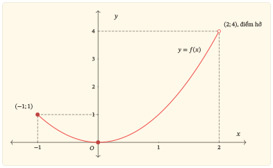

:::::::::::::::::::::::::::::::::::::::::::::::::::::::::::::::::::::::::::::::::::::::::::::::::::::::::::::::::::::::::::::::::::::::::::::::::::::::::::::::: {.zo-on-thi-package .r1-g01 .r1-g02 r1-code="R1-G02" r1-lesson-count="7" r1-title="Giá trị lớn nhất và giá trị nhỏ nhất của hàm số"}
::: {#bat-dau .r1-status}
Đang hoàn thiện
:::

Học liệu này giúp em phân biệt cực trị với giá trị lớn nhất, nhỏ nhất; tìm đúng
giá trị trên tập được chỉ định; kiểm tra sự đạt được; và lựa chọn công cụ phù
hợp từ công thức, bảng biến thiên, đồ thị hoặc tình huống thực tiễn đơn giản.

## Cách học với tài liệu này {#cách-học-với-tài-liệu-này}

Chuẩn bị giấy để tự làm trước khi mở gợi ý hoặc lời giải. Em có thể học qua
nhiều lượt; sau mỗi lượt, ghi lại tập đang xét, căn cứ kết luận và chỗ còn cần
kiểm tra.

::: {#r1-g02-table-t08 .table-scroll}
| Phần | Em thực hiện | Kết quả cần giữ lại |
|:-----|:--------------|:--------------------|
| Học | Đọc các mục cần thiết; tự trả lời câu hỏi dừng trước khi xem đối chiếu. | Tập đang xét, điều kiện áp dụng và lập luận của em. |
| Luyện tập | Làm bài theo lượt đã gợi ý; chỉ mở gợi ý khi thực sự cần. | Bài làm và chỗ còn sai hoặc chưa giải thích được. |
| Kiểm tra | Làm năm bài độc lập; không mở bài học và lời giải. | Bài làm ban đầu và căn cứ cho từng kết luận. |
| Sửa lỗi | Giữ bài làm ban đầu; nhận diện lỗi, sửa lập luận rồi làm bài thử lại. | Lí do sửa và kết quả của bài làm mới. |
| Ôn lại | Quay lại theo các mốc gợi ý và tự nhắc ba câu hỏi cốt lõi. | Ngày ôn, kết quả và phần còn cần luyện. |
:::

:::: {#cach-thuc-hien-su-dung-tai-lieu .r1-details .r1-guidance}
::: r1-summary
Cách thực hiện
:::

- Làm bài trên giấy; chỉ mở gợi ý hoặc lời giải sau khi đã thử.
- Dùng chuột hoặc phím Enter để mở các khung khi cần.
- Có thể chia thành các lượt: **học và làm Bài luyện tập 01--02, 10**; **làm
  Bài luyện tập 03--06, 09**; **kiểm tra, sửa lỗi và thử lại**.
- Dùng Bài luyện tập 07 ở lượt kiểm tra chuyển giao riêng; làm Bài luyện tập 08
  sau khi đã ôn đạo hàm của hàm mũ và lôgarit.
::::

## Bài học {#bai-hoc}

::: lesson-toc
:::

### 0. Bắt đầu từ đâu? {#bắt-đầu-từ-đâu}

:::: {#cach-thuc-hien-bat-dau .r1-details .r1-guidance}
::: r1-summary
Cách thực hiện
:::

1.  Tự trả lời ba câu khởi động trên giấy.
2.  Đối chiếu lời giải và xác định câu còn vướng.
3.  Dùng câu hỏi dẫn đường, mục tiêu và chỉ dẫn chọn phần cần ôn để quyết định
    điểm bắt đầu phù hợp.
::::

#### Câu hỏi dẫn đường {#câu-hỏi-dẫn-đường}

Khi tìm giá trị lớn nhất, giá trị nhỏ nhất trên một tập được chỉ định, em cần
trả lời hai câu hỏi:

1.  Giá trị nào không bị vượt qua trên tập đang xét?
2.  Giá trị ấy có thực sự đạt được tại một điểm thuộc tập đang xét không?

#### Học xong, em cần làm được gì? {#học-xong-em-cần-làm-được-gì}

::: {#r1-g02-table-t09 .table-scroll}
| Mục tiêu | Việc em cần làm được |
|:---------|:----------------------|
| Gọi đúng đối tượng | Xác định $D$ và tập đang xét từ đầy đủ dữ kiện; phân biệt biểu thức với hàm số, cực trị với giá trị lớn nhất, nhỏ nhất; kiểm tra đủ hai điều kiện của định nghĩa. |
| Tìm trên đoạn | Kiểm tra điều kiện, lập đủ danh sách điểm cần xét và so sánh các giá trị hàm số. |
| Giải thích sự tồn tại | Đọc công thức, bảng và đồ thị để xác định hoặc bác bỏ sự tồn tại trên các tập được chỉ định. |
| Chọn và kiểm tra kết quả | Chọn công cụ phù hợp, đối chiếu bằng cách khác và diễn giải một tình huống thực tiễn đơn giản. |
:::

**Kiến thức cần trước:** tập xác định, khoảng đơn điệu, cực trị, dấu đạo hàm,
đọc bảng biến thiên và phân biệt đồ thị của hàm số với đồ thị của đạo hàm. Em
cũng cần tính được đạo hàm và giá trị của các hàm số quen thuộc.

#### Câu hỏi khởi động {#ba-câu-khởi-động}

Hãy thử trả lời trên giấy trước khi mở lời giải. Không cần tính điểm; câu nào còn vướng sẽ chỉ ra phần cần ôn.

::::: {.zo-learning-task .zo-learning-task--pause}

- **Câu hỏi khởi động 01.** Hàm số $r$ liên tục trên $[-3; 4]$, biến thiên đúng như bảng. Tại $x = 2$, hàm số có giá trị cực đại bằng 1. Có thể kết luận 1 là giá trị lớn nhất trên đoạn này không? Giá trị lớn nhất, nhỏ nhất thực tế là bao nhiêu?

:::: table-scroll
::: {.r1-bbt bbt="BBT01" caption="Bảng biến thiên của hàm số r trên đoạn từ −3 đến 4."}
ZO BBT placeholder
:::
:::

- **Câu hỏi khởi động 02.** Cho hàm số $f(x)=(x-2)^2$. Một bạn nhận xét: “Giá trị nhỏ nhất của $f$ trên $K=(2;5]$ bằng $0$ vì $f(2)=0$.” Nhận xét này đúng không? Vì sao?

- **Câu hỏi khởi động 03.** Trên một hình ghi nhãn $y = f'(x)$, điểm $(1; 0)$ thuộc đường biểu diễn. Có thể ghi $f(1) = 0$ không?

::: answer-link
[Xem lời giải](#loi-giai-khoi-dong-01)
:::
:::::

#### Chọn đúng phần cần ôn {#chọn-đúng-phần-cần-ôn}

::: {#r1-g02-table-t10 .table-scroll}
| Nếu còn vướng | Ôn nhanh điều này | Quay lại |
|:---------------|:------------------|:---------|
| Tập xác định và tập đang xét | Phân biệt quy tắc, tập xác định và tập được chỉ định để so sánh | Mục 1 |
| Cực trị với giá trị lớn nhất, nhỏ nhất | Kiểm tra cả điều kiện so sánh và sự đạt được | Mục 2 |
| Quy trình tìm trên đoạn đóng | Lập đủ danh sách điểm cần xét và so sánh giá trị | Mục 3 |
| Khoảng hở hoặc tập nhiều thành phần | Kiểm tra cận, điểm hở và từng thành phần của tập | Mục 4 |
| Bài toán thực tiễn | Chọn đại lượng, tập giá trị được phép và đơn vị | Mục 5 |
| Các phần trên đã vững | Làm bài độc lập để xác định chỗ còn cần ôn | Phần Kiểm tra |
:::

### 1. Hàm số được cho bằng cả quy tắc và tập xác định {#doi-tuong}

:::: {#cach-thuc-hien-doi-tuong .r1-details .r1-guidance}
::: r1-summary
Cách thực hiện
:::

1.  Đọc trọn dữ kiện và xác định tập xác định $D$.
2.  Xác định tập đang xét $K$ và kiểm tra quan hệ giữa $K$ với $D$.
3.  Quyết định điểm hoặc giá trị nào được dùng trong phép so sánh trên $K$.
::::

Để xác định một hàm số, cần biết biến số được phép nhận những giá trị nào và quy tắc gán cho mỗi giá trị ấy một giá trị duy nhất của hàm số. Tập các giá trị mà biến số được phép nhận gọi là **tập xác định $D$ của hàm số**.

:::: {.zo-block .zo-block-red}
::: {.zo-block-title}
Đọc đầy đủ dữ kiện trước khi tìm $D$
:::

- Nếu đề cho hàm số có tập xác định $K$, thì $D = K$. Công thức phải có nghĩa với mọi $x \in K$.
- Nếu chỉ cho công thức và **không chỉ rõ tập xác định**, ta mới theo quy ước lấy tất cả số thực làm biểu thức có nghĩa.
::::

[Nguồn đối chiếu: Sách giáo khoa Toán 10, tập hai, bộ Kết nối tri thức với cuộc sống, bài 15, trang 6 (trang 7 của tệp PDF), phần định nghĩa và chú ý về trường hợp không chỉ rõ tập xác định.]{.zo-source-note}

#### 1.1. Trở lại câu khởi động: tính được $f(2)$, vì sao không được lấy $2$ làm điểm đạt?

Đề cho $f(x) = (x - 2)^2$ mà không giới hạn tập xác định, nên $D = \mathbb{R}$. Yêu cầu tìm giá trị nhỏ nhất trên $K = (2; 5]$ chỉ giới hạn các điểm được đưa vào so sánh.

::: {#r1-g02-table-t01 .table-scroll}
| Đối tượng cần đọc | Kết luận trong bài này |
|:------------------|:------------------------|
| Tập xác định $D$  | $\mathbb{R}$: công thức có nghĩa với mọi số thực và đề không cho giới hạn khác. |
| Tập đang xét $K$  | $(2;5]$: chỉ so sánh giá trị tại các điểm thuộc tập này. |
| Đầu mút $2$       | $2\in D$ nhưng $2\notin K$. Giá trị $f(2)=0$ có nghĩa; $2$ không được dùng làm điểm đạt trên $K$. |
| Đầu mút $5$       | $5\in K$. Giá trị $f(5)=9$ được đưa vào so sánh. |
:::

[**Cần phân biệt ba việc: thay số vào biểu thức, tính giá trị hàm số và xét điểm đạt trên $K$.**]{#bieu-thuc-va-ham-so .r1-unboxed-label}

Với $f$ ở câu khởi động, cả phép tính $(2-2)^2=0$ và kí hiệu $f(2)=0$ đều đúng. Điều bị bỏ sót là $2\notin K$.

Nếu một đề khác cho hàm số $g$ có tập xác định $(2;5]$, với $g(x)=(x-2)^2$, thì $g(2)$ không xác định. Phép thay $2$ vào biểu thức vẫn tính được $0$, nhưng không phải là giá trị của $g$ tại $2$. Cùng công thức chưa đủ để kết luận hai hàm số có cùng tập xác định.

Vì vậy, **$D$ là tập xác định của hàm số đã cho; $K$ là tập được yêu cầu xét**. Hai tập có thể trùng nhau. Nếu xét trên một phần của $D$ thì phải có $K\subseteq D$. Không tự mặc định $D$ lớn hơn $K$, cũng không tự đổi $D$ của một hàm số đã được xác định rõ.

Trước mỗi bài, hãy tự hỏi: đề đang cho tập xác định của hàm số, hay đang yêu cầu so sánh các giá trị trên một tập được chỉ định? Đọc trọn yêu cầu rồi mới quyết định $D$ và $K$.

### 2. Hai điều kiện cùng phải đúng {#dinh-nghia}

:::: {#cach-thuc-hien-dinh-nghia .r1-details .r1-guidance}
::: r1-summary
Cách thực hiện
:::

- Kiểm tra điều kiện so sánh với mọi điểm thuộc $K$.
- Kiểm tra có điểm thuộc $K$ tại đó giá trị được đạt.
::::

Cho hàm số $f$ có tập xác định $D$. Với tập không rỗng $K \subseteq D$ (có thể $K = D$), số $M$ là **giá trị lớn nhất** của $f$ trên $K$ khi:

:::: {.zo-block .zo-block-red}
::: {.zo-block-title}
Giá trị lớn nhất trên một tập
:::

1.  $f(x) \le M$ với mọi $x \in K$.
2.  Có ít nhất một điểm $x_0 \in K$ sao cho $f(x_0) = M$.

Kí hiệu: $\max_{x\in K} f(x)=M$.
::::

Tương tự, số $m$ là **giá trị nhỏ nhất** khi $f(x) \ge m$ với mọi $x \in K$, đồng thời có một điểm $x_1 \in K$ sao cho $f(x_1) = m$. Kí hiệu: $\min_{x\in K} f(x)=m$.

[Nguồn đối chiếu: Sách giáo khoa Toán 12, tập một, bộ Kết nối tri thức với cuộc sống, bài 2, trang 15 (trang 17 của tệp PDF), phần định nghĩa.]{.zo-source-note}

Sách giáo khoa trình bày trên tập $D$. Bản này dùng $K$ cho tập được yêu cầu xét; khi xét toàn bộ tập xác định thì $K=D$. Cả điều kiện so sánh và điều kiện đạt được đều phải dùng cùng tập $K$.

Hãy viết đủ: **“Giá trị lớn nhất bằng $M$, đạt tại $x=x_0$.”** Số $M$ là giá trị; $x_0$ là điểm đạt giá trị của hàm số; $(x_0;M)$ là một điểm trên đồ thị. Một giá trị lớn nhất có thể đạt tại nhiều điểm.

#### 2.1. Áp dụng cho $f(x)=(x-2)^2$ trên $K=(2;5]$

::: {#cau-hoi-bai-hoc-01 .r1-task .r1-g02-pause}
[**Thử trước khi đọc tiếp.**]{.r1-task-label} Không được lấy $x=2$. Vậy $0$ có thể là giá trị nhỏ nhất không? Nếu $0$ không phải giá trị nhỏ nhất, liệu có một số dương nào nhỏ nhất?

::: answer-link
[Xem lời giải](#loi-giai-bai-hoc-01)
:::
:::

#### 2.2. Cận chưa chắc là giá trị đạt được

Nếu chỉ có $f(x) \le M$ với mọi $x \in K$, ta mới có một **cận trên**. Nếu chỉ có $f(x) \ge m$, ta có một **cận dưới**. "Bị chặn trên", "bị chặn dưới" nói về sự tồn tại của những cận như vậy; "bị chặn" nghĩa là có cả hai.

Ví dụ, trên $(0; 1)$, hàm số $f(x) = x$ có $0 < f(x) < 1$. Hàm số bị chặn nhưng không đạt 0 hoặc 1. Với mỗi $x \in (0; 1)$, điểm $x/2$ cho giá trị nhỏ hơn, còn điểm $(x + 1)/2$ cho giá trị lớn hơn. Vì vậy hàm số không có cả giá trị nhỏ nhất lẫn lớn nhất trên khoảng này.

[**Không đạt một cận tùy ý chưa đủ để kết luận không có giá trị lớn nhất.**]{.r1-unboxed-label}

Hàm số hằng $f(x) = 3$ không đạt cận trên 10, nhưng có giá trị lớn nhất bằng 3. Muốn bác bỏ sự tồn tại, cần lập luận loại được mọi giá trị có thể là lớn nhất.

#### 2.3. Cực trị và giá trị lớn nhất, nhỏ nhất

**Nhắc lại cách nhận biết cực trị.** Xét hàm số $f$ liên tục trên một khoảng chứa $x_0$. Hàm số đạt cực đại tại $x_0$ nếu, trong một khoảng đủ nhỏ quanh $x_0$, giá trị $f(x_0)$ **lớn hơn** mọi giá trị $f(x)$ với $x\ne x_0$. Hàm số đạt cực tiểu tại $x_0$ nếu giá trị $f(x_0)$ **nhỏ hơn** mọi giá trị như vậy. Việc so sánh xét các điểm ở cả hai phía của $x_0$; bằng nhau không thỏa điều kiện lớn hơn hoặc nhỏ hơn này.

::: {#r1-g02-table-t02 .table-scroll}
| Cực đại, cực tiểu | Giá trị lớn nhất, nhỏ nhất trên $K$ |
|:------------------|:-------------------------------------|
| So sánh với các điểm đủ gần ở cả hai phía; dùng bất đẳng thức nghiêm ngặt. | So sánh với mọi điểm thuộc $K$. |
| Giá trị cực đại có thể bị một giá trị ở xa vượt qua. | Giá trị lớn nhất không bị bất cứ giá trị nào trên $K$ vượt qua. |
| Một đầu mút của tập xác định không có khoảng nhỏ quanh nó nằm trọn trong tập xác định, nên không thỏa điều kiện hai phía nêu trên. | Đầu mút thuộc $K$ có thể là nơi đạt giá trị lớn nhất hoặc nhỏ nhất. Nếu điểm đó nằm bên trong $D$, phải xét hàm số ở cả hai phía mới kết luận về cực trị. |
:::

Một điểm cực trị thuộc $K$ là một điểm cần xem xét khi tìm giá trị lớn nhất, nhỏ nhất trên $K$. Ngược lại, điểm đạt giá trị lớn nhất, nhỏ nhất chưa chắc là điểm cực trị: giá trị ấy có thể đạt tại đầu mút, hoặc bằng các giá trị ở những điểm lân cận.

::: {#cau-hoi-bai-hoc-02 .r1-task .r1-g02-pause}
[**Dừng để nghĩ.**]{.r1-task-label} Cho hàm số $f(x) = 2$ có tập xác định $(0; 1)$. Hàm số có giá trị lớn nhất, nhỏ nhất không? Có điểm cực đại hoặc cực tiểu không? Hãy giải thích bằng cách so sánh giá trị tại một điểm với các giá trị ở những điểm gần nó.

::: answer-link
[Xem lời giải](#loi-giai-bai-hoc-02)
:::
:::

### 3. Trên đoạn đóng: bảo đảm tồn tại và tìm đủ điểm {#tren-doan}

:::: {#cach-thuc-hien-tren-doan .r1-details .r1-guidance}
::: r1-summary
Cách thực hiện
:::

1.  Kiểm tra đoạn đang xét nằm trong tập xác định và hàm số liên tục trên đoạn.
2.  Lập đủ danh sách điểm cần xét.
3.  Tính giá trị hàm số tại từng điểm trong danh sách.
4.  So sánh các giá trị và ghi tất cả điểm đạt.
::::

:::: {.zo-block .zo-block-red}
::: {.zo-block-title}
Bảo đảm tồn tại
:::

Nếu $f$ liên tục trên đoạn $[a; b]$, với $a < b$, thì $f$ có cả giá trị lớn nhất và giá trị nhỏ nhất trên đoạn đó.
::::

Cần kiểm tra $[a; b] \subseteq D$ và tính liên tục trên toàn đoạn. Một hàm được cho bởi công thức đa thức trên cả đoạn thì liên tục trên đoạn ấy; với công thức phân thức phải kiểm tra mẫu khác 0 ở mọi điểm của đoạn. Liên tục ở đầu mút được xét từ phía bên trong đoạn.

Đây là **điều kiện đủ**. Nếu thiếu điều kiện, em chưa được dùng bảo đảm trên; em cũng chưa được kết luận rằng giá trị lớn nhất, nhỏ nhất không tồn tại.

::: {#cau-hoi-bai-hoc-03 .r1-task .r1-g02-pause}
[**Kiểm tra điều kiện.**]{.r1-task-label} Hàm $q$ có tập xác định $[0;1]$, với $q(x)=x$ khi $0\le x<1$ và $q(1)=0$. Một bạn chỉ so sánh $q(0)=q(1)=0$ rồi kết luận giá trị lớn nhất bằng $0$. Bạn đã bỏ điều kiện nào?

::: answer-link
[Xem lời giải](#loi-giai-bai-hoc-03)
:::
:::

#### 3.1. Quy trình so sánh một danh sách hữu hạn

Giả sử $f$ liên tục trên $[a; b]$, có đạo hàm trên $(a; b)$ trừ nhiều nhất một số hữu hạn điểm, và chỉ có hữu hạn điểm bên trong đoạn thỏa $f'(x) = 0$.

1.  **Lập danh sách điểm:** hai đầu mút $a, b$; các điểm thuộc $(a; b)$ mà $f'(x) = 0$; các điểm thuộc $(a; b)$ mà hàm số có giá trị nhưng không có đạo hàm.
2.  **Tính giá trị của $f$** tại tất cả các điểm trong danh sách.
3.  **So sánh các giá trị**, rồi ghi giá trị lớn nhất, nhỏ nhất và tất cả điểm đạt được tìm thấy.

[Nguồn đối chiếu: Sách giáo khoa Toán 12, tập một, bộ Kết nối tri thức với cuộc sống, bài 2, trang 18 (trang 20 của tệp PDF), phần quy trình và giả thiết.]{.zo-source-note}

**Vì sao phải có ba nhóm điểm?** Giá trị lớn nhất, nhỏ nhất đã được bảo đảm tồn tại. Điểm đạt có thể là đầu mút. Nếu nằm bên trong và hàm số có đạo hàm tại đó, đạo hàm phải bằng 0; nếu không có đạo hàm, điểm ấy cần được xét riêng.

Không cần tính đạo hàm tại đầu mút để đưa đầu mút vào danh sách. Khi phương trình $f'(x) = 0$ có vô số nghiệm, quy trình liệt kê hữu hạn này không áp dụng nguyên dạng. Chẳng hạn với hàm hằng, có thể kết luận ngay từ định nghĩa.

#### 3.2. Ví dụ làm mẫu --- So sánh giá trị, không so sánh hoành độ {.r1-example-heading .zo-learning-example-heading}

:::: {.zo-learning-example}

Cho hàm số $p(x)=x^2-4x+1$. Tìm giá trị lớn nhất, nhỏ nhất của $p$ trên đoạn $[-1;4]$.

::: {#cau-hoi-bai-hoc-04 .r1-task .r1-g02-pause}
[**Trước khi xem:**]{.r1-task-label} Em sẽ đưa những điểm nào vào danh sách? Vì sao?

::: answer-link
[Xem lời giải](#loi-giai-bai-hoc-04)
:::
:::
::::

### 4. Khi tập đang xét không phải một đoạn đóng {#tap-khac}

:::: {#cach-thuc-hien-tap-khac .r1-details .r1-guidance}
::: r1-summary
Cách thực hiện
:::

1.  Trở về hai điều kiện trong định nghĩa.
2.  Xét từng thành phần của $K$ và ghi các giá trị đạt được hoặc cận liên quan.
3.  Phân biệt giá trị hàm số với giới hạn và kiểm tra sự đạt được.
4.  So sánh trên toàn bộ $K$ rồi mới kết luận.
::::

Hãy trở về hai điều kiện của định nghĩa. Bảng biến thiên hoặc đồ thị giúp thấy hướng thay đổi. Một giới hạn hữu hạn ở đầu mút hở không tự tạo ra giá trị của hàm số tại đầu mút đó. Muốn gọi một số là giá trị lớn nhất hoặc nhỏ nhất trên $K$, vẫn phải tìm được điểm thuộc $K$ tại đó hàm số đạt số ấy.

Ở bảng sau, cho rõ hàm số $F(x)=x$ có tập xác định $\mathbb{R}$. Ta giữ nguyên hàm số $F$ và lần lượt thay tập $K$ được yêu cầu xét.

::: {#r1-g02-table-t03 .table-scroll}
| Tập $K$ đang xét của $F$ | Giá trị nhỏ nhất | Giá trị lớn nhất |
|:-------------------------|:------------------|:------------------|
| Trên $[0;1]$             | $0$ tại $x=0$    | $1$ tại $x=1$    |
| Trên $[0;1)$             | $0$ tại $x=0$    | Không có          |
| Trên $(0;1]$             | Không có          | $1$ tại $x=1$    |
| Trên $(0;1)$             | Không có          | Không có          |
:::

Ví dụ, trên $K=[0;1)$, mỗi điểm $x$ luôn có một điểm $y=(x+1)/2$ thuộc cùng tập với $F(y)>F(x)$. Vì thế $F$ không có giá trị lớn nhất trên $K$. Dù $F(1)=1$ có nghĩa với hàm số đã cho trên $\mathbb{R}$, điểm $1$ không thuộc $K$ và không có điểm nào khác trong $K$ cho giá trị $1$.

Trên một tập không bị chặn, không được suy ngay rằng hàm số không có giá trị lớn nhất hoặc nhỏ nhất. Chẳng hạn $x^2$ trên $\mathbb{R}$ vẫn có giá trị nhỏ nhất bằng $0$.

[**Một điểm hở không loại luôn cả một giá trị.**]{.r1-unboxed-label}

Chẳng hạn, hàm số $q$ có tập xác định $(-1;1]$, với $q(x)=x^2$, không có giá trị $q(-1)$. Tuy nhiên, giá trị $1$ vẫn được đạt tại $x=1$ và là giá trị lớn nhất, vì $q(x)\le1$ trên toàn tập xác định. Cần kiểm tra mọi điểm có thể cho cùng tung độ, không chỉ đầu mút bị loại.

#### 4.1. Khi $K$ gồm nhiều thành phần rời nhau

Xét từng thành phần, ghi rõ các giá trị đạt được và các cận liên quan, rồi so sánh trên **toàn bộ $K$**. Một mũi tên chỉ cho biết biến thiên trên phần mà nó biểu diễn. Không nối qua chỗ bị loại để kết luận đơn điệu trên cả tập.

Một thành phần không có giá trị lớn nhất không có nghĩa cả tập cũng không có. Chẳng hạn với $f(x) = x$ trên $[0; 1) \cup [2; 3]$, thành phần đầu không có giá trị lớn nhất, nhưng toàn tập có giá trị lớn nhất bằng 3 tại $x = 3$.

#### 4.2. Chọn công cụ từ dữ kiện

- **Công thức:** dùng biến đổi, bất đẳng thức đơn giản hoặc đạo hàm; chọn cách làm ngắn mà đủ lập luận.
- **Bảng biến thiên:** đọc toàn bảng, tập đang xét, giá trị tại điểm và giới hạn. Không tự thêm dữ kiện đạo hàm nếu bảng không cho.
- **Đồ thị:** đọc nhãn, tập được biểu diễn, tung độ, điểm kín và điểm hở. Kiểm tra xem tung độ ở một điểm hở có được đạt tại điểm khác thuộc $K$ hay không. Hình phác không cho phép đoán chính xác một giá trị chưa được ghi hoặc xác định.
- **Lời văn:** xác định đại lượng cần tìm, biến số, tập giá trị được phép và đơn vị.

### 5. Cầu nối đến bài toán thực tiễn {#loi-van}

:::: {#cach-thuc-hien-loi-van .r1-details .r1-guidance}
::: r1-summary
Cách thực hiện
:::

1.  Xác định đại lượng cần tối ưu và biến số.
2.  Lập hàm mục tiêu.
3.  Ghi rõ tập giá trị được phép của biến và tìm giá trị tối ưu trên tập đó.
4.  Diễn giải kết quả cùng đơn vị trong bối cảnh bài toán.
::::

Trong gói này, công thức doanh thu và chi phí đã được cung cấp. Em cần lập đúng hàm lợi nhuận, xác định tập đang xét rồi tìm và diễn giải giá trị lớn nhất.

$$P(x) = R(x) - C(x)$$

[Lợi nhuận = doanh thu $-$ tổng chi phí.]{.caption}

Nếu đề cho **chi phí bình quân cho một sản phẩm** là $G(x)$, thì tổng chi phí là $C(x) = xG(x)$, không phải $G(x)$.

Đọc kĩ $x$ là lượng đo có thể nhận giá trị thực hay số sản phẩm phải nguyên. Nếu chỉ nhận giá trị nguyên, hàm lợi nhuận của bài toán được xét trên tập các số nguyên được phép. Có thể dùng một **hàm phụ nhận biến thực** có cùng công thức để tìm ứng viên, nhưng phải gọi rõ đó là hàm phụ. Khi hàm phụ tăng rồi giảm và đỉnh nằm giữa hai số nguyên liên tiếp được phép, so sánh hai số ấy; không dùng việc làm tròn như một quy tắc chung.

::: {#cau-hoi-bai-hoc-05 .r1-task .r1-g02-pause}
[**Thử kiểm tra cách làm tròn.**]{.r1-task-label} Một hàm $P$ tăng đến $x=2{,}2$ rồi giảm. Chỉ được chọn $x=2$ hoặc $x=3$, với $P(2)=8$ và $P(3)=9{,}2$. Chọn số nguyên gần $2{,}2$ nhất có cho giá trị lớn nhất không?

::: answer-link
[Xem lời giải](#loi-giai-bai-hoc-05)
:::
:::

[**Chỗ dừng của gói.**]{.r1-unboxed-label}

Chưa tự xây dựng mô hình hình học nhiều bước, chưa xử lí nhiều ràng buộc hoặc phân loại tham số. Những việc đó dành cho gói bài toán tối ưu và phần vận dụng tiếp theo.

### Khép lại bài học {#khép-lại-bài-học}

Gói về tiệm cận sẽ làm rõ hơn hành vi của đồ thị khi biến tiến đến một điểm bị loại hoặc ra vô cực. Gói bài toán tối ưu sẽ yêu cầu tự chọn biến, xây dựng hàm mục tiêu và xác định các ràng buộc. Nền em mang theo là: **xét đúng tập, kiểm tra sự đạt được và giải thích kết quả trong bối cảnh**.

## Luyện tập {#phieu-luyen}

Làm Bài luyện tập 01--06 và 09--10 theo các lượt ở phần Bắt đầu. Với mỗi bài, ghi tập đang xét, căn cứ kết luận, giá trị và điểm đạt. Giữ Bài luyện tập 07 cho một lượt kiểm tra chuyển giao sau khi làm vững bài cơ bản, chưa mở lời giải trước. Bài luyện tập 08 có thể để sau nếu cần ôn đạo hàm của hàm mũ và lôgarit; cần quay lại hoàn thành để kiểm tra phương pháp với các họ hàm này.

:::: {#cach-thuc-hien-luyen-tap .r1-details .r1-guidance}
::: r1-summary
Cách thực hiện
:::

- Làm các bài theo những lượt đã gợi ý ở phần Bắt đầu.
- Với mỗi bài, ghi tập đang xét, căn cứ kết luận, giá trị và mọi điểm đạt.
- Chỉ mở gợi ý khi đã thử nhưng chưa tìm được hướng tiếp tục.
- Chỉ mở lời giải của bài đã hoàn thành hoặc cần đối chiếu sau khi tự làm.
::::

::::::::: {#l01 .r1-task}
### Bài luyện tập 01. Cực đại có phải lớn nhất?

Cho hàm số $f(x) = x^3 - 3x$. Thực hiện các yêu cầu sau trên đoạn $[-2; 3]$.

1.  Xác định các cực trị bên trong đoạn.
2.  Tìm giá trị lớn nhất, nhỏ nhất trên đoạn, ghi mọi điểm đạt.
3.  Bác bỏ nhận xét: "Giá trị cực đại bằng 2 nên giá trị lớn nhất bằng 2."

:::: {.r1-details .r1-guidance .zo-learning-hint}
::: r1-summary
Cần một gợi ý?
:::

Lập đủ danh sách hai đầu mút và các nghiệm đạo hàm thuộc bên trong đoạn. Đừng chọn chỉ một điểm nếu nhiều điểm cho cùng giá trị.
::::

::: answer-link
[Xem lời giải](#loi-giai-l01)
:::
:::::::::

:::::::: {#l02 .r1-task}
### Bài luyện tập 02. Một điểm không có đạo hàm

Cho hàm số $g(x)=\lvert x+2\rvert$. Tìm giá trị lớn nhất, nhỏ nhất của $g$ trên đoạn $[-4;1]$. Một bạn không tìm thấy nghiệm $g'(x)=0$ nên chỉ so sánh hai đầu mút. Hãy chỉ ra điểm bị bỏ và kiểm tra kết quả bằng ý nghĩa khoảng cách.

:::: {.r1-details .r1-guidance .zo-learning-hint}
::: r1-summary
Cần một gợi ý?
:::

Điểm đổi công thức của dấu giá trị tuyệt đối có thuộc đoạn không? Hàm số có giá trị và có đạo hàm tại đó không?
::::

::: answer-link
[Xem lời giải](#loi-giai-l02)
:::
::::::::

:::::::: {#l03 .r1-task}
### Bài luyện tập 03. Tập không bị chặn, hàm vẫn bị chặn

Xét $h(x)=1/(1+x^2)$ trên $\mathbb{R}$. Tìm giá trị lớn nhất. Hàm số có giá trị nhỏ nhất không? Không dùng riêng câu “vì $x$ tiến ra vô cực” thay cho lập luận về sự đạt được.

:::: {.r1-details .r1-guidance .zo-learning-hint}
::: r1-summary
Cần một gợi ý?
:::

Muốn chứng minh không có giá trị nhỏ nhất, thử tạo một điểm mới cho mẫu số lớn hơn mẫu số tại điểm đang xét.
::::

::: answer-link
[Xem lời giải](#loi-giai-l03)
:::
::::::::

:::::: {#l04 .r1-task}
### Bài luyện tập 04. Hai thành phần đều cần được xét

Cho hàm số $f(x)=x$. Tìm giá trị lớn nhất, nhỏ nhất của $f$ trên $K=[-2;-1]\cup(0;1)$, nếu có. Giải thích vì sao chỉ xét đoạn $[-2;-1]$ là chưa đủ.

::: answer-link
[Xem lời giải](#loi-giai-l04)
:::
::::::

::::::::: {#l05 .r1-task}
### Bài luyện tập 05. Từ doanh thu đến lợi nhuận

Một cơ sở điều chỉnh lượng sản phẩm $x$ (tấn), với $1\le x\le10$; $x$ nhận giá trị thực. Doanh thu và tổng chi phí, cùng tính bằng triệu đồng, theo mô hình:

$$
\begin{aligned}
R(x)&=30x,\\
C(x)&=\frac{x^3}{4}+3x+12.
\end{aligned}
$$

Lập hàm lợi nhuận và tìm lượng sản phẩm cho lợi nhuận lớn nhất theo mô hình. Ghi cả lợi nhuận và đơn vị. Đối chiếu kết quả bằng biến đổi đại số.

:::: {.r1-details .r1-guidance .zo-learning-hint}
::: r1-summary
Cần một gợi ý?
:::

Hàm cần tối đa là lợi nhuận. Sau khi lập hàm, em đã trở về bài toán trên một đoạn đóng.
::::

::: answer-link
[Xem lời giải](#loi-giai-l05)
:::
:::::::::

:::::::: {#l06 .r1-task}
### Bài luyện tập 06. Đọc giá trị và sự đạt được trên đồ thị

Cho hàm số $f$ có tập xác định $\mathbb{R}$. Hình dưới chỉ biểu diễn phần đồ thị ứng với $K=[-1;2)$. Hãy đọc hình để trả lời hai câu đầu, rồi mới mở công thức để kiểm tra.

:::: {.r1-figure r1-id="fig-r1-g02-do-thi-01"}
{loading="lazy"}

::: r1-figcaption
Hình 01 — Đồ thị của $f$ trên $K=[-1;2)$. Điểm kín thuộc đồ thị đang xét; điểm hở chỉ vị trí bị loại.
:::
::::

1.  Tìm giá trị nhỏ nhất trên $K$ và tọa độ điểm trên đồ thị tương ứng.
2.  Có giá trị lớn nhất trên $K$ không? Giải thích vai trò của điểm hở $(2;4)$.
3.  Sau khi trả lời từ hình, mở công thức và kiểm tra lại kết quả.

::: answer-link
[Xem lời giải](#loi-giai-l06-cong-thuc)
:::

::: answer-link
[Xem lời giải](#loi-giai-l06)
:::
::::::::

:::::: {#l07 .r1-task}
### Bài luyện tập 07. Kiểm tra chuyển giao: hàm lượng giác

Làm ở một lượt riêng, chưa xem lời giải. Cần nêu điều kiện, xét đủ điểm và giải thích kết quả. Nếu chưa làm được, ôn cách tính và xét dấu đạo hàm lượng giác rồi thử lại bằng câu mới ở phần Kiểm tra.

Cho hàm số $f(x)=2\sin x-x$. Tìm giá trị lớn nhất, nhỏ nhất của $f$ trên đoạn $[0;\pi/2]$. Góc đo bằng radian. Hãy dùng dấu đạo hàm để giải thích điểm bên trong nào cần xét.

::: answer-link
[Xem lời giải](#loi-giai-l07)
:::
::::::

:::::: {#l08 .r1-task}
### Bài luyện tập 08. Chuyển giao: hàm mũ và lôgarit

[Chỉ làm khi đã có nền đạo hàm tương ứng]{.pill}

Cho hai hàm số $u(x)=x^2e^{-x}$ và $v(x)=\ln x/x$. Tìm giá trị lớn nhất, nhỏ nhất: (a) của $u$ trên đoạn $[0;4]$; (b) của $v$ trên đoạn $[1;e^2]$.

::: answer-link
[Xem lời giải](#loi-giai-l08)
:::
::::::

:::::: {#l09 .r1-task}
### Bài luyện tập 09. Nghiệm đạo hàm nào được giữ lại?

Cho $f(x)=(x-3)^2/(x+1)$. Xác định tập xác định $D$, rồi tìm giá trị lớn nhất, nhỏ nhất trên $K=(-1;+\infty)$, nếu có. Dùng đạo hàm và kiểm tra kết quả bằng một cách khác. Khi loại một nghiệm đạo hàm, hãy nói rõ điểm đó nằm ngoài $D$ hay chỉ nằm ngoài $K$.

::: answer-link
[Xem lời giải](#loi-giai-l09)
:::
::::::

:::::: {#l10 .r1-task}
### Bài luyện tập 10. Chọn cách so sánh trực tiếp

Cho $s(x)=\sqrt{4-(x-1)^2}$. Xác định $D$, rồi tìm giá trị lớn nhất, nhỏ nhất của $s$ trên $K=[0;3]$. Có cần tính đạo hàm không? Ghi tất cả điểm đạt thuộc $K$.

::: answer-link
[Xem lời giải](#loi-giai-l10)
:::
::::::

## Kiểm tra {#tu-kiem-tra}

Làm năm câu trên giấy khi đã đóng phần Học và Luyện tập. Không mở gợi ý. Nếu cần hỗ trợ, ghi rõ đã xem phần nào; sau đó dùng câu mới ở phần Sửa lỗi để kiểm tra lại.

Đáp số đúng cần đi cùng tập đang xét, lí do tồn tại hoặc không tồn tại, và điểm đạt nếu có. Đây là kiểm tra mục tiêu của gói, không phải đề mô phỏng thi.

:::: {#cach-thuc-hien-kiem-tra .r1-details .r1-guidance}
::: r1-summary
Cách thực hiện
:::

Làm năm bài độc lập trên giấy khi đã đóng phần Học, Luyện tập và Lời giải. Ghi
cả kết luận, tập đang xét và căn cứ cho sự tồn tại hoặc không tồn tại. Chỉ mở
hướng dẫn chấm sau khi đã hoàn thành lượt làm ban đầu.
::::

:::::: {#kt01 .r1-task}
### Bài kiểm tra 01. Đọc đồ thị trên tập được chỉ định

Hàm số $g$ có tập xác định $\mathbb{R}$ và $g(1)=3$. Hình dưới chỉ biểu diễn phần đồ thị ứng với $K=(1;3]$.

:::: {.r1-figure r1-id="fig-r1-g02-do-thi-02"}
![Đồ thị nghịch biến của $g$ trên $K=(1;3]$, gồm điểm hở tại $x=1$ và điểm kín tại $x=3$.](hinh/do_thi_02.svg){loading="lazy"}

::: r1-figcaption
Hình 02 — Phần đồ thị của $g$ trên $K=(1;3]$; các tọa độ được ghi chính xác và hàm nghịch biến trên $K$.
:::
::::

Từ hình, tìm giá trị lớn nhất, nhỏ nhất của $g$ trên $K$, nếu có. Một bạn nói: “$g(1)=3$ nên giá trị lớn nhất trên $K$ bằng $3$.” Hãy chỉ ra chỗ sai và giải thích ý nghĩa của điểm hở $(1;3)$.

::: answer-link
[Xem lời giải](#loi-giai-kt01)
:::
::::::

:::::: {#kt02 .r1-task}
### Bài kiểm tra 02. Có thể đạt tại nhiều điểm

Cho hàm số $h(x) = x^3 - 3x^2 + 1$. Dùng đạo hàm tìm giá trị lớn nhất, nhỏ nhất của h trên đoạn $[-1; 3]$; ghi tất cả điểm đạt trên đoạn này. Kiểm tra bằng dấu của $h(x) - 1$ và $h(x) + 3$.

::: answer-link
[Xem lời giải](#loi-giai-kt02)
:::
::::::

::::::: {#kt03 .r1-task}
### Bài kiểm tra 03. Đọc toàn bảng

Hàm số $f$ có tập xác định $K=[-3;-1]\cup(0;2]$ và liên tục trên từng thành phần của $K$. Chiều biến thiên và các giá trị được cho trong bảng. Số $0$ ở hàng $f(x)$ là giới hạn khi $x$ tiến đến $0$ từ bên phải, không phải giá trị $f(0)$, vì $0$ không thuộc tập xác định.

:::: table-scroll
::: {.r1-bbt bbt="BBT04" caption="Bảng biến thiên của f trên K = [−3;−1] ∪ (0;2]; số 0 ở hàng f(x) là giới hạn bên phải."}
ZO BBT placeholder
:::
:::

Tìm giá trị lớn nhất, nhỏ nhất nếu có. Giải thích vì sao chỉ lấy số nhỏ nhất trong các số ghi ở bảng có thể sai.

**Thêm một tập đang xét:** Với $h(x)=(x+1)^2$, tìm giá trị lớn nhất, nhỏ nhất trên $(-\infty;0]$, nếu có. Giải thích vì sao tập không bị chặn chưa quyết định câu trả lời.

::: answer-link
[Xem lời giải](#loi-giai-kt03)
:::
:::::::

::::::: {#kt04 .r1-task}
### Bài kiểm tra 04. Biến nhận giá trị nguyên

Một xưởng làm $x$ sản phẩm, $x\in\{1;2;\ldots;20\}$. Doanh thu là $R(x)=72x$ nghìn đồng. Chi phí bình quân cho một sản phẩm là $G(x)=2x+10+50/x$ nghìn đồng/sản phẩm.

Lập hàm lợi nhuận; xác định số sản phẩm cho lợi nhuận lớn nhất và mức lợi nhuận đó. Giải thích cách xử lí ràng buộc $x$ nguyên.

::: answer-link
[Xem lời giải](#loi-giai-kt04)
:::
:::::::

:::::: {#kt05 .r1-task}
### Bài kiểm tra 05. Phản biện lời giải dùng đạo hàm

Cho hàm số $u(x)=2-\lvert x-1\rvert$. Khi tìm giá trị lớn nhất, nhỏ nhất của $u$ trên đoạn $[-2;3]$, một bạn viết: “Phương trình $u'(x)=0$ không có nghiệm; so sánh $u(-2)=-1$ và $u(3)=0$, nên giá trị lớn nhất bằng $0$.” Hãy chỉ ra bước sai và giải lại.

::: answer-link
[Xem lời giải](#loi-giai-kt05)
:::
::::::

## Sửa lỗi {#sua-loi}

Chọn dòng giống bài làm của em. Tự viết lại một câu giải thích đúng, rồi làm câu thử lại được chỉ dẫn mà chưa mở lời giải.

:::: {#cach-thuc-hien-sua-loi .r1-details .r1-guidance}
::: r1-summary
Cách thực hiện
:::

1.  Giữ nguyên bài làm ban đầu.
2.  Đối chiếu bảng để xác định điều kiện hoặc bước suy luận đã bỏ sót.
3.  Viết lại lập luận cho đúng.
4.  Làm bài tập khắc phục lỗi tương ứng trước khi mở lời giải.

Nếu một bài mắc nhiều lỗi, xử lí từng lỗi; không chỉ chọn lỗi dễ nhất.
::::

### Chọn bài tập khắc phục lỗi {#chọn-bài-tập-khắc-phục-lỗi}

::: {#r1-g02-table-t04 .table-scroll}
| Dấu hiệu trong bài làm | Thao tác sửa | Thử lại |
|:-----------------------|:-------------|:--------|
| Thấy cực đại rồi kết luận lớn nhất; chỉ giải $f'(x)=0$; quên đầu mút. | Ghi lại $K$, lập đủ danh sách điểm và so sánh các giá trị của $f$. | Bài tập khắc phục lỗi 01 |
| Đồng nhất $D$ với $K$; bỏ dữ kiện về tập xác định rồi tự lấy $D=\mathbb{R}$; viết $f(a)$ dù $a\notin D$; đưa điểm ngoài $K$ vào so sánh; coi cận là giá trị đạt được. | Đọc $D$ từ đầy đủ đề. Phân biệt tính biểu thức với tính $f(a)$; nếu xét trên $K\subseteq D$ thì kiểm tra thêm $a\in K$. Muốn bác bỏ sự tồn tại, chỉ ra vì sao mọi ứng viên đều bị một giá trị khác vượt qua. | Bài tập khắc phục lỗi 02 |
| Bỏ điểm không có đạo hàm dù hàm số có giá trị ở đó. | Tách câu hỏi “$f$ có giá trị?” khỏi “$f$ có đạo hàm?”. Xét điểm đổi công thức. | Bài tập khắc phục lỗi 03 |
| Bỏ một thành phần; kéo kết luận đơn điệu qua chỗ bị loại; đọc giới hạn thành giá trị; thấy điểm hở rồi loại luôn tung độ ấy. | Ghi tập giá trị của từng thành phần, rồi so sánh trên toàn $K$. Kiểm tra giá trị ở điểm hở có được đạt tại một điểm khác hay không. | Bài tập khắc phục lỗi 04 |
| Nhầm hoành độ, tung độ và điểm trên đồ thị; đọc đồ thị $f'$ thành $f$. | Viết riêng nhãn đồ thị, $x_0$, $f(x_0)$, $(x_0;f(x_0))$. Nếu hình chỉ cho $f'$ thì chưa có tung độ của $f$. | Bài tập khắc phục lỗi 03, câu 2 |
| Lấy $R-G$ khi $G$ là chi phí bình quân; giữ nghiệm không nguyên hoặc tự làm tròn. | Lập tổng chi phí $xG$; xét đúng tập giá trị của $x$; so sánh và ghi đơn vị. | Bài tập khắc phục lỗi 05 |
| Dùng bảo đảm liên tục trên đoạn khi thiếu điều kiện; hoặc thiếu điều kiện thì kết luận không tồn tại. | Kiểm tra từng giả thiết. Nếu không áp dụng được, quay về định nghĩa. | Bài tập khắc phục lỗi 06 |
:::

:::::: {#s00 .r1-task}
### Bài tập khắc phục lỗi 01. Cực đại và toàn đoạn

Cho hàm số $f(x)=x^3-12x+4$. Tìm giá trị lớn nhất, nhỏ nhất của $f$ trên đoạn $[-3;5]$. Giải thích vì sao giá trị cực đại $20$ chưa quyết định đáp án.

::: answer-link
[Xem lời giải](#loi-giai-s00)
:::
::::::

:::::: {#s01 .r1-task}
### Bài tập khắc phục lỗi 02. Có cận nhưng không đạt

Cho hàm số $f$ có tập xác định $D=(-1;2]$, với $f(x)=5-(x+1)^2$. Phép tính $5-(-1+1)^2=5$ có phải là tính $f(-1)$ không? Tìm giá trị lớn nhất, nhỏ nhất nếu có; giải thích đầy đủ trường hợp không tồn tại.

::: answer-link
[Xem lời giải](#loi-giai-s01)
:::
::::::

:::::: {#s02 .r1-task}
### Bài tập khắc phục lỗi 03. Điểm gãy và tọa độ

1.  Cho hàm số $v(x)=1-\lvert x+2\rvert$. Tìm giá trị lớn nhất, nhỏ nhất của $v$ trên đoạn $[-4;1]$.
2.  Ghi riêng điểm đạt giá trị lớn nhất của hàm số, giá trị lớn nhất và tọa độ điểm tương ứng trên đồ thị $y=v(x)$. Nếu một hình khác ghi $y=v'(x)$, có được lấy tung độ trên hình đó làm $v(x)$ không?

::: answer-link
[Xem lời giải](#loi-giai-s02)
:::
::::::

:::::: {#s03 .r1-task}
### Bài tập khắc phục lỗi 04. Đọc hai thành phần

Hàm số $f$ có tập xác định $K=[-2;0)\cup[1;3]$ và liên tục trên từng thành phần của $K$. Trên $[-2;0)$, hàm nghịch biến từ $f(-2)=4$ và tiến tới $1$ khi $x$ tiến đến $0$ từ bên trái. Trên $[1;3]$, hàm nghịch biến từ $f(1)=6$ đến $f(3)=2$. Tìm giá trị lớn nhất, nhỏ nhất nếu có.

::: answer-link
[Xem lời giải](#loi-giai-s03)
:::
::::::

:::::: {#s04 .r1-task}
### Bài tập khắc phục lỗi 05. Tổng chi phí và số nguyên

Số sản phẩm $x$ là số nguyên từ $1$ đến $15$. Doanh thu $R(x)=50x$ nghìn đồng; chi phí bình quân $G(x)=3x+7+10/x$ nghìn đồng/sản phẩm. Tìm số sản phẩm cho lợi nhuận lớn nhất.

::: answer-link
[Xem lời giải](#loi-giai-s04)
:::
::::::

:::::: {#s05 .r1-task}
### Bài tập khắc phục lỗi 06. Đoạn đóng chưa đủ

Hàm số $r$ có tập xác định $D=[0;1]$, được cho bởi $r(0)=1$ và $r(x)=x$ với $0<x\le1$. Một bạn nói: “Tập đang xét là đoạn đóng nên hàm có cả giá trị lớn nhất và nhỏ nhất.” Kiểm tra phát biểu rồi xác định điều thực sự đúng.

::: answer-link
[Xem lời giải](#loi-giai-s05)
:::
::::::

[**Tiêu chí xác nhận đã sửa lỗi.**]{.r1-unboxed-label}

**Chỉ coi là đã sửa khi:** em làm được câu mới và giải thích được điều kiện từng bỏ sót. Nếu vẫn sai, ghi một lỗi cụ thể cần xử lí ở lượt gần nhất, thay vì làm tiếp nhiều câu cùng cách sai.

::: {#thu-lai-chuyen-giao .r1-task .r1-g02-pause}
[**Sau khi sửa lỗi ở Bài luyện tập 07, thử một câu mới.**]{.r1-task-label} Cho $a(x)=\sin 2x-x$. Dùng đạo hàm tìm giá trị lớn nhất, nhỏ nhất trên $[0;\pi/2]$, góc đo bằng radian. Hãy làm ở lượt sau, khi đã đóng lời giải Bài luyện tập 07.

::: answer-link
[Xem lời giải](#loi-giai-thu-lai-chuyen-giao)
:::
:::

## Ôn lại {#on-lai}

Đến mỗi lượt, đóng tài liệu và tự nhắc: **Đang xét trên tập nào? Đã so sánh với mọi giá trị chưa? Giá trị kết luận có được đạt không?**

:::: {#cach-thuc-hien-on-lai .r1-details .r1-guidance}
::: r1-summary
Cách thực hiện
:::

1.  Chọn ngày quay lại và ghi nhiệm vụ cần làm.
2.  Đến buổi ôn, đóng tài liệu rồi tự giải nhiệm vụ mới.
3.  Đối chiếu đáp án, ghi kết quả và lỗi còn lặp.
4.  Đưa mục tiêu chưa vững vào lượt gần nhất; giảm lặp khi đã làm đúng và giải
    thích được qua hai lượt.

Các mốc trong bảng là lịch gợi ý; có thể điều chỉnh theo kết quả thực tế.
::::

::: {#r1-g02-table-t05 .table-scroll}
| Lượt quay lại | Nhiệm vụ mới, làm trước khi mở đáp án |
|:--------------|:---------------------------------------|
| Sau khoảng 2--3 ngày | Cho $f$ có tập xác định $D=(-1;2]$, $f(x)=x$. Tìm giá trị lớn nhất, nhỏ nhất nếu có; phân biệt phép thay $x=-1$ vào biểu thức với kí hiệu $f(-1)$. |
| Sau khoảng 7 ngày | Với $g(x)=1/(x^2+4)$ trên $\mathbb{R}$, xác định các giá trị lớn nhất, nhỏ nhất nếu có. Kiểm tra bằng bất đẳng thức. |
| Sau khoảng 3--4 tuần | Một vật chuyển động thẳng có tọa độ $s(t)=t^3-6t^2+12t$ (m), với $0\le t\le4$ và $t$ tính bằng giây. Trong khoảng thời gian từ $t=1$ đến $t=3$, tìm thời điểm vật chuyển động chậm nhất và nhanh nhất; ghi tốc độ tương ứng. Tự chọn đại lượng và công cụ cần dùng. |
:::

::: answer-link
[Xem lời giải](#loi-giai-on-lai-01)
:::

Các mốc 2--3 ngày, 7 ngày và 3--4 tuần là lịch ôn gợi ý. Nếu lỗi lặp lại, đưa mục tiêu vào lượt gần nhất; nếu đã vững qua hai lượt, giảm lặp để dành thời gian cho chỗ yếu.

## Lời giải và hướng dẫn chấm {#loi-giai}

:::: {#cach-thuc-hien-dung-loi-giai .r1-details .r1-guidance}
::: r1-summary
Cách thực hiện
:::

Chỉ mở lời giải của bài đã tự làm. Khi đối chiếu, kiểm tra tập đang xét, điều
kiện và lí do trước khi so sánh đáp số; giữ lại bài làm ban đầu để nhận diện
đúng chỗ cần sửa.
::::

### Lời giải câu hỏi khởi động {#loi-giai-khoi-dong}

:::: {#loi-giai-khoi-dong-01 .r1-details .r1-solution}
::: r1-summary
Đối chiếu ba câu khởi động
:::

1.  Không. Giá trị $1$ chỉ là cực đại cục bộ; $r(-3)=5>1$. Toàn bảng cho giá trị lớn nhất $5$ tại $-3$ và nhỏ nhất $-2$ tại $0$.
2.  Nhận xét sai. Phép tính $f(2)=0$ đúng, nhưng $2\notin K$. Với mọi $x\in K$, ta có $f(x)>0$, nên $0$ không phải giá trị nhỏ nhất trên $K$. Việc có một giá trị nhỏ nhất khác hay không sẽ được xét ở mục 2.
3.  Chỉ suy ra $f'(1) = 0$. Tung độ trên đồ thị đạo hàm không phải giá trị của hàm số ban đầu.

Nếu vướng câu 2, đọc mục [Hàm số được cho bằng cả quy tắc và tập xác định](#doi-tuong). Nếu vướng câu 3, hãy đọc nhãn trên hình trước: với nhãn $y=f(x)$, tung độ là $f(x)$; với nhãn $y=f'(x)$, tung độ là $f'(x)$.

::: answer-link
[Xem đề bài](#ba-câu-khởi-động)
:::
::::

### Lời giải câu hỏi và ví dụ trong Bài học {#loi-giai-bai-hoc}

:::: {#loi-giai-bai-hoc-01 .r1-details .r1-solution}
::: r1-summary
Phân biệt "0 không đạt" và "không có giá trị nhỏ nhất"
:::

Với mọi $x\in K$, $0<(x-2)^2\le9$; dấu bằng bên phải xảy ra tại $x=5$. Vì vậy giá trị lớn nhất bằng $9$ tại $x=5$. Giá trị $0$ không được đạt trên $K$ vì phương trình $(x-2)^2=0$ chỉ có nghiệm $2$, mà $2\notin K$.

Để loại cả khả năng có một giá trị nhỏ nhất dương, lấy bất kì $x\in K$ và đặt $y=(x+2)/2$. Khi đó $2<y<x\le5$ và $f(y)=f(x)/4<f(x)$. Mọi giá trị của $f$ trên $K$ đều có một giá trị khác nhỏ hơn. Do đó hàm số không có giá trị nhỏ nhất trên $K$.

::: answer-link
[Xem đề bài](#cau-hoi-bai-hoc-01)
:::
::::

:::: {#loi-giai-bai-hoc-02 .r1-details .r1-solution}
::: r1-summary
Đối chiếu suy nghĩ
:::

Giá trị lớn nhất và nhỏ nhất đều bằng 2, đạt tại mọi điểm thuộc (0; 1): mọi giá trị đều không lớn hơn 2 và không nhỏ hơn 2. Hàm số không có điểm cực đại hay cực tiểu, vì giá trị tại mỗi điểm đều bằng các giá trị ở những điểm gần nó; không có sự lớn hơn hoặc nhỏ hơn nghiêm ngặt.

::: answer-link
[Xem đề bài](#cau-hoi-bai-hoc-02)
:::
::::

:::: {#loi-giai-bai-hoc-03 .r1-details .r1-solution}
::: r1-summary
Đối chiếu điều kiện và kết luận
:::

Giới hạn của $q$ khi $x$ tiến đến $1$ từ bên trái bằng $1$, khác $q(1)=0$: $q$ không liên tục trên đoạn. Không được dùng quy trình cho hàm liên tục. Giá trị nhỏ nhất bằng $0$ tại $0$ và $1$. Không có giá trị lớn nhất: với mỗi giá trị $c\in[0;1)$, điểm $y=(c+1)/2$ thuộc $(0;1)$ cho $q(y)=y>c$.

Cũng không được đảo thành "không liên tục thì không thể có cả hai giá trị". Hàm bằng 0 trên \[0; 1) và bằng 1 tại 1 vẫn có giá trị nhỏ nhất 0 và lớn nhất 1.

::: answer-link
[Xem đề bài](#cau-hoi-bai-hoc-03)
:::
::::

::::: {#loi-giai-bai-hoc-04 .r1-details .r1-solution}
::: r1-summary
Mở lời giải ví dụ
:::

Hàm số $p$ có tập xác định $\mathbb{R}$; tập đang xét là $K=[-1;4]$. Đoạn này nằm trong tập xác định và $p$ liên tục trên đoạn đó. Ta có $p'(x)=2x-4$, bằng $0$ tại $x=2\in(-1;4)$. Đạo hàm tồn tại tại mọi điểm bên trong đoạn.

::: {#r1-g02-table-t06 .table-scroll}
| $x$    | $-1$ | $2$  | $4$ |
|:-------|-----:|-----:|----:|
| $p(x)$ | $6$  | $-3$ | $1$ |
:::

Giá trị lớn nhất bằng $6$ tại $x=-1$; giá trị nhỏ nhất bằng $-3$ tại $x=2$.

**Kiểm tra bằng biểu diễn khác:** $p(x)=(x-2)^2-3$. Trên $[-1;4]$, khoảng cách từ $x$ đến $2$ nhỏ nhất bằng $0$, lớn nhất bằng $3$. Vì vậy $-3\le p(x)\le6$, với dấu bằng tại các điểm vừa tìm.

Điểm 4 lớn hơn điểm 2 về hoành độ, nhưng đó không phải tiêu chí chọn giá trị lớn nhất. Cần so sánh hàng $p(x)$.

::: answer-link
[Xem đề bài](#cau-hoi-bai-hoc-04)
:::
:::::

:::: {#loi-giai-bai-hoc-05 .r1-details .r1-solution}
::: r1-summary
Đối chiếu lựa chọn
:::

Không. Phải chọn $x=3$ vì $P(3)=9{,}2>P(2)=8$. Chiều biến thiên giúp chọn ứng viên; so sánh giá trị mới quyết định đáp án.

::: answer-link
[Xem đề bài](#cau-hoi-bai-hoc-05)
:::
::::

### Lời giải bài luyện tập {#loi-giai-luyen-tap}

::::: {#loi-giai-l01 .r1-details .r1-solution}
::: r1-summary
Bài luyện tập 01 — Cực đại có phải lớn nhất?
:::

Hàm số liên tục trên đoạn. $f'(x)=3(x-1)(x+1)$. Đạo hàm đổi dấu từ dương sang âm tại $-1$, từ âm sang dương tại $1$. Hàm số có giá trị cực đại $f(-1)=2$, giá trị cực tiểu $f(1)=-2$.

::: {#r1-g02-table-t07 .table-scroll}
| $x$    | $-2$ | $-1$ | $1$  | $3$  |
|:-------|-----:|-----:|-----:|-----:|
| $f(x)$ | $-2$ | $2$  | $-2$ | $18$ |
:::

Giá trị lớn nhất là $18$ tại $x=3$. Giá trị nhỏ nhất là $-2$, đạt tại $x=-2$ và $x=1$.

Nhận xét sai vì chỉ xét cực đại cục bộ và bỏ đầu mút: $f(3)=18>2$. Có thể kiểm tra từ ba khoảng biến thiên: tăng trên $[-2;-1]$, giảm trên $[-1;1]$, tăng trên $[1;3]$.

::: answer-link
[Xem đề bài](#l01)
:::
:::::

:::: {#loi-giai-l02 .r1-details .r1-solution}
::: r1-summary
Bài luyện tập 02 — Một điểm không có đạo hàm
:::

Hàm số liên tục trên đoạn. Trên $(-4;-2)$, đạo hàm bằng $-1$; trên $(-2;1)$, đạo hàm bằng $1$; tại $-2$ đạo hàm không tồn tại nhưng giá trị hàm số vẫn có.

Cần so sánh $g(-4) = 2, g(-2) = 0, g(1) = 3$.

Giá trị nhỏ nhất bằng $0$ tại $x=-2$; giá trị lớn nhất bằng $3$ tại $x=1$.

Khoảng cách từ $x$ đến $-2$ trên đoạn đã cho nhỏ nhất bằng $0$, lớn nhất bằng $3$. Cách đọc này kiểm tra được kết quả mà không dùng đạo hàm.

::: answer-link
[Xem đề bài](#l02)
:::
::::

:::: {#loi-giai-l03 .r1-details .r1-solution}
::: r1-summary
Bài luyện tập 03 — Tập không bị chặn, hàm vẫn bị chặn
:::

Với mọi $x$ thực, $0<h(x)\le1$, và $h(0)=1$. Vậy giá trị lớn nhất là $1$ tại $x=0$.

Không có giá trị nhỏ nhất. Với bất cứ $x$ nào, chọn $y=\sqrt{x^2+1}$; khi đó $h(y)=1/(x^2+2)<h(x)$. Mọi giá trị đang có đều bị một giá trị khác nhỏ hơn vượt xuống.

Số $0$ là cận dưới và được tiến gần tùy ý, nhưng không đạt. Có thể kiểm tra thêm bằng $h'(x)=-2x/(1+x^2)^2$: hàm tăng đến $x=0$ rồi giảm.

::: answer-link
[Xem đề bài](#l03)
:::
::::

:::: {#loi-giai-l04 .r1-details .r1-solution}
::: r1-summary
Bài luyện tập 04 — Hai thành phần đều cần được xét
:::

Trên thành phần đầu, giá trị thuộc $[-2;-1]$; trên thành phần sau, giá trị thuộc $(0;1)$. Vì vậy mọi giá trị đều không nhỏ hơn $-2$, và $f(-2)=-2$: giá trị nhỏ nhất bằng $-2$ tại $x=-2$.

Không có giá trị lớn nhất. Mọi giá trị ở thành phần đầu đều nhỏ hơn $f(1/2)$. Với mỗi $x \in (0; 1)$, điểm $(x + 1)/2$ cùng thuộc thành phần này và cho giá trị lớn hơn. Số 1 không được đạt.

Chỉ xét thành phần đầu sẽ cho kết luận sai rằng $-1$ là giá trị lớn nhất trên $K$.

::: answer-link
[Xem đề bài](#l04)
:::
::::

:::: {#loi-giai-l05 .r1-details .r1-solution}
::: r1-summary
Bài luyện tập 05 — Từ doanh thu đến lợi nhuận
:::

Hàm lợi nhuận có tập xác định $D=[1;10]$ theo mô hình, với $P(x)=-x^3/4+27x-12$, liên tục trên đoạn đó. Với $x\in(1;10)$, $P'(x)=27-3x^2/4$. Phương trình đại số $27-3x^2/4=0$ có hai nghiệm $-6$ và $6$; chỉ $x=6$ thuộc $(1;10)$, nên chỉ điểm này là nghiệm của $P'(x)=0$ trong khoảng đang xét.

$P(1) = 59/4; P(6) = 96; P(10) = 8$.

Sản xuất 6 tấn cho lợi nhuận lớn nhất 96 triệu đồng theo mô hình.

Kiểm tra: $96-P(x)=(x-6)^2(x+12)/4\ge0$ trên $[1;10]$, bằng $0$ đúng khi $x=6$. Đây cũng là một chứng minh trực tiếp cho kết quả.

::: answer-link
[Xem đề bài](#l05)
:::
::::

:::: {#loi-giai-l06-cong-thuc .r1-details .r1-solution}
::: r1-summary
Công thức để đối chiếu sau khi đọc hình
:::

$f(x)=x^2$ trên $\mathbb{R}$. Hãy kiểm tra giá trị và điểm đạt trên $K$.

::: answer-link
[Xem đề bài](#l06)
:::
::::

:::: {#loi-giai-l06 .r1-details .r1-solution}
::: r1-summary
Bài luyện tập 06 — Đọc giá trị và sự đạt được trên đồ thị
:::

Giá trị nhỏ nhất bằng $0$ tại $x=0$; điểm trên đồ thị là $(0;0)$.

Không có giá trị lớn nhất. Trên $K$, $0\le x^2<4$, và các giá trị tiến gần $4$ khi $x$ tiến đến $2$ từ bên trái. Để thấy mọi giá trị đều có thể bị vượt qua, với bất kì $x\in K$ đặt $t=(\lvert x\rvert+2)/2$. Khi đó $\lvert x\rvert<t<2$, $t\in K$, nên $t^2>x^2$.

Điểm hở $(2;4)$ không thuộc phần đồ thị đang xét trên $K$. Hàm số vẫn có $f(2)=4$ trên $D=\mathbb{R}$, nhưng $2\notin K$. Để kiểm tra giá trị $4$ có đạt ở điểm khác không, giải $x^2=4$: cả $2$ và $-2$ đều không thuộc $K$. Kết hợp với lập luận ở trên, $4$ là cận trên không đạt và không có giá trị lớn nhất.

::: answer-link
[Xem đề bài](#l06)
:::
::::

:::: {#loi-giai-l07 .r1-details .r1-solution}
::: r1-summary
Bài luyện tập 07 — Kiểm tra chuyển giao: hàm lượng giác
:::

Hàm số liên tục trên đoạn. $f'(x)=2\cos x-1$, bằng $0$ tại $x=\pi/3$ trong đoạn. Đạo hàm dương trên $(0;\pi/3)$ và âm trên $(\pi/3;\pi/2)$.

Các giá trị cần so sánh: $f(0) = 0; f(\pi/3) = \sqrt{3} - \pi/3; f(\pi/2) = 2 - \pi/2$.

Giá trị lớn nhất bằng $\sqrt{3}-\pi/3$ tại $x=\pi/3$. Giá trị nhỏ nhất bằng $0$ tại $x=0$.

Chiều biến thiên bảo đảm giá trị ở $\pi/3$ lớn hơn hai đầu mút; giữa hai đầu mút, $2-\pi/2>0$ vì $\pi<4$.

::: answer-link
[Xem đề bài](#l07)
:::
::::

:::: {#loi-giai-l08 .r1-details .r1-solution}
::: r1-summary
Bài luyện tập 08 — Chuyển giao: hàm mũ và lôgarit
:::

$\mathrm{a})$ $u'(x)=e^{-x}x(2-x)$. Hàm tăng trên $(0;2)$, giảm trên $(2;4)$. So sánh $u(0)=0$, $u(2)=4/e^2$, $u(4)=16/e^4$: lớn nhất $4/e^2$ tại $2$, nhỏ nhất $0$ tại $0$.

$\mathrm{b})$ Hàm số $v$ có tập xác định $D=(0;+\infty)$. Tập đang xét $K=[1;e^2]$ nằm trong $D$. Hàm số liên tục trên $K$; trong $(1;e^2)$, $v'(x)=(1-\ln x)/x^2$. Hàm tăng trên $(1;e)$, giảm trên $(e;e^2)$. Các giá trị $v(1)=0$, $v(e)=1/e$, $v(e^2)=2/e^2$ cho lớn nhất $1/e$ tại $e$, nhỏ nhất $0$ tại $1$.

Cả hai hàm đều liên tục trên đoạn đang xét. Cấu trúc bài toán không đổi khi thay họ hàm số.

::: answer-link
[Xem đề bài](#l08)
:::
::::

:::: {#loi-giai-l09 .r1-details .r1-solution}
::: r1-summary
Bài luyện tập 09 — Nghiệm đạo hàm nào được giữ lại?
:::

$D=\mathbb{R}\setminus\{-1\}$. Với $x\in D$, $f'(x)=(x-3)(x+5)/(x+1)^2$. Hai nghiệm là $-5$ và $3$. Điểm $-5$ thuộc $D$ nhưng không thuộc $K$, nên bị loại khỏi các điểm cần xét trên $K$.

Trên $K$, đạo hàm âm khi $-1<x<3$ và dương khi $x>3$. Giá trị nhỏ nhất bằng $0$ tại $x=3$. Kiểm tra trực tiếp: mẫu $x+1$ dương, tử $(x-3)^2$ không âm, bằng $0$ đúng tại $3$.

Không có giá trị lớn nhất. Với $x>-1$, $f(x)=x-7+16/(x+1)>x-7$. Cho bất kì số $M$ nào, chọn $x>\max\{-1;M+7\}$ thì $f(x)>M$. Các giá trị trên $K$ không bị chặn trên.

::: answer-link
[Xem đề bài](#l09)
:::
::::

:::: {#loi-giai-l10 .r1-details .r1-solution}
::: r1-summary
Bài luyện tập 10 — Chọn cách so sánh trực tiếp
:::

Điều kiện $4-(x-1)^2\ge0$ cho $D=[-1;3]$, còn $K=[0;3]$ là một phần của $D$. Trên $K$, $0\le s(x)\le2$.

Giá trị lớn nhất bằng $2$, đạt tại $x=1$. Phương trình $s(x)=0$ có hai nghiệm $-1$ và $3$, nhưng chỉ $3$ thuộc $K$. Giá trị nhỏ nhất trên $K$ bằng $0$ tại $x=3$. So sánh trực tiếp đã đủ để kết luận, không cần tính đạo hàm. Tại đầu mút $3$, hàm vẫn có giá trị dù công thức đạo hàm ở bên trong không áp dụng tại đó.

::: answer-link
[Xem đề bài](#l10)
:::
::::

### Đáp án và hướng dẫn chấm {#loi-giai-kiem-tra}

:::: {#loi-giai-kt01 .r1-details .r1-solution}
::: r1-summary
Bài kiểm tra 01 — Đọc đồ thị trên tập được chỉ định
:::

Tập xác định $D=\mathbb{R}$, còn $K=(1;3]$. Dữ kiện $g(1)=3$ đúng; suy ra giá trị lớn nhất trên $K$ bằng $3$ là sai. Điểm $1$ không thuộc $K$, và mọi điểm của phần đồ thị đang xét đều có tung độ nhỏ hơn $3$.

Hàm nghịch biến trên $K$ nên giá trị nhỏ nhất bằng $-1$, đạt tại $x=3$. Không có giá trị lớn nhất: với bất kì $x\in K$, điểm $y=(x+1)/2$ thỏa $1<y<x\le3$, nên $g(y)>g(x)$.

Điểm hở biểu thị việc loại điểm khỏi phần đồ thị trên $K$; không có nghĩa là $g$ không xác định tại $1$. Kết luận từ hình không cần biết công thức của $g$.

Nếu sai: đọc mục 1--2 phần Học, làm lại Bài luyện tập 06 và thử Bài tập khắc phục lỗi 02.

::: answer-link
[Xem đề bài](#kt01)
:::
::::

:::: {#loi-giai-kt02 .r1-details .r1-solution}
::: r1-summary
Bài kiểm tra 02 — Có thể đạt tại nhiều điểm
:::

Hàm liên tục trên đoạn; $h'(x)=3x(x-2)$. Danh sách điểm là $-1,0,2,3$, với giá trị lần lượt $-3,1,-3,1$.

Giá trị lớn nhất bằng $1$ tại $x=0$ và $x=3$; nhỏ nhất bằng $-3$ tại $x=-1$ và $x=2$.

Trên $[-1;3]$, $h(x)-1=x^2(x-3)\le0$ và $h(x)+3=(x+1)(x-2)^2\ge0$. Các trường hợp dấu bằng xác nhận đầy đủ các điểm đạt.

Nếu bỏ đầu mút hoặc chỉ xét cực trị: đọc mục 3 phần Học và thử Bài tập khắc phục lỗi 01.

::: answer-link
[Xem đề bài](#kt02)
:::
::::

:::: {#loi-giai-kt03 .r1-details .r1-solution}
::: r1-summary
Bài kiểm tra 03 — Đọc toàn bảng
:::

Nhờ tính liên tục và chiều biến thiên đã cho, tập giá trị trên $[-3;-1]$ là $[2;5]$, còn trên $(0;2]$ là $(0;4]$. Tập giá trị của $f$ trên toàn $K$ là $(0;5]$.

Giá trị lớn nhất bằng $5$ tại $x=-3$; không có giá trị nhỏ nhất.

Giới hạn $0$ ở đầu mút hở không phải một giá trị được đạt trên $K$: cả hai thành phần đều chỉ cho giá trị dương. Mỗi giá trị ở thành phần đầu lớn hơn một giá trị đủ gần $0$ của thành phần sau; trong thành phần sau, mọi điểm đều có điểm nhỏ hơn ở cùng thành phần cho giá trị hàm số nhỏ hơn.

**Với $h$:** $h(x)\ge0$ và $h(-1)=0$, nên giá trị nhỏ nhất bằng $0$ tại $-1$. Không có giá trị lớn nhất: tại $x=-1-t$, với $t\ge0$, ta có $h(x)=t^2$, lớn tùy ý khi $t$ tăng.

Nếu bỏ một thành phần hoặc lấy giới hạn làm giá trị đạt được: đọc mục 4 phần Học và thử Bài tập khắc phục lỗi 04.

::: answer-link
[Xem đề bài](#kt03)
:::
::::

::::: {#loi-giai-kt04 .r1-details .r1-solution}
::: r1-summary
Bài kiểm tra 04 — Biến nhận giá trị nguyên
:::

Tổng chi phí:

$$C(x) = xG(x) = 2x^2 + 10x + 50.$$

Lợi nhuận:

$$P(x) = -2x^2 + 62x - 50 = 861/2 - 2(x - 31/2)^2.$$

Hàm lợi nhuận $P$ có tập xác định $\{1;2;\ldots;20\}$. Nếu dùng hàm phụ $Q$ có tập xác định $\mathbb{R}$ và công thức $Q(t)=-2t^2+62t-50$, thì $Q$ đạt lớn nhất tại $t=15{,}5$. Nhưng $15{,}5$ không thuộc tập xác định của $P$. Trên các số nguyên từ $1$ đến $20$, bình phương khoảng cách đến $15{,}5$ nhỏ nhất tại $15$ và $16$.

Cả 15 và 16 sản phẩm đều cho lợi nhuận lớn nhất 430 nghìn đồng.

Giá trị $430{,}5$ là giá trị lớn nhất của $Q$. Không có giá trị $P(15{,}5)$; lợi nhuận đạt được lớn nhất của bài toán là $430$ nghìn đồng.

Nếu nhầm chi phí bình quân, đơn vị hoặc số nguyên: đọc mục 5 phần Học và thử Bài tập khắc phục lỗi 05.

::: answer-link
[Xem đề bài](#kt04)
:::
:::::

:::: {#loi-giai-kt05 .r1-details .r1-solution}
::: r1-summary
Bài kiểm tra 05 — Phản biện lời giải dùng đạo hàm
:::

Bạn bỏ điểm $x=1$, nơi $u$ có giá trị nhưng không có đạo hàm. Hàm liên tục trên đoạn. Cần so sánh $u(-2)=-1$, $u(1)=2$, $u(3)=0$.

Giá trị lớn nhất bằng $2$ tại $x=1$; nhỏ nhất bằng $-1$ tại $x=-2$.

Kiểm tra bằng khoảng cách: $\lvert x-1\rvert$ nhỏ nhất bằng $0$ tại $1$ và lớn nhất bằng $3$ tại $-2$.

Nếu bỏ điểm không có đạo hàm: đọc mục 3 phần Học và thử Bài tập khắc phục lỗi 03.

::: answer-link
[Xem đề bài](#kt05)
:::
::::

### Lời giải bài tập khắc phục lỗi {#loi-giai-sua-loi}

:::: {#loi-giai-thu-lai-chuyen-giao .r1-details .r1-solution}
::: r1-summary
Đáp án thử lại chuyển giao
:::

$a$ liên tục trên đoạn. $a'(x)=2\cos 2x-1$, bằng $0$ tại $\pi/6$, dương trước và âm sau điểm đó trong đoạn. So sánh $a(0)=0$, $a(\pi/6)=\sqrt{3}/2-\pi/6$, $a(\pi/2)=-\pi/2$. Giá trị lớn nhất bằng $\sqrt{3}/2-\pi/6$ tại $\pi/6$; nhỏ nhất bằng $-\pi/2$ tại $\pi/2$. Đạt khi xét đủ đầu mút, đúng dấu đạo hàm và kết luận đủ giá trị, điểm đạt.

::: answer-link
[Xem đề bài](#thu-lai-chuyen-giao)
:::
::::

:::: {#loi-giai-s00 .r1-details .r1-solution}
::: r1-summary
Bài tập khắc phục lỗi 01 — Cực đại và toàn đoạn
:::

$f'(x)=3(x-2)(x+2)$. Hàm liên tục trên đoạn; xét các điểm $-3,-2,2,5$ với giá trị lần lượt $13,20,-12,69$.

Giá trị lớn nhất $69$ tại $5$; nhỏ nhất $-12$ tại $2$. Giá trị cực đại $20$ tại $-2$ chỉ là so sánh cục bộ và bị $f(5)$ vượt qua.

::: answer-link
[Xem đề bài](#s00)
:::
::::

:::: {#loi-giai-s01 .r1-details .r1-solution}
::: r1-summary
Bài tập khắc phục lỗi 02 — Có cận nhưng không đạt
:::

Phép tính đã cho chỉ tính giá trị của biểu thức tại $-1$. Vì $-1\notin D$ nên $f(-1)$ không xác định. Hàm giảm trên $(-1;2]$. Giá trị nhỏ nhất bằng $-4$ tại $x=2$. Không có giá trị lớn nhất. Với mỗi $x$ trong tập, điểm $y=-1+(x+1)/2$ thỏa $-1<y<x$, nên $f(y)>f(x)$.

Số $5$ là cận trên không đạt; $x=-1$ bị loại. Lập luận tạo $y$ mới loại được mọi ứng viên lớn nhất.

::: answer-link
[Xem đề bài](#s01)
:::
::::

:::: {#loi-giai-s02 .r1-details .r1-solution}
::: r1-summary
Bài tập khắc phục lỗi 03 — Điểm gãy và tọa độ
:::

Cần xét $-4,-2,1$, cho các giá trị $-1,1,-2$. Giá trị lớn nhất bằng $1$ tại $x=-2$; nhỏ nhất bằng $-2$ tại $x=1$. Tại $-2$, hàm có giá trị nhưng không có đạo hàm.

Ba đối tượng: $x=-2$; giá trị $1$; điểm $(-2;1)$ trên đồ thị $v$. Tung độ của đồ thị $v'$ biểu diễn $v'(x)$, không biểu diễn $v(x)$.

::: answer-link
[Xem đề bài](#s02)
:::
::::

:::: {#loi-giai-s03 .r1-details .r1-solution}
::: r1-summary
Bài tập khắc phục lỗi 04 — Đọc hai thành phần
:::

Các tập giá trị tương ứng là $(1;4]$ và $[2;6]$; hợp là $(1;6]$. Giá trị lớn nhất bằng $6$ tại $x=1$. Không có giá trị nhỏ nhất: số $1$ không đạt, trong thành phần đầu có giá trị gần $1$ tùy ý; mọi giá trị thuộc thành phần sau cũng lớn hơn một số giá trị thuộc thành phần đầu.

::: answer-link
[Xem đề bài](#s03)
:::
::::

:::: {#loi-giai-s04 .r1-details .r1-solution}
::: r1-summary
Bài tập khắc phục lỗi 05 — Tổng chi phí và số nguyên
:::

Tổng chi phí là $xG(x)=3x^2+7x+10$. Lợi nhuận $P(x)=-3x^2+43x-10$. Tập xác định của $P$ là $\{1;2;\ldots;15\}$. Dùng hàm phụ $Q$ có tập xác định $\mathbb{R}$, $Q(t)=-3t^2+43t-10$: $Q$ tăng trên $(-\infty;43/6)$, giảm trên $(43/6;+\infty)$. Tại các số nguyên được phép, $P$ và $Q$ có cùng giá trị. Vì $7<43/6<8$, trên các số nguyên chỉ cần so sánh $7$ và $8$; những số nguyên khác ở xa đỉnh hơn.

$P(7) = 144; P(8) = 142$. Vậy 7 sản phẩm cho lợi nhuận lớn nhất 144 nghìn đồng.

::: answer-link
[Xem đề bài](#s04)
:::
::::

:::: {#loi-giai-s05 .r1-details .r1-solution}
::: r1-summary
Bài tập khắc phục lỗi 06 — Đoạn đóng chưa đủ
:::

Hàm không liên tục tại $0$: giới hạn từ bên phải bằng $0$, khác $r(0)=1$. Vì vậy không thể dùng bảo đảm cho hàm liên tục trên đoạn.

Hàm vẫn có giá trị lớn nhất bằng $1$ tại $x=0$ và $x=1$. Không có giá trị nhỏ nhất: với $x>0$, $r(x/2)<r(x)$; còn giá trị $r(0)=1$ bị $r(1/2)$ vượt xuống. Các giá trị của hàm tạo thành $(0;1]$.

Ví dụ vừa bác bỏ việc chỉ kiểm tra đoạn đóng, vừa cho thấy thiếu tính liên tục không đồng nghĩa với không có giá trị lớn nhất.

::: answer-link
[Xem đề bài](#s05)
:::
::::

### Đáp án các lượt Ôn lại {#loi-giai-on-lai}

:::: {#loi-giai-on-lai-01 .r1-details .r1-solution}
::: r1-summary
Đáp án các lượt ôn --- chỉ mở sau khi làm
:::

1.  Điểm $-1$ không thuộc $D$ nên $f(-1)$ không xác định, dù biểu thức $x$ có nghĩa tại $-1$. Giá trị lớn nhất bằng $2$ tại $x=2$. Không có giá trị nhỏ nhất: với mỗi $x>-1$ trong tập, $y=(x-1)/2$ vẫn thuộc tập và $-1<y<x$.
2.  $0<g(x)\le1/4$; lớn nhất $1/4$ tại $x=0$. Không có giá trị nhỏ nhất: chọn $y=\sqrt{x^2+1}$ thì $g(y)<g(x)$. Số $0$ là cận dưới không đạt.
3.  Trên thời gian đang xét $[1;3]$, vận tốc $v(t)=s'(t)=3(t-2)^2$ không âm, nên tốc độ bằng $v(t)$. Các giá trị cần so sánh là $v(1)=3$, $v(2)=0$, $v(3)=3$. Vật chậm nhất tại $t=2$ giây, tốc độ $0$ m/s; nhanh nhất tại $t=1$ và $t=3$ giây, tốc độ $3$ m/s. Có thể kiểm tra trực tiếp từ khoảng cách của $t$ đến $2$. Cần tối ưu tốc độ, không tối ưu tọa độ $s(t)$.

::: answer-link
[Xem đề bài](#on-lai)
:::
::::

### Đọc kết quả tự kiểm tra {#đọc-kết-quả-tự-kiểm-tra}

- **Gọi đúng đối tượng:** Bài kiểm tra 01 xác định đúng $D$ và $K$; giải thích vì sao $g(1)$ có nghĩa nhưng không được dùng $1$ làm điểm đạt trên $K$; kiểm tra cả điều kiện so sánh lẫn đạt được.
- **Tìm trên đoạn:** Bài kiểm tra 02 và 05 lập đủ danh sách, so sánh đúng và ghi mọi điểm đạt; Bài kiểm tra 02 thể hiện cách dùng đạo hàm. Bài luyện tập 07 kiểm tra riêng khả năng chuyển giao khi đã có nền lượng giác.
- **Giải thích sự tồn tại:** Bài kiểm tra 01 và cả hai ý của Bài kiểm tra 03 giải thích được sự không tồn tại; xét đủ các thành phần và xử lí tập không bị chặn.
- **Chọn và kiểm tra kết quả:** Bài kiểm tra 02 có phép kiểm tra độc lập; Bài kiểm tra 04 lập đúng lợi nhuận, xét $x$ nguyên và ghi đơn vị.

Mục tiêu nào chưa đạt thì sửa đúng lỗi đó rồi làm câu mới. Không dùng tổng số câu đúng để che đi một lỗi còn lặp.

::::::::::::::: {.r1-footer}
## Nguồn đối chiếu {#nguon}

- Bộ Giáo dục và Đào tạo, *Chương trình giáo dục phổ thông môn Toán* (2018), trang 106–107, nêu yêu cầu nhận biết giá trị lớn nhất, giá trị nhỏ nhất trên tập cho trước và xác định bằng đạo hàm trong những trường hợp đơn giản.
- *Sách giáo khoa Toán 10, tập hai — Kết nối tri thức với cuộc sống*, bài 15, trang 6–7 (trang 7–8 của tệp PDF), được dùng để đối chiếu định nghĩa hàm số, tập xác định và cách cho hàm số trên một tập được chỉ rõ.
- *Sách giáo khoa Toán 12, tập một — Kết nối tri thức với cuộc sống*, bài 2, trang 15–19 (trang 17–21 của tệp PDF), được dùng để đối chiếu định nghĩa và phương pháp tìm giá trị lớn nhất, giá trị nhỏ nhất.
- *Sách giáo viên Toán 12 — Kết nối tri thức với cuộc sống*, bài 2, trang 41–42 (trang 42–43 của tệp PDF), được dùng để đối chiếu mục tiêu và cách tổ chức hoạt động học.
- Học liệu *Kết nối hàm số, bảng biến thiên và đồ thị* được dùng để nối kiến thức về tập xác định, tính đơn điệu, cực trị, bảng biến thiên và đồ thị.

Các tình huống số trong học liệu được biên soạn cho R1-G02. Gói tập trung vào việc xét đúng tập, kiểm tra sự đạt được và giải thích kết luận; bài toán tối ưu tổng hợp, tiệm cận và biện luận tham số thuộc các gói khác.
:::::::::::::::

## Tải PDF {#tai-tai-lieu}

Chọn bản phù hợp với cách học của bạn. Số trang dưới đây được kiểm tra trực tiếp từ tệp PDF hiện hành.
::::::::::::::::::::::::::::::::::::::::::::::::::::::::::::::::::::::::::::::::::::::::::::::::::::::::::::::::::::::::::::::::::::::::::::::::::::::::::::::::
