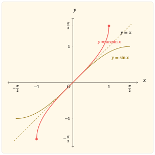

## Một nhánh của sin có thể đảo ngược

Hàm sin trên toàn bộ $\mathbb{R}$ không thể có hàm ngược: chẳng hạn $\sin 0=\sin 2\pi=0$, nên một đầu ra không xác định duy nhất đầu vào đã sinh ra nó. Muốn đảo ngược hàm sin, trước hết phải chọn một miền mà trên đó mỗi giá trị chỉ xuất hiện một lần.

Đoạn

$$
I=\left[-\frac{\pi}{2},\frac{\pi}{2}\right]
$$

là miền chuẩn cho mục đích ấy. Trên $I$, hàm sin liên tục, tăng nghiêm ngặt và đi từ $-1$ đến $1$. Vì vậy,

$$
\sin:I\longrightarrow[-1,1]
$$

là một song ánh. Với mỗi $x\in[-1,1]$, có đúng một $y\in I$ sao cho $\sin y=x$. Số $y$ duy nhất đó được gọi là $\arcsin x$:

$$
y=\arcsin x
\quad\Leftrightarrow\quad
\begin{cases}
\sin y=x,\\
-\frac{\pi}{2}\le y\le\frac{\pi}{2}.
\end{cases}
$$

Từ định nghĩa, hai công thức hàm ngược cần được đọc cùng điều kiện của chúng:

$$
\sin(\arcsin x)=x,
\quad x\in[-1,1],
$$

và

$$
\arcsin(\sin y)=y,
\quad y\in\left[-\frac{\pi}{2},\frac{\pi}{2}\right].
$$

Công thức thứ hai không đúng với mọi số thực. Chẳng hạn,

$$
\arcsin\left(\sin\frac{3\pi}{4}\right)
=\arcsin\frac{\sqrt{2}}{2}
=\frac{\pi}{4}
\ne\frac{3\pi}{4}.
$$

Điểm quyết định không nằm ở kí hiệu $\arcsin$ mà ở miền đã dùng để làm cho nhánh sin trở thành song ánh. Hàm $\arcsin$ đảo đúng nhánh sin trên $I$, không đảo hàm sin trên toàn bộ $\mathbb{R}$.

## Khi đầu vào và đầu ra đổi vai

Phép đảo ngược biến ánh xạ

$$
y\mapsto \sin y,
\quad y\in I,
$$

thành ánh xạ theo chiều ngược lại

$$
x\mapsto \arcsin x,
\quad x\in[-1,1].
$$

Bởi vậy, tập giá trị của nhánh sin trở thành tập xác định của $\arcsin$, còn miền của nhánh sin trở thành tập giá trị của $\arcsin$:

$$
D_{\arcsin}=[-1,1],
\quad
\operatorname{Im}(\arcsin)
=\left[-\frac{\pi}{2},\frac{\pi}{2}\right].
$$

Nhánh sin tăng nghiêm ngặt nên thứ tự cũng được đọc theo chiều ngược của ánh xạ: nếu $-1\le x_1<x_2\le1$ thì

$$
\arcsin x_1<\arcsin x_2.
$$

Do đó, $\arcsin$ tăng nghiêm ngặt trên toàn bộ tập xác định. Hàm đạt giá trị nhỏ nhất $-\frac{\pi}{2}$ tại $x=-1$ và giá trị lớn nhất $\frac{\pi}{2}$ tại $x=1$. Nghiệm duy nhất là $x=0$; hơn nữa $\arcsin x$ cùng dấu với $x$.

Tính lẻ cũng đi qua phép đảo. Với $x\in[-1,1]$, đặt $y=\arcsin x$. Khi đó $y\in I$ và $\sin y=x$. Vì $I$ đối xứng qua $0$ và hàm sin lẻ,

$$
\sin(-y)=-x.
$$

Tính duy nhất trong định nghĩa của $\arcsin$ cho

$$
\arcsin(-x)=-\arcsin x.
$$

Vì vậy, đồ thị của $y=\arcsin x$ nhận gốc tọa độ làm tâm đối xứng. Hàm cũng liên tục trên $[-1,1]$ vì nó là hàm ngược của một hàm liên tục, tăng nghiêm ngặt trên một đoạn.

Về hình học, nếu $(y,\sin y)$ nằm trên nhánh sin với $y\in I$ thì

$$
(\sin y,y)
$$

nằm trên đồ thị $y=\arcsin x$. Hai điểm này đối xứng nhau qua đường thẳng $y=x$. Vì vậy, toàn bộ đồ thị $y=\arcsin x$ là ảnh đối xứng của nhánh $y=\sin x$, $x\in I$, qua đường thẳng $y=x$.

::::: {.content-visible when-format="html"}

:::: {#fig-ham-arcsin-x}
{fig-alt="Đồ thị hàm arcsin màu đỏ, nhánh hàm sin trên đoạn từ âm pi trên hai đến pi trên hai màu vàng nâu và đường tham chiếu y bằng x nét đứt; hai đường cong đối xứng nhau qua y bằng x." width="100%" fig-align="center"}

Đồ thị $y=\arcsin x$ và nhánh $y=\sin x$ trên $\left[-\frac{\pi}{2},\frac{\pi}{2}\right]$ đối xứng qua đường thẳng $y=x$.
::::

:::::

::::: {.content-visible when-format="pdf"}

:::: {#fig-ham-arcsin-x}
{fig-alt="Đồ thị hàm arcsin màu đỏ, nhánh hàm sin trên đoạn từ âm pi trên hai đến pi trên hai màu vàng nâu và đường tham chiếu y bằng x nét đứt; hai đường cong đối xứng nhau qua y bằng x." width="85%" fig-align="center"}

Đồ thị $y=\arcsin x$ và nhánh $y=\sin x$ trên $\left[-\frac{\pi}{2},\frac{\pi}{2}\right]$ đối xứng qua đường thẳng $y=x$.
::::

:::::

Hình vẽ cần được đọc từ quan hệ đã chứng minh, không phải ngược lại. Hai đầu mút $\left(-1,-\frac{\pi}{2}\right)$ và $\left(1,\frac{\pi}{2}\right)$ đến từ việc đổi thứ tự tọa độ của $\left(-\frac{\pi}{2},-1\right)$ và $\left(\frac{\pi}{2},1\right)$ trên nhánh sin. Tính tăng, tâm đối xứng và toàn bộ hình dạng đường cong cũng phù hợp với phép đối xứng qua $y=x$; không cần nội suy từ một số hữu hạn điểm rời rạc.

## Đạo hàm ghi lại phép đảo

Xét $x\in(-1,1)$ và đặt

$$
y=\arcsin x.
$$

Khi đó $y\in\left(-\frac{\pi}{2},\frac{\pi}{2}\right)$ và

$$
\sin y=x.
$$

Lấy đạo hàm hai vế theo $x$:

$$
\cos y\,y^\prime=1.
$$

Trên khoảng $\left(-\frac{\pi}{2},\frac{\pi}{2}\right)$, ta có $\cos y>0$. Đồng thời,

$$
\cos y
=\sqrt{1-\sin^2y}
=\sqrt{1-x^2}.
$$

Do đó,

$$
(\arcsin x)^\prime
=\frac{1}{\sqrt{1-x^2}},
\quad -1<x<1.
$$

Đạo hàm dương cho một cách kiểm tra khác đối với tính tăng của hàm trên miền trong. Công thức cũng cho thấy một dấu vết trực tiếp của phép đảo: nơi nhánh sin có độ dốc tiến về $0$ ở $y=\pm\frac{\pi}{2}$ thì độ dốc của hàm ngược tăng không bị chặn. Cụ thể,

$$
\lim_{x\to1^-}(\arcsin x)^\prime=+\infty,
\quad
\lim_{x\to(-1)^+}(\arcsin x)^\prime=+\infty.
$$

Hai đầu mút $x=-1$ và $x=1$ vẫn thuộc tập xác định của $\arcsin$, nhưng công thức đạo hàm trên chỉ áp dụng cho $(-1,1)$. Trên đồ thị, sự khác biệt ấy xuất hiện dưới dạng đường cong tiến đến phương thẳng đứng tại hai đầu mút, chứ không phải một giá trị đạo hàm hữu hạn tại đó.

## Kết tinh

Hàm $\arcsin$ không phải là thao tác “xóa sin” một cách vô điều kiện. Nó là hàm ngược của đúng nhánh sin trên $\left[-\frac{\pi}{2},\frac{\pi}{2}\right]$. Sau khi miền này được cố định, hàng loạt tính chất nối với nhau bằng cùng một cơ chế: miền và tập giá trị đổi vai, đồ thị được phản chiếu qua $y=x$, tính tăng đi theo tính tăng của nhánh gốc, còn đạo hàm xuất hiện từ việc giải ngược phương trình $\sin y=x$.

Cách nhìn có thể chuyển sang những hàm ngược khác là: trước khi dùng kí hiệu hàm ngược hay công thức hợp, phải xác định miền làm cho hàm gốc một-một và theo dõi chính xác miền ấy khi đầu vào và đầu ra đổi vai.

## Bài tập

Các bài dưới đây được sắp theo quan hệ phụ thuộc. Bốn bài đầu dựng lại các mắt xích của bài; ba bài sau đi tiếp từ chính cơ chế hàm ngược để khảo sát phép hợp ngoài nhánh chính, độ cong và công thức đạo hàm tổng quát.

### Nhánh sin và phép đảo

#### Bài 1. Miền nào làm cho sin đảo được?

Xét hàm sin trên

$$
I=\left[-\frac{\pi}{2},\frac{\pi}{2}\right].
$$

a. Giải thích vì sao hàm sin tăng nghiêm ngặt trên $I$ và nhận đúng mọi giá trị trong $[-1,1]$.

b. Từ đó, phát biểu định nghĩa $y=\arcsin x$ với đầy đủ điều kiện của $x$ và $y$.

c. Viết đúng miền áp dụng của hai đẳng thức $\sin(\arcsin x)=x$ và $\arcsin(\sin y)=y$.

d. Tính $\arcsin\left(\sin\frac{5\pi}{6}\right)$ và giải thích vì sao kết quả không bằng $\frac{5\pi}{6}$.

#### Bài 2. Những tính chất đi ra từ phép đảo

Không dùng đạo hàm của $\arcsin$.

a. Chứng minh $\arcsin$ tăng nghiêm ngặt trên $[-1,1]$.

b. Chứng minh $\arcsin(-x)=-\arcsin x$ với mọi $x\in[-1,1]$.

c. Xác định nghiệm, dấu, giá trị nhỏ nhất và giá trị lớn nhất của $\arcsin x$.

d. Nêu tập xác định và tập giá trị, rồi giải thích vì sao hai tập này xuất hiện theo thứ tự ngược với nhánh sin chính.

#### Bài 3. Dựng đồ thị không bằng cách nối điểm

a. Phác họa nhánh $y=\sin x$ trên $\left[-\frac{\pi}{2},\frac{\pi}{2}\right]$.

b. Dùng phép đối xứng qua $y=x$ để dựng đồ thị $y=\arcsin x$. Đánh dấu hai đầu mút và gốc tọa độ.

c. Từ phép dựng, giải thích vì sao đồ thị $y=\arcsin x$ tăng và có tâm đối xứng là gốc tọa độ.

d. Giải thích vì sao ba điểm $\left(-1,-\frac{\pi}{2}\right)$, $(0,0)$, $\left(1,\frac{\pi}{2}\right)$ riêng lẻ chưa đủ để xác định hình dạng đồ thị, còn quan hệ hàm ngược thì đủ để dựng toàn bộ đường cong từ nhánh sin đã biết.

#### Bài 4. Đạo hàm và hai đầu mút

Với $x\in(-1,1)$, đặt $y=\arcsin x$.

a. Từ $\sin y=x$, chứng minh

$$
(\arcsin x)^\prime=\frac{1}{\sqrt{1-x^2}}.
$$

b. Dùng đạo hàm để kiểm tra lại chiều biến thiên của $\arcsin$ trên $(-1,1)$.

c. Tính giới hạn của $(\arcsin x)^\prime$ khi $x\to1^-$ và khi $x\to(-1)^+$.

d. Phân biệt hai phát biểu: “$x=\pm1$ thuộc tập xác định của $\arcsin$” và “đạo hàm của $\arcsin$ được cho bởi công thức trên tại $x=\pm1$”.

### Từ cơ chế hàm ngược đến những hệ quả mới

#### Bài 5. Khi đầu vào rời nhánh chính

Đặt

$$
F(t)=\arcsin(\sin t).
$$

a. Chứng minh $F(t)=t$ với $t\in\left[-\frac{\pi}{2},\frac{\pi}{2}\right]$.

b. Với $t\in\left[\frac{\pi}{2},\frac{3\pi}{2}\right]$, chứng minh

$$
F(t)=\pi-t.
$$

c. Với $t\in\left[\frac{3\pi}{2},\frac{5\pi}{2}\right]$, chứng minh

$$
F(t)=t-2\pi.
$$

d. Từ ba khoảng trên, giải thích vì sao $F$ không phải là hàm đồng nhất trên $\mathbb{R}$ dù $\arcsin$ là hàm ngược của một nhánh sin.

#### Bài 6. Độ cong của đồ thị

Với $-1<x<1$, xuất phát từ

$$
f^\prime(x)=\frac{1}{\sqrt{1-x^2}}
$$

cho $f(x)=\arcsin x$.

a. Chứng minh

$$
f^{\prime\prime}(x)
=\frac{x}{(1-x^2)^{\frac{3}{2}}}.
$$

b. Xác định dấu của $f^{\prime\prime}(x)$ trên $(-1,0)$ và $(0,1)$.

c. Suy ra dạng cong của đồ thị ở hai phía của gốc tọa độ và kiểm tra kết quả ấy với tính lẻ của hàm.

d. Xác định điểm uốn của đồ thị.

#### Bài 7. Công thức đạo hàm của một hàm ngược

Cho $g$ khả vi và tăng nghiêm ngặt trên một khoảng, với $g^\prime(t)>0$ tại các điểm đang xét. Gọi $h=g^{-1}$ trên tập giá trị tương ứng và giả sử $h$ khả vi tại điểm đang xét.

a. Từ đẳng thức $g(h(x))=x$, chứng minh $h^\prime(x)=\frac{1}{g^\prime(h(x))}$.

b. Áp dụng công thức cho $g(t)=\sin t$ trên $\left(-\frac{\pi}{2},\frac{\pi}{2}\right)$ để thu lại đạo hàm của $\arcsin x$.

c. Giải thích bằng công thức tổng quát vì sao độ dốc của hàm ngược trở nên rất lớn khi độ dốc của hàm gốc tiến gần $0$ nhưng vẫn dương.
