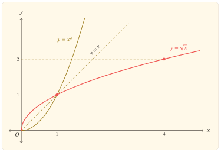
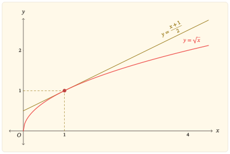
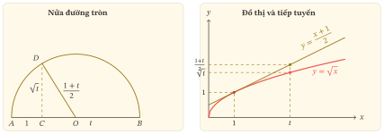

Trên tập số không âm, hàm bình phương $x\mapsto x^2$ tăng nghiêm ngặt và nhận mọi giá trị không âm. Vì thế, với mỗi $x\geq 0$ có đúng một số không âm $y$ thỏa mãn $y^2=x$; số ấy được kí hiệu là $\sqrt{x}$. Nói cách khác, phép lấy căn bậc hai số học đảo ngược phép bình phương khi hàm bình phương được xét trên $[0,+\infty)$. Quan hệ này dẫn đến hàm số

$$
f(x)=\sqrt{x},
$$

và cho phép khảo sát tập xác định, tập giá trị, biến thiên, hình dạng đồ thị cùng những bất đẳng thức gắn với tính lõm của hàm.

## Tập xác định và tập giá trị

Ta xét hàm số $f(x)=\sqrt{x}$, trong đó $\sqrt{x}$ được hiểu là căn bậc hai số học của $x$.

<details class="zo-block zo-block-red">
<summary class="zo-block-title">Căn bậc hai số học</summary>
<div class="zo-block-body">

Với $x\geq 0$, số không âm $y$ thỏa mãn $y^2=x$ được gọi là *căn bậc hai số học* của $x$ và được kí hiệu là $\sqrt{x}$. Số ấy là duy nhất vì phép bình phương đồng biến nghiêm ngặt trên $[0,+\infty)$: hai số không âm khác nhau không thể có cùng bình phương.
</div>
</details>

Trong tập số thực, căn thức $\sqrt{x}$ có nghĩa khi và chỉ khi $x\geq 0$. Vì vậy hàm số $f(x)=\sqrt{x}$ có tập xác định

$$
\mathcal D=[0,+\infty).
$$

Gọi $T$ là tập giá trị của $f$. Theo định nghĩa, mọi giá trị $\sqrt{x}$ đều không âm, nên $T\subset [0,+\infty)$. Ngược lại, với bất kì $y\in[0,+\infty)$, lấy $x=y^2$ thì $x\geq 0$ và $\sqrt{x}=\sqrt{y^2}=y$; do đó $[0,+\infty)\subset T$. Vậy

$$
T=[0,+\infty).
$$

<details class="zo-block zo-block-red">
<summary class="zo-block-title">Chứng minh hai tập bằng nhau</summary>
<div class="zo-block-body">

Để chứng minh hai tập $A$ và $B$ bằng nhau, ta thường chứng minh đồng thời $A\subset B$ và $B\subset A$. Ở đây, tính không âm cho $T\subset[0,+\infty)$, còn cách chọn $x=y^2$ cho chiều bao hàm ngược lại.
</div>
</details>

Nếu $y=\sqrt{x}$ thì $y\geq 0$ và $x=y^2$. Ngược lại, nếu $x=y^2$ với $y\geq 0$ thì theo định nghĩa căn bậc hai số học, $y=\sqrt{x}$. Hai chiều này biểu hiện chính xác quan hệ hàm ngược giữa hàm căn $f(x)=\sqrt{x}$ và hàm bình phương $x\mapsto x^2$ khi hàm bình phương được xét trên $[0,+\infty)$.

Từ $f(0)=0$, đồ thị đi qua $O(0,0)$. Hơn nữa, $f(x)>0$ với mọi $x>0$, nên $O$ là giao điểm duy nhất của đồ thị với hai trục; đồng thời $x=0$ là đầu mút của tập xác định.

Quan hệ hàm ngược với hàm bình phương gợi ra tính liên tục của hàm căn. Có thể kiểm tra trực tiếp điều đó trên $(0,+\infty)$: với $x_0>0$ và $x>0$,

$$
\lvert\sqrt{x}-\sqrt{x_0}\rvert
=\frac{\lvert x-x_0\rvert}{\sqrt{x}+\sqrt{x_0}}
\leq\frac{\lvert x-x_0\rvert}{\sqrt{x_0}}.
$$

Khi $x\to x_0$, vế phải tiến về $0$, nên $f$ liên tục tại mọi $x_0>0$. Tại đầu mút,

$$
\lim_{x\to0^+}\sqrt{x}=0=f(0),
$$

nên hàm số liên tục phải tại $0$.

<details class="zo-block zo-block-gray">
<summary class="zo-block-title">Vì sao hàm căn liên tục phải tại $0$?</summary>
<div class="zo-block-body">

Vì $0$ là đầu mút trái của tập xác định, ở đây cần kiểm tra tính liên tục phải. Theo định nghĩa $\varepsilon$–$\delta$, với mỗi $\varepsilon>0$ cần tìm $\delta>0$ sao cho, nếu $x$ thuộc tập xác định và $0\leq x<\delta$, thì

$$
\lvert\sqrt{x}-\sqrt{0}\rvert<\varepsilon.
$$

Chọn $\delta=\varepsilon^2$. Khi $0\leq x<\delta$, ta có

$$
\lvert\sqrt{x}-\sqrt{0}\rvert=\sqrt{x}<\varepsilon.
$$

Đây chính là điều kiện $\varepsilon$–$\delta$ cho tính liên tục phải tại $0$.
</div>
</details>

## Tăng và lõm xuống

Nếu $0\leq x_1<x_2$ thì

$$
\sqrt{x_2}-\sqrt{x_1}
=\frac{x_2-x_1}{\sqrt{x_2}+\sqrt{x_1}}>0.
$$

Vì thế $f$ đồng biến nghiêm ngặt trên toàn bộ tập xác định $[0,+\infty)$. Lập luận này bao gồm cả đầu mút và không cần dùng đạo hàm tại $0$.

Đồ thị có một hiện tượng hình học đáng chú ý: dây cung nối hai điểm của đồ thị nằm phía dưới đồ thị. Hiện tượng ấy được gọi là *lõm xuống*.

<details class="zo-block zo-block-red">
<summary class="zo-block-title">Hàm lõm</summary>
<div class="zo-block-body">

Hàm số $f$ được gọi là *lõm* trên một khoảng $I$ nếu, với mọi $x_1,x_2\in I$ và mọi $\lambda\in[0,1]$,

$$
f\bigl(\lambda x_1+(1-\lambda)x_2\bigr)
\geq
\lambda f(x_1)+(1-\lambda)f(x_2).
$$

Về hình học, đồ thị của một hàm lõm nằm phía trên dây cung nối hai điểm bất kì của nó.
</div>
</details>

Với $x_1,x_2\geq 0$ là hoành độ của hai điểm trên đồ thị và $\lambda\in[0,1]$ xác định điểm chia trên dây cung, ta có

$$
\begin{aligned}
&\lambda x_1+(1-\lambda)x_2
-\bigl[\lambda\sqrt{x_1}+(1-\lambda)\sqrt{x_2}\bigr]^2\\
&\quad=\lambda(1-\lambda)\bigl(\sqrt{x_1}-\sqrt{x_2}\bigr)^2\geq 0.
\end{aligned}
$$

Hai vế cần so sánh đều không âm, nên

$$
\sqrt{\lambda x_1+(1-\lambda)x_2}
\geq
\lambda\sqrt{x_1}+(1-\lambda)\sqrt{x_2}.
$$

Đây chính là tính lõm của hàm số $f(x)=\sqrt{x}$ trên $[0,+\infty)$.

Nếu $0<\lambda<1$ và $x_1\ne x_2$ thì $\lambda(1-\lambda)(\sqrt{x_1}-\sqrt{x_2})^2>0$, nên bất đẳng thức lõm là nghiêm; do đó $f(x)=\sqrt{x}$ lõm nghiêm ngặt trên $[0,+\infty)$.

Trên khoảng $(0,+\infty)$, hàm khả vi với

$$
f^\prime(x)=\frac{1}{2\sqrt{x}}>0,
\qquad
f^{\prime\prime}(x)=-\frac{1}{4x\sqrt{x}}<0.
$$

Đạo hàm dương xác nhận tính đồng biến. Đạo hàm cấp hai âm là cách nhìn giải tích xác nhận tính lõm trên $(0,+\infty)$. Đồng thời, $f^\prime(x)$ giảm về $0$ khi $x\to+\infty$, nghĩa là hệ số góc của tiếp tuyến giảm dần.

### Điều xảy ra tại đầu mút

Công thức đạo hàm trên không áp dụng tại $x=0$. Thương sai phân một phía là

$$
\frac{f(h)-f(0)}{h}
=\frac{\sqrt{h}}{h}
=\frac{1}{\sqrt{h}}.
$$

Do đó

$$
\lim_{h\to0^+}\frac{f(h)-f(0)}{h}=+\infty.
$$

Do $0$ là đầu mút của tập xác định, đạo hàm hai phía tại đó không được đặt ra; đạo hàm phải hữu hạn cũng không tồn tại. Không viết $f^\prime(0)=+\infty$. Về hình học, các dây cung nối $O$ với $(h,\sqrt h)$ có hệ số góc tăng không bị chặn, nên đồ thị có tiếp tuyến đứng $x=0$ tại đầu mút.

### Bảng biến thiên

Trên $(0,+\infty)$, dấu của $f^\prime$ cùng các giá trị ở đầu mút và khi $x\to+\infty$ cho bảng biến thiên sau.

| $x$ | $0$ | $0<x<+\infty$ | $+\infty$ |
|---|:---:|:---:|:---:|
| $f^\prime(x)$ |  | $+$ |  |
| $f(x)$ | $0$ | $\nearrow$ | $+\infty$ |

Hàng $f^\prime(x)$ chỉ ghi dấu trên $(0,+\infty)$, là tập mà đạo hàm được xác định. Ô tại $x=0$ để trống vì $f^\prime(0)$ không tồn tại; không dùng hai vạch đứng, bởi $x=0$ vẫn thuộc tập xác định của chính hàm $f$ và $f(0)=0$ vẫn là giá trị đầu mút của bảng.

## Đồ thị của hai hàm ngược

Hàm bình phương $x\mapsto x^2$ đồng biến nghiêm ngặt trên $[0,+\infty)$ và có tập giá trị $[0,+\infty)$, nên mỗi giá trị không âm xác định duy nhất một số không âm có bình phương bằng nó. Theo định nghĩa căn bậc hai số học, hàm ngược của hàm bình phương trên tập này là $f(x)=\sqrt{x}$. Vì đồ thị của hai hàm ngược đối xứng qua đường $y=x$, đồ thị hàm căn bậc hai là ảnh đối xứng của phần $x\geq 0$ trên parabol $y=x^2$.

::::: {.content-visible when-format="html"}

:::: {#fig-do-thi-ham-can-x}
{fig-alt="Đồ thị y bằng căn x bắt đầu tại O, tăng và lõm xuống trong góc phần tư thứ nhất; nửa phải parabol y bằng x bình phương và đường y bằng x cho thấy quan hệ đối xứng của hai hàm ngược." width="100%" fig-align="center"}

Đồ thị $y=\sqrt{x}$ và nửa phải của $y=x^2$ đối xứng qua $y=x$.
::::

:::::

::::: {.content-visible when-format="pdf"}

:::: {#fig-do-thi-ham-can-x}
{fig-alt="Đồ thị y bằng căn x bắt đầu tại O, tăng và lõm xuống trong góc phần tư thứ nhất; nửa phải parabol y bằng x bình phương và đường y bằng x cho thấy quan hệ đối xứng của hai hàm ngược." width="54%" fig-align="center"}

Đồ thị $y=\sqrt{x}$ và nửa phải của $y=x^2$ đối xứng qua $y=x$.
::::

:::::

Đọc ngược từ hình, mỗi điểm $(a,a^2)$ trên nửa phải parabol tương ứng với điểm $(a^2,a)$ trên đồ thị căn bậc hai. Các điểm $(0,0)$ và $(1,1)$ nằm trên đường $y=x$ nên bất động qua phép đối xứng. Sau điểm $(1,1)$, ta có $\sqrt{x}<x$; giữa $0$ và $1$, thứ tự đảo lại: $\sqrt{x}>x$.

## Từ tính lõm đến những bất đẳng thức hữu ích

Vì đồ thị lõm xuống trên $(0,+\infty)$, nó nằm dưới mọi tiếp tuyến tại một điểm dương. Tiếp tuyến tại $x=a>0$ có phương trình

$$
y=\sqrt{a}+\frac{x-a}{2\sqrt{a}}.
$$

Rút gọn phương trình được

$$
y=\frac{x+a}{2\sqrt{a}}.
$$

Vì đồ thị lõm xuống nên nằm dưới tiếp tuyến. Lấy $b\geq 0$, tại hoành độ $b$ ta có

$$
\sqrt{b}\leq\frac{a+b}{2\sqrt{a}}.
$$

Nhân hai vế với $2\sqrt{a}>0$ rồi chia cho $2$, ta được

$$
\sqrt{ab}\leq\frac{a+b}{2}.
$$

Khi $a=0$ hoặc $b=0$, bất đẳng thức cũng đúng trực tiếp. Vì hàm căn lõm nghiêm ngặt, với $a,b>0$ dấu bằng chỉ xảy ra khi $a=b$; về hình học, đó là khi điểm đang xét chính là tiếp điểm.

::::: {.content-visible when-format="html"}

:::: {#fig-do-thi-tiep-tuyen-ham-can-x fig-pos="H"}
{fig-alt="Đồ thị y bằng căn x nằm dưới tiếp tuyến y bằng x cộng 1 chia 2 tại điểm 1 phẩy 1; hình minh họa bất đẳng thức căn x không vượt quá x cộng 1 chia 2." width="88%" fig-align="center"}

Đồ thị $y=\sqrt{x}$ nằm dưới tiếp tuyến $y=\frac{x+1}{2}$ tại $x=1$.
::::

:::::

::::: {.content-visible when-format="pdf"}

:::: {#fig-do-thi-tiep-tuyen-ham-can-x fig-pos="H"}
{fig-alt="Đồ thị y bằng căn x nằm dưới tiếp tuyến y bằng x cộng 1 chia 2 tại điểm 1 phẩy 1; hình minh họa bất đẳng thức căn x không vượt quá x cộng 1 chia 2." width="62%" fig-align="center"}

Đồ thị $y=\sqrt{x}$ nằm dưới tiếp tuyến $y=\frac{x+1}{2}$ tại $x=1$.
::::

:::::

Tính lõm còn có thể nhận ra qua số gia. Với $h>0$, hiệu

$$
\sqrt{x+h}-\sqrt{x}
=\frac{h}{\sqrt{x+h}+\sqrt{x}}
$$

giảm khi $x$ tăng. Với cùng một số gia $h$ ở đầu vào, số gia của hàm căn giảm dần; điều này phù hợp với việc hệ số góc của tiếp tuyến giảm.

<!-- zo-pdf-block-integrity-break: yellow-amgm -->
::::: {.content-visible when-format="pdf"}
```{=latex}
\newpage
```
:::::

<details class="zo-block zo-block-yellow">
<summary class="zo-block-title">Hai hình ảnh của bất đẳng thức trung bình cộng – trung bình nhân</summary>
<div class="zo-block-body">

Với $a,b>0$, xét nửa đường tròn có đường kính $AB$. Chọn $C$ trên đoạn $AB$ sao cho $\lvert AC\rvert=a$ và $\lvert CB\rvert=b$; gọi $O$ là trung điểm của $AB$. Qua $C$ dựng $CD\perp AB$, với $D$ trên nửa đường tròn. Theo định lí Thales, tam giác $ADB$ vuông tại $D$ và $CD$ là đường cao hạ xuống cạnh huyền, nên

$$
\lvert CD\rvert^2=\lvert AC\rvert\,\lvert CB\rvert=ab,
\qquad
\lvert CD\rvert=\sqrt{ab}.
$$

Nếu $r$ là độ dài bán kính thì $r=\lvert OD\rvert=\frac{\lvert AB\rvert}{2}=\frac{a+b}{2}$. Tam giác $OCD$ vuông tại $C$, nên $\lvert CD\rvert\leq\lvert OD\rvert=r$. Do đó

$$
\sqrt{ab}\leq\frac{a+b}{2}.
$$

Dấu bằng xảy ra đúng khi $C=O$, tức $a=b$. Nếu giữ $a+b$ cố định thì bán kính không đổi; khi $C$ chạy trên $AB$, đường cao $CD$ lớn nhất khi $C$ trùng với trung điểm $O$.

Ở cách nhìn bằng tiếp tuyến, cố định $a>0$ và cho $b$ thay đổi. Ta xét hàm $x\mapsto\sqrt{ax}$ vì tại $x=b$ giá trị của nó chính là $\sqrt{ab}$. Do $\sqrt{ax}=\sqrt{a}\sqrt{x}$, đây là một bội dương của hàm căn nên vẫn lõm. Với $x>0$, đạo hàm của hàm này là $\frac{\sqrt{a}}{2\sqrt{x}}$; tại $x=a$ hệ số góc tiếp tuyến bằng $\frac{1}{2}$, vì thế tiếp tuyến là $y=\frac{a+x}{2}$. Tại $x=b$, tung độ của đồ thị và tiếp tuyến lần lượt là $\sqrt{ab}$ và $\frac{a+b}{2}$. Tính lõm cho cùng bất đẳng thức trên; dấu bằng xảy ra khi $b=a$, tức điểm đang xét trùng với tiếp điểm.

Hai hình cùng so sánh $\sqrt{ab}$ với $\frac{a+b}{2}$ nhưng giữ cố định những đại lượng khác nhau: hình nửa đường tròn giữ $a+b$ cố định và cho $C$ thay đổi, còn hình tiếp tuyến giữ $a$ cố định và cho $b$ thay đổi. Hình thứ nhất làm nổi bật bài toán cực đại của đường cao; hình thứ hai làm rõ vai trò của tính lõm và sự tiếp xúc.

Để bỏ thang đo chung $a$ và chỉ giữ tỉ số giữa hai số, đặt $t=\frac{b}{a}>0$. Chia bất đẳng thức cho $a>0$, ta được

$$
\sqrt t\leq\frac{1+t}{2}.
$$

Trong hình nửa đường tròn đã chuẩn hóa, hai đoạn đáy có độ dài $1$ và $t$, đường cao có độ dài $\sqrt t$, còn bán kính có độ dài $\frac{1+t}{2}$. Ở hình tiếp tuyến, cùng tham số $t$ được đọc tại $x=t$ trên đồ thị $y=\sqrt{x}$ và tiếp tuyến $y=\frac{1+x}{2}$ tại $x=1$. Hai hình vì thế biểu diễn cùng một bất đẳng thức sau khi bỏ thang đo $a$.

::::: {.content-visible when-format="html"}

{fig-alt="Hai hình chuẩn hóa cùng so sánh căn t với một cộng t chia hai: bên trái là đường cao trong nửa đường tròn có hai đoạn đáy 1 và t; bên phải là đồ thị căn x và tiếp tuyến tại x bằng 1, được so sánh tại x bằng t." width="100%" fig-align="center"}

*Sau chuẩn hóa $t=\frac{b}{a}$, hai hình cùng so sánh $\sqrt t$ với $\frac{1+t}{2}$.*

:::::

::::: {.content-visible when-format="pdf"}

{fig-alt="Hai hình chuẩn hóa cùng so sánh căn t với một cộng t chia hai: bên trái là đường cao trong nửa đường tròn có hai đoạn đáy 1 và t; bên phải là đồ thị căn x và tiếp tuyến tại x bằng 1, được so sánh tại x bằng t." width="92%" fig-align="center"}

*Sau chuẩn hóa $t=\frac{b}{a}$, hai hình cùng so sánh $\sqrt t$ với $\frac{1+t}{2}$.*

:::::
</div>
</details>

## Nhìn lại

Định nghĩa căn bậc hai số học chọn nghiệm không âm của phương trình bình phương. Vì hàm $y=x^2$ tăng trên $[0,+\infty)$ và nhận mọi giá trị không âm, hàm $y=\sqrt{x}$ là hàm ngược của nó trên tập này. Hàm căn có tập xác định và tập giá trị đều là $[0,+\infty)$; đồ thị bắt đầu tại $O$, tăng, lõm xuống và có tiếp tuyến đứng tại đầu mút. Khi tìm hàm ngược của một hàm số khác, điều đầu tiên cần kiểm tra là tập đang xét có làm cho mỗi giá trị chỉ ứng với một đầu vào hay không.

## Bài tập

### Từ nửa parabol đến hàm căn

#### Bài 1. Dựng lại hàm căn bậc hai

Xét hàm số $g(x)=x^2$ trên $[0,+\infty)$.

a. Chứng minh $g$ đồng biến nghiêm ngặt trên $[0,+\infty)$.

b. Chứng minh $g$ nhận mọi giá trị trong $[0,+\infty)$ và mỗi giá trị chỉ được nhận một lần.

c. Với $u\geq 0$, giải phương trình $u=x^2$ theo $x\geq 0$. Từ đó viết hàm ngược của $g$ và xác định tập xác định, tập giá trị của hàm ngược ấy.

#### Bài 2. Hai đồ thị của hai hàm ngược

Với $a\geq 0$, điểm $A(a,a^2)$ thuộc nửa phải của parabol $y=x^2$.

a. Xác định điểm tương ứng trên đồ thị $y=\sqrt{x}$ khi đổi vai trò hai tọa độ và giải thích vì sao hai điểm đối xứng qua đường $y=x$.

b. Tìm các điểm chung của hai đồ thị $y=x^2$ với $x\geq 0$ và $y=\sqrt{x}$.

c. Từ đó chứng minh $\sqrt{x}>x$ với $0<x<1$ và $\sqrt{x}<x$ với $x>1$.

### Biến thiên và đầu mút

#### Bài 3. Tăng trên toàn tập xác định

Với $0\leq a<b$, dùng phép liên hợp để chứng minh $\sqrt{a}<\sqrt{b}$. Từ đó kết luận sự biến thiên của hàm số $y=\sqrt{x}$ trên toàn bộ tập xác định và giải thích vì sao lập luận này xử lí được cả đầu mút $0$.

#### Bài 4. Tiếp tuyến đứng tại đầu mút

Với $h>0$, xét dây cung nối $O(0,0)$ với điểm $M(h,\sqrt{h})$ trên đồ thị.

a. Tính hệ số góc của $OM$.

b. Xét giới hạn của hệ số góc đó khi $h\to0^+$.

c. Giải thích kết quả hình học thu được tại $O$ và vì sao công thức $f^\prime(x)=\frac{1}{2\sqrt{x}}$ chỉ áp dụng cho $x>0$, không cho một đạo hàm hữu hạn tại $x=0$.

#### Bài 5. Tính lõm và số gia

Với $f(x)=\sqrt{x}$:

a. Dùng định nghĩa hàm lõm để chứng minh $f$ lõm trên $[0,+\infty)$.

b. Trên $(0,+\infty)$, tính $f^\prime(x)$ và $f^{\prime\prime}(x)$; giải thích dấu của hai đạo hàm phù hợp thế nào với tính tăng và tính lõm đã biết.

c. Với $h>0$ cố định, chứng minh
$\sqrt{x+h}-\sqrt{x}$
giảm khi $x$ tăng trên $[0,+\infty)$.

d. Giải thích mối liên hệ giữa kết quả ở câu c) với tính lõm của hàm số.

### Tiếp tuyến, biến đổi và diện tích

#### Bài 6. Tiếp tuyến và một bất đẳng thức

Với $a>0$:

a. Viết phương trình tiếp tuyến của đồ thị $y=\sqrt{x}$ tại điểm có hoành độ $a$.

b. Dùng tính lõm của đồ thị đã chứng minh ở Bài 5 để suy ra

$$
2\sqrt{ax}\leq a+x
$$

với mọi $x\geq 0$.

c. Xác định khi nào xảy ra dấu bằng và giải thích ý nghĩa hình học của trường hợp đó.

d. Viết một tiểu luận toán học ngắn đối sánh cách dựng nửa đường tròn với cách nhìn bằng tiếp tuyến của hàm căn. Bài viết cần chỉ rõ: đại lượng nào biểu diễn $\sqrt{ab}$; đại lượng nào biểu diễn $\frac{a+b}{2}$; trong hình nửa đường tròn, đại lượng nào được giữ cố định và đại lượng nào thay đổi; trong hình tiếp tuyến, đại lượng nào được giữ cố định và đại lượng nào thay đổi; ý nghĩa hình học của dấu bằng trong cả hai hình; và điều mỗi cách nhìn làm sáng tỏ mà cách kia chưa cho thấy ngay.

#### Bài 7. Dịch chuyển đồ thị

Từ đồ thị $y=\sqrt{x}$:

a. Mô tả lần lượt các phép biến đổi để nhận được đồ thị $y=\sqrt{x-2}+1$.

b. Xác định đầu mút, tập xác định và tập giá trị của hàm mới.

c. Suy ra chiều biến thiên và phương trình tiếp tuyến đứng tại đầu mút của đồ thị mới.

#### Bài 8. Diện tích dưới đường cong

Xét hình phẳng giới hạn bởi đồ thị $y=\sqrt{x}$, trục hoành và đường thẳng $x=4$.

a. Tính diện tích hình phẳng đó bằng tích phân theo $x$.

b. Viết cùng miền hình phẳng theo biến $y$ bằng quan hệ $x=y^2$, $y\geq 0$, rồi tính lại diện tích.

c. Giải thích vì sao hai cách tính cho cùng một kết quả và chỉ ra vai trò của quan hệ hàm ngược trong hai cách mô tả miền.
