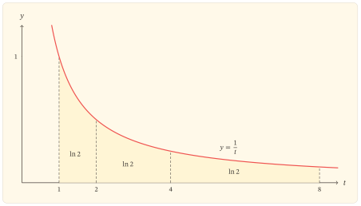
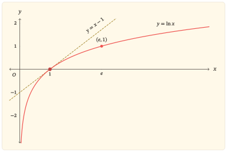

## Khi một độ dời không còn đủ

Trên trục số thông thường, độ chênh lệch giữa $x$ và $x+1$ luôn bằng $1$. Cách đo ấy phù hợp khi điều cần theo dõi là một lượng tăng tuyệt đối. Nhưng nhiều biến đổi không giữ nguyên lượng tăng; chúng giữ nguyên *tỉ lệ*.

Từ $1$ đến $2$, từ $10$ đến $20$ và từ $100$ đến $200$, độ chênh lệch lần lượt là $1$, $10$ và $100$. Ba biến đổi có quy mô tuyệt đối khác nhau, nhưng cùng thực hiện một việc: đầu vào được nhân với $2$.

Hàm lô-ga-rit tự nhiên tạo ra một thước đo thích hợp với kiểu thay đổi ấy. Với mọi $x>0$,

$$
\ln(2x)-\ln x=\ln 2.
$$

Lượng thay đổi ở đầu ra không phụ thuộc vào điểm xuất phát $x$. Nhân đầu vào với $2$ luôn tạo ra cùng một độ dời $\ln2$ trên trục giá trị. Tổng quát hơn, với mỗi $q>0$,

$$
\ln(qx)-\ln x=\ln q.
$$

Đẳng thức này không chỉ là một quy tắc tính toán. Nó cho biết hàm $\ln$ đọc khoảng cách theo tỉ lệ: phép nhân ở đầu vào được chuyển thành phép cộng ở đầu ra.

Phần còn lại của bài sẽ làm rõ cấu trúc nào tạo nên quy luật ấy và vì sao chính cấu trúc đó khiến đồ thị $y=\ln x$ tăng trên toàn miền, ngày càng dốc khi tiến gần $x=0$ nhưng ngày càng thoải khi $x$ lớn.

## Dựng thước đo từ đường cong $y=\frac{1}{t}$

Với $x>0$, đặt

$$
f(x)=\int_1^x\frac{1}{t}\,dt.
$$

Đây là một tích phân có hướng. Khi $x>1$, nó là diện tích có dấu dương dưới đường $y=\frac{1}{t}$ từ $1$ đến $x$. Khi $0<x<1$, cận trên nằm bên trái cận dưới, nên

$$
\int_1^x\frac{1}{t}\,dt
=-\int_x^1\frac{1}{t}\,dt<0.
$$

:::: {.zo-block .zo-block-red}
::: {.zo-block-title}
Định nghĩa lô-ga-rit tự nhiên
:::

::: {.zo-block-body}
Với mỗi $x>0$, *lô-ga-rit tự nhiên của $x$* được định nghĩa bởi

$$
\ln x=\int_1^x\frac{1}{t}\,dt.
$$

Hàm số $f(x)=\ln x$ vì thế có tập xác định

$$
D=(0,+\infty).
$$
:::
::::

Từ định nghĩa,

$$
\ln1=\int_1^1\frac{1}{t}\,dt=0.
$$

Số $1$ là mốc chuẩn của thước đo này. Những số lớn hơn $1$ có lô-ga-rit dương; những số nằm giữa $0$ và $1$ có lô-ga-rit âm. Tuy nhiên, dấu chỉ là biểu hiện đầu tiên. Cơ chế chính xuất hiện khi miền tích phân được co giãn.

### Một phép co giãn không làm đổi diện tích

Cho $a>0$ và $b>0$. Hiệu giữa hai giá trị $\ln(ab)$ và $\ln a$ là

$$
\ln(ab)-\ln a
=\int_a^{ab}\frac{1}{t}\,dt.
$$

Trong tích phân này, đặt $t=au$. Khi $t$ chạy từ $a$ đến $ab$, biến $u$ chạy từ $1$ đến $b$, còn $dt=a\,du$. Do đó,

$$
\begin{aligned}
\int_a^{ab}\frac{1}{t}\,dt
&=\int_1^b\frac{1}{au}\,a\,du\\
&=\int_1^b\frac{1}{u}\,du\\
&=\ln b.
\end{aligned}
$$

Vì vậy,

$$
\ln(ab)-\ln a=\ln b,
$$

hay

$$
\ln(ab)=\ln a+\ln b
\quad\text{với }a,b>0.
$$

Đây là chứng cứ quyết định cho quy luật biến phép nhân thành phép cộng. Khi trục $t$ được kéo giãn theo hệ số $a$, độ dài vi phân được nhân với $a$, còn độ cao $\frac{1}{t}$ bị chia cho $a$. Hai thay đổi bù trừ nhau, nên diện tích có dấu được giữ nguyên.

Ba khoảng $[1,2]$, $[2,4]$ và $[4,8]$ đều có cùng tỉ lệ giữa đầu mút phải và đầu mút trái. Quy luật vừa chứng minh cho

$$
\int_1^2\frac{1}{t}\,dt
=\int_2^4\frac{1}{t}\,dt
=\int_4^8\frac{1}{t}\,dt
=\ln2.
$$

:::: {.content-visible when-format="html"}

::: {#fig-lnx-dien-tich}
{fig-alt="Đồ thị y bằng 1 trên t với ba miền dưới đường cong trên các khoảng từ 1 đến 2, từ 2 đến 4 và từ 4 đến 8; mỗi miền có diện tích bằng ln 2." width="100%" fig-align="center"}

Ba khoảng có bề rộng khác nhau nhưng cùng tạo ra diện tích $\ln2$, vì mỗi khoảng nhận được từ khoảng trước bằng phép nhân cả hai đầu mút với $2$.
:::

::::

:::: {.content-visible when-format="pdf"}

::: {#fig-lnx-dien-tich}
{fig-alt="Đồ thị y bằng 1 trên t với ba miền dưới đường cong trên các khoảng từ 1 đến 2, từ 2 đến 4 và từ 4 đến 8; mỗi miền có diện tích bằng ln 2." width="85%" fig-align="center"}

Ba khoảng có bề rộng khác nhau nhưng cùng tạo ra diện tích $\ln2$, vì mỗi khoảng nhận được từ khoảng trước bằng phép nhân cả hai đầu mút với $2$.
:::

::::

Hình chỉ biểu diễn ba trường hợp cụ thể. Sự bằng nhau đối với mọi $a,b>0$ đã được xác lập bởi phép đổi biến, không phải bởi phần diện tích được tô.

### Những quy luật cùng phát sinh

Thay $b$ bằng $\frac{1}{a}$ trong quy luật tích, ta có

$$
\ln1=\ln a+\ln\left(\frac{1}{a}\right).
$$

Vì $\ln1=0$,

$$
\ln\left(\frac{1}{a}\right)=-\ln a
\quad\text{với }a>0.
$$

Từ quy luật tích và quy luật nghịch đảo, với $a,b>0$,

$$
\ln\left(\frac{a}{b}\right)=\ln a-\ln b.
$$

Nếu $n$ là số nguyên dương, lặp lại quy luật tích cho

$$
\ln(a^n)=n\ln a.
$$

Khi $n$ là số nguyên âm, quy luật vẫn đúng nhờ công thức nghịch đảo; trường hợp $n=0$ đúng vì $a^0=1$. Như vậy, với mọi số nguyên $n$,

$$
\ln(a^n)=n\ln a
\quad\text{với }a>0.
$$

Các công thức này cùng biểu hiện một cơ chế. Tích, thương và lũy thừa ở miền dương lần lượt trở thành tổng, hiệu và phép nhân với một số nguyên trên trục lô-ga-rit.

## Tăng trên toàn miền nhưng ngày càng chậm

Định nghĩa tích phân không chỉ tạo ra quy luật đại số. Nó còn cho đạo hàm của hàm đang xét. Theo định lí cơ bản của giải tích,

$$
f^\prime(x)=\frac{1}{x}
\quad\text{với }x>0.
$$

Vì $\frac{1}{x}>0$ trên toàn tập xác định, hàm $f$ đồng biến nghiêm ngặt trên $(0,+\infty)$. Do đó:

- $f(x)<0$ khi $0<x<1$;
- $f(1)=0$;
- $f(x)>0$ khi $x>1$.

Hàm có đúng một nghiệm là $x=1$. Đồ thị cắt trục hoành tại $(1,0)$ và không cắt trục tung, vì $0$ không thuộc tập xác định.

Đạo hàm cấp hai là

$$
f^{\prime\prime}(x)=-\frac{1}{x^2}<0
\quad\text{với }x>0.
$$

Vì thế, đồ thị lõm xuống trên toàn miền. Độ dốc $f^\prime(x)=\frac{1}{x}$ vẫn dương nhưng giảm dần: gần $0$, độ dốc rất lớn; khi $x$ tăng, độ dốc tiến gần $0$. Hàm tiếp tục tăng mà không đổi chiều, nhưng mỗi đơn vị tăng thêm ở đầu vào tạo ra một lượng tăng ngày càng nhỏ ở đầu ra.

Đây là cách đạo hàm biểu hiện cùng một cơ chế với quy luật tích. Trên một mức xuất phát nhỏ, một thay đổi tuyệt đối cố định có thể là một tỉ lệ lớn; trên một mức xuất phát lớn, thay đổi ấy chỉ là một tỉ lệ nhỏ. Hàm $\ln$ phản ứng mạnh với trường hợp đầu và yếu hơn với trường hợp sau.

### Tiếp tuyến tại mốc chuẩn

Tại $x=1$,

$$
f(1)=0,
\quad
f^\prime(1)=1.
$$

Tiếp tuyến của đồ thị tại $(1,0)$ có phương trình

$$
y=x-1.
$$

Do đồ thị lõm xuống, tiếp tuyến này nằm phía trên đồ thị. Có thể xác lập quan hệ ấy trực tiếp mà không dựa vào hình. Xét

$$
h(x)=x-1-\ln x
\quad\text{với }x>0.
$$

Ta có

$$
h^\prime(x)
=1-\frac{1}{x}
=\frac{x-1}{x}.
$$

Hàm $h$ nghịch biến trên $(0,1)$, đồng biến trên $(1,+\infty)$ và đạt giá trị nhỏ nhất tại $x=1$. Vì $h(1)=0$, ta được

$$
\ln x\leq x-1
\quad\text{với mọi }x>0,
$$

trong đó dấu bằng chỉ xảy ra khi $x=1$.

Bất đẳng thức này nối một kết luận giải tích với một quan hệ hình học: toàn bộ đồ thị $y=\ln x$ nằm không cao hơn tiếp tuyến $y=x-1$ tại mốc chuẩn.

## Hai biên của miền và toàn bộ tập giá trị

Tính đồng biến cho biết hướng chuyển động của hàm, nhưng chưa cho biết hàm đi xa đến đâu. Hai biên $0$ và $+\infty$ của tập xác định phải được xét từ bên trong miền.

### Khi $x$ tăng không bị chặn

Vì $\ln2>0$, quy luật lũy thừa cho

$$
\ln(2^n)=n\ln2.
$$

Khi $n$ tăng không bị chặn, vế phải tăng không bị chặn. Cụ thể, với một số thực $M$ bất kì, có thể chọn số nguyên dương $n$ đủ lớn để $n\ln2>M$. Khi $x\geq2^n$, tính đồng biến cho

$$
\ln x\geq\ln(2^n)=n\ln2>M.
$$

Do đó,

$$
\lim_{x\to+\infty}\ln x=+\infty.
$$

Hàm tăng ngày càng chậm nhưng không tiến tới một giới hạn hữu hạn. Việc độ dốc tiến về $0$ không đồng nghĩa với việc giá trị của hàm bị chặn.

### Khi $x$ tiến về $0$ từ bên phải

Với $x>0$,

$$
\ln x=-\ln\left(\frac{1}{x}\right).
$$

Khi $x\to0^+$, ta có $\frac{1}{x}\to+\infty$. Kết quả ở biên phải vì thế cho

$$
\lim_{x\to0^+}\ln x=-\infty.
$$

Đường thẳng $x=0$ là tiệm cận đứng của đồ thị. Đây đồng thời là trục tung, nhưng không có điểm nào của đồ thị nằm trên đường này.

Hàm $\ln$ liên tục và đồng biến nghiêm ngặt trên $(0,+\infty)$; giá trị của nó đi từ $-\infty$ đến $+\infty$ khi đầu vào đi từ biên trái đến biên phải. Bởi vậy, tập giá trị của hàm là

$$
\mathbb{R}.
$$

Với mỗi $y\in\mathbb{R}$, tồn tại đúng một số $x>0$ sao cho $\ln x=y$. Tính tồn tại đến từ tính liên tục và hai giới hạn biên; tính duy nhất đến từ tính đồng biến nghiêm ngặt.

### Bảng biến thiên như một điểm kết tinh

Các kết quả trên có thể được nén trong bảng biến thiên:

$$
\begin{array}{c|ccc}
x&0^+&&+\infty\\
\hline
f^\prime(x)&&+&\\
\hline
\ln x&-\infty&\nearrow&+\infty
\end{array}
$$

Bảng không phải chứng cứ cho dấu đạo hàm hay hai giới hạn. Nó tổng hợp các kết quả đã được chứng minh và làm hiện một quan hệ toàn cục: hàm $\ln$ là một song ánh từ $(0,+\infty)$ lên $\mathbb{R}$.

## Số $e$ và hàm ngược

Vì hàm $\ln$ nhận mỗi giá trị thực đúng một lần, có đúng một số dương mà lô-ga-rit tự nhiên bằng $1$. Số ấy được kí hiệu là $e$:

$$
\ln e=1.
$$

Làm tròn đến năm chữ số thập phân, ta có

$$
e\approx2{,}71828.
$$

Phép gán

$$
y=\ln x
$$

có thể được đảo theo đúng một cách trên toàn miền. Hàm ngược được gọi là *hàm mũ tự nhiên* và được viết là

$$
x=e^y.
$$

Do đó, với $x>0$ và $y\in\mathbb{R}$,

$$
e^{\ln x}=x
\quad\text{và}\quad
\ln(e^y)=y.
$$

Đồ thị $y=\ln x$ và $y=e^x$ đối xứng qua đường thẳng $y=x$. Trong bài này, quan hệ hàm ngược được xác lập từ tính song ánh; không cần thêm một hình riêng để làm chứng cứ.

Vì sao cơ số $e$ là tự nhiên?

Với một cơ số $a>0$, $a\ne1$, đặt lô-ga-rit cơ số $a$ bởi công thức đổi cơ số

$$
\log_a x=\frac{\ln x}{\ln a}.
$$

Đạo hàm của nó là

$$
\left(\log_a x\right)^\prime
=\frac{1}{x\ln a}.
$$

Riêng khi $a=e$, ta có $\ln e=1$, nên công thức trở thành

$$
(\ln x)^\prime=\frac{1}{x}.
$$

Không còn một hệ số cố định nào đứng trước $\frac{1}{x}$. Sự chuẩn hóa này làm cho $e$ trở thành cơ số phù hợp trực tiếp với đạo hàm và tích phân.

## Đồ thị kết tinh những kết quả nào?

Những mệnh đề đã xác lập đặt ra các ràng buộc quyết định hình dạng đồ thị:

- đồ thị chỉ nằm bên phải trục tung;
- đồ thị cắt trục hoành đúng một lần tại $(1,0)$;
- đồ thị đi qua $(e,1)$;
- khi $x\to0^+$, đồ thị hạ xuống không bị chặn và tiến sát tiệm cận đứng $x=0$;
- khi $x\to+\infty$, đồ thị tăng không bị chặn;
- độ dốc luôn dương nhưng giảm dần, nên đồ thị lõm xuống trên toàn miền;
- toàn bộ đồ thị nằm không cao hơn đường thẳng $y=x-1$.

:::: {.content-visible when-format="html"}

::: {#fig-lnx-toan-canh}
{fig-alt="Đồ thị hàm y bằng ln x trên miền x dương, đi qua các điểm một không và e một, tiến xuống âm vô cực gần trục tung, tăng và lõm xuống; đường tiếp tuyến y bằng x trừ 1 nằm phía trên đồ thị." width="100%" fig-align="center"}

Đồ thị $y=\ln x$ tăng trên toàn miền nhưng ngày càng thoải; tiếp tuyến $y=x-1$ tại $(1,0)$ nằm phía trên đường cong.
:::

::::

:::: {.content-visible when-format="pdf"}

::: {#fig-lnx-toan-canh}
{fig-alt="Đồ thị hàm y bằng ln x trên miền x dương, đi qua các điểm một không và e một, tiến xuống âm vô cực gần trục tung, tăng và lõm xuống; đường tiếp tuyến y bằng x trừ 1 nằm phía trên đồ thị." width="85%" fig-align="center"}

Đồ thị $y=\ln x$ tăng trên toàn miền nhưng ngày càng thoải; tiếp tuyến $y=x-1$ tại $(1,0)$ nằm phía trên đường cong.
:::

::::

Hình vẽ làm các quan hệ cùng hiện ra trong một cửa sổ, nhưng không thay thế chứng cứ. Một cửa sổ hữu hạn không thể cho thấy giá trị thực sự tiến đến $-\infty$ hoặc $+\infty$; hai giới hạn ấy đã được chứng minh bằng quy luật lô-ga-rit và tính đồng biến. Tương tự, việc đường cong có vẻ nằm dưới tiếp tuyến chỉ minh họa bất đẳng thức $\ln x\leq x-1$.

Khi tiến gần trục tung từ bên phải, đường cong ngày càng dốc vì $f^\prime(x)=\frac{1}{x}$ tăng không bị chặn khi $x\to0^+$. Ở phía bên phải, đường cong ngày càng thoải vì $f^\prime(x)\to0$. Tuy vậy, $\ln x$ vẫn tăng không bị chặn. Hình dạng này cần được đọc đồng thời từ đạo hàm và giới hạn; chỉ một trong hai chưa đủ.

## Thước đo nhân

Giờ có thể trở lại quan hệ mở đầu. Với $x>0$ và $q>0$,

$$
\ln(qx)-\ln x=\ln q.
$$

Nếu đầu vào lần lượt là

$$
x,\ qx,\ q^2x,\ q^3x,\ldots,
$$

thì đầu ra lần lượt là

$$
\ln x,\ \ln x+\ln q,\ \ln x+2\ln q,\ \ln x+3\ln q,\ldots.
$$

Một cấp số nhân trên trục đầu vào trở thành một cấp số cộng trên trục đầu ra. Khoảng cách theo tỉ lệ được chuyển thành khoảng cách theo phép cộng.

Điều này cũng giải thích vì sao đồ thị vừa tăng mạnh gần $0$ vừa tăng chậm khi $x$ lớn. Cùng một độ dời ngang, chẳng hạn tăng thêm $1$, không giữ nguyên tỉ lệ:

- từ $1$ đến $2$, đầu vào được nhân với $2$;
- từ $100$ đến $101$, đầu vào chỉ được nhân với $\frac{101}{100}$.

Hàm $\ln$ ghi nhận hai tỉ lệ rất khác nhau, nên hai lượng tăng ở đầu ra cũng khác nhau. Trái lại, nếu luôn nhân đầu vào với cùng một $q$, lượng tăng ở đầu ra luôn bằng $\ln q$.

## Kết tinh

Hàm $\ln$ được dựng bằng diện tích có dấu dưới đường $y=\frac{1}{t}$, tính từ mốc $1$. Mật độ $\frac{1}{t}$ có một tính chất đặc biệt dưới phép co giãn: khi độ dài được nhân lên, độ cao giảm theo đúng tỉ lệ nghịch. Vì thế, diện tích tương ứng được giữ nguyên và quy luật

$$
\ln(ab)=\ln a+\ln b
$$

xuất hiện.

Từ cơ chế này, các phần của cuộc khảo sát nối với nhau. Quy luật nghịch đảo liên hệ hai biên của miền. Đạo hàm $\frac{1}{x}$ làm hàm tăng trên toàn miền, còn đạo hàm cấp hai $-\frac{1}{x^2}$ làm độ dốc giảm dần. Các giá trị đi từ $-\infty$ đến $+\infty$, nên hàm $\ln$ ghép mỗi số dương với đúng một số thực và có hàm mũ tự nhiên làm hàm ngược.

Chuỗi nén của bài là:

> diện tích theo tỉ lệ $\rightarrow$ quy luật tích $\rightarrow$ biến thiên và độ cong $\rightarrow$ đồ thị $\rightarrow$ thước đo nhân.

Khi một hàm khác được dùng để đo thay đổi theo tỉ lệ, câu hỏi cần giữ lại không phải chỉ là công thức của nó giống $\ln x$ đến đâu. Cần kiểm tra miền, quy luật biến đổi và chứng cứ xem cùng một tỉ lệ ở đầu vào có thật sự tạo ra cùng một độ dời ở đầu ra hay không.

## Bài tập

Hệ thống bài tập được sắp xếp theo ba chặng. Chặng đầu tái dựng cơ chế của hàm $\ln$. Chặng thứ hai dùng cơ chế ấy để khép kín các quan hệ giải tích và hình học. Chặng cuối chuyển cách nhìn sang những cấu trúc gần gũi.

### Tái dựng cơ chế

#### Bài 1. Định nghĩa, miền và dấu

Với $x>0$, đặt

$$
f(x)=\int_1^x\frac{1}{t}\,dt.
$$

a. Giải thích vì sao tập xác định của $f$ là $(0,+\infty)$.

b. Tính $f(1)$.

c. Chứng minh $f(x)<0$ khi $0<x<1$ và $f(x)>0$ khi $x>1$.

d. Từ định nghĩa, giải thích ý nghĩa của $f(x)$ như một diện tích có dấu.

#### Bài 2. Quy luật tích

Cho $a,b>0$.

a. Viết $\ln(ab)-\ln a$ dưới dạng một tích phân.

b. Thực hiện phép đổi biến $t=au$ để chứng minh

$$
\ln(ab)=\ln a+\ln b.
$$

c. Giải thích bằng lời vì sao thừa số $a$ xuất hiện trong $dt$ triệt tiêu thừa số $a$ xuất hiện trong mẫu số.

d. Chỉ ra phần nào của lập luận là chứng cứ tổng quát và phần nào chỉ được hình vẽ diện tích minh họa.

#### Bài 3. Thương, nghịch đảo và lũy thừa

Với $a,b>0$ và $n$ là số nguyên, hãy chứng minh lần lượt:

$$
\ln\left(\frac{1}{a}\right)=-\ln a,
$$

$$
\ln\left(\frac{a}{b}\right)=\ln a-\ln b,
$$

và

$$
\ln(a^n)=n\ln a.
$$

Cần xử lí riêng ý nghĩa của số mũ âm trong công thức cuối.

#### Bài 4. Những bước nhân đều

Cho $x>0$ và $q>0$.

a. Chứng minh

$$
\ln(qx)-\ln x=\ln q.
$$

b. Tính $\ln(q^kx)$ theo $\ln x$, $\ln q$ và số nguyên không âm $k$.

c. Với $x=3$ và $q=2$, viết năm đầu vào đầu tiên cùng năm đầu ra tương ứng.

d. Giải thích vì sao các đầu vào tạo thành một cấp số nhân còn các đầu ra tạo thành một cấp số cộng.

### Khép kín hình dạng toàn cục

#### Bài 5. Biến thiên và độ cong

a. Dùng định lí cơ bản của giải tích để tính $f^\prime(x)$.

b. Chứng minh $f$ đồng biến nghiêm ngặt trên $(0,+\infty)$.

c. Tính $f^{\prime\prime}(x)$ và xác định độ cong của đồ thị.

d. Chứng minh hàm không có cực trị và đồ thị không có điểm uốn trên tập xác định.

e. Giải thích vì sao $f^\prime(x)\to0$ khi $x\to+\infty$ không đủ để kết luận $f(x)$ có giới hạn hữu hạn.

#### Bài 6. Hai biên của miền

a. Chứng minh $\ln2>0$.

b. Dùng $\ln(2^n)=n\ln2$ và tính đồng biến để chứng minh

$$
\lim_{x\to+\infty}\ln x=+\infty.
$$

c. Dùng $\ln x=-\ln\left(\frac{1}{x}\right)$ để chứng minh

$$
\lim_{x\to0^+}\ln x=-\infty.
$$

d. Từ đó, xác định tập giá trị và tiệm cận của đồ thị.

#### Bài 7. Tiếp tuyến và một bất đẳng thức cơ bản

Xét

$$
h(x)=x-1-\ln x
\quad\text{với }x>0.
$$

a. Khảo sát biến thiên của $h$.

b. Chứng minh

$$
\ln x\leq x-1
$$

với mọi $x>0$, đồng thời xác định trường hợp xảy ra dấu bằng.

c. Giải thích ý nghĩa hình học của bất đẳng thức bằng tiếp tuyến của đồ thị $y=\ln x$ tại $(1,0)$.

d. Thay $x$ bằng $\frac{1}{x}$ trong bất đẳng thức thích hợp để chứng minh

$$
1-\frac{1}{x}\leq\ln x
$$

với mọi $x>0$.

#### Bài 8. Phương trình và bất phương trình

a. Giải phương trình

$$
\ln x=0.
$$

b. Biết $\ln e=1$, giải các phương trình

$$
\ln x=3,
\quad
\ln(x^2)=4
$$

trên những miền mà biểu thức có nghĩa. Với phương trình thứ hai, phải xác định miền trước khi biến đổi; không được thay $\ln(x^2)$ bằng $2\ln x$ khi chưa biết $x>0$.

c. Giải bất phương trình

$$
\ln(2x-1)\leq0.
$$

d. Trong mỗi câu, chỉ ra chỗ tính đồng biến nghiêm ngặt của hàm $\ln$ được sử dụng.

#### Bài 9. Dựng lại đồ thị

Không nhìn lại hình trong bài, hãy:

a. lập một bản tóm tắt gồm tập xác định, tập giá trị, nghiệm, dấu, giới hạn tại hai biên, chiều biến thiên, độ cong và tiệm cận;

b. viết phương trình tiếp tuyến tại $(1,0)$;

c. phác họa đồ thị cùng tiếp tuyến;

d. phân biệt những kết luận đã được chứng minh với những gì hình phác họa chỉ minh họa.

### Mở rộng cách nhìn

#### Bài 10. Lô-ga-rit tăng chậm hơn mọi lũy thừa dương

Cho $\alpha>0$ và đặt

$$
\beta=\frac{\alpha}{2}.
$$

Trên $[1,+\infty)$, xét

$$
\varphi(x)=\frac{x^\beta}{\beta}-\ln x.
$$

a. Chứng minh

$$
\varphi^\prime(x)
=\frac{x^\beta-1}{x}
\geq0.
$$

b. Từ tính đồng biến của $\varphi$ và giá trị $\varphi(1)=\frac{1}{\beta}$, chứng minh

$$
\ln x
\leq
\frac{x^\beta-1}{\beta}
\leq
\frac{x^\beta}{\beta}
\quad\text{với }x\geq1.
$$

c. Dùng định lí kẹp để chứng minh

$$
\lim_{x\to+\infty}\frac{\ln x}{x^\alpha}=0.
$$

d. Lấy $\alpha=1$ và giải thích vì sao kết quả thu được không mâu thuẫn với

$$
\lim_{x\to+\infty}\ln x=+\infty.
$$

#### Bài 11. Hàm mũ tự nhiên

Gọi $g$ là hàm ngược của $f(x)=\ln x$ và viết $g(y)=e^y$.

a. Chứng minh

$$
e^{u+v}=e^u e^v
$$

với mọi $u,v\in\mathbb{R}$.

b. Dùng công thức đạo hàm của hàm ngược để chứng minh

$$
(e^y)^\prime=e^y.
$$

c. Giải thích vì sao tính chất đạo hàm này gắn trực tiếp với lựa chọn mốc $\ln e=1$.

#### Bài 12. Đổi cơ số

Cho $a>0$, $a\ne1$, và đặt

$$
L_a(x)=\frac{\ln x}{\ln a}
\quad\text{với }x>0.
$$

a. Chứng minh $L_a(a)=1$ và

$$
L_a(xy)=L_a(x)+L_a(y).
$$

b. Tính $L_a^\prime(x)$.

c. Chứng minh $L_a$ đồng biến khi $a>1$ và nghịch biến khi $0<a<1$.

d. Giải thích phần nào của cơ chế “tỉ lệ nhân thành độ dời cộng” được giữ nguyên khi đổi cơ số, và phần nào thay đổi.
