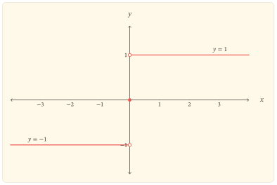

Một số thực âm, số $0$ và một số thực dương khác nhau trước hết ở *dấu*. Hàm dấu ghi lại đúng sự phân loại đó: nó bỏ qua độ lớn của số khác $0$, nhưng không nhập $0$ vào một trong hai phía.

## Ba trường hợp trong một định nghĩa

Hàm dấu, còn gọi là hàm signum, được xác định trên toàn bộ tập số thực bởi

$$
\operatorname{sgn}x=
\begin{cases}
-1,&x<0,\\
0,&x=0,\\
1,&x>0.
\end{cases}
$$

Vì mỗi số thực thuộc đúng một trong ba trường hợp trên, tập xác định là $\mathbb R$. Cả ba giá trị $-1,0,1$ đều đạt được, nên tập giá trị là

$$
\{-1,0,1\}.
$$

Định nghĩa cho ngay quy tắc về dấu:

$$
\begin{aligned}
\operatorname{sgn}x<0&\Leftrightarrow x<0,\\
\operatorname{sgn}x=0&\Leftrightarrow x=0,\\
\operatorname{sgn}x>0&\Leftrightarrow x>0.
\end{aligned}
$$

Do đó $x=0$ là nghiệm duy nhất và đồ thị cắt cả hai trục tọa độ tại $O(0,0)$.

## Hai nửa trục phẳng, một điểm chuyển mức

Trên khoảng $(-\infty,0)$, hàm luôn bằng $-1$; trên khoảng $(0,+\infty)$, hàm luôn bằng $1$. Vì thế hàm hằng, và do đó vừa không giảm vừa không tăng, trên từng khoảng này.

Trên toàn bộ $\mathbb R$, nếu $x_1<x_2$ thì việc xét vị trí của hai số đối với $0$ luôn cho

$$
\operatorname{sgn}x_1\leq \operatorname{sgn}x_2.
$$

Vậy hàm dấu không giảm trên $\mathbb R$, nhưng không đồng biến nghiêm ngặt trên bất kì khoảng nào có nhiều hơn một điểm: trong mỗi nửa trục luôn có hai đầu vào khác nhau cho cùng một đầu ra.

Hàm cũng bị chặn bởi

$$
-1\leq \operatorname{sgn}x\leq 1.
$$

Giá trị nhỏ nhất là $-1$, đạt tại mọi $x<0$; giá trị lớn nhất là $1$, đạt tại mọi $x>0$.

## Đối xứng qua gốc tọa độ

Với mọi $x\in\mathbb R$, đổi $x$ thành $-x$ đổi phía của số đối với $0$, còn $0$ vẫn là $0$. Bởi vậy

$$
\operatorname{sgn}(-x)=-\operatorname{sgn}x.
$$

Hàm dấu là hàm lẻ, nên đồ thị nhận gốc tọa độ làm tâm đối xứng. Một hệ thức thường dùng khác là

$$
x=\lvert x\rvert\operatorname{sgn}x
$$

với mọi $x\in\mathbb R$. Khi $x\ne0$, hệ thức tương đương với

$$
\operatorname{sgn}x=\frac{x}{\lvert x\rvert}.
$$

Điều kiện $x\ne0$ ở công thức thương là thiết yếu vì mẫu số bằng $0$ tại gốc.

## Bước nhảy tại $0$

Tại mọi điểm $a<0$, hàm bằng $-1$ trong một lân cận đủ nhỏ của $a$; tương tự, tại mọi điểm $a>0$, hàm bằng $1$ trong một lân cận đủ nhỏ. Do đó hàm liên tục trên $(-\infty,0)$ và $(0,+\infty)$.

Ở gốc, hai giới hạn một phía tồn tại nhưng khác nhau:

$$
\lim_{x\to0^-}\operatorname{sgn}x=-1,\qquad
\lim_{x\to0^+}\operatorname{sgn}x=1.
$$

Vì vậy $\lim_{x\to0}\operatorname{sgn}x$ không tồn tại. Đặc biệt, nó không thể bằng $\operatorname{sgn}0=0$; hàm gián đoạn bước nhảy tại $0$. Giá trị riêng ở gốc quyết định điểm đặc của đồ thị, nhưng không thể nối hai mức giới hạn một phía thành một giới hạn chung.

## Đọc đồ thị từ định nghĩa

Mỗi trường hợp của định nghĩa tạo một mảnh đồ thị. Nửa trục âm cho tia ngang $y=-1$ với đầu mút $(0,-1)$ bị loại; nửa trục dương cho tia ngang $y=1$ với đầu mút $(0,1)$ bị loại; trường hợp $x=0$ cho riêng điểm $O(0,0)$.

::::: {.content-visible when-format="html"}

:::: {#fig-ham-sgn-x}
{fig-alt="Đồ thị hàm dấu gồm tia ngang y bằng âm 1 khi x âm, tia ngang y bằng 1 khi x dương, hai điểm rỗng tại x bằng 0 trên hai tia và điểm đặc tại gốc tọa độ." width="100%" fig-align="center"}

Đồ thị $y=\operatorname{sgn}x$: hai điểm rỗng ghi nhận các bất đẳng thức nghiêm $x<0$, $x>0$, còn điểm đặc biểu diễn giá trị tại $x=0$.
::::

:::::

::::: {.content-visible when-format="pdf"}

:::: {#fig-ham-sgn-x}
{fig-alt="Đồ thị hàm dấu gồm tia ngang y bằng âm 1 khi x âm, tia ngang y bằng 1 khi x dương, hai điểm rỗng tại x bằng 0 trên hai tia và điểm đặc tại gốc tọa độ." width="70%" fig-align="center"}

Đồ thị $y=\operatorname{sgn}x$: hai điểm rỗng ghi nhận các bất đẳng thức nghiêm $x<0$, $x>0$, còn điểm đặc biểu diễn giá trị tại $x=0$.
::::

:::::

Đọc ngược từ hình, các đoạn nằm ngang xác nhận tính hằng trên từng nửa trục. Thứ tự $-1<0<1$ của ba mức cho thấy hàm không giảm khi đi từ trái sang phải. Hai vòng tròn rỗng ở cùng hoành độ $0$, nhưng khác tung độ, làm hiện rõ hai giới hạn một phía không bằng nhau; điểm đặc ở giữa xác nhận giá trị thật của hàm tại gốc.

## Một cách nhìn qua phân loại

Hàm dấu không đo một số lớn đến đâu. Với mọi $x\ne0$, đầu ra chỉ cho biết $x$ nằm ở phía âm hay phía dương; riêng đầu ra $0$ nhận diện đúng đầu vào $0$. Vì thế, từ $\operatorname{sgn}x$ không thể khôi phục $x$ khi đầu ra là $-1$ hoặc $1$, nhưng có thể khôi phục dấu của $x$.

Cách nhìn này giải thích đồng thời hình dạng bậc thang và sự gián đoạn: cả một nửa trục bị thu về một mức, rồi đầu ra đổi tức thời khi đầu vào đi qua gốc. Nó cũng nhắc rằng một hàm không giảm không nhất thiết liên tục và không nhất thiết đồng biến nghiêm ngặt.

## Bài tập

### Định nghĩa, đối xứng và điểm nhảy

#### Bài 1. Tính giá trị và giải phương trình

Tính $\operatorname{sgn}(-7)$, $\operatorname{sgn}(0)$, $\operatorname{sgn}(3-\pi)$. Sau đó giải trên $\mathbb R$ các phương trình

$$
\operatorname{sgn}x=1,\qquad \operatorname{sgn}x=0.
$$

#### Bài 2. Kiểm tra tính lẻ

Dùng định nghĩa từng trường hợp để chứng minh $\operatorname{sgn}(-x)=-\operatorname{sgn}x$ với mọi $x\in\mathbb R$.

#### Bài 3. Phân loại điểm liên tục

Xác định tất cả các điểm liên tục của hàm $f(x)=\operatorname{sgn}x$. Tại điểm gián đoạn, tính hai giới hạn một phía và gọi đúng loại gián đoạn.

### Biến thể và quan hệ

#### Bài 4. Tịnh tiến điểm nhảy

Với $a\in\mathbb R$, khảo sát nhanh hàm $g(x)=\operatorname{sgn}(x-a)$: xác định tập giá trị, nghiệm, các khoảng hằng, điểm gián đoạn và mô tả cách nhận đồ thị từ đồ thị hàm dấu.

#### Bài 5. Tách dấu khỏi độ lớn

Chứng minh rằng $x=\lvert x\rvert\operatorname{sgn}x$ với mọi $x\in\mathbb R$. Với $x\ne0$, giải thích chính xác thông tin nào về $x$ được cho bởi $\lvert x\rvert$ và thông tin nào được cho bởi $\operatorname{sgn}x$.

#### Bài 6. Một hàm không giảm có bước nhảy

Chứng minh trực tiếp từ định nghĩa rằng hàm dấu không giảm trên $\mathbb R$. Dùng kết quả về giới hạn tại $0$ để chỉ ra rằng tính không giảm không kéo theo tính liên tục.
