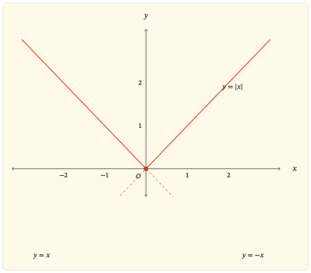

Một số thực có thể nằm bên trái hoặc bên phải $0$, nhưng giá trị tuyệt đối không giữ lại thông tin ấy. Nó chỉ giữ lại *khoảng cách đến $0$*. Vì vậy, $-3$ và $3$ khác dấu nhưng đều cách $0$ ba đơn vị:

$$
\lvert-3\rvert=\lvert3\rvert=3.
$$

Sự mất dấu và bảo toàn khoảng cách là hiện tượng trung tâm của hàm số $y=\lvert x\rvert$. Từ đó có thể đọc gần như toàn bộ bài: tính chẵn, tập giá trị, chiều biến thiên, điểm cực tiểu, hình chữ V của đồ thị và cả việc hàm liên tục nhưng không có đạo hàm tại gốc.

## Từ dấu của $x$ đến một công thức từng phần

Giá trị tuyệt đối của một số thực $x$ được xác định bởi

$$
\lvert x\rvert=
\begin{cases}
-x,&x<0,\\
x,&x\geq0.
\end{cases}
$$

Nếu $x<0$ thì $-x>0$, nên nhánh $-x$ đổi một giá trị âm thành khoảng cách dương của nó đến $0$. Nếu $x\geq0$ thì khoảng cách ấy chính là $x$. Cả hai trường hợp vì thế cùng cho một đại lượng không âm.

Mọi số thực đều có giá trị tuyệt đối, nên tập xác định là

$$
D=\mathbb{R}.
$$

Với mọi $x\in\mathbb{R}$,

$$
\lvert x\rvert\geq0,
$$

và dấu bằng xảy ra đúng khi $x=0$. Ngược lại, với mỗi $y\geq0$, chọn $x=y$ thì $\lvert x\rvert=y$. Do đó tập giá trị là

$$
[0,+\infty).
$$

Kết quả này có hai vế cần phân biệt: hàm không nhận giá trị âm, và mọi giá trị không âm đều thực sự được nhận.

## Hai đầu vào đối nhau cho cùng một khoảng cách

Với mọi $x\in\mathbb{R}$,

$$
\lvert-x\rvert=\lvert x\rvert.
$$

Vì thế hàm số $f(x)=\lvert x\rvert$ là hàm chẵn; đồ thị nhận trục tung làm trục đối xứng.

Đối xứng này không chỉ là một đặc điểm hình học. Nó diễn tả trực tiếp việc giá trị tuyệt đối xóa dấu của đầu vào: nếu $x\ne0$ thì hai số khác nhau $x$ và $-x$ có cùng ảnh. Do đó hàm không đơn ánh trên toàn bộ $\mathbb{R}$ và không có hàm ngược trên toàn miền ấy.

Tuy nhiên, đầu ra vẫn xác định được độ lớn của đầu vào. Nếu

$$
\lvert x\rvert=a,
$$

thì với $a>0$ có đúng hai khả năng

$$
x=-a
\quad\text{hoặc}\quad
x=a.
$$

Khi $a=0$ chỉ có nghiệm $x=0$, còn khi $a<0$ phương trình vô nghiệm. Số nghiệm thay đổi chính tại giá trị nhỏ nhất của hàm.

## Giảm về gốc rồi tăng khi rời gốc

Công thức từng phần cho thấy ngay hai chế độ biến thiên.

Trên $(-\infty,0]$,

$$
\lvert x\rvert=-x.
$$

Khi $x$ tăng về phía $0$, giá trị $-x$ giảm. Vì thế hàm nghịch biến nghiêm ngặt trên $(-\infty,0]$.

Trên $[0,+\infty)$,

$$
\lvert x\rvert=x,
$$

nên hàm đồng biến nghiêm ngặt trên $[0,+\infty)$.

Hai nhánh gặp nhau tại

$$
f(0)=0.
$$

Đó là giá trị nhỏ nhất của hàm số. Hàm không có giá trị lớn nhất vì

$$
\lim_{x\to-\infty}\lvert x\rvert=+\infty
\quad\text{và}\quad
\lim_{x\to+\infty}\lvert x\rvert=+\infty.
$$

Bảng biến thiên nén các kết quả ấy thành một hình thức ngắn:

| $x$ | $-\infty$ |  | $0$ |  | $+\infty$ |
| --- | :---: | :---: | :---: | :---: | :---: |
| $y$ | $+\infty$ | $\searrow$ | $0$ | $\nearrow$ | $+\infty$ |

Điều đáng chú ý là hai phía của gốc có cùng độ lớn nhưng ngược chiều biến thiên. Tính chẵn tạo đối xứng về giá trị; còn thứ tự của trục số làm nhánh trái đi xuống và nhánh phải đi lên.

## Liên tục tại gốc nhưng không có một độ dốc duy nhất

Trên mỗi nửa trục, hàm số là một hàm bậc nhất nên liên tục. Tại $0$,

$$
\lim_{x\to0}\lvert x\rvert=0=\lvert0\rvert,
$$

nên hàm cũng liên tục tại gốc. Vì vậy $y=\lvert x\rvert$ liên tục trên toàn bộ $\mathbb{R}$.

Tính khả vi lại cho một câu chuyện khác. Với $x<0$,

$$
y^\prime=-1,
$$

còn với $x>0$,

$$
y^\prime=1.
$$

Tại $x=0$, xét thương sai phân:

$$
\frac{\lvert h\rvert-\lvert0\rvert}{h}
=
\frac{\lvert h\rvert}{h}.
$$

Khi $h<0$, thương này bằng $-1$; khi $h>0$, nó bằng $1$. Do đó

$$
\lim_{h\to0^-}\frac{\lvert h\rvert}{h}=-1,
\quad
\lim_{h\to0^+}\frac{\lvert h\rvert}{h}=1.
$$

Hai giới hạn một phía khác nhau, nên $f^\prime(0)$ không tồn tại.

Như vậy, gốc tọa độ là nơi hàm số *liên tục nhưng không khả vi*. Hai nhánh không bị đứt; chúng gặp nhau tại cùng một điểm. Nhưng độ dốc từ bên trái và bên phải không khớp nhau, tạo nên một góc nhọn.

  
Liên tục không kéo theo khả vi

  

Nếu một hàm khả vi tại một điểm thì nó liên tục tại điểm đó. Chiều ngược lại không đúng.

Hàm số $y=\lvert x\rvert$ là một ví dụ cơ bản: nó liên tục tại $0$, nhưng đạo hàm trái bằng $-1$ và đạo hàm phải bằng $1$, nên không có đạo hàm tại $0$.

  

## Đồ thị như kết quả của một phép gấp

Trên nửa trục dương, đồ thị $y=\lvert x\rvert$ trùng với đường thẳng $y=x$. Trên nửa trục âm, nó trùng với đường thẳng $y=-x$.

Có thể nhìn quá trình này theo một cách khác. Bắt đầu từ đường thẳng $y=x$. Phần ứng với $x\geq0$ đã nằm phía trên trục hoành nên được giữ nguyên. Phần ứng với $x<0$ nằm dưới trục hoành; lấy giá trị tuyệt đối của tung độ phản xạ phần này qua trục hoành. Sau phép phản xạ, hai nhánh gặp nhau tại $O(0,0)$ và tạo thành hình chữ V.

::::: {.content-visible when-format="html"}
:::: {#fig-ham-so-gia-tri-tuyet-doi}
{fig-alt="Đồ thị y bằng giá trị tuyệt đối của x gồm hai tia thẳng y bằng âm x ở bên trái và y bằng x ở bên phải, gặp nhau tại gốc tọa độ; hai đường y bằng x và y bằng âm x được thể hiện như các đường tham chiếu." width="100%" fig-align="center"}

Đồ thị $y=\lvert x\rvert$: hai nhánh thẳng gặp nhau tại gốc và tạo một góc nhọn.
::::

:::::

::::: {.content-visible when-format="pdf"}
:::: {#fig-ham-so-gia-tri-tuyet-doi}
{fig-alt="Đồ thị y bằng giá trị tuyệt đối của x gồm hai tia thẳng y bằng âm x ở bên trái và y bằng x ở bên phải, gặp nhau tại gốc tọa độ; hai đường y bằng x và y bằng âm x được thể hiện như các đường tham chiếu." width="85%" fig-align="center"}

Đồ thị $y=\lvert x\rvert$: hai nhánh thẳng gặp nhau tại gốc và tạo một góc nhọn.
::::

:::::

Hình vẽ kết tinh ba kết quả đã có từ công thức. Trục tung là trục đối xứng vì hai đầu vào đối nhau có cùng ảnh. Điểm $O$ là điểm thấp nhất vì mọi giá trị tuyệt đối đều không âm. Góc nhọn tại $O$ biểu hiện việc hai độ dốc $-1$ và $1$ gặp nhau mà không tạo được một tiếp tuyến duy nhất.

## Quan hệ với hàm dấu

Hàm dấu giữ lại *dấu* của một số nhưng bỏ qua độ lớn; giá trị tuyệt đối giữ lại *độ lớn* nhưng bỏ qua dấu. Hai hàm bổ sung đúng hai phần thông tin ấy.

Với mọi $x\in\mathbb{R}$,

$$
x=\lvert x\rvert\operatorname{sgn}x.
$$

Khi $x\ne0$,

$$
\operatorname{sgn}x=\frac{x}{\lvert x\rvert}.
$$

Quan hệ này còn xuất hiện ở đạo hàm. Với $x\ne0$,

$$
\frac{d}{dx}\lvert x\rvert
=
\begin{cases}
-1,&x<0,\\
1,&x>0,
\end{cases}
=
\operatorname{sgn}x.
$$

Không được kéo công thức ấy qua $x=0$: $\operatorname{sgn}0$ được định nghĩa bằng $0$, nhưng $\lvert x\rvert$ không có đạo hàm tại $0$. Chính điểm bị loại này ghi lại góc nhọn của đồ thị.

## Từ khoảng cách đến phương trình và bất đẳng thức

Cách hiểu $\lvert x\rvert$ là khoảng cách từ $x$ đến $0$ giúp đọc trực tiếp nhiều quan hệ.

Với $a\geq0$,

$$
\lvert x\rvert\leq a
$$

có nghĩa là khoảng cách từ $x$ đến $0$ không vượt quá $a$. Do đó

$$
-a\leq x\leq a.
$$

Tương tự,

$$
\lvert x\rvert<a
$$

tương đương với

$$
-a<x<a
$$

khi $a>0$.

Ở chiều ngược lại,

$$
\lvert x\rvert\geq a
$$

với $a\geq0$ có nghĩa là $x$ nằm ngoài hoặc trên biên của đoạn $[-a,a]$:

$$
x\leq-a
\quad\text{hoặc}\quad
x\geq a.
$$

Các kết quả này không phải những quy tắc rời rạc cần học thuộc. Chúng cùng xuất phát từ một mô hình: giá trị tuyệt đối đo khoảng cách tới gốc.

### Dời tâm của khoảng cách

Nếu thay $x$ bằng $x-a$, ta được

$$
y=\lvert x-a\rvert.
$$

Giá trị này là khoảng cách từ $x$ đến $a$, không còn là khoảng cách đến $0$. Vì thế đồ thị chữ V được tịnh tiến ngang: đỉnh chuyển từ $(0,0)$ đến $(a,0)$, còn hai độ dốc của hai nhánh vẫn là $-1$ và $1$.

Cách nhìn này cho thấy phép tịnh tiến không tạo ra một cơ chế mới. Nó chỉ đổi *tâm của phép đo khoảng cách*.

## Nhìn lại phép gấp

Hàm số $y=\lvert x\rvert$ có thể được đọc từ ba góc nhìn tương thích với nhau.

Từ đại số, công thức từng phần ghép $y=-x$ và $y=x$ tại $0$.

Từ thứ tự, nhánh trái nghịch biến về giá trị nhỏ nhất $0$, còn nhánh phải đồng biến rời khỏi giá trị ấy.

Từ hình học, giá trị tuyệt đối là khoảng cách đến gốc, nên hai điểm đối xứng qua $0$ cho cùng một đầu ra. Đồ thị vì thế là kết quả của việc gấp hai nửa trục theo khoảng cách rồi biểu diễn khoảng cách ấy bằng tung độ.

Ba cách nhìn đều dẫn đến cùng một đặc điểm tại gốc: hàm liên tục, đạt cực tiểu, nhưng không khả vi. Chính sự gặp nhau của hai quy luật tuyến tính khác độ dốc tạo nên góc nhọn đặc trưng của đồ thị.

## Bài tập

### Công thức từng phần, đối xứng và biến thiên

#### Bài 1. Đọc hàm từ định nghĩa

Viết $\lvert x\rvert$ dưới dạng hàm từng phần. Từ đó:

a. xác định tập xác định và tập giá trị;

b. chứng minh hàm số là hàm chẵn;

c. xác định các khoảng nghịch biến và đồng biến;

d. nêu giá trị nhỏ nhất và điểm đạt giá trị nhỏ nhất.

#### Bài 2. Liên tục và góc nhọn tại gốc

Cho $f(x)=\lvert x\rvert$.

a. Chứng minh $\lim_{x\to0}f(x)=f(0)$.

b. Tính đạo hàm trái và đạo hàm phải tại $0$ bằng định nghĩa.

c. Giải thích vì sao đồ thị liên tục tại gốc nhưng không có tiếp tuyến với một hệ số góc hữu hạn duy nhất tại đó.

#### Bài 3. Từ đồ thị đến phương trình

Dùng đồ thị hoặc cách hiểu khoảng cách để giải theo tham số thực $a$ phương trình

$$
\lvert x\rvert=a.
$$

Phân loại số nghiệm theo $a<0$, $a=0$ và $a>0$, rồi liên hệ sự thay đổi số nghiệm với tập giá trị của hàm số.

### Khoảng cách, hàm dấu và biến thể

#### Bài 4. Bất đẳng thức như một bài toán khoảng cách

Với $a>0$, chứng minh bằng ngôn ngữ khoảng cách rằng

$$
\lvert x\rvert\leq a
$$

tương đương với

$$
-a\leq x\leq a.
$$

Sau đó mô tả tập nghiệm của $\lvert x\rvert>a$ trên trục số.

#### Bài 5. Tách độ lớn khỏi dấu

Chứng minh

$$
x=\lvert x\rvert\operatorname{sgn}x
$$

với mọi $x\in\mathbb{R}$. Với $x\ne0$, giải thích vì sao

$$
\frac{d}{dx}\lvert x\rvert=\operatorname{sgn}x,
$$

nhưng đẳng thức này không thể mở rộng đến $x=0$.

#### Bài 6. Dời tâm của chữ V

Với $a\in\mathbb{R}$, xét

$$
g(x)=\lvert x-a\rvert.
$$

a. Giải thích ý nghĩa của $g(x)$ như một khoảng cách.

b. Xác định tập giá trị và giá trị nhỏ nhất.

c. Xác định các khoảng nghịch biến, đồng biến.

d. Mô tả cách nhận đồ thị của $g$ từ đồ thị $y=\lvert x\rvert$.
