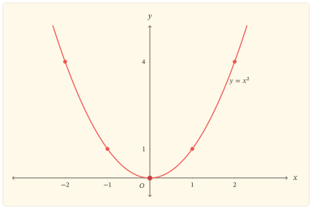

Hai số đối nhau có vị trí khác nhau trên trục số, nhưng phép bình phương cho chúng cùng một giá trị:

$$
x^2=(-x)^2.
$$

Đẳng thức đơn giản này tổ chức gần như toàn bộ hình dạng của đồ thị. Nó làm dấu của đầu vào không còn phân biệt được từ đầu ra, trong khi khoảng cách $\lvert x\rvert$ đến $0$ vẫn xác định được bởi $\lvert x\rvert=\sqrt{x^2}$. Vì vậy, khảo sát hàm số bình phương cũng là khảo sát cách một quy tắc hai–một gấp hai nửa trục lên cùng một nhánh giá trị không âm.

## Phép bình phương nhận và trả lại điều gì?

Xét hàm số

$$
f(x)=x^2.
$$

Mọi số thực đều có thể được bình phương, nên tập xác định là $D=\mathbb{R}$. Với mọi $x\in\mathbb{R}$,

$$
f(x)=x^2\geq0,
$$

và dấu bằng xảy ra đúng khi $x=0$. Ngược lại, với mỗi $y\geq0$, chọn $x=\sqrt{y}$ thì $f(x)=y$. Do đó tập giá trị của hàm số là

$$
[0,+\infty).
$$

Kết quả này gồm cả hai chiều: hàm không nhận giá trị âm, và mọi giá trị không âm đều thực sự được nhận.

### Hai đầu vào cho một đầu ra

Với mọi $x\in\mathbb{R}$,

$$
f(-x)=(-x)^2=x^2=f(x).
$$

Hàm $f$ là hàm chẵn; đồ thị nhận trục tung làm trục đối xứng. Nếu $x\ne0$, hai đầu vào $x$ và $-x$ khác nhau nhưng có cùng ảnh. Vì thế, trên toàn bộ $\mathbb{R}$, hàm không đơn ánh và không có hàm ngược.

Tuy nhiên, đầu ra vẫn xác định được khoảng cách của đầu vào đến $0$:

$$
\lvert x\rvert=\sqrt{f(x)}.
$$

Nói cách khác, phép bình phương làm mất thông tin về dấu, không làm mất thông tin về trị tuyệt đối. Khi giới hạn miền thành $[0,+\infty)$, ta có $x=\sqrt{f(x)}$; khi giới hạn miền thành $(-\infty,0]$, ta có $x=-\sqrt{f(x)}$. Hai nhánh ngược tương ứng là căn bậc hai và đối của căn bậc hai.

## Hai chiều biến thiên gặp nhau tại $0$

Trên nửa trục dương, nếu $0\leq x_1<x_2$ thì

$$
x_2^2-x_1^2=(x_2-x_1)(x_2+x_1)>0.
$$

Do đó, $f$ đồng biến trên $[0,+\infty)$. Trên nửa trục âm, nếu $x_1<x_2\leq0$ thì $-x_1>-x_2\geq0$. Áp dụng kết quả vừa chứng minh trên nửa trục dương và dùng tính chẵn, ta được

$$
f(x_1)=f(-x_1)>f(-x_2)=f(x_2).
$$

Vì vậy, $f$ nghịch biến trên $(-\infty,0]$.

Cùng kết luận ấy hiện ra từ đạo hàm:

$$
f^\prime(x)=2x.
$$

Đạo hàm âm khi $x<0$, bằng $0$ tại $x=0$ và dương khi $x>0$. Cách dùng hiệu hai bình phương chứng minh trực tiếp quan hệ thứ tự; đạo hàm nén quan hệ đó thành dấu của tốc độ biến thiên. Hai lập luận có vai trò khác nhau nhưng cùng chỉ đến một cấu trúc.

| $x$ | $-\infty$ |  | $0$ |  | $+\infty$ |
|---:|:---:|:---:|:---:|:---:|:---:|
| $f^\prime(x)$ |  | $-$ | $0$ | $+$ |  |
| $f(x)$ | $+\infty$ | $\searrow$ | $0$ | $\nearrow$ | $+\infty$ |

Giá trị $0$ là giá trị nhỏ nhất của hàm số và đạt được duy nhất tại $x=0$. Hàm không có giá trị lớn nhất vì $x^2\to+\infty$ khi $x\to\pm\infty$.

## Hình dạng bị ràng buộc bởi các kết quả

Những kết luận đã chứng minh đặt ra các điều kiện toàn cục cho đồ thị:

- đồ thị nằm trong nửa mặt phẳng $y\geq0$;
- đồ thị đi qua $O(0,0)$ và chỉ tiếp xúc trục hoành tại đó;
- đồ thị đối xứng qua trục tung;
- nhánh trái hạ xuống khi $x$ tiến từ $-\infty$ về $0$, còn nhánh phải đi lên khi $x$ tăng từ $0$;
- hai đầu của đồ thị cùng vươn lên không bị chặn.

::: {#fig-ham-x-binh}
{fig-alt="Đồ thị parabol y bằng x bình phương, có đỉnh tại gốc tọa độ, đối xứng qua trục tung và mở lên trên." width="85%" fig-align="center"}

Đồ thị $y=x^2$ là một parabol có đỉnh $O(0,0)$ và trục đối xứng là trục tung.
:::

Hình vẽ biểu hiện các ràng buộc trên, nhưng không thay thế chúng. Chẳng hạn, tính đối xứng được bảo đảm bởi đẳng thức $f(-x)=f(x)$, còn chiều biến thiên được chứng minh bằng thứ tự hoặc dấu đạo hàm; việc nối một số điểm không đủ để xác lập hai tính chất ấy trên toàn miền.

### Độ dốc thay đổi đều

Đạo hàm $f^\prime(x)=2x$ còn cho biết độ dốc tăng tuyến tính theo $x$. Với mỗi độ tăng $h$,

$$
f^\prime(x+h)-f^\prime(x)=2h,
$$

không phụ thuộc vào vị trí ban đầu $x$. Đạo hàm cấp hai

$$
f^{\prime\prime}(x)=2>0
$$

trên toàn bộ $\mathbb{R}$, nên đồ thị luôn cong lên. Đây là lý do hai nhánh không chỉ đối xứng mà còn mở ngày càng nhanh khi rời khỏi đỉnh.

## Đọc ngược từ đầu ra

Cho một mức $a\in\mathbb{R}$. Các giao điểm của đồ thị với đường thẳng $y=a$ tương ứng với nghiệm của phương trình

$$
x^2=a.
$$

Nếu $a<0$, phương trình không có nghiệm thực vì tập giá trị của $f$ không chứa số âm. Nếu $a=0$, chỉ có nghiệm $x=0$. Nếu $a>0$, có đúng hai nghiệm đối nhau:

$$
x=\pm\sqrt{a}.
$$

Số giao điểm thay đổi đúng tại mức cực tiểu $a=0$. Đây là cách đọc ngược toàn bộ cơ chế: đầu ra dương khôi phục được trị tuyệt đối của đầu vào nhưng không quyết định được dấu; đầu ra bằng $0$ là trường hợp duy nhất hai nhánh gặp nhau.

:::: {.zo-block .zo-block-gray}
::: {.zo-block-title}
Một phép soi chiếu với $y=x^3$
:::

Phép lập phương vẫn phân biệt hai đầu vào đối nhau vì $(-x)^3=-x^3$. Hàm $y=x^3$ đồng biến trên toàn bộ $\mathbb{R}$ và mỗi đầu ra thực ứng với đúng một đầu vào. So sánh này cho thấy tính đối xứng qua trục tung và hai nhánh ngược của $y=x^2$ không đến từ việc nó là một lũy thừa nói chung, mà từ số mũ chẵn.
::::

## Kết tinh

Phép bình phương biến hai nửa trục theo hai chiều khác nhau: khi tiến từ trái về $0$, giá trị giảm; khi rời $0$ sang phải, giá trị tăng. Đẳng thức $f(-x)=f(x)$ ghép hai chiều ấy thành hai nhánh đối xứng, còn bất đẳng thức $x^2\geq0$ buộc chúng gặp nhau tại giá trị nhỏ nhất $0$.

Vì thế, parabol không phải là hình được suy ra từ vài điểm rời rạc. Nó là biểu hiện đồng thời của miền xác định, tập giá trị, tính chẵn, biến thiên và độ cong. Khi đọc ngược đồ thị, cùng cấu trúc ấy giải thích vì sao một mức dương cắt đồ thị tại hai điểm đối nhau, mức $0$ chỉ chạm tại đỉnh và một mức âm không cắt đồ thị.

## Bài tập

### Tái dựng mạch cốt lõi

#### Bài 1. Miền và ảnh

Chứng minh trực tiếp rằng tập giá trị của $f(x)=x^2$ là $[0,+\infty)$. Trong chứng minh, tách rõ điều kiện cần và điều kiện đủ.

#### Bài 2. Biến thiên không dùng đạo hàm

Dùng hiệu $x_2^2-x_1^2$ để chứng minh $f$ đồng biến trên $[0,+\infty)$. Sau đó dùng tính chẵn để suy ra chiều biến thiên trên $(-\infty,0]$.

#### Bài 3. Đường thẳng ngang

Biện luận theo $a\in\mathbb{R}$ số nghiệm thực của phương trình $x^2=a$, rồi giải thích kết quả bằng số giao điểm của parabol với đường thẳng $y=a$.

### Mở rộng và đào sâu

#### Bài 4. Tịnh tiến parabol

Với $h,k\in\mathbb{R}$, xét $g(x)=(x-h)^2+k$. Xác định tập giá trị, tọa độ đỉnh, trục đối xứng và các khoảng biến thiên của $g$. Giải thích vai trò riêng của $h$ và $k$.

#### Bài 5. Một phương trình có tham số

Tìm tất cả $m\in\mathbb{R}$ để phương trình

$$
x^2-2mx+m+2=0
$$

có hai nghiệm thực phân biệt. Diễn giải điều kiện tìm được bằng giao điểm của parabol $y=(x-m)^2$ và một đường thẳng ngang thích hợp.

#### Bài 6. Lũy thừa chẵn

Cho số nguyên $n\geq1$. Khảo sát nhanh hàm $g_n(x)=x^{2n}$ về tập xác định, tập giá trị, tính chẵn, các khoảng biến thiên và số nghiệm của phương trình $x^{2n}=a$. Chỉ ra những kết luận nào giống $y=x^2$ và đặc điểm nào của độ cong gần $0$ thay đổi khi $n>1$.
