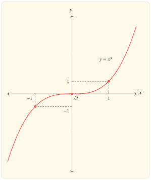
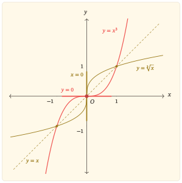

Lũy thừa bậc ba $y=x^3$ biểu hiện một hành vi khác biệt so với bậc nhất hay bậc hai. Nó duy trì sự đồng biến trên toàn miền như $y=x$, nhưng tại một điểm duy nhất, tốc độ thay đổi tức thời của nó bằng $0$. Điều cần giải thích là vì sao sự triệt tiêu ấy không làm hàm số quay đầu: dấu của đạo hàm bậc nhất không đổi, trong khi độ cong của đồ thị lại đổi khi đi qua gốc tọa độ.

## Nhận diện và tính đối xứng

Hàm số $y=x^3$ được xác định trên toàn $\mathbb{R}$.

  
Hàm số lẻ

  

Cho hàm số $f$ có tập xác định $D$ đối xứng qua $0$, nghĩa là nếu $x\in D$ thì $-x\in D$. Hàm số $f$ được gọi là *hàm lẻ* nếu, với mọi $x\in D$, ta có
$$
f(-x)=-f(x).
$$
Khi đó đồ thị của $f$ nhận gốc tọa độ làm tâm đối xứng. Nếu $0\in D$ thì từ $f(0)=-f(0)$ suy ra $f(0)=0$.

  

Với $f(x)=x^3$,
$$
f(-x)=(-x)^3=-x^3=-f(x),
$$
nên $y=x^3$ là hàm số lẻ và đồ thị đối xứng qua gốc tọa độ $O(0,0)$. Đối xứng này giúp ta khôi phục nửa đồ thị bên trái từ nửa bên phải. Tuy nhiên, những kết luận toàn cục như tính đồng biến trên cả $\mathbb{R}$ vẫn cần được kiểm tra trên toàn miền, chứ không chỉ dựa vào hình đối xứng.

Phương trình
$$
x^3=0
$$
chỉ có nghiệm $x=0$, nên đồ thị cắt cả hai trục tọa độ tại đúng một điểm là $O(0,0)$. Hơn nữa,
$$
x^3=x\cdot x^2,
$$
và $x^2>0$ khi $x\ne 0$, vì vậy $x^3$ luôn cùng dấu với $x$. Gốc tọa độ vừa là nghiệm duy nhất vừa là điểm phân chia hai miền dấu của hàm số.

## Đồng biến nghiêm ngặt dù đạo hàm bằng $0$ tại gốc

Có thể thấy tính đồng biến của $x^3$ ngay từ đại số. Với hai số thực $a<b$,
$$
b^3-a^3=(b-a)(a^2+ab+b^2).
$$
Ta có $b-a>0$ và
$$
a^2+ab+b^2=\left(a+\frac{b}{2}\right)^2+\frac{3b^2}{4}>0,
$$
vì đẳng thức chỉ có thể xảy ra khi $a=b=0$, trái với $a<b$. Do đó
$$
b^3-a^3>0.
$$
Vì thế $y=x^3$ đồng biến nghiêm ngặt trên toàn $\mathbb{R}$. Lập luận này cho thấy rõ thứ tự logic: tính đồng biến là một thuộc tính của hàm số, không phải một khái niệm được định nghĩa bằng đạo hàm. Đạo hàm là một công cụ mạnh để nhận diện, kiểm tra và giải thích thuộc tính ấy khi các điều kiện áp dụng đã được thỏa mãn.

Hai giới hạn ở vô cực phù hợp với chiều biến thiên vừa xác lập:
$$
\lim_{x\to-\infty}x^3=-\infty
\quad\text{và}\quad
\lim_{x\to+\infty}x^3=+\infty.
$$
Do hàm liên tục và đồng biến nghiêm ngặt từ $-\infty$ đến $+\infty$, tập giá trị của hàm số là toàn bộ $\mathbb{R}$. Tương đương, với mỗi $m\in\mathbb{R}$, phương trình $x^3=m$ có đúng một nghiệm thực.

Đạo hàm bậc nhất cho biết độ dốc của đồ thị:
$$
y^\prime=3x^2.
$$
Với $x\ne0$, ta có $y^\prime>0$; tại $x=0$,
$$
y^\prime(0)=0.
$$
Như vậy gốc tọa độ là một điểm có tiếp tuyến nằm ngang, nhưng điều đó chưa đủ để kết luận có cực trị.

  
Nghiệm bội và sự đổi dấu

  

Giả sử gần $x=a$ một biểu thức liên tục $g$ có dạng
$$
g(x)=(x-a)^m h(x),
$$
trong đó $h(a)\ne0$. Khi đó $a$ là một nghiệm bội $m$ của $g$. Vì $h$ giữ nguyên dấu trong một lân cận đủ nhỏ của $a$, sự đổi dấu của $g$ được quyết định bởi $(x-a)^m$. Khi $m$ lẻ, $(x-a)^m$ đổi dấu khi đi qua $a$, còn khi $m$ chẵn, $(x-a)^m$ không đổi dấu khi đi qua $a$.

Vì vậy, đối với đạo hàm, một nghiệm bội chẵn thường làm $y^\prime$ giữ nguyên dấu ở hai phía, còn một nghiệm bội lẻ làm $y^\prime$ đổi dấu, miễn là phần còn lại của phép phân tích không triệt tiêu tại điểm đang xét.

  

Ở đây
$$
y^\prime=3x^2=3(x-0)^2,
$$
nên $x=0$ là nghiệm bội $2$, tức bội chẵn, của $y^\prime=0$. Đạo hàm dương ở cả hai phía của $0$, vì thế hàm số không đổi chiều biến thiên và $O(0,0)$ không phải là điểm cực trị. Tiếp tuyến tại gốc là
$$
y=0.
$$

## Độ dốc thay đổi và điểm uốn

Trước khi dùng đạo hàm bậc hai, chính công thức $y^\prime=3x^2$ đã cho thấy độ dốc biến đổi như thế nào. Nếu $x_1<x_2\le0$ thì $|x_1|>|x_2|$, nên
$$
3x_1^2>3x_2^2.
$$
Vì vậy, khi đi từ trái sang phải trên $(-\infty,0]$, độ dốc giảm dần về $0$. Ngược lại, nếu $0\le x_1<x_2$ thì
$$
3x_1^2<3x_2^2,
$$
nên độ dốc tăng dần khi rời gốc về phía phải. Các bất đẳng thức này đã mô tả được chuyển động “phẳng dần rồi dốc dần” mà chưa cần lấy đạo hàm lần thứ hai.

Đạo hàm bậc hai nén đúng xu hướng vừa chứng minh vào một công thức:
$$
y^{\prime\prime}=6x.
$$
Khi $x<0$, $y^{\prime\prime}<0$, nên $y^\prime$ giảm; khi $x>0$, $y^{\prime\prime}>0$, nên $y^\prime$ tăng. Vì thế đạo hàm bậc hai không tạo ra hiện tượng mới, mà cung cấp một công cụ vi phân để nhận diện nhanh sự thay đổi của độ dốc đã thấy từ bất đẳng thức. Đồ thị luôn đi lên nhưng trước gốc thì phẳng dần, còn sau gốc thì dốc dần; đó là cơ chế tạo nên sự đổi hướng cong tại $O$.

  
Điểm uốn của đồ thị

  

Một điểm $A(a,f(a))$ được gọi là *điểm uốn* khi đồ thị đổi tính cong khi đi qua $A$. Nếu $f^{\prime\prime}$ tồn tại ở hai phía của $a$ và đổi dấu khi qua $a$, thì $A$ là một điểm uốn.

Điều kiện $f^{\prime\prime}(a)=0$ tự nó chưa đủ để kết luận có điểm uốn; điều quyết định là sự đổi tính cong của đồ thị.

  

Với $y=x^3$, $y^{\prime\prime}=6x$ đổi dấu từ âm sang dương khi đi qua $0$, nên $O(0,0)$ là điểm uốn. Đồng thời, vì $x^3<0$ khi $x<0$ và $x^3>0$ khi $x>0$, đường cong nằm ở hai phía khác nhau của tiếp tuyến $y=0$ và đi xuyên qua tiếp tuyến ấy tại gốc. Việc đi xuyên qua tiếp tuyến là một hệ quả hình học trong trường hợp này; tiêu chuẩn nhận diện điểm uốn vẫn là sự đổi tính cong.

## Bảng biến thiên và đồ thị tổng hợp

Những kết quả trên có thể nén vào bảng biến thiên sau. Hai dấu $+$ nằm ở các cột biểu diễn hai khoảng $(-\infty,0)$ và $(0,+\infty)$; chúng không phải là giá trị của đạo hàm tại $\pm\infty$.

| $x$ | $-\infty$ |  | $0$ |  | $+\infty$ |
| --- | :---: | :---: | :---: | :---: | :---: |
| $y^\prime$ |  | $+$ | $0$ | $+$ |  |
| $y$ | $-\infty$ | $\nearrow$ | $0$ | $\nearrow$ | $+\infty$ |

Bảng cho thấy một điểm dừng duy nhất tại $x=0$ nhưng không có sự đổi chiều tăng. Khi đọc cùng dấu của $y^{\prime\prime}$, ta còn thấy rõ hơn cấu trúc địa phương: nhánh bên trái vẫn tăng nhưng phẳng dần khi tiến đến gốc; nhánh bên phải tiếp tục tăng và dốc dần khi rời gốc.

::::: {.content-visible when-format="html"}

:::: {#fig-ham_x_mu_3 fig-pos="H"}
{fig-alt="Đồ thị hàm số y=x^3 đối xứng qua gốc tọa độ, đi qua O, âm một âm một và một một; đường cong tăng trên toàn trục số và đổi tính cong tại gốc" width="100%" fig-align="center"}

Đồ thị hàm số $y=x^3$
::::

:::::

::::: {.content-visible when-format="pdf"}

:::: {#fig-ham_x_mu_3 fig-pos="H"}
{fig-alt="Đồ thị hàm số y=x^3 đối xứng qua gốc tọa độ, đi qua O, âm một âm một và một một; đường cong tăng trên toàn trục số và đổi tính cong tại gốc" width="85%" fig-align="center"}

Đồ thị hàm số $y=x^3$
::::

:::::

## Vì sao $y=x^2$ quay đầu còn $y=x^3$ đi qua gốc?

Hai hàm $y=x^2$ và $y=x^3$ đều có tiếp tuyến nằm ngang tại gốc, nhưng cơ chế tại đó khác nhau.

| Quan hệ tại $x=0$ | $y=x^2$ | $y=x^3$ |
| --- | --- | --- |
| Đạo hàm | $y^\prime=2x$ | $y^\prime=3x^2$ |
| Bội của nghiệm $y^\prime=0$ | $1$ — bội lẻ | $2$ — bội chẵn |
| Dấu của $y^\prime$ qua $0$ | $-\to+$ | $+\to+$ |
| Hệ quả về biến thiên | giảm rồi tăng | tăng ở cả hai phía |
| Cực trị tại gốc | cực tiểu | không có cực trị |
| Đạo hàm bậc hai | $y^{\prime\prime}=2>0$ | $y^{\prime\prime}=6x$ đổi dấu |
| Quan hệ với tiếp tuyến $y=0$ | $x^2$ có bội $2$, đồ thị ở cùng một phía | $x^3$ có bội $3$, đồ thị đi qua tiếp tuyến |

Bảng này làm rõ hai vai trò khác nhau của tính chẵn lẻ của số bội. Bội của nghiệm của $y^\prime$ kiểm soát khả năng đổi dấu của đạo hàm và do đó liên quan trực tiếp đến cực trị. Bội của nghiệm của $f(x)-T(x)$, với $T$ là tiếp tuyến tại điểm đang xét, mô tả cách đường cong tiếp xúc với tiếp tuyến: bội chẵn giữ đường cong về một phía, còn bội lẻ cho phép đường cong đi qua tiếp tuyến.

Với $y=x^3$, hai thông tin ấy kết hợp với nhau: $y^\prime$ có nghiệm bội chẵn nên không xuất hiện cực trị, trong khi $y^{\prime\prime}$ đổi dấu và $y-T=x^3$ có nghiệm bội lẻ nên gốc tọa độ là một điểm uốn nơi đường cong đi qua tiếp tuyến ngang.

## Từ tính đồng biến đến hàm ngược

Tính đồng biến nghiêm ngặt cùng tập giá trị $\mathbb{R}$ còn cho một hệ quả tự nhiên. Hàm
$$
f\colon \mathbb{R}\to\mathbb{R}
$$
được cho bởi $f(x)=x^3$ là một-một và phủ hết $\mathbb{R}$, nên có hàm ngược trên toàn trục số:
$$
f^{-1}(x)=\sqrt[3]{x}.
$$
Đồ thị của $y=x^3$ và $y=\sqrt[3]{x}$ đối xứng qua đường thẳng $y=x$. Phép đối xứng này biến tiếp tuyến ngang $y=0$ của đồ thị $y=x^3$ tại gốc thành tiếp tuyến đứng $x=0$ của đồ thị hàm ngược. Vì vậy, hiện tượng “phẳng lại” của $x^3$ tại gốc được nhìn từ hàm ngược thành một tiếp tuyến đứng.

::::: {.content-visible when-format="html"}

:::: {#fig-ham_x_mu_3_va_ham_nguoc fig-pos="H"}
{fig-alt="Đồ thị y=x^3 và y=căn bậc ba của x đối xứng qua y=x; tại gốc, tiếp tuyến ngang của y=x^3 phản xạ thành tiếp tuyến đứng của hàm ngược" width="100%" fig-align="center"}

Đồ thị $y=x^3$ và hàm ngược $y=\sqrt[3]{x}$
::::

:::::

::::: {.content-visible when-format="pdf"}

:::: {#fig-ham_x_mu_3_va_ham_nguoc fig-pos="H"}
{fig-alt="Đồ thị y=x^3 và y=căn bậc ba của x đối xứng qua y=x; tại gốc, tiếp tuyến ngang của y=x^3 phản xạ thành tiếp tuyến đứng của hàm ngược" width="85%" fig-align="center"}

Đồ thị $y=x^3$ và hàm ngược $y=\sqrt[3]{x}$
::::

:::::

Trên hình, gốc tọa độ nằm trên trục đối xứng $y=x$, nên được giữ cố định qua phép phản xạ. Điểm uốn tại gốc của $y=x^3$ tương ứng với điểm uốn có tiếp tuyến đứng của $y=\sqrt[3]{x}$. Cả hai hàm đều đồng biến và không có cực trị, vì vậy trong cặp đồ thị này không có điểm cực trị nào để phản chiếu. Hai đoạn tiếp tuyến được nhấn tại gốc cho thấy trực tiếp quan hệ ngang–đứng dưới phép đối xứng.

Mối liên hệ này không phải một tính chất riêng của công thức lũy thừa bậc ba. Khi một hàm một-một có hàm ngược, việc phản xạ đồ thị qua $y=x$ chuyển các quan hệ hình học của hàm sang những quan hệ tương ứng của hàm ngược. Tuy nhiên, mỗi kết luận vi phân vẫn phải được kiểm tra với các điều kiện thích hợp tại điểm đang xét.

## Nhìn lại điểm dừng tại gốc

Tại $O(0,0)$, ba thông tin phải được phân biệt. Điều kiện $y^\prime(0)=0$ cho biết tiếp tuyến nằm ngang. Việc $y^\prime$ không đổi dấu qua $0$ cho biết hàm số không đổi chiều biến thiên, nên không có cực trị. Việc $y^{\prime\prime}$ đổi dấu qua $0$ cho biết đồ thị đổi tính cong, nên $O$ là điểm uốn.

Vì thế, phương trình $y^\prime=0$ chỉ tạo ra các điểm cần tiếp tục khảo sát. Muốn kết luận cực trị phải kiểm tra sự thay đổi của biến thiên; muốn kết luận điểm uốn phải kiểm tra sự thay đổi của tính cong. Số bội của nghiệm có thể làm lộ cơ chế đổi dấu, nhưng không thay thế việc kiểm tra các điều kiện của kết luận đang dùng.

## Bài tập

### Tính lẻ, đồng biến và điểm uốn tại gốc tọa độ

#### Bài 1. Từ công thức đến tính đồng biến

Cho hàm số $y=x^3$.

a. Chứng minh hàm số là hàm lẻ và nêu ý nghĩa hình học của tính chất này.
b. Với $a<b$, phân tích $b^3-a^3$ thành nhân tử và chứng minh trực tiếp rằng $a^3<b^3$. Từ đó kết luận hàm số đồng biến nghiêm ngặt trên $\mathbb{R}$ mà chưa dùng đạo hàm.
c. Tính $y^\prime$. Xác định bội của nghiệm $x=0$ của phương trình $y^\prime=0$ và dùng tính chẵn lẻ của số bội để giải thích vì sao đạo hàm không đổi dấu qua $0$.

#### Bài 2. Tiếp tuyến, điểm uốn và hàm ngược

Cho hàm số $y=x^3$.

a. Từ $y^\prime=3x^2$, dùng bất đẳng thức để chứng minh độ dốc giảm dần khi $x$ tiến đến $0$ từ bên trái và tăng dần khi $x$ rời $0$ về bên phải. Sau đó tính $y^{\prime\prime}$ để kiểm tra lại xu hướng ấy, chứng minh $O(0,0)$ là điểm uốn và viết phương trình tiếp tuyến của đồ thị tại $O$.
b. Chứng minh tập giá trị của hàm số là $\mathbb{R}$ và suy ra hàm số có hàm ngược trên $\mathbb{R}$.
c. Tìm công thức của hàm ngược. Dựa vào phép đối xứng qua $y=x$ và hình minh họa trong bài, giải thích vì sao tiếp tuyến ngang của $y=x^3$ tại gốc tương ứng với một tiếp tuyến đứng của đồ thị hàm ngược, đồng thời nêu điều gì xảy ra với điểm uốn và vì sao không có cực trị nào cần phản chiếu.

### Từ $y=x^3$ đến các hàm bậc ba khác

#### Bài 3. Điểm uốn được tịnh tiến

Cho hàm số
$$
y=x^3-3x^2+3x.
$$

a. Viết hàm số dưới dạng một phép tịnh tiến của $y=x^3$.
b. Phân tích đạo hàm để giải thích vì sao hàm số vẫn đồng biến trên $\mathbb{R}$ và không có cực trị.
c. Xác định điểm uốn và tiếp tuyến tại điểm uốn. So sánh vai trò của điểm này với gốc tọa độ của $y=x^3$.

#### Bài 4. Khi nghiệm của đạo hàm tạo cực trị

Cho hàm số $y=x^3-3x$.

a. Tính $y^\prime$ và tìm các nghiệm của phương trình $y^\prime=0$.
b. Xét dấu của $y^\prime$ ở hai phía của từng nghiệm và kết luận về các điểm cực trị.
c. So sánh với nghiệm $x=0$ của đạo hàm của $y=x^3$, rồi phát biểu tiêu chí nhận diện cực trị dựa trên sự đổi dấu của $y^\prime$. Nêu rõ vì sao điều kiện $y^\prime(a)=0$ riêng lẻ chưa đủ.
