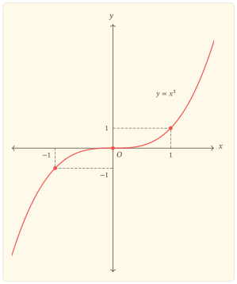
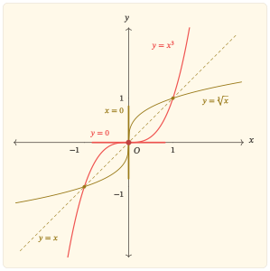

Hàm số $y=x^3$ có một đặc điểm đáng chú ý. Nó đồng biến trên toàn bộ $\mathbb{R}$ như hàm số $y=x$, nhưng khác với đường thẳng ở chỗ độ dốc không giữ nguyên: khi tiến đến gốc tọa độ, độ dốc giảm dần về $0$ rồi tăng trở lại. Ở điểm này, $y=x^3$ cũng khác với $y=x^2$. Cả hai đều có tiếp tuyến nằm ngang tại $O$, nhưng đồ thị $y=x^2$ quay đầu tại đó, còn đồ thị $y=x^3$ vẫn tiếp tục đi lên. Vì sao cùng có đạo hàm bằng $0$ mà một hàm đổi chiều biến thiên, còn hàm kia thì không? Câu trả lời nằm ở dấu của đạo hàm bậc nhất và cách độ dốc biến thiên qua $0$: $y=x^3$ vẫn giữ chiều đồng biến, đồng thời đồ thị chuyển từ cong xuống sang cong lên.

## Nhận diện và tính đối xứng

Hàm số $y=x^3$ được xác định trên toàn $\mathbb{R}$.

Với $f(x)=x^3$,
$$
f(-x)=(-x)^3=-x^3=-f(x),
$$
nên $y=x^3$ là hàm số lẻ và đồ thị đối xứng qua gốc tọa độ $O(0,0)$. Phép đối xứng này giúp ta hoàn thiện nửa đồ thị bên trái từ nửa bên phải. Tuy nhiên, những kết luận toàn cục đối với hàm số lẻ vẫn cần được kiểm tra trên toàn miền, chứ không chỉ dựa vào hình đối xứng.

  
Hàm số lẻ

  

Cho hàm số $f$ có tập xác định $D$ đối xứng qua $0$, nghĩa là nếu $x\in D$ thì $-x\in D$. Hàm số $f$ được gọi là *hàm lẻ* nếu, với mọi $x\in D$,
$$
f(-x)=-f(x).
$$

Điều kiện này có một ý nghĩa hình học trực tiếp. Lấy một điểm bất kì
$$
(x,f(x))
$$
của đồ thị. Điểm đối xứng của nó qua gốc tọa độ $O$ có tọa độ $(-x,-f(x))$.

Vì $f$ là hàm lẻ nên
$$
-f(x)=f(-x).
$$
Do đó điểm đối xứng ấy có thể viết thành
$$
(-x,f(-x)),
$$
và đây cũng là một điểm của đồ thị ứng với hoành độ $-x$.

Như vậy, mỗi điểm của đồ thị đều có điểm đối xứng qua $O$ cũng nằm trên đồ thị. Vì thế, đồ thị của hàm lẻ nhận gốc tọa độ $O$ làm tâm đối xứng.

**Lưu ý:** Với hàm lẻ, nếu $0\in D$ thì $f(0)=0$. Vì sao?
  

Phương trình

$$
x^3=0
$$

chỉ có nghiệm $x=0$, nên đồ thị của hàm số $y=x^3$ giao với cả hai trục tọa độ tại cùng một điểm $O(0,0)$.

Đẳng thức

$$
x^3=x\cdot x^2
$$

cho phép nhìn thấy hai vai trò khác nhau trong cùng một biểu thức. Nhân tử $x$ giữ lại dấu của giá trị: khi $x<0$ thì $x^3<0$, còn khi $x>0$ thì $x^3>0$, bởi $x^2$ luôn dương với $x\ne0$. Vì thế, phần đồ thị bên trái gốc tọa độ nằm dưới trục hoành, còn phần bên phải nằm trên trục hoành.

Nhưng $x^2$ không chỉ đứng đó để không làm đổi dấu. Nó còn quyết định giá trị của $x$ được thu nhỏ hay khuếch đại khi tạo thành $x^3$. Nếu $\lvert x\rvert<1$ thì $x^2<1$, nên phép nhân với $x^2$ làm cho

$$
\lvert x^3\rvert<\lvert x\rvert.
$$

Bởi vậy, trong khoảng từ $-1$ đến $1$, đồ thị $y=x^3$ nằm gần trục hoành hơn đường thẳng $y=x$. Ngược lại, nếu $\lvert x\rvert>1$ thì $x^2>1$, nên

$$
\lvert x^3\rvert>\lvert x\rvert;
$$

ra ngoài khoảng ấy, đồ thị $y=x^3$ nằm xa trục hoành hơn $y=x$. Tại $x=-1$, $0$ và $1$, hai đồ thị gặp nhau.

Như vậy, cấu trúc $x^3=x\cdot x^2$ đã cho ta một hình dung khá rõ trước cả khi dùng đạo hàm: nhân tử $x$ quyết định đồ thị nằm về phía nào của trục hoành, còn nhân tử $x^2$ làm nó ép sát về trục hoành khi ở gần gốc và tách xa dần khi $\lvert x\rvert$ lớn hơn $1$. Chính sự kết hợp hai vai trò ấy tạo nên một phần hình dạng đặc trưng của đồ thị $y=x^3$.

## Đồng biến nghiêm ngặt

Có thể nhận thấy tính đồng biến của $x^3$ ngay từ đại số. Với hai số thực $a<b$, có thể khẳng định
$$
b^3-a^3=(b-a)(a^2+ab+b^2)>0.
$$
Vì $b-a>0$ và
$$
a^2+ab+b^2=\left(a+\frac{b}{2}\right)^2+\frac{3b^2}{4}>0.
$$
Do đó, $y=x^3$ đồng biến nghiêm ngặt trên toàn $\mathbb{R}$. Lập luận này cho thấy: tính đồng biến là một thuộc tính của hàm số, không phải một khái niệm được định nghĩa bằng đạo hàm. Đạo hàm là một công cụ mạnh để nhận diện, kiểm tra và giải thích thuộc tính ấy khi các điều kiện áp dụng đã được thỏa mãn.

Khi $x$ có độ lớn ngày càng lớn, $x^3$ cũng có độ lớn ngày càng lớn và giữ cùng dấu với $x$. Vì thế,
$$
\lim_{x\to-\infty}x^3=-\infty
$$
và
$$
\lim_{x\to+\infty}x^3=+\infty.
$$

Hàm số $y=x^3$ là một hàm đa thức nên liên tục trên toàn bộ $\mathbb{R}$. Kết hợp tính liên tục với hai giới hạn trên, hàm số nhận mọi giá trị thực; do đó tập giá trị là $\mathbb{R}$.

Hơn nữa, vì hàm số đồng biến nghiêm ngặt, nên với mỗi $m\in\mathbb{R}$, phương trình
$$
x^3=m
$$
có đúng một nghiệm thực.

Đạo hàm bậc nhất của hàm số là

$$
y'=3x^2\ge 0
$$

với mọi $x\in\mathbb R$. Kết quả này phù hợp với tính đồng biến nghiêm ngặt đã được chứng minh ở trên. Tuy nhiên, tại $x=0$,

$$
y'(0)=0.
$$

Điều gì xảy ra với đồ thị tại điểm này?

Tiếp tuyến của đồ thị hàm số

Giả sử hàm số $f$ được xác định trên một khoảng mở chứa $a$. Nếu giới hạn

$$
\lim_{x\to a}\frac{f(x)-f(a)}{x-a}
$$

tồn tại, thì tiếp tuyến của đồ thị $y=f(x)$ tại điểm $(a,f(a))$ là đường thẳng đi qua điểm đó và có hệ số góc bằng giới hạn trên.

Khi $f^\prime(a)$ tồn tại, hệ số góc của tiếp tuyến chính là $f^\prime(a)$.

Vì $y'(0)=0$, tiếp tuyến của đồ thị $y=x^3$ tại $O(0,0)$ có hệ số góc bằng $0$. Đó là đường thẳng nằm ngang

$$
y=0.
$$

Một đạo hàm bằng $0$ tại một điểm chưa đủ để kết luận hàm số đạt cực trị tại điểm đó. Khi dùng dấu của đạo hàm để nhận biết cực trị, điều quyết định là đạo hàm có đổi dấu khi đi qua điểm đang xét hay không: sự đổi dấu từ dương sang âm cho thấy hàm chuyển từ tăng sang giảm, còn sự đổi dấu từ âm sang dương cho thấy hàm chuyển từ giảm sang tăng.

Ở đây, $3x^2$ không âm ở cả hai phía của $0$ và không đổi dấu khi đi qua $0$. Hàm số vì thế vẫn tiếp tục đồng biến qua điểm này. Nhìn trên đồ thị, đường cong đi lên, dần trở nên nằm ngang khi đến $O$, rồi tiếp tục đi lên sau khi vượt qua $O$. Tiếp tuyến nằm ngang không đồng nghĩa với việc đồ thị phải quay đầu.

Điểm $O$ còn cho thấy một đặc điểm dễ bị che khuất bởi hình dung quen thuộc về tiếp tuyến. Khi $x<0$, ta có $x^3<0$, nên đồ thị nằm dưới đường thẳng $y=0$; khi $x>0$, ta có $x^3>0$, nên đồ thị nằm trên đường thẳng ấy. Như vậy, đồ thị cắt tiếp tuyến tại chính tiếp điểm $O$.

Tiếp tuyến vì thế không nên được hiểu là đường thẳng chỉ ``chạm mà không cắt'' đường cong. Điều xác định tiếp tuyến là hướng của đường cong tại tiếp điểm, được biểu thị bằng giới hạn của các hệ số góc cát tuyến, hay bằng đạo hàm khi đạo hàm tồn tại.

<!-- 

  
Nghiệm bội và sự đổi dấu

  

Giả sử gần $x=a$, một biểu thức $g$ có dạng
$$
g(x)=(x-a)^m h(x),
$$
trong đó $h$ liên tục tại $a$ và $h(a)\ne 0$. Khi đó $h$ giữ nguyên dấu trong một lân cận đủ nhỏ của $a$, nên sự đổi dấu của $g$ được quyết định bởi $(x-a)^m$. Nếu $m$ lẻ, $(x-a)^m$ đổi dấu khi đi qua $a$; nếu $m$ chẵn, $(x-a)^m$ không đổi dấu.

Vì vậy, đối với đạo hàm, một nghiệm bội chẵn thường làm $y^\prime$ giữ nguyên dấu ở hai phía, còn một nghiệm bội lẻ làm $y^\prime$ đổi dấu, miễn là phần còn lại của phép phân tích không triệt tiêu tại điểm đang xét.

  

 -->

## Độ dốc thay đổi và điểm uốn

Trước khi dùng đạo hàm bậc hai, chính công thức $y^\prime=3x^2$ đã cho thấy độ dốc biến đổi như thế nào. Nếu $x_1<x_2\le0$ thì $\lvert x_1\rvert>\lvert x_2\rvert$, nên
$$
3x_1^2>3x_2^2.
$$
Vì vậy, khi đi từ trái sang phải trên $(-\infty,0]$, độ dốc giảm dần về $0$. Ngược lại, nếu $0\le x_1<x_2$ thì
$$
3x_1^2<3x_2^2,
$$
nên độ dốc tăng dần khi rời gốc về phía phải.

Các bất đẳng thức này đã mô tả được chuyển động “phẳng dần rồi dốc dần” mà chưa cần lấy đạo hàm lần thứ hai.

Đạo hàm bậc hai nén đúng xu hướng vừa vừa biểu hiện thông qua các bất đẳng thức vào một công thức:
$$
y^{\prime\prime}=6x.
$$
Khi $x<0$, ta có $y^{\prime\prime}<0$, nên $y^\prime$ giảm; khi $x>0$, ta có $y^{\prime\prime}>0$, nên $y^\prime$ tăng. Đạo hàm bậc hai vì thế cho phép nhận biết nhanh sự thay đổi của độ dốc. Khi tiến đến gốc từ bên trái, đồ thị vẫn đi lên nhưng ngày càng phẳng; sau khi đi qua gốc, nó tiếp tục đi lên và ngày càng dốc hơn. Nói theo tính cong, đồ thị chuyển từ cong xuống sang cong lên tại $O$; đây chính là cơ chế hình học của điểm uốn.

  
Điểm uốn của đồ thị

  

Một điểm $A(a,f(a))$ được gọi là *điểm uốn* khi đồ thị đổi tính cong khi đi qua $A$. Nếu $f^{\prime\prime}$ tồn tại ở hai phía của $a$ và đổi dấu khi qua $a$, thì $A$ là một điểm uốn.

Điều kiện $f^{\prime\prime}(a)=0$ tự nó chưa đủ để kết luận có điểm uốn; điều quyết định là sự đổi tính cong của đồ thị.

  

Với $y=x^3$, vì $y^{\prime\prime}=6x$ đổi dấu từ âm sang dương khi đi qua $0$, nên $O(0,0)$ là điểm uốn. Đồng thời, vì $x^3<0$ khi $x<0$ và $x^3>0$ khi $x>0$, đường cong nằm ở hai phía khác nhau của tiếp tuyến $y=0$ và đi xuyên qua tiếp tuyến ấy tại gốc. Việc đi xuyên qua tiếp tuyến là một hệ quả hình học trong trường hợp này; tiêu chuẩn nhận diện điểm uốn vẫn là sự đổi tính cong.

## Bảng biến thiên và đồ thị

Những kết quả đã nghiên cứu qua được tổng hợp lại trong bảng biến thiên sau.

| $x$ | $-\infty$ |  | $0$ |  | $+\infty$ |
| --- | :---: | :---: | :---: | :---: | :---: |
| $y^\prime$ |  | $+$ | $0$ | $+$ |  |
| $y^{\prime\prime}$ |  | $-$ | $0$ | $+$ |  |
| $y$ | $-\infty$ | $\nearrow$ | $0$ | $\nearrow$ | $+\infty$ |

Bảng cho thấy một điểm dừng duy nhất tại $x=0$ nhưng không có sự đổi chiều tăng. Khi đọc cùng dấu của $y^{\prime\prime}$, ta còn thấy rõ hơn cấu trúc địa phương: nhánh bên trái vẫn tăng nhưng phẳng dần khi tiến đến gốc; nhánh bên phải tiếp tục tăng và dốc dần khi rời gốc.

::::: {.content-visible when-format="html"}

:::: {#fig-ham_x_mu_3 fig-pos="H"}
{fig-alt="Đồ thị hàm số y=x^3 đối xứng qua gốc tọa độ, đi qua O, âm một âm một và một một; đường cong tăng trên toàn trục số và đổi tính cong tại gốc" width="100%" fig-align="center"}

Đồ thị hàm số $y=x^3$
::::

:::::

::::: {.content-visible when-format="pdf"}

:::: {#fig-ham_x_mu_3 fig-pos="H"}
{fig-alt="Đồ thị hàm số y=x^3 đối xứng qua gốc tọa độ, đi qua O, âm một âm một và một một; đường cong tăng trên toàn trục số và đổi tính cong tại gốc" width="85%" fig-align="center"}

Đồ thị hàm số $y=x^3$
::::

:::::

## Từ tính đồng biến đến hàm ngược

Tính đồng biến nghiêm ngặt cùng tập giá trị $\mathbb{R}$ còn cho một hệ quả tự nhiên. Hàm
$$
f\colon \mathbb{R}\to\mathbb{R}
$$
được cho bởi $f(x)=x^3$ là một-một và phủ hết $\mathbb{R}$, nên có hàm ngược trên toàn trục số:
$$
f^{-1}(x)=\sqrt[3]{x}.
$$
Đồ thị của $y=x^3$ và $y=\sqrt[3]{x}$ đối xứng qua đường thẳng $y=x$. Phép đối xứng này biến tiếp tuyến ngang $y=0$ của đồ thị $y=x^3$ tại gốc thành tiếp tuyến đứng $x=0$ của đồ thị hàm ngược. Vì vậy, hiện tượng đồ thị “bằng phẳng” tại gốc của $x^3$ lại trở thành “dựng đứng” với $\sqrt[3]{x}$.

::::: {.content-visible when-format="html"}

:::: {#fig-ham_x_mu_3_va_ham_nguoc fig-pos="H"}
{fig-alt="Đồ thị y=x^3 và y=căn bậc ba của x đối xứng qua y=x; tại gốc, tiếp tuyến ngang của y=x^3 phản xạ thành tiếp tuyến đứng của hàm ngược" width="100%" fig-align="center"}

Đồ thị $y=x^3$ và hàm ngược $y=\sqrt[3]{x}$
::::

:::::

::::: {.content-visible when-format="pdf"}

:::: {#fig-ham_x_mu_3_va_ham_nguoc fig-pos="H"}
{fig-alt="Đồ thị y=x^3 và y=căn bậc ba của x đối xứng qua y=x; tại gốc, tiếp tuyến ngang của y=x^3 phản xạ thành tiếp tuyến đứng của hàm ngược" width="85%" fig-align="center"}

Đồ thị $y=x^3$ và hàm ngược $y=\sqrt[3]{x}$
::::

:::::

Trên hình, gốc tọa độ nằm trên trục đối xứng $y=x$, nên được giữ cố định qua phép phản xạ. Điểm uốn tại gốc nơi có tiếp tuyến ngang của $y=x^3$ tương ứng với điểm uốn có tiếp tuyến đứng của $y=\sqrt[3]{x}$. Cả hai hàm đều đồng biến và không có cực trị, vì vậy trong cặp đồ thị này không có điểm cực trị nào để phản chiếu. Hai đoạn tiếp tuyến được nhấn tại gốc cho thấy trực tiếp quan hệ ngang–đứng dưới phép đối xứng.

Mối liên hệ này không phải một tính chất riêng của công thức lũy thừa bậc ba. Khi một hàm số một-một có hàm ngược, đồ thị của hàm ngược là ảnh của đồ thị hàm ban đầu qua phép đối xứng qua đường thẳng $y=x$. Phép đối xứng ấy hoán đổi vai trò của hai tọa độ: điểm $(a,b)$ chuyển thành $(b,a)$, và một tiếp tuyến ngang có thể chuyển thành một tiếp tuyến đứng. Tuy nhiên, các đặc điểm hình học không nhất thiết được giữ nguyên cùng một dạng; chẳng hạn, tính cong lên có thể chuyển thành tính cong xuống. Vì vậy, phép đối xứng cho ta một cách nhìn hình học để liên hệ hai đồ thị, nhưng những kết luận về đạo hàm, tiếp tuyến hay tính cong của hàm ngược vẫn phải được thiết lập với các điều kiện thích hợp tại điểm đang xét.

## Nhìn lại điểm dừng tại gốc

Tại $O(0,0)$, ba hiện tượng cùng xuất hiện nhưng mang những ý nghĩa khác nhau và cần được phân biệt.

*Thứ nhất, đồ thị có tiếp tuyến nằm ngang tại $O$.* Ta có

$$
y^\prime(0)=0.
$$

Đạo hàm tại $0$ chính là hệ số góc của tiếp tuyến tại $O$, nên tiếp tuyến ở đây có hệ số góc bằng $0$. Tuy nhiên, một tiếp tuyến nằm ngang chưa đủ để kết luận hàm số đạt cực trị.

*Thứ hai, hàm số không đổi chiều biến thiên khi đi qua $0$.* Với

$$
y^\prime=3x^2,
$$

ta có $y^\prime>0$ khi $x\ne 0$ và $y^\prime(0)=0$. Như vậy, đạo hàm dương ở cả hai phía của $0$ và không đổi dấu khi đi qua điểm này. Hàm số vẫn đồng biến trước và sau $0$; nó không chuyển từ tăng sang giảm hoặc từ giảm sang tăng. Vì thế, $x=0$ không phải là điểm cực trị của hàm số.

Điều này cho thấy $y^\prime(a)=0$ chỉ cho biết $a$ là một điểm cần được khảo sát thêm. Muốn kết luận về cực trị bằng dấu của đạo hàm, cần xét xem $y^\prime$ có đổi dấu khi đi qua $a$ hay không.

*Thứ ba, đồ thị lại đổi tính cong tại $O$.* Đạo hàm bậc hai là

$$
y^{\prime\prime}=6x.
$$

Khi $x<0$, ta có $y^{\prime\prime}<0$, nên $y^\prime$ giảm; khi $x>0$, ta có $y^{\prime\prime}>0$, nên $y^\prime$ tăng. Vì thế, khi tiến đến $O$ từ bên trái, độ dốc của đồ thị giảm dần về $0$; sau khi đi qua $O$, độ dốc lại tăng dần từ $0$.

Trên đồ thị, sự thay đổi ấy biểu hiện thành việc đường cong chuyển từ cong xuống sang cong lên tại $O$. Đồ thị đổi tính cong khi đi qua điểm này, nên $O$ là một điểm uốn.

Hai đạo hàm vì thế mô tả hai tầng biến thiên khác nhau. Dấu của $y^\prime$ cho biết giá trị của hàm số đang tăng hay giảm; dấu của $y^{\prime\prime}$ cho biết độ dốc ấy đang tăng hay giảm. Trên đồ thị, tầng thứ nhất liên quan đến việc đường cong đi lên hay đi xuống, còn tầng thứ hai liên quan đến việc đường cong cong lên hay cong xuống.

Điểm $O$ cho thấy rõ sự khác biệt giữa các hiện tượng này: đồ thị có tiếp tuyến nằm ngang, nhưng hàm số không đạt cực trị; đồng thời, chính tại đó đồ thị đổi tính cong và có một điểm uốn.

## Bài tập

### Tính lẻ, đồng biến và điểm uốn tại gốc tọa độ

#### Bài 1. Từ công thức đến tính đồng biến

Cho hàm số $y=x^3$.

a. Chứng minh hàm số là hàm lẻ và nêu ý nghĩa hình học của tính chất này.
b. Với $a<b$, phân tích $b^3-a^3$ thành nhân tử và chứng minh trực tiếp rằng $a^3<b^3$. Từ đó kết luận hàm số đồng biến nghiêm ngặt trên $\mathbb{R}$ mà chưa dùng đạo hàm.
<!-- c. Tính $y^\prime$. Xác định bội của nghiệm $x=0$ của phương trình $y^\prime=0$ và dùng tính chẵn lẻ của số bội để giải thích vì sao đạo hàm không đổi dấu qua $0$. -->

#### Bài 2. Tiếp tuyến, điểm uốn và hàm ngược

Cho hàm số $y=x^3$.

a. Từ $y^\prime=3x^2$, dùng bất đẳng thức để chứng minh độ dốc giảm dần khi $x$ tiến đến $0$ từ bên trái và tăng dần khi $x$ rời $0$ về bên phải. Sau đó tính $y^{\prime\prime}$ để kiểm tra lại xu hướng ấy, chứng minh $O(0,0)$ là điểm uốn và viết phương trình tiếp tuyến của đồ thị tại $O$.
b. Chứng minh tập giá trị của hàm số là $\mathbb{R}$ và suy ra hàm số có hàm ngược trên $\mathbb{R}$.
c. Tìm công thức của hàm ngược. Dựa vào phép đối xứng qua $y=x$ và hình minh họa trong bài, giải thích vì sao tiếp tuyến ngang của $y=x^3$ tại gốc tương ứng với một tiếp tuyến đứng của đồ thị hàm ngược, đồng thời nêu điều gì xảy ra với điểm uốn và vì sao không có cực trị nào cần phản chiếu.
d. Có phải mọi tính chất hình học của hàm ngược đều bảo toàn so với hàm ban đầu?

### Từ $y=x^3$ đến các hàm bậc ba khác

#### Bài 3. Điểm uốn được tịnh tiến

Cho hàm số
$$
y=x^3-3x^2+3x.
$$

a. Viết hàm số dưới dạng một phép tịnh tiến của $y=x^3$.
b. Phân tích đạo hàm để giải thích vì sao hàm số vẫn đồng biến trên $\mathbb{R}$ và không có cực trị.
c. Xác định điểm uốn và tiếp tuyến tại điểm uốn. So sánh vai trò của điểm này với gốc tọa độ của $y=x^3$.

#### Bài 4. Khi nghiệm của đạo hàm tạo cực trị

Cho hàm số $y=x^3-3x$.

a. Tính $y^\prime$ và tìm các nghiệm của phương trình $y^\prime=0$.
b. Xét dấu của $y^\prime$ ở hai phía của từng nghiệm và kết luận về các điểm cực trị.
c. So sánh với nghiệm $x=0$ của đạo hàm của $y=x^3$, rồi phát biểu tiêu chí nhận diện cực trị dựa trên sự đổi dấu của $y^\prime$. Nêu rõ vì sao điều kiện $y^\prime(a)=0$ riêng lẻ chưa đủ.
