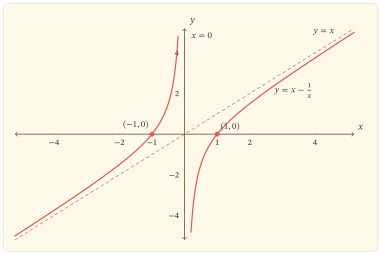

Viết hàm số dưới dạng

$$
f(x)=x-\frac{1}{x}, \qquad x\ne 0,
$$

ta thấy hai tác động trái chiều: số hạng $x$ kéo giá trị theo đầu vào, còn $-1/x$ trở nên quyết định khi $x$ tiến gần $0$. Sự tách miền tại $0$ tạo ra hai nhánh; điều đáng chú ý là mỗi nhánh đều đồng biến và đều đi qua mọi độ cao. Vì thế, mỗi giá trị của hàm xuất hiện một lần trên từng nhánh.

## Hai đầu vào cho cùng một đầu ra

Miền xác định là

$$
D=\mathbb{R}\setminus\{0\}=(-\infty,0)\cup(0,+\infty).
$$

Hai thành phần của miền không đứng tách biệt về mặt giá trị. Với mọi $x\in D$,

$$
\begin{aligned}
f\left(-\frac{1}{x}\right)
&=-\frac{1}{x}+x\\
&=f(x).
\end{aligned}
$$

Phép biến đổi $x\mapsto-1/x$ đổi dấu đầu vào, đưa mỗi điểm của nhánh dương sang nhánh âm và khi thực hiện hai lần thì trở lại điểm ban đầu. Nó không có điểm cố định thực, bởi phương trình $x=-1/x$ tương đương $x^2=-1$. Do đó, các đầu vào được ghép thành từng cặp phân biệt

$$
\left\{x,-\frac{1}{x}\right\},
$$

và hai phần tử trong mỗi cặp cho cùng một giá trị hàm.

Quan hệ này mới cho biết ít nhất hai đầu vào có thể cùng đầu ra. Để chứng minh không còn đầu vào thứ ba, xét phương trình $f(x)=y$ với $y\in\mathbb{R}$:

$$
x-\frac{1}{x}=y
\Leftrightarrow x^2-yx-1=0.
$$

Biệt thức $\Delta=y^2+4$ luôn dương. Phương trình có đúng hai nghiệm thực

$$
x_-(y)=\frac{y-\sqrt{y^2+4}}{2}<0.
$$

Đầu vào còn lại là

$$
x_+(y)=\frac{y+\sqrt{y^2+4}}{2}>0.
$$

Tích hai nghiệm bằng $-1$, nên $x_-(y)=-1/x_+(y)$. Như vậy, với mỗi $y\in\mathbb{R}$, phương trình $f(x)=y$ có đúng hai nghiệm, một âm và một dương. Đặc biệt, tập giá trị của $f$ là $\mathbb{R}$.

## Mỗi nhánh đi qua mọi độ cao

Trên từng thành phần của miền, hàm liên tục và

$$
f^\prime(x)=1+\frac{1}{x^2}>0.
$$

Vì thế, $f$ đồng biến nghiêm ngặt trên $(-\infty,0)$ và trên $(0,+\infty)$. Không thể gộp hai khoảng thành một phát biểu đồng biến trên toàn $D$: chẳng hạn $-1<1$ nhưng $f(-1)=f(1)=0$.

Ở gần điểm bị loại, hai nhánh có hành vi trái chiều:

$$
\lim_{x\to0^-}f(x)=+\infty.
$$

Ở phía bên kia,

$$
\lim_{x\to0^+}f(x)=-\infty.
$$

Ở đầu còn lại của mỗi nhánh,

$$
\lim_{x\to-\infty}f(x)=-\infty,
\qquad
\lim_{x\to+\infty}f(x)=+\infty.
$$

Do $f$ liên tục và đồng biến nghiêm ngặt trên từng khoảng, các cặp giới hạn

$$
\lim_{x\to-\infty}f(x)=-\infty,
\qquad
\lim_{x\to0^-}f(x)=+\infty
$$

và

$$
\lim_{x\to0^+}f(x)=-\infty,
\qquad
\lim_{x\to+\infty}f(x)=+\infty
$$

cho thấy mỗi nhánh nhận mọi giá trị thực đúng một lần. Kết luận này đồng thời khép kín cách nhìn từ phương trình $f(x)=y$: mỗi giá trị $y$ ứng với một nghiệm trên nhánh âm và một nghiệm trên nhánh dương.

Ở xa gốc tọa độ, sai lệch so với đường thẳng $y=x$ là

$$
f(x)-x=-\frac{1}{x}\longrightarrow 0
\qquad (x\to\pm\infty).
$$

Do đó, $x=0$ là tiệm cận đứng, đồng thời là đường biên phân cách hai nhánh; $y=x$ là tiệm cận xiên. Trên nhánh dương, $f(x)<x$; trên nhánh âm, $f(x)>x$. Hai nghiệm $x=-1$ và $x=1$ cùng cho giá trị $0$, đúng với quy luật ghép cặp.

Độ cong bổ sung cho hình dạng ấy:

$$
f^{\prime\prime}(x)=-\frac{2}{x^3}.
$$

Nhánh âm lồi, nhánh dương lõm. Không có cực trị trên từng nhánh vì đạo hàm không đổi dấu.

## Đồ thị kết tinh các quan hệ

::: {.content-visible when-format="html"}
{#fig-do-thi-ham-x-tru-mot-tren-x fig-alt="Đồ thị gồm hai nhánh của hàm số y bằng x trừ một trên x. Nhánh âm tăng từ âm vô cực lên dương vô cực; nhánh dương tăng từ âm vô cực lên dương vô cực. Hai nhánh đi qua âm một phẩy không và một phẩy không, đồng thời tiến gần đường thẳng y bằng x khi trị tuyệt đối của x tăng."}
:::

::: {.content-visible when-format="pdf"}
{#fig-do-thi-ham-x-tru-mot-tren-x-pdf fig-alt="Đồ thị gồm hai nhánh của hàm số y bằng x trừ một trên x, với tiệm cận đứng x bằng không và tiệm cận xiên y bằng x."}
:::

Đồ thị trên không được suy ra từ vài điểm riêng lẻ. Hai nhánh của nó dựa đồng thời trên tính liên tục, chiều biến thiên, các giới hạn tại $0$, tiệm cận xiên và độ cong. Một đường thẳng ngang bất kì cắt mỗi nhánh đúng một lần; hoành độ của hai giao điểm có tích bằng $-1$.

Hàm còn là hàm lẻ vì $f(-x)=-f(x)$. Đối xứng tâm qua gốc tọa độ mô tả quan hệ giữa giá trị tại hai đầu vào đối nhau; còn phép ghép $x\mapsto-1/x$ mô tả hai đầu vào cho cùng một giá trị. Đây là hai quan hệ khác nhau và cùng hiện diện trên đồ thị.

::: {.zo-block .zo-block-gray}
::: {.zo-block-title}
Một cách đọc không nên lẫn
:::

Mỗi nhánh riêng là song ánh từ khoảng xác định của nó lên $\mathbb{R}$. Trên toàn miền $D$, hàm là toàn ánh lên $\mathbb{R}$ nhưng không đơn ánh: phương trình $f(x)=y$ có đúng hai nghiệm với mọi $y\in\mathbb{R}$. Vì vậy, “đồng biến trên từng nhánh” không kéo theo “đơn ánh trên toàn miền không liên thông”.
:::

## Điều còn lại sau phép khảo sát

Cấu trúc $x-1/x$ cho thấy sự không đơn ánh không nhất thiết đến từ một điểm ngoặt. Ở đây, mỗi nhánh không hề đổi chiều; sự lặp lại giá trị xuất hiện vì miền có hai thành phần và một phép ghép chính xác nối chúng. Khi gặp một hàm có nhiều nhánh, câu hỏi hữu ích không chỉ là mỗi nhánh biến thiên thế nào, mà còn là có quan hệ nào ghép các đầu vào ở những nhánh khác nhau hay không.

## Bài tập

### Tái dựng cơ chế ghép cặp

#### Bài 1

Không dùng công thức nghiệm, hãy chứng minh rằng nếu $u,v\in D$ và $f(u)=f(v)$ thì $u=v$ hoặc $uv=-1$.

Gợi ý

Biến đổi $u-1/u=v-1/v$ rồi phân tích thành nhân tử theo $u-v$.

#### Bài 2

Tìm hai nghiệm của phương trình $f(x)=2$ và kiểm tra tích của chúng. Xác định nghiệm nào thuộc nhánh âm, nghiệm nào thuộc nhánh dương.

Đáp án để đối chiếu

Hai nghiệm là $1-\sqrt2$ và $1+\sqrt2$; tích của chúng bằng $-1$.

### Mở rộng từ cấu trúc của hàm

#### Bài 3

Với $a>0$, xét $f_a(x)=x-a/x$ trên $\mathbb{R}\setminus\{0\}$. Tìm phép biến đổi ghép hai đầu vào khác dấu cho cùng một đầu ra, rồi xác định số nghiệm của phương trình $f_a(x)=y$ với mỗi $y\in\mathbb{R}$.

Gợi ý và kết quả

Kiểm tra phép ghép $x\mapsto-a/x$. Phương trình $f_a(x)=y$ tương đương $x^2-yx-a=0$, có hai nghiệm trái dấu với mọi $y$.

#### Bài 4

Trên mỗi nhánh của đồ thị, hãy tìm hàm ngược của phép hạn chế tương ứng và giải thích vì sao hai công thức nghịch đảo phải chọn hai dấu khác nhau trước căn thức.
