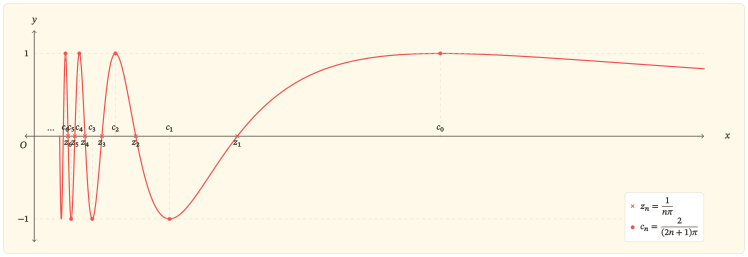
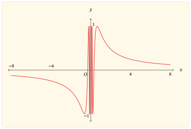
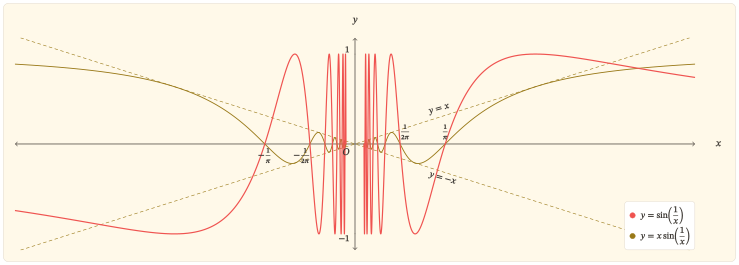

## Hai nhịp điệu trong một công thức

Xét hàm

$$
f(x)=\sin\left(\frac{1}{x}\right).
$$

Trong bài viết này, **hàm sin** chỉ hàm quen thuộc thường được viết là $y=\sin x$, còn **hàm $f$** chỉ hàm đang được khảo sát ở trên, $y=\sin\left(\frac{1}{x}\right)$. Khi cần tách rõ hai tầng của công thức, đặt

$$
u=\frac{1}{x}.
$$

Khi đó, $x$ là đầu vào của hàm $f$, còn $u$ là đầu vào được đưa vào hàm sin; giá trị cuối cùng là $f(x)=\sin u$.

Sự xuất hiện của hàm sin gợi nhớ một nhịp điệu quen thuộc: những dao động đều đặn, lặp lại sau mỗi chu kì. Tuy nhiên, trong hàm $f$, đầu vào $x$ không được đưa thẳng vào hàm sin. Phép nghịch đảo biến $x$ thành $u=\frac{1}{x}$ trước. Sự thay đổi nhỏ trong công thức ấy tạo nên hai cảnh tượng trái ngược trên cùng một đồ thị.

Khi đầu vào $x$ của hàm $f$ nằm rất xa $0$, dù về phía dương hay phía âm, $u=\frac{1}{x}$ lại ở rất gần $0$. Trong vùng này, giá trị $\sin u$ gần với $u$. Vì vậy, giá trị của hàm $f$ ngày càng gần $0$, khiến hai phần đồ thị ở xa trục tung dần áp sát trục hoành.

Khi $x$ tiến sát $0$ từ một trong hai phía, tình hình đảo ngược: độ lớn của $u=\frac{1}{x}$ tăng lên không giới hạn. Đầu vào $u$ đi qua ngày càng nhiều chu kì của hàm sin. Đồ thị của $f$ vẫn vươn tới hai mức $1$ và $-1$, nhưng những dao động ấy không còn trải đều trên trục $x$. Càng gần $0$, chúng càng nằm trong những khoảng hẹp hơn và dồn sít quanh trục tung. Phép nghịch đảo không làm mất cái vô hạn của sóng sin; nó chỉ đổi cách cái vô hạn ấy hiện diện: từ vô số chu kì trải dài về vô cực trên trục $u$ thành vô số dao động dồn tụ về phía $x=0$ trên trục $x$. Trong mỗi khoảng quanh $0$, dù hẹp đến đâu, phần đồ thị ở hai phía vẫn chứa vô hạn dao động.

Hàm $f$ vì thế không tuần hoàn theo $x$, dù vẫn mang nhịp dao động quen thuộc của hàm sin. Phần còn lại của bài sẽ làm rõ vì sao phép nghịch đảo khiến đồ thị áp sát trục hoành ở xa nhưng dồn sít vô hạn gần $0$.

## Những điều đầu tiên hiện ra từ công thức

Công thức $f(x)=\sin\left(\frac{1}{x}\right)$ có thể được đọc từ trong ra ngoài. Phép nghịch đảo được thực hiện trước, rồi giá trị $u=\frac{1}{x}$ được đưa vào hàm sin. Mỗi thành phần vì thế đặt lên hàm $f$ một ràng buộc riêng: phép nghịch đảo quyết định những đầu vào $x$ nào có thể được sử dụng, còn hàm sin giới hạn những giá trị mà $f$ có thể nhận.

### Hàm $f$ có nghĩa ở đâu và nhận những giá trị nào?

Tại $x=0$, nghịch đảo của $x$ không tồn tại. Với mọi số thực khác $0$, giá trị $u=\frac{1}{x}$ được xác định và có thể được đưa vào hàm sin. Vì vậy, tập xác định của hàm $f$ gồm tất cả các số thực khác $0$:

$$
D=(-\infty,0)\cup(0,+\infty).
$$

Việc loại $0$ khỏi tập xác định để lại một dấu vết rõ ràng trên đồ thị: đồ thị không có điểm nào nằm trên trục tung và được chia thành hai phần ở hai phía của trục này.

Trên mỗi khoảng $(-\infty,0)$ và $(0,+\infty)$, giá trị $u=\frac{1}{x}$ thay đổi liên tục theo $x$, còn hàm sin liên tục theo đầu vào $u$. Vì vậy, hàm $f$ liên tục tại mọi điểm thuộc tập xác định của nó.

Khi đầu vào $x$ thay đổi trên tập xác định của $f$, $u=\frac{1}{x}$ nhận mọi giá trị thực khác $0$. Dù $u=0$ không xuất hiện, hàm sin vẫn nhận mọi giá trị từ $-1$ đến $1$ tại những đầu vào khác $0$. Bởi vậy, tập giá trị của hàm $f$ là

$$
[-1,1].
$$

Toàn bộ đồ thị nằm trong dải giới hạn bởi hai đường thẳng $y=-1$ và $y=1$, đồng thời thực sự chạm tới cả hai đường biên ấy.

### Một nửa đồ thị soi chiếu nửa còn lại

Tập xác định đối xứng qua $0$: cùng với mỗi $x\ne0$, số $-x$ cũng thuộc tập xác định. Thay $x$ bằng $-x$ trong công thức, ta có

$$
\begin{aligned}
f(-x)
&=\sin\left(\frac{1}{-x}\right)\\
&=\sin\left(-\frac{1}{x}\right)\\
&=-\sin\left(\frac{1}{x}\right)\\
&=-f(x).
\end{aligned}
$$

Hàm $f$ vì thế là hàm lẻ, có đồ thị nhận gốc tọa độ làm tâm đối xứng. Bản thân gốc tọa độ không thuộc đồ thị, nhưng vẫn là tâm của phép đối xứng ấy.

Mỗi điểm có hoành độ dương tương ứng với một điểm có hoành độ âm, trong đó cả hoành độ và tung độ đều đổi dấu. Do đó, khi đã hiểu đồ thị trên nửa trục dương, có thể dựng phần còn lại bằng phép đối xứng qua gốc tọa độ.

### Vì sao hàm $f$ không tuần hoàn?

Sự xuất hiện của hàm sin trong công thức có thể gợi cảm giác rằng hàm $f$ sẽ tuần hoàn theo một chu kì nào đó, cho dù không phải là $2\pi$ như hàm sin. Nhưng sự thật thì không phải thế. Muốn tuần hoàn, toàn bộ đồ thị phải lặp lại sau một độ dời ngang cố định.

 
Định nghĩa hàm tuần hoàn
 

Hàm $f$ có tập xác định $D$ được gọi là tuần hoàn nếu tồn tại một số $T\ne 0$ sao cho với mọi $x\in D$, hai điều kiện:

$$
x+T\in D,\ x-T\in D
$$

và

$$
f(x+T)=f(x)
$$

đồng thời thỏa mãn.

Mỗi số $T$ thỏa mãn các điều kiện trên được gọi là một chu kì của hàm $f$.

Nếu tồn tại $T_0>0$ nhỏ nhất trong tất cả các chu kì dương, thì $T_0$ được gọi là *chu kì cơ sở*.

 

Xét một độ dời ngang bất kì $T\ne 0$. Vì $-T\ne0$, hàm $f$ xác định tại $x=-T$, nên đồ thị có một điểm mang hoành độ $-T$. Nếu toàn bộ đồ thị lặp lại sau độ dời $T$, điểm ấy khi được tịnh tiến theo phương ngang một lượng $T$ phải trùng với một điểm khác của đồ thị có hoành độ

$$
-T+T=0.
$$

Nhưng hàm $f$ không xác định tại $x=0$, nên đồ thị không có bất kì điểm nào mang hoành độ $0$. Vì thế, sau độ dời $T$, đồ thị không thể trùng với chính nó.

Lập luận này đúng với mọi $T\ne 0$. Do đó, không có một độ dời ngang khác $0$ nào làm toàn bộ đồ thị lặp lại. Hàm $f$ không tuần hoàn.

## Phép nghịch đảo tạo nên hai hành vi đối nghịch

Những kết quả trên cho phép thu gọn việc khảo sát về nửa trục dương. Nhánh nằm trên nửa trục âm được suy ra từ tính lẻ và phép đối xứng qua gốc tọa độ.

Trên nửa trục dương, khi đầu vào $x$ của hàm $f$ thay đổi, đầu vào $u=\frac{1}{x}$ của hàm sin chuyển động theo hai hướng trái ngược. Khi $x$ tiến ra vô cực, $u$ trở về $0$. Khi $x$ tiến về $0$, $u$ tăng không bị chặn và đi qua vô hạn chu kì. Đây là các chu kì của hàm sin khi đầu vào $u$ thay đổi, không phải các chu kì của hàm $f$ theo đầu vào $x$.

### Dịu êm

Nếu $x\to +\infty$ thì $u=\frac{1}{x}\to 0$. Tính liên tục của hàm sin tại $0$ cho phép kết luận

$$
\lim_{x\to+\infty}\sin\left(\frac{1}{x}\right)=0.
$$

Từ tính lẻ của hàm $f$, giới hạn ở phía bên trái cũng bằng $0$. Vì vậy, đường thẳng $y=0$ là tiệm cận ngang của đồ thị của hàm $f$ ở cả bên trái lẫn bên phải.

Giới hạn cơ bản

$$
\lim_{u\to 0}\frac{\sin u}{u}=1
$$

còn cho một mô tả chính xác hơn:

$$
\lim_{x\to\pm\infty}
\frac{\sin\left(\frac{1}{x}\right)}{\frac{1}{x}}
=1.
$$

Nó nói rằng tỉ số giữa $\sin\left(\frac{1}{x}\right)$ và $\frac{1}{x}$ tiến về $1$. Vì vậy, khi độ lớn của $x$ tăng, giá trị của hàm $f$ ngày càng gần $\frac{1}{x}$.

Ở xa gốc tọa độ, đồ thị của $f$ không chỉ tiến về trục hoành mà còn bám sát đồ thị $y=\frac{1}{x}$.

Trên nửa trục dương, nếu $x>\frac{2}{\pi}$ thì

$$
0<\frac{1}{x}<\frac{\pi}{2}.
$$

Đầu vào $u=\frac{1}{x}$ lúc này chỉ nằm trong phần đầu của một chu kì của hàm sin. Khi $x$ tăng, $u$ giảm trong khoảng $\left(0,\frac{\pi}{2}\right)$, còn hàm sin đồng biến khi đầu vào $u$ tăng trên khoảng ấy. Vì $u$ chuyển động theo chiều ngược lại, hàm $f$ nghịch biến trên $\left(\frac{2}{\pi},+\infty\right)$ và tiến dần về $0$.

Sự “lặng dần” ở vô cực không phải là một chuỗi dao động vẫn tiếp diễn với biên độ nhỏ dần. Ở phần đuôi này, đầu vào $u=\frac{1}{x}$ không còn đi qua thêm bất kì chu kì nào của hàm sin; đồ thị của $f$ chỉ còn một nhánh đơn điệu tiến về tiệm cận ngang.

### Dữ dội

Nếu $x\to 0^+$ thì $u=\frac{1}{x}\to +\infty$. Đầu vào $u$ vì thế đi qua hết chu kì này đến chu kì khác của hàm sin. Những mốc cách đều nhau trên trục $u$ xuất hiện ngày càng gần nhau khi được đưa trở lại trục $x$.

#### Nghiệm và cực trị xen kẽ

Các nghiệm dương của hàm $f$ được xác định bởi

$$
\frac{1}{x}=n\pi,
\quad n=1,2,3,\ldots
$$

Do đó, đặt

$$
z_n=\frac{1}{n\pi},
\quad n=1,2,3,\ldots
$$

thì $f(z_n)=0$ và $z_n\to 0^+$.

Giữa hai nghiệm dương liên tiếp bất kì có đúng một mốc tại đó hàm $f$ đạt một trong hai giá trị biên $1$ hoặc $-1$. Quy luật này bắt đầu bằng một mốc nằm bên phải nghiệm $z_1$. Đặt

$$
c_n=\frac{2}{(2n+1)\pi},
\quad n=0,1,2,\ldots
$$

thì $f(c_n)=(-1)^n$ và $c_n\to 0^+$.

Vì tập giá trị của $f$ là $[-1,1]$, với $m=0,1,2,\ldots$, các điểm $\left(c_{2m},1\right)$ là điểm cực đại, còn các điểm $\left(c_{2m+1},-1\right)$ là điểm cực tiểu. Các nghiệm và hoành độ cực trị sắp xếp theo thứ tự

$$
0<\cdots<c_2<z_2<c_1<z_1<c_0<+\infty.
$$

Như vậy, khi đi từ phải sang trái về phía $0$, đồ thị đi qua điểm cực đại thứ nhất là

$$
(c_0,1)=\left(\frac{2}{\pi},1\right),
$$

tiếp theo là điểm giao trục hoành thứ nhất

$$
(z_1,0)=\left(\frac{1}{\pi},0\right),
$$

rồi đến điểm cực tiểu thứ nhất

$$
(c_1,-1)=\left(\frac{2}{3\pi},-1\right).
$$

Sau đó, đồ thị lần lượt đi qua $(z_2,0)$, $(c_2,1)$, $(z_3,0)$, $(c_3,-1)$, và tiếp tục theo cùng quy luật.

Các nghiệm luôn xen giữa hai cực trị liên tiếp, còn cực đại và cực tiểu luân phiên nhau. Những mốc này tạo thành một dãy vô hạn cùng hội tụ về $0$ từ phía bên phải, nhưng không mốc nào chạm trục tung.

:::: {.content-visible when-format="html"}

::: {.column-screen-inset-shaded #fig-sin-mot-tren-x-phong-dai}
{fig-alt="Nhánh dương của đồ thị hàm sin một trên x gần $0$, với các nghiệm và cực trị xen kẽ, cùng dồn về $0$; hình chỉ biểu diễn một số hữu hạn dao động." width=100% fig-align="center"}

Các nghiệm $z_n$ và hoành độ cực trị $c_n$ xen kẽ, cùng dồn về $0$ trên nửa trục dương.
:::

::::

:::: {.content-visible when-format="pdf"}

::: {#fig-sin-mot-tren-x-phong-dai}
{fig-alt="Nhánh dương của đồ thị hàm sin một trên x gần $0$, với các nghiệm và cực trị xen kẽ, cùng dồn về $0$; hình chỉ biểu diễn một số hữu hạn dao động." width=85% fig-align="center"}

Các nghiệm $z_n$ và hoành độ cực trị $c_n$ xen kẽ, cùng dồn về $0$ trên nửa trục dương.
:::

::::

#### Phương ngang co lại, phương dọc giữ nguyên

Khoảng cách giữa hai nghiệm dương liên tiếp là

$$
\begin{aligned}
z_n-z_{n+1}
&=\frac{1}{n\pi}-\frac{1}{(n+1)\pi}\\
&=\frac{1}{\pi n(n+1)}.
\end{aligned}
$$

Do đó,

$$
z_n-z_{n+1}\to0.
$$

Hai nghiệm liên tiếp của hàm sin cách nhau $\pi$ trên trục $u$. Trong hàm $f$, đầu vào của hàm sin là $u=\frac{1}{x}$, nên bề rộng tương ứng trên trục $x$ co dần về $0$. Đây là dấu vết định lượng của sự dồn sít theo phương ngang.

Sự co lại ấy không diễn ra theo phương đứng. Với mọi $m=0,1,2,\ldots$,

$$
f(c_{2m})=1,
\quad
f(c_{2m+1})=-1.
$$

Các nhịp sóng ngày càng hẹp nhưng vẫn chạm cả hai mức biên. Biên độ vẫn bằng $1$, và khoảng cách từ đáy đến đỉnh vẫn bằng $2$.

#### Giới hạn tại $0$ không tồn tại

Với $n=0,1,2,\ldots$, hai dãy $\left(c_{2n}\right)$ và $\left(c_{2n+1}\right)$ cùng thỏa mãn

$$
c_{2n}\to 0^+,
\quad
c_{2n+1}\to 0^+,
$$

nhưng

$$
f(c_{2n})=1,
\quad
f(c_{2n+1})=-1.
$$

Nếu giới hạn bên phải của hàm $f$ tại $0$ tồn tại, giá trị của $f$ dọc theo mọi dãy tiến về $0^+$ phải tiến đến cùng một số. Hai dãy trên cho hai giá trị khác nhau, nên

$$
\lim_{x\to 0^+}\sin\left(\frac{1}{x}\right)
$$

*không tồn tại*. Vì vậy, không thể bổ sung bất kì giá trị nào tại $x=0$ để làm cho hàm $f$ liên tục ở đó.

Dù vậy,

$$
\left\lvert\sin\left(\frac{1}{x}\right)\right\rvert\leq1.
$$

Đường thẳng $x=0$ không phải là tiệm cận đứng. Khi tiến gần điểm bị loại này, đồ thị không vọt ra vô cực mà dao động vô hạn lần trong dải $-1\leq y\leq 1$.

Không chỉ hai mức $-1$ và $1$

Hai dãy cực trị cho thấy hàm $f$ vẫn đạt hai giá trị $1$ và $-1$ tại những điểm ngày càng gần $0$. Nhưng hiện tượng này không chỉ xảy ra với hai mức biên ấy.

Chọn một mức bất kì $L\in[-1,1]$. Vì tập giá trị của hàm sin là $[-1,1]$, tồn tại một số

$$
t\in\left[-\frac{\pi}{2},\frac{\pi}{2}\right]
$$

sao cho $\sin t=L$.

Do hàm sin có chu kì $2\pi$, ta có

$$
\sin(t+2n\pi)=\sin t=L,
\quad n=1,2,3,\ldots
$$

Trong khi đó, $t+2n\pi\to+\infty$. Đặt

$$
x_n=\frac{1}{t+2n\pi}.
$$

Khi ấy, $x_n\to0^+$ và

$$
f(x_n)
=\sin\left(\frac{1}{x_n}\right)
=\sin(t+2n\pi)
=L.
$$

Như vậy, với mỗi mức $L\in[-1,1]$, luôn có một dãy đầu vào tiến về $0^+$ mà trên đó giá trị của $f$ luôn bằng đúng $L$. Nói theo hình học, mỗi đường thẳng $y=L$ với $-1\leq L\leq1$ đều cắt đồ thị tại vô hạn điểm dồn về phía trục tung.

Sự thất bại của giới hạn tại $0$ vì thế không chỉ được thể hiện qua hai mức $-1$ và $1$. Tùy theo dãy đầu vào được chọn, giá trị của hàm có thể trở lại vô hạn lần tại bất kì mức nào trong dải $[-1,1]$.

## Từ biến thiên đến toàn cảnh đồ thị

Các dãy $z_n$ và $c_n$ đã xác định những mốc quan trọng của mỗi nhịp sóng. Đạo hàm sẽ nối các mốc ấy thành quy luật biến thiên, rồi toàn bộ kết quả được kết tinh trong hình dạng của đồ thị.

### Các nhịp đi lên và đi xuống

Với $x\ne 0$,

$$
f^\prime(x)
=-\frac{1}{x^2}\cos\left(\frac{1}{x}\right).
$$

Thừa số $\frac{1}{x^2}$ luôn dương, nên dấu của $f^\prime(x)$ ngược với dấu của $\cos\left(\frac{1}{x}\right)$. Với $n=0,1,2,\ldots$, trên khoảng $(c_{n+1},c_n)$,

$$
\frac{(2n+1)\pi}{2}
<
\frac{1}{x}
<
\frac{(2n+3)\pi}{2}.
$$

Do đó, dấu của $f^\prime(x)$ trên $(c_{n+1},c_n)$ là $(-1)^n$. Vì thế, với $n$ chẵn, hàm $f$ đồng biến trên khoảng này; với $n$ lẻ, hàm $f$ nghịch biến. Trên phần đuôi $\left(c_0,+\infty\right)$, hàm $f$ nghịch biến.

Dấu đạo hàm cho thấy các số $c_n$ không chỉ là những đầu vào tại đó hàm $f$ đạt hai giá trị biên. Chúng còn là những đầu vào tại đó đồ thị đổi chiều: $c_{2m}$ là hoành độ của một cực đại, còn $c_{2m+1}$ là hoành độ của một cực tiểu.

Trên nửa trục âm, công thức đạo hàm cho $f'(-x)=f^\prime(x)$. Vì vậy, các khoảng đơn điệu trên nửa trục dương được phản chiếu qua gốc tọa độ thành những khoảng đơn điệu tương ứng trên nửa trục âm. Hàm $f$ có vô hạn khoảng đồng biến, vô hạn khoảng nghịch biến và vô hạn điểm cực trị ở cả hai phía của $0$; tất cả các điểm cực trị cùng dồn về $0$.

Một bảng biến thiên hữu hạn không thể liệt kê hết cấu trúc này. Dãy $c_n$ cùng quy luật chẵn–lẻ cho một cách biểu đạt trung thực hơn: không thu gọn vô hạn nhịp thành một số hữu hạn ô, nhưng vẫn xác định được toàn bộ cách đồ thị đi lên và đi xuống.

### Toàn cảnh và giới hạn của hình vẽ

Những kết quả đã chứng minh đặt ra các ràng buộc quyết định hình dạng đồ thị:

- đồ thị nằm trong dải $-1\leq y\leq 1$;
- đồ thị nhận gốc tọa độ làm tâm đối xứng nhưng không đi qua gốc tọa độ;
- đồ thị cắt trục hoành tại $x=\pm z_n=\pm\frac{1}{n\pi}$, với $n=1,2,3,\ldots$;
- đồ thị chạm hai đường biên $y=1$ và $y=-1$ tại các điểm có hoành độ $x=\pm c_n=\pm\frac{2}{(2n+1)\pi}$, với $n=0,1,2,3,\ldots$;
- các nghiệm, điểm cực trị và khoảng đơn điệu dồn vô hạn về hai phía của trục tung;
- khi $\lvert x\rvert\to \infty$, đồ thị bám sát $y=\frac{1}{x}$ và tiến về tiệm cận ngang $y=0$.

::: {#fig-sin-mot-tren-x-toan-canh}
{fig-alt="Đồ thị toàn cảnh của hàm sin một trên x, thể hiện các dao động dồn về 0 và hai nhánh tiến về trục hoành khi trị tuyệt đối của x tăng." width="85%"}

Đồ thị toàn cảnh của $y=\sin\left(\frac{1}{x}\right)$: các dao động dồn về $0$, còn hai nhánh tiến về trục hoành khi $\lvert x\rvert$ tăng.
:::

Hình toàn cảnh và hình phóng đại đảm nhiệm hai thang quan sát khác nhau. Hình toàn cảnh cho thấy đồng thời tính đối xứng, dải giá trị và hành vi ở vô cực; hình phóng đại làm lộ trật tự xen kẽ của nghiệm và cực trị gần $0$. Không hình nào có thể thay thế hình còn lại.

Ngay cả khi tiếp tục phóng đại, một hình vẫn chỉ biểu diễn được hữu hạn dao động. Kết quả $z_n-z_{n+1}\to0$ mới chứng minh rằng sau mọi nhịp đang nhìn thấy vẫn còn vô hạn nhịp khác nằm gần $0$ hơn.

Giới hạn ấy của hình vẽ cũng đặt ra một yêu cầu kĩ thuật. Nếu lấy các điểm cách đều trên trục $x$, hai điểm mẫu gần $0$ có thể nằm cách nhau qua nhiều nhịp sóng. Việc nối chúng bằng đoạn thẳng sẽ tạo ra đường gấp khúc giả hoặc bỏ qua nhiều lần đổi dấu. Cách dựng phù hợp là lấy mẫu theo đầu vào $u$ của hàm sin:

$$
u=\frac{1}{x},
\quad
(x,y)=\left(\frac{1}{u},\sin u\right),
$$

trên từng nhánh của đồ thị. Khi các điểm mẫu được phân bố theo $u$, mỗi chu kì của hàm sin được theo dõi trực tiếp. Việc dừng ở một giá trị hữu hạn của $u$ đồng thời làm rõ rằng hình chỉ biểu diễn một phần của vô hạn dao động.

## Dao động vô hạn với biên độ co về $0$

Việc hàm $f$ dao động vô hạn lần khi $x\to 0$ dễ gợi ra một câu hỏi: phải chăng cứ dao động vô hạn thì giới hạn không tồn tại? Để phân biệt vai trò của biên độ và số lần dao động đối với sự tồn tại của giới hạn, xét hàm

$$
g(x)=x\sin\left(\frac{1}{x}\right),
\quad x\ne0.
$$

Trong hàm $g$, đầu vào $u=\frac{1}{x}$ của hàm sin vẫn đi qua vô hạn chu kì khi $x\to 0$. Trong mọi khoảng quanh $0$, dù nhỏ đến đâu, hàm $g$ vẫn đổi dấu vô hạn lần. Tuy nhiên,

$$
\left\lvert x\sin\left(\frac{1}{x}\right)\right\rvert
\leq\lvert x\rvert.
$$

Vì thế, các dao động của $g$ bị giữ trong một dải co dần về trục hoành.

:::: {.content-visible when-format="html"}

::: {.column-screen-inset-shaded #fig-sin-mot-tren-x-soi-chieu}
{fig-alt="Đồ thị so sánh hàm sin một trên x với hàm x nhân sin một trên x và hai đường thẳng y bằng x, y bằng âm x." fig-align="center" width="100%"}

Soi chiếu hàm $f$ và hàm $g$: các dao động của $g$ nằm giữa hai đường thẳng $y=x$ và $y=-x$, rồi co dần về trục hoành.
:::

::::

:::: {.content-visible when-format="pdf"}

::: {#fig-sin-mot-tren-x-soi-chieu}
{fig-alt="Đồ thị so sánh hàm sin một trên x với hàm x nhân sin một trên x và hai đường thẳng y bằng x, y bằng âm x." width="85%"}

Soi chiếu hàm $f$ và hàm $g$: các dao động của $g$ nằm giữa hai đường thẳng $y=x$ và $y=-x$, rồi co dần về trục hoành.
:::

::::

Ta có

$$
-\lvert x\rvert
\leq
x\sin\left(\frac{1}{x}\right)
\leq
\lvert x\rvert
$$

và cả hai biểu thức ở hai đầu đều tiến về $0$ khi $x\to 0$. Giá trị ở giữa vì thế cũng phải tiến về $0$. Lập luận này được gọi là định lí kẹp. Do đó,

$$
\lim_{x\to 0}x\sin\left(\frac{1}{x}\right)=0.
$$

Bổ sung $g(0)=0$ thì hàm $g$ liên tục trên $\mathbb{R}$. Sự hiện diện của vô hạn dao động vì thế chưa đủ để kết luận rằng giới hạn không tồn tại. Đối với hàm $f$, giới hạn thất bại vì các dao động dồn sít vẫn giữ nguyên biên độ; đối với hàm $g$, biên độ co về $0$ nên mọi dao động cùng bị ép về một giá trị.

## Kết tinh

Trong hàm $f$, đầu vào của hàm sin không còn là $x$ trực tiếp mà là $u=\frac{1}{x}$. Sự thay đổi này phân bố lại các gợn sóng khác nhau, nhưng vẫn giữ nguyên biên độ dao động của hàm sin trên trục $x$. Khi $\lvert x\rvert$ lớn, $u$ nằm trong một khoảng nhỏ quanh $0$, nên đồ thị của $f$ chỉ còn những nhánh đơn điệu bám sát $y=\frac{1}{x}$ và tiến về tiệm cận ngang. Khi $x$ tiến về $0$, $u$ đi qua vô hạn chu kì; vô số nghiệm, điểm cực trị và khoảng đơn điệu vì thế dồn vào mọi khoảng quanh trục tung. Trên đoạn $\left[-\frac{2}{\pi},\frac{2}{\pi}\right]$, có thể quan sát các cực trị ngoài cùng cùng sự dồn sít của các dao động về $0$; để thấy hai nhánh tiến về tiệm cận ngang, vẫn cần một cửa sổ rộng hơn.

Phép nghịch đảo quyết định mật độ dao động theo phương ngang, nhưng không làm thay đổi biên độ của hàm sin. Các mức $1$ và $-1$ vẫn xuất hiện dọc theo những dãy cùng tiến về $0$, nên giới hạn tại đó không tồn tại. Đạo hàm và đồ thị biểu hiện cùng một cơ chế: vô hạn lần đổi chiều được nén vào một khoảng ngày càng hẹp.

Phép soi chiếu với hàm $y=x\sin\left(\frac{1}{x}\right)$ làm rõ yếu tố còn lại. Một hàm có thể dao động vô hạn lần mà vẫn có giới hạn nếu biên độ của các dao động co về $0$. Vì vậy, khi khảo sát một hàm dao động gần một điểm, cần phân biệt hai câu hỏi: các nhịp dao động dồn sít đến mức nào, và độ lớn của chúng có đồng thời suy giảm hay không.

## Bài tập

Hệ thống bài tập tiếp tục mạch của bài viết qua ba chặng. Chặng đầu giúp tự dựng lại toàn bộ hàm $f$. Chặng thứ hai hoàn tất những chi tiết mà bài viết chỉ mới nêu hoặc giải thích bằng trực giác. Chặng cuối chuyển các kết quả đã có sang những hàm gần gũi, rồi đi đến hai cơ chế tổng quát: đầu vào của hàm sin quyết định mật độ dao động, còn nhân tử bên ngoài quyết định độ lớn của dao động.

Mười bốn bài được sắp xếp theo quan hệ phụ thuộc. Vì vậy, nên thực hiện theo thứ tự thay vì chọn riêng những câu có vẻ quen thuộc.

### Tái dựng toàn bộ hàm $f$

#### Bài 1. Những ràng buộc đầu tiên từ công thức

Xét

$$
f(x)=\sin\left(\frac{1}{x}\right).
$$

a. Xác định tập xác định của hàm $f$. Giải thích vì sao $f$ liên tục trên từng khoảng $(-\infty,0)$ và $(0,+\infty)$.

b. Chứng minh tập giá trị của $f$ là $[-1,1]$. Trong chứng minh, cần chỉ ra cả hai điều: $f$ không thể nhận giá trị nằm ngoài đoạn này và mọi giá trị trong đoạn này đều thực sự được nhận.

c. Chứng minh $f$ là hàm lẻ và nêu phép đối xứng tương ứng của đồ thị.

d. Giả sử $T\ne0$ là một chu kì của $f$. Xét đầu vào $x=-T$ để chỉ ra mâu thuẫn với tập xác định. Từ đó, chứng minh $f$ không tuần hoàn.

e. Giải thích vì sao kết luận ở câu d không mâu thuẫn với việc đầu vào $\frac{1}{x}$ đi qua vô hạn chu kì của hàm sin khi $x\to0$.

#### Bài 2. Phần đuôi của đồ thị

a. Tính

$$
\lim_{x\to+\infty}f(x)
\quad\text{và}\quad
\lim_{x\to-\infty}f(x).
$$

Từ đó, xác định tiệm cận ngang của đồ thị.

b. Dùng giới hạn

$$
\lim_{u\to0}\frac{\sin u}{u}=1
$$

để chứng minh

$$
\lim_{x\to\pm\infty}
\frac{\sin\left(\frac{1}{x}\right)}{\frac{1}{x}}
=1.
$$

c. Chứng minh thêm

$$
\lim_{x\to\pm\infty}
\left[
\sin\left(\frac{1}{x}\right)-\frac{1}{x}
\right]
=0.
$$

Hai kết quả ở câu b và câu c cùng mô tả sự gần nhau của đồ thị hàm $f$ và đồ thị $y=\frac{1}{x}$, nhưng không nói đúng cùng một điều. Hãy giải thích sự khác nhau.

d. Không dùng đạo hàm, hãy chứng minh $f$ nghịch biến trên $\left(\frac{2}{\pi},+\infty\right)$. Có thể theo dõi lần lượt sự thay đổi của $\frac{1}{x}$ và của hàm sin trên $\left(0,\frac{\pi}{2}\right)$.

#### Bài 3. Các mốc của những nhịp sóng

a. Tìm tất cả nghiệm của phương trình

$$
\sin\left(\frac{1}{x}\right)=0.
$$

Viết nghiệm dưới dạng $x=\frac{1}{k\pi}$, trong đó $k$ là số nguyên khác $0$.

b. Trên nửa trục dương, đặt

$$
z_n=\frac{1}{n\pi},
\quad n=1,2,3,\ldots
$$

và

$$
c_n=\frac{2}{(2n+1)\pi},
\quad n=0,1,2,\ldots
$$

Chứng minh

$$
c_{n-1}>z_n>c_n
\quad
\text{với }n=1,2,3,\ldots
$$

Từ đó, viết thứ tự xen kẽ của toàn bộ các số $z_n,c_n$ trên nửa trục dương.

c. Tính $f(c_n)$. Xác định những số $c_n$ là hoành độ của điểm cực đại và những số $c_n$ là hoành độ của điểm cực tiểu.

d. Tính khoảng cách $z_n-z_{n+1}$ và chứng minh khoảng cách này tiến về $0$. Giải thích ý nghĩa hình học của kết quả.

#### Bài 4. Nối các mốc bằng quy luật biến thiên

a. Tính đạo hàm $f^\prime(x)$ với $x\ne 0$.

b. Với $n=0,1,2,\ldots$, xác định dấu của $f^\prime(x)$ trên khoảng $(c_{n+1},c_n)$. Từ đó, viết quy luật các khoảng đồng biến và nghịch biến của $f$ trên $(0,+\infty)$ theo tính chẵn–lẻ của $n$.

c. Xác định chiều biến thiên trên $\left(c_0,+\infty\right)$.

d. Chứng minh $f^\prime(-x)=f^\prime(x)$. Dùng kết quả này để viết các khoảng đồng biến và nghịch biến tương ứng trên $(-\infty,0)$.

e. Xác định đầy đủ các điểm cực đại và cực tiểu của $f$ trên cả tập xác định.

#### Bài 5. Điều gì xảy ra khi tiến về $0$?

a. Dùng hai dãy $\left(c_{2n}\right)$ và $\left(c_{2n+1}\right)$ để chứng minh giới hạn bên phải của $f$ tại $0$ không tồn tại.

b. Dùng hai dãy $\left(-c_{2n}\right)$ và $\left(-c_{2n+1}\right)$ để chứng minh giới hạn bên trái của $f$ tại $0$ cũng không tồn tại.

c. Giải thích vì sao không thể bổ sung bất kì giá trị nào cho $f(0)$ để thu được một hàm liên tục tại $0$.

d. Chứng minh đường thẳng $x=0$ không phải là tiệm cận đứng của đồ thị, dù các dao động dồn vô hạn về đường thẳng này.

#### Bài 6. Dựng lại toàn cảnh đồ thị

Không nhìn lại hình trong bài, hãy thực hiện các công việc sau:

a. Lập một bản tóm tắt gồm tập xác định, tập giá trị, đối xứng, nghiệm, cực trị, chiều biến thiên, hành vi khi $x\to0^\pm$, hành vi khi $x\to\pm\infty$ và tiệm cận.

b. Từ bản tóm tắt, phác họa đồ thị trên một cửa sổ đủ rộng để thấy hai nhánh tiến về trục hoành.

c. Phác họa riêng nhánh dương trong một khoảng nhỏ gần $0$ để thể hiện trật tự xen kẽ của các nghiệm và cực trị.

d. Giải thích vì sao cần hai thang quan sát và vì sao không một hình hữu hạn nào có thể biểu diễn trọn vẹn vô hạn dao động gần $0$.

### Khép kín những điều còn để mở

#### Bài 7. Dấu của hàm giữa hai nghiệm liên tiếp

Với $n=1,2,3,\ldots$, xét khoảng $(z_{n+1},z_n)$.

a. Chứng minh rằng khi $x$ chạy trên khoảng này thì

$$
n\pi<\frac{1}{x}<(n+1)\pi.
$$

b. Suy ra $f(x)>0$ trên $(z_{n+1},z_n)$ khi $n$ chẵn và $f(x)<0$ trên khoảng ấy khi $n$ lẻ.

c. Chứng minh $c_n$ là hoành độ cực trị duy nhất nằm giữa hai nghiệm $z_{n+1}$ và $z_n$.

d. Dùng tính lẻ để suy ra dấu và vị trí cực trị trên các khoảng tương ứng ở nửa trục âm.

#### Bài 8. Không chỉ hai mức $-1$ và $1$

Cho trước một số $L\in[-1,1]$.

a. Chọn $t\in\left[-\frac{\pi}{2},\frac{\pi}{2}\right]$ sao cho $\sin t=L$ và đặt

$$
x_n=\frac{1}{t+2n\pi},
\quad n=1,2,3,\ldots
$$

Chứng minh $x_n\to0^+$ và $f(x_n)=L$ với mọi $n$.

b. Đặt

$$
y_n=\frac{1}{t-2n\pi},
\quad n=1,2,3,\ldots
$$

Chứng minh $y_n\to0^-$ và $f(y_n)=L$ với mọi $n$.

c. Từ hai kết quả trên, mô tả đầy đủ những mức giá trị còn tiếp tục xuất hiện khi đầu vào tiến về $0$ từ mỗi phía.

#### Bài 9. Điều hình vẽ có thể và không thể chứng minh

a. Dùng $z_n\to0^+$ và $c_n\to0^+$ để chứng minh rằng trong mọi khoảng $(0,\delta)$, với $\delta>0$, đều có vô hạn nghiệm và vô hạn điểm cực trị của $f$.

b. Với một số nguyên dương $N$, xét các đầu vào của hàm sin

$$
u_j=\frac{j\pi}{2},
\quad j=1,2,\ldots,2N+1,
$$

rồi chuyển chúng về trục $x$ bằng

$$
x_j=\frac{1}{u_j}=\frac{2}{j\pi}.
$$

Tính $f(x_j)$ và chỉ ra vì sao các điểm thu được lần lượt đánh dấu nghiệm và cực trị.

c. Giải thích vì sao lấy điểm cách đều theo $u$ theo dõi được từng nhịp của hàm sin, còn lấy điểm cách đều theo $x$ có thể bỏ qua nhiều nhịp gần $0$.

d. Phân biệt hai vai trò: hình vẽ biểu hiện một số dao động hữu hạn; công thức của các dãy chứng minh sự tồn tại của vô hạn dao động.

### Mở rộng và đào sâu

#### Bài 10. Dao động còn lại nhưng biên độ co về $0$

Xét

$$
g(x)=x\sin\left(\frac{1}{x}\right),
\quad x\ne0.
$$

a. Chứng minh $g$ có vô hạn nghiệm và đổi dấu vô hạn lần trong mọi khoảng quanh $0$.

b. Dùng bất đẳng thức

$$
\left\lvert g(x)\right\rvert\leq\lvert x\rvert
$$

để tính $\lim_{x\to0}g(x)$. Đặt thêm $g(0)=0$ và chứng minh hàm $g$ mới liên tục trên $\mathbb{R}$.

c. Xét giới hạn

$$
\lim_{x\to0}\frac{g(x)-g(0)}{x}.
$$

Chứng minh hàm $g$ không có đạo hàm tại $0$.

d. Giải thích vì sao kết quả này đồng thời cho thấy: vô hạn dao động không ngăn cản tính liên tục, nhưng vẫn có thể ngăn cản tính khả vi.

#### Bài 11. Khi biên độ co nhanh hơn

Xét hàm

$$
h(x)=
\begin{cases}
x^2\sin\left(\frac{1}{x}\right),&x\ne0,\\
0,&x=0.
\end{cases}
$$

a. Chứng minh $h$ liên tục tại $0$.

b. Dùng định nghĩa đạo hàm để chứng minh $h'(0)=0$.

c. Với $x\ne0$, chứng minh

$$
h'(x)
=2x\sin\left(\frac{1}{x}\right)
-\cos\left(\frac{1}{x}\right).
$$

d. Xét đạo hàm tại các điểm $z_n=\frac{1}{n\pi}$. Chứng minh $h^\prime(x)$ không tiến về $0$ khi $x\to0$, nên đạo hàm của $h$ không liên tục tại $0$.

e. Phân biệt ba kết luận: liên tục tại $0$, có đạo hàm tại $0$ và đạo hàm liên tục tại $0$.

#### Bài 12. Một họ hàm có biên độ là lũy thừa của $x$

Với $m$ là số nguyên không âm, xét

$$
f_m(x)=x^m\sin\left(\frac{1}{x}\right),
\quad x\ne0.
$$

Khi có thể, đặt thêm $f_m(0)=0$.

a. Chứng minh có thể mở rộng $f_m$ thành một hàm liên tục tại $0$ khi và chỉ khi $m\geq 1$.

b. Trong các trường hợp đã mở rộng liên tục, chứng minh $f_m$ có đạo hàm tại $0$ khi và chỉ khi $m\geq2$. Tính $f_m^\prime(0)$ khi đạo hàm tồn tại.

c. Với $x\ne 0$, tính $f_m^\prime(x)$. Chứng minh đạo hàm của hàm mở rộng liên tục tại $0$ khi và chỉ khi $m\geq3$.

d. Lập một bảng cho bốn trường hợp $m=0$, $m=1$, $m=2$ và $m\geq 3$, trong đó ghi rõ: khả năng mở rộng liên tục, sự tồn tại của đạo hàm tại $0$ và tính liên tục của đạo hàm tại $0$.

#### Bài 13. Thay đổi tốc độ của đầu vào

Với $r$ là số nguyên dương, xét

$$
q_r(x)=\sin\left(\frac{1}{x^r}\right),
\quad x\ne0.
$$

a. Xác định tập xác định và tập giá trị của $q_r$.

b. Chứng minh $q_r$ là hàm lẻ khi $r$ lẻ và là hàm chẵn khi $r$ chẵn.

c. Tìm các nghiệm dương của $q_r$. Chứng minh chúng có dạng

$$
p_n=\sqrt[r]{\frac{1}{n\pi}},
\quad n=1,2,3,\ldots
$$

và cùng tiến về $0$.

d. Xây dựng hai dãy đầu vào dương cùng tiến về $0$, trong đó $q_r$ luôn nhận giá trị $1$ trên một dãy và luôn nhận giá trị $-1$ trên dãy còn lại. Từ đó, chứng minh giới hạn của $q_r$ tại $0$ không tồn tại.

e. Trên khoảng $0<x<1$, so sánh $\frac{1}{x^r}$ với $\frac{1}{x}$ khi $r>1$. Giải thích vì sao việc tăng $r$ làm các chu kì của hàm sin được đi qua nhanh hơn khi $x$ tiến về $0$, nhưng không làm thay đổi biên độ dao động.

#### Bài 14. Cơ chế chung của nhân tử biên độ

Cho hàm $a$ xác định với mọi $x\ne0$ trong một khoảng quanh $0$ và thỏa mãn

$$
\lim_{x\to0}a(x)=0.
$$

a. Dùng bất đẳng thức

$$
\left\lvert
a(x)\sin\left(\frac{1}{x}\right)
\right\rvert
\leq\lvert a(x)\rvert
$$

để chứng minh

$$
\lim_{x\to0}
a(x)\sin\left(\frac{1}{x}\right)
=0.
$$

b. Nếu có thêm một hàm $b$ thỏa mãn $\lim_{x\to0}b(x)=B$, hãy chứng minh

$$
\lim_{x\to0}
\left[
b(x)+a(x)\sin\left(\frac{1}{x}\right)
\right]
=B.
$$

c. Áp dụng kết quả trên để tính

$$
\lim_{x\to0}
\left[
2+x+\sqrt{\lvert x\rvert}
\sin\left(\frac{1}{x}\right)
\right].
$$

d. Từ Bài 13 và bài này, phát biểu bằng lời vai trò riêng của đầu vào $\frac{1}{x^r}$ và nhân tử $a(x)$ đối với hình dạng dao động gần $0$.
