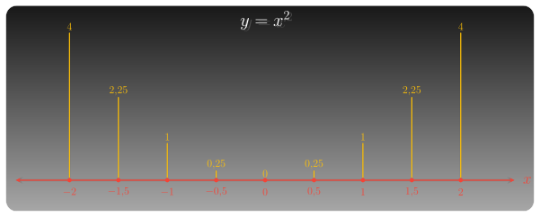

::: {.zo-gateway}

## Tổng quan

ZO Math 100+ là nhóm dự án học toán phổ thông theo một nguyên tắc giản dị: đi qua đủ nhiều trường hợp cụ thể để người học tự thấy các mô thức. Từ đó, bạn thấu hiểu bản chất và tự xây dựng được kiến thức bền vững cho mình, thay vì chỉ ghi nhớ công thức một cách thụ động.

Con số "100+" không nhằm tạo cảm giác nhiều bài tập. Nó biểu thị một trường quan sát đủ rộng. Một ví dụ đơn lẻ giúp ta hiểu một tình huống; một chuỗi đủ dài giúp ta nhận ra một mạch tư duy.

## Tinh thần 100+

::: {.zo-gateway-principles}

::: {.zo-gateway-principle}
**Quan sát đủ rộng**

Một trường hợp giúp ta hiểu một tình huống; nhiều trường hợp giúp ta nhận ra quy luật.
:::

::: {.zo-gateway-principle}
**So sánh có chủ đích**

Mỗi bài được đọc trong quan hệ với các bài khác: cái gì lặp đi lặp lại, cái gì biến mất, cái gì là phổ quát, cái gì là ngoại lệ.
:::

::: {.zo-gateway-principle}
**Khái quát có căn cứ**

Kết luận không xuất hiện như một công thức có sẵn, mà được rút ra từ dấu hiệu đã quan sát.
:::

:::

Mỗi dự án trong ZO Math 100+ bắt đầu từ những trường hợp cụ thể. Qua từng trường hợp, người học quan sát dữ kiện, đọc dấu hiệu, so sánh kết quả, rồi dần đi đến một cách nhìn khái quát hơn.

## Dự án đang triển khai

::: {.zo-section-list .zo-gateway-project-list}

::: {.zo-section-item .zo-gateway-project-card}

::: {.zo-gateway-project-media}

:::

::: {.zo-gateway-project-body}
### [100+ Hàm số: Sự biến thiên và đồ thị](100_ham_so_su_bien_thien_va_do_thi/index.qmd)

Đi qua nhiều hàm số cụ thể để đọc sự biến thiên, nhận diện hình dáng đồ thị, và dần hiểu hàm số như một quy luật có thể được quan sát, so sánh và khái quát.

::: {.zo-gateway-project-action}
[Vào dự án →](100_ham_so_su_bien_thien_va_do_thi/index.qmd)
:::

:::

:::

:::

## Cách học

Trước hết, hãy chọn một dự án đang triển khai. Ở mỗi dự án, đừng xem từng bài như một bài giải rời rạc. Hãy đọc mỗi trường hợp như một mảnh quan sát: đối tượng nào đang được xét, đại lượng nào thay đổi, dấu hiệu nào đáng chú ý, và kết quả ấy cho thấy điều gì về cấu trúc chung.

:::
