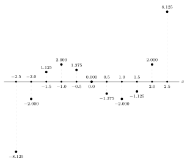
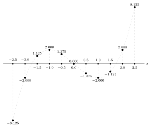
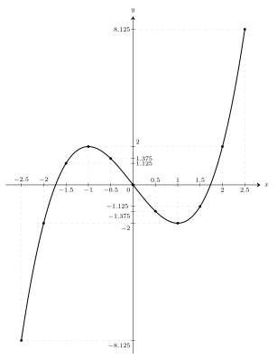

## Tự vấn

Ngày nay, khi gặp một hàm số, mình gần như lập tức nghĩ đến việc vẽ đồ thị của nó. Việc ấy quen thuộc đến mức mình từng không còn thấy có gì cần thắc mắc nữa: một trục ngang, một trục dọc, hai trục vuông góc với nhau, rồi một đường cong được vẽ lên đó.

{width=85%, fig-align="center"}

Mình thấy thầy cô vẽ như vậy. Mình thấy bạn bè vẽ như vậy. Mình thấy sách giáo khoa, sách tham khảo, bài giảng và lời giải đều vẽ như vậy. Lâu dần, hình ảnh ấy trở thành một điều hiển nhiên: đã nói đến đồ thị hàm số thì dường như phải có hai trục vuông góc và một đường cong.

Nhưng càng học toán, mình càng không muốn chấp nhận một hình vẽ chỉ vì nó luôn có mặt ở đó. Một điều quen thuộc không có nghĩa là nó đã được hiểu. Nếu mình chỉ làm theo, đồ thị sẽ mãi chỉ là một thủ tục: lập bảng giá trị, chấm vài điểm, nối chúng lại.

Vì sao lại làm như vậy? Vì sao phải có hai trục? Và vì sao hai trục ấy lại vuông góc?

Nói chính xác hơn, không phải mọi cách biểu diễn hàm số đều bắt buộc phải dùng hai trục vuông góc. Trong toán học, còn có những hệ tọa độ và cách biểu diễn khác. Nhưng trong cách học phổ thông quen thuộc, đồ thị hàm số thường được vẽ trong một hệ trục tọa độ vuông góc. Điều mình muốn hiểu là: vì sao cách vẽ ấy lại tự nhiên đến mức trở thành cách vẽ thông dụng nhất?

Mình không muốn bắt đầu bằng một định nghĩa có sẵn về đồ thị. Mình muốn đi chậm hơn: thử đặt mình vào tình huống chưa có hình vẽ ấy, rồi xem nhu cầu nào buộc mình phải tạo ra nó.

Hàm số cụ thể

$$
y=x^3-3x
$$

sẽ đồng hành cùng mình trong bài viết này.

Mình chọn hàm này không phải vì nó đặc biệt. Nó đủ đơn giản để mình tự tính các giá trị của $y$, nhưng cũng đủ thay đổi để các con số nhanh chóng trở nên khó nhìn bằng mắt. Chính chỗ khó nhìn ấy sẽ buộc mình phải tìm một cách biểu diễn khác.

Nói cách khác, mình không vẽ đồ thị vì thói quen. Mình vẽ vì mình cần một hình ảnh giúp mình nhìn thấy $y$ thay đổi như thế nào khi $x$ thay đổi.

## Biến đầu vào $x$ và biến phụ thuộc $y$

Trong một hàm số, $x$ là giá trị mình đưa vào. Công thức là một quy tắc đang chờ giá trị ấy. Khi mình đưa một giá trị $x$ vào công thức, công thức trả lại một giá trị $y$ tương ứng.

Có thể hình dung đơn giản như thế này. Nếu mình muốn biết nhiệt độ trong ngày thay đổi ra sao, mình có quyền chọn các thời điểm để đo: 6 giờ, 7 giờ, 8 giờ, 9 giờ. Nhưng tại mỗi thời điểm ấy, nhiệt độ không do mình chọn. Nhiệt độ là kết quả mình đo được. Với hàm số cũng vậy. Mình chọn $x$ để hỏi. Công thức trả lời bằng $y$.

Với hàm số

$$
y=x^3-3x,
$$

mình thử chọn các giá trị $x$ sau:

<table class="x-value-table">
  <tbody>
    <tr>
      <td>$-2.5$</td>
      <td>$-2.0$</td>
      <td>$-1.5$</td>
      <td>$-1.0$</td>
      <td>$-0.5$</td>
      <td>$0.0$</td>
    </tr>
    <tr>
      <td>$0.5$</td>
      <td>$1.0$</td>
      <td>$1.5$</td>
      <td>$2.0$</td>
      <td>$2.5$</td>
      <td></td>
    </tr>
  </tbody>
</table>

Mình chọn chúng cách nhau $0.5$ đơn vị. Mình chọn cách đều để dễ theo dõi. Nếu bước quá thưa, mình có thể bỏ lỡ một chỗ đổi chiều. Nếu bước quá dày, khối lượng tính toán lớn có thể đổi lại không thu được gì đáng nói. Ở đây, bước $0.5$ là vừa đủ cho một lần quan sát đầu tiên.

Thay từng giá trị $x$ vào công thức, mình thu được bảng sau:

<table class="xy-value-table">
  <thead>
    <tr>
      <th>$x$</th>
      <th>$y$</th>
    </tr>
  </thead>
  <tbody>
    <tr><td>$-2.5$</td><td>$-8.125$</td></tr>
    <tr><td>$-2.0$</td><td>$-2.000$</td></tr>
    <tr><td>$-1.5$</td><td>$1.125$</td></tr>
    <tr><td>$-1.0$</td><td>$2.000$</td></tr>
    <tr><td>$-0.5$</td><td>$1.375$</td></tr>
    <tr><td>$0.0$</td><td>$0.000$</td></tr>
    <tr><td>$0.5$</td><td>$-1.375$</td></tr>
    <tr><td>$1.0$</td><td>$-2.000$</td></tr>
    <tr><td>$1.5$</td><td>$-1.125$</td></tr>
    <tr><td>$2.0$</td><td>$2.000$</td></tr>
    <tr><td>$2.5$</td><td>$8.125$</td></tr>
  </tbody>
</table>

Nhìn vào bảng, mình thấy ngay sự khác nhau giữa hai cột $x$ và $y$. Các giá trị $x$ đi rất đều: mỗi lần tăng thêm $0.5$. Nhưng các giá trị $y$ không đi theo nhịp đều ấy.

Khi $x$ đi từ $-2.5$ đến $-1$, $y$ tăng từ $-8.125$ lên $2$. Khi $x$ tiếp tục đi đến $1$, $y$ lại giảm xuống $-2$. Rồi từ $1$ đến $2.5$, $y$ tăng trở lại đến $8.125$.

Như vậy, mình có thể cho $x$ thay đổi theo một nhịp do mình chọn, nhưng mình không thể bắt $y$ thay đổi theo nhịp ấy. Mình chủ động đưa vào $x$. Mình thu được $y$ thông qua công thức. Chính sự phụ thuộc này mới là điều mình muốn quan sát.

Bảng số ghi lại các kết quả một cách chính xác, nhưng nó chưa giúp mình nhìn thấy sự phụ thuộc ấy thật rõ. Muốn biết $y$ tăng hay giảm, mình phải đọc từng dòng. Muốn biết $y$ đổi chiều ở đâu, mình phải so sánh nhiều dòng liên tiếp. Muốn hình dung toàn bộ sự thay đổi, mình phải tự ráp các con số ấy lại trong đầu.

Đến đây, nhu cầu thật sự xuất hiện. Mình không chỉ muốn biết từng cặp giá trị $(x,y)$. Mình muốn nhìn thấy dáng điệu biến thiên của $y$ khi $x$ thay đổi.

Vì vậy, mình cần một cách biểu diễn khác. Cách ấy phải giữ được thứ tự thay đổi của $x$, đồng thời phải cho thấy giá trị $y$ tương ứng tại mỗi $x$. Nói cách khác, mình cần đặt vai trò đầu vào của $x$ và sự phụ thuộc của $y$ vào cùng một hình ảnh.

## Trục thứ nhất: $x$

Mình bắt đầu từ những giá trị $x$ đã chọn. Chúng có thứ tự $-2.5$ đứng trước $-2.0$, $-2.0$ đứng trước $-1.5$, rồi cứ thế cho đến $2.5$. Vì có thứ tự như vậy, mình đặt chúng lên một đường ngang, từ trái sang phải.

{width=95%, fig-align="center"}

Mình sẽ gọi đường này là trục $x$. Trục $x$ không chỉ giúp mình sắp xếp các giá trị $x$ theo thứ tự từ nhỏ đến lớn, mà nó còn ngụ ý rằng có vô số giá trị khác đang sẵn sàng được đưa vào hàm số. Mỗi mốc trên trục $x$ là một câu hỏi mình gửi vào hàm số: nếu $x$ bằng chừng này, thì $y$ bằng bao nhiêu?

Bây giờ, tại từng mốc $x$, mình cần đặt câu trả lời $y$ vào hình.

Nếu $y$ dương, mình dựng một đoạn đi lên từ mốc $x$. Nếu $y$ âm, mình dựng một đoạn đi xuống từ mốc $x$. Nếu $y=0$, đoạn ấy không vươn lên cũng không hạ xuống; nó nằm ngay trên đường ngang.

{width=95%, fig-align="center"}

Cách làm này có một điểm rất quan trọng. Khi mình dựng đoạn từ một mốc $x$, mình luôn nhận ra $y$ này là của $x$ này bất kể lúc nào. Mỗi đoạn vẫn bám vào đúng giá trị $x$ đã chọn. Đoạn chỉ đi lên hoặc đi xuống để biểu diễn giá trị $y$ mà công thức trả lại.

Ở đây, sự vuông góc bắt đầu có lí do. Nếu mình đã chọn đường ngang để sắp xếp các giá trị $x$, thì phương thẳng đứng là phương tự nhiên nhất để biểu diễn giá trị $y$ tại mỗi mốc $x$. Khi đi theo phương ấy, mình thay đổi độ cao mà không làm thay đổi vị trí ngang đã chọn.

Nhờ vậy, câu hỏi và câu trả lời được tách ra rõ ràng. Mốc trên đường ngang cho biết mình đã chọn $x$ nào. Đoạn dựng lên hoặc hạ xuống cho biết hàm số trả lại $y$ nào.

Mình còn thấy thêm một lí do khác. Tại mỗi mốc $x$ chỉ có một phương vuông góc với trục ngang, còn phương xiên thì có vô vàn cách chọn. Nếu dùng đoạn xiên, mình sẽ phải hỏi thêm: vì sao chọn góc này mà không chọn góc khác? Với đoạn thẳng đứng, lựa chọn ấy không còn tùy tiện nữa. Nó gắn trực tiếp với nhu cầu giữ nguyên mốc $x$ trong khi biểu diễn giá trị $y$.

Đến đây, bảng số đã bắt đầu có hình ảnh ban đầu. Các giá trị $y$ không còn nằm trong một cột khô khan nữa. Chúng trở thành những đoạn dài ngắn khác nhau, hướng lên hoặc hướng xuống, gắn với từng giá trị $x$.

Như vậy, mỗi cặp số trong bảng không còn chỉ là hai con số. Nó trở thành một dấu hiệu hình học: tại vị trí $x$, giá trị $y$ được biểu diễn bằng một độ cao có dấu.

## Điểm $(x,y)$ và đường cong

Nhìn các đoạn thẳng ấy một lúc, mình nhận ra phần thật sự cần nhìn là đầu mút của mỗi đoạn.

Không phải vì các đoạn đều vô ích. Chính các đoạn đã giúp mình thấy cách đưa $y$ ra khỏi bảng số. Nhưng sau khi đoạn đã làm xong việc của nó, đầu mút là nơi còn lại thông tin mình cần: nó cho biết giá trị $y$ được đặt ở mức nào ứng với giá trị $x$ đã chọn.

{width=95%, fig-align="center"}

Nếu chỉ giữ các đầu mút, mình có một dãy điểm. Mỗi điểm vẫn giữ lại đầy đủ thông tin của một cặp số trong bảng: giá trị $x$ cho biết điểm ấy nằm ở vị trí nào theo chiều ngang, còn giá trị $y$ cho biết điểm ấy cao hay thấp.

Trong các điểm đang xét, điểm ứng với $x=-2.5$ nằm thấp nhất, vì tại đó $y=-8.125$. Điểm ứng với $x=2.5$ nằm cao nhất, vì tại đó $y=8.125$. Một vài sự cân xứng cũng bắt đầu hiện ra. Chẳng hạn, điểm ứng với $x=-1$ và $y=2$ nằm đối lại với điểm ứng với $x=1$ và $y=-2$ qua vị trí nơi $x=0$ và $y=0$. Hai điểm thấp nhất và cao nhất vừa nói đến cũng vậy.

Việc chỉ giữ các đầu mút còn làm hình ảnh gọn hơn. Nếu mình chọn thêm nhiều giá trị $x$, các đoạn thẳng sẽ nhanh chóng làm hình vẽ trở nên dày và rối. Trong khi đó, các điểm vẫn giữ được hai thông tin quan trọng nhất: tại mỗi giá trị $x$, giá trị $y$ được đặt ở mức nào.

Các điểm ấy không còn buộc mình đọc từng dòng của bảng. Mắt mình bắt đầu thấy các xu hướng. Từ bên trái, các điểm đi lên. Sau đó chúng quay xuống. Rồi chúng lại đi lên.

Nhưng đến đây có một nghi vấn tự nhiên: mình mới chỉ có vài điểm; khoảng trống giữa hai điểm thì sao?

Ban đầu mình chỉ chọn một số giá trị $x$ để lập bảng. Nhưng hàm số không chỉ có bấy nhiêu giá trị ấy. Với công thức $y=x^3-3x$, giữa $-2.5$ và $-2$ còn rất nhiều giá trị $x$ khác; giữa $-2$ và $-1.5$ cũng vậy. 

Nếu mình chọn thêm nhiều giá trị $x$ hơn, các đầu mút sẽ xuất hiện ngày một nhiều hơn. Khi các giá trị $x$ được chọn ngày càng sát nhau, dãy điểm sẽ gợi ra một đường cong.

{width=95%, fig-align="center"}

Đường cong ấy là cách mình nhìn cùng một lúc rất nhiều câu trả lời của hàm số. Bảng cho mình các kết quả theo từng dòng. Đường cong cho mình dáng điệu chung của sự thay đổi.

## Trục thứ hai: $y$

Đường cong vừa vẽ ra giúp mình nhìn thấy hình thái tổng quan của sự thay đổi. Nhưng nó vẫn còn thiếu một điều quan trọng: mình cần đọc được giá trị $y$ tại một điểm bất kì trên đường cong theo một cách thống nhất.

Ở các bước trước, mỗi giá trị $y$ được biểu diễn bằng một đoạn đi lên hoặc đi xuống từ mốc $x$. Cách ấy giúp mình thấy độ cao của từng giá trị. Nhưng khi các điểm ngày càng nhiều, mình không thể giữ mãi các đoạn dựng đứng. Mình cũng không thể ghi nhãn giá trị $y$ cho tất cả các điểm trên đường cong. Ngay cả với một số hữu hạn điểm nhưng khá nhiều, hình ảnh sẽ nhanh chóng trở nên rối rắm.

Vì vậy, mình cần một trục đo chung để đọc các giá trị $y$. Trục đo ấy không thuộc riêng một điểm nào. Nó cho phép mình so sánh độ cao của mọi điểm trên hình theo cùng một mốc.

Mình dựng trục $y$ vuông góc với trục $x$ tại mốc $0$. Hãy để ý rằng, với mỗi điểm trên đường cong, mình có thể nhìn ngang sang trục $y$ để đọc giá trị $y$ của điểm đó.

Nhưng vì sao lại chọn vị trí đặt trục $y$ như thế?

Nếu chỉ cần một trục đo để đọc độ cao, mình có thể đặt nó ở bên trái, bên phải, hoặc gần một mốc $x$ nào đó. Nhưng khi đường thẳng đứng ấy trở thành trục của hình vẽ, nó không nên gắn với một giá trị $x$ tùy tiện. Nó cần đi qua mốc gốc của trục đo ngang, tức là qua vị trí $x=0$.

Lí do là ở đó hai phép đo gặp nhau một cách tự nhiên. Trên đường ngang, $x=0$ là mốc không lệch sang trái cũng không lệch sang phải. Trên chiều dọc, $y=0$ là mốc không cao lên cũng không thấp xuống. Khi đặt trục dọc qua $x=0$, giao điểm của hai trục trở thành điểm chung của hai mốc ấy: $x=0$ và $y=0$.

{width=95%, fig-align="center"}

Từ lúc này, hình vẽ có hai trục đo rõ ràng. Đường ngang giúp mình đọc giá trị $x$. Đường dọc giúp mình đọc giá trị $y$. Một điểm trên hình được hiểu bằng hai thao tác: nhìn xuống đường ngang để biết nó ứng với giá trị $x$ nào, rồi nhìn sang đường dọc để biết giá trị $y$ tương ứng là bao nhiêu.

Đây là nơi bản chất của hệ trục vuông góc hiện ra rõ nhất. Trong một hàm số, $y$ vẫn phụ thuộc vào $x$; vì thế không nên hiểu rằng $x$ và $y$ độc lập với nhau theo nghĩa giá trị. Điều độc lập ở đây là hai phương đo. Phương ngang dùng để xác định vị trí theo $x$. Phương dọc dùng để đo giá trị $y$. Khi đi ngang, mình thay đổi vị trí $x$ mà không thay đổi độ cao. Khi đi dọc, mình thay đổi độ cao mà không làm lệch vị trí $x$ đang xét.

Chính sự tách bạch ấy làm cho hệ trục vuông góc trở nên tự nhiên. Nó không trộn hai công việc vào nhau. Một hướng dùng để đi qua các giá trị đầu vào. Một hướng dùng để đo các giá trị mà hàm số trả lại.

Vì vậy, hai trục vuông góc không phải là một thói quen vẽ hình vô cớ. Chúng xuất hiện từ chính nhu cầu quan sát hàm số: mình cần một trục để sắp xếp các giá trị $x$, một trục để đo các giá trị $y$, và một điểm gốc chung nơi $x=0$ gặp $y=0$.

## Hình ảnh của sự biến thiên

Bảng có vai trò của bảng. Bảng cho mình các giá trị cụ thể. Nếu muốn biết tại $x=2.5$ thì $y$ bằng bao nhiêu, bảng trả lời ngay: $y=8.125$. Mỗi dòng của bảng là một câu trả lời chính xác của hàm số.

Nhưng điều mình đi tìm từ đầu không chỉ là từng câu trả lời riêng lẻ. Mình muốn biết $y$ thay đổi như thế nào khi $x$ thay đổi. Muốn thấy điều đó trong bảng, mình phải đọc nhiều dòng liên tiếp, so sánh các giá trị $y$, rồi tự hình dung trong đầu hướng đi chung của chúng.

Đồ thị làm việc ấy trực quan hơn. Khi các cặp giá trị $(x,y)$ được đặt thành điểm trên hai trục, mắt mình không chỉ thấy từng giá trị. Mình còn thấy cách các giá trị ấy nối nhau thành một hình dạng.

Với hàm số

$$
y=x^3-3x,
$$

bảng cho mình biết từng cặp số. Còn đồ thị cho mình thấy một chuyển động chung: từ bên trái, các điểm đi lên; sau đó quay xuống; rồi lại đi lên. Những điều ấy vẫn có trong bảng, nhưng bảng giấu chúng trong các dòng số. Đồ thị đưa chúng ra trước mắt.

Vì vậy, đồ thị không thay thế bảng giá trị. Nó làm một việc khác. Bảng giữ sự chính xác của từng kết quả. Đồ thị cho mình hình ảnh tổng thể của sự biến thiên.

Đồ thị là cách nhìn cùng một lúc rất nhiều câu trả lời của hàm số. Mỗi điểm trên đường cong vẫn ứng với một cặp giá trị $(x,y)$, nhưng toàn bộ đường cong cho mình thấy cách $y$ đi theo $x$.

Nói gọn lại, với một hàm số $y=f(x)$, đồ thị của nó là tập hợp các điểm có dạng $(x,f(x))$ trong mặt phẳng tọa độ. Nhưng trong bài viết này, mình không đi từ định nghĩa ấy. Mình đi từ nhu cầu nhìn thấy sự biến thiên, rồi mới thấy vì sao định nghĩa ấy trở nên tự nhiên.

## Kết tinh

Bây giờ mình trở lại câu hỏi ban đầu.

Vì sao đồ thị hàm số thường được vẽ bằng hai trục vuông góc?

Vì mình muốn nhìn thấy sự thay đổi của $y$ khi $x$ thay đổi. Để làm việc đó, mình cần tách hai vai trò ra rõ ràng. $x$ là giá trị mình chủ động chọn, nên các giá trị $x$ được đặt theo thứ tự trên một đường ngang. $y$ là giá trị công thức trả lại, nên tại mỗi vị trí $x$, mình cần biểu diễn $y$ bằng một độ cao để tiện quan sát.

Độ cao ấy cần đi theo một phương không làm lệch mốc $x$ đang xét. Khi biểu diễn $y$, mình muốn thay đổi độ cao mà vẫn giữ nguyên vị trí ngang. Vì vậy, từ mỗi mốc $x$, giá trị $y$ được dựng lên hoặc hạ xuống theo phương vuông góc với đường ngang.

Sau đó, khi chỉ giữ lại các đầu mút, mình có các điểm. Mỗi điểm giữ lại đầy đủ hai thông tin: nó nằm ở đâu theo chiều ngang để cho biết $x$, và nó cao hay thấp để cho biết $y$. Khi cần đọc mọi giá trị $y$ bằng một trục đo chung, trục dọc xuất hiện. Trục ấy được đặt qua $x=0$ để hai mốc gốc gặp nhau tại một điểm chung: $x=0$ và $y=0$.

Như vậy, hai trục vuông góc xuất hiện từ chính nhu cầu quan sát hàm số. Trục ngang giúp mình đi qua các giá trị $x$. Trục dọc giúp mình đo các giá trị $y$. Sự vuông góc giúp hai việc ấy không lẫn vào nhau: đi ngang là thay đổi $x$ trong khi giữ nguyên độ cao; đi dọc là thay đổi độ cao trong khi giữ nguyên $x$.

Dĩ nhiên, hệ trục vuông góc không phải là cách biểu diễn duy nhất trong toán học. Nhưng với nhu cầu đang xét ở đây---nhìn sự biến thiên của một đại lượng $y$ theo một đại lượng $x$---nó là một cách biểu diễn rất tự nhiên, rõ ràng và dễ đọc.

Khi hiểu như vậy, hai trục vuông góc không còn là một thủ tục phải nhớ. Chúng trở thành câu trả lời tự nhiên cho một nhu cầu rất căn bản: làm sao để nhìn thấy một đại lượng thay đổi theo một đại lượng khác.

## Câu hỏi khai thác

Xét hàm số

$$
y=x^3-3x.
$$

#### Từ bảng số đến nhu cầu nhìn bằng mắt

1. Lập bảng giá trị $y$ ứng với các giá trị $x$ sau:

$$
-2.5,\; -2,\; -1.5,\; -1,\; -0.5,\; 0,\; 0.5,\; 1,\; 1.5,\; 2,\; 2.5.
$$

2. Nhìn vào bảng vừa lập, hãy cho biết khi $x$ tăng từ $-2.5$ đến $2.5$, giá trị $y$ có luôn giữ một xu hướng thay đổi không? Hãy chỉ ra những khoảng mà $y$ tăng, giảm, rồi tăng trở lại.

3. Chỉ nhìn vào bảng giá trị, ta có hình dung rõ ràng được toàn bộ sự biến thiên của $y$ theo $x$ không? Vì sao ta bắt đầu cần một hình ảnh trực quan hơn?

#### Từ mốc $x$ đến đoạn biểu diễn $y$

4. Đặt các giá trị $x$ đã chọn lên một đường ngang theo thứ tự từ trái sang phải. Vì sao đường ngang này phù hợp để biểu diễn các giá trị đầu vào?

5. Tại mỗi mốc $x$, hãy dựng một đoạn thẳng đứng biểu diễn giá trị $y$: đi lên nếu $y>0$, đi xuống nếu $y<0$, và không vươn lên hay hạ xuống nếu $y=0$.

6. Khi dựng đoạn thẳng đứng tại một mốc $x$, thông tin nào được giữ nguyên? Thông tin nào được biểu diễn thêm?

7. Vì sao trong cách dựng này, phương thẳng đứng giúp ta biểu diễn $y$ mà không làm thay đổi mốc $x$ đang xét?

#### Từ đoạn thẳng đến điểm $(x,y)$

8. Sau khi dựng các đoạn biểu diễn $y$, hãy chỉ giữ lại các đầu mút của chúng. Mỗi đầu mút giữ lại hai thông tin nào?

9. Giải thích vì sao đầu mút ứng với $x=-2$ có thể được gọi là điểm $(-2,-2)$, còn đầu mút ứng với $x=1$ có thể được gọi là điểm $(1,-2)$.

10. Hai điểm $(-2,-2)$ và $(1,-2)$ có cùng giá trị $y$. Chúng giống nhau ở điểm nào và khác nhau ở điểm nào trên hình vẽ?

11. Hai điểm $(-1,2)$ và $(1,-2)$ có quan hệ gì với nhau qua điểm $(0,0)$? Quan sát này nói gì về hình dạng của đồ thị?

#### Từ vài điểm đến đường cong

12. Nếu chỉ chọn 11 giá trị $x$ như trên, ta có thể biết chính xác toàn bộ đồ thị không? Vì sao?

13. Nếu chọn thêm các giá trị $x$ nằm giữa hai mốc liên tiếp, chẳng hạn giữa $0$ và $0.5$, thì các điểm mới sẽ giúp hình vẽ rõ hơn như thế nào?

14. Vì sao đường cong trong hình không nên được hiểu đơn giản là "nối đại các điểm lại", mà nên được hiểu là hình ảnh gợi ra khi ta xét ngày càng nhiều giá trị $x$?

15. Với hàm số $y=x^3-3x$, hãy giải thích bằng lời câu sau: "Mỗi điểm trên đồ thị là một câu trả lời của hàm số."

#### Vai trò của trục $y$

16. Khi đã có nhiều điểm trên hình, vì sao ta không nên ghi giá trị $y$ trực tiếp bên cạnh từng điểm?

17. Trục $y$ giúp ta đọc giá trị $y$ của một điểm trên đồ thị bằng cách nào?

18. Vì sao trục $y$ nên đi qua mốc $x=0$, thay vì đi qua một giá trị $x$ tùy ý như $x=1$ hay $x=-2$?

19. Giao điểm của hai trục biểu diễn đồng thời hai điều kiện nào?

20. Hãy giải thích vì sao gốc tọa độ không chỉ là "chỗ hai trục cắt nhau", mà là nơi hai mốc gốc $x=0$ và $y=0$ gặp nhau.

#### Vì sao hai trục vuông góc?

21. Trong hình vẽ quen thuộc, trục ngang dùng để làm gì? Trục dọc dùng để làm gì?

22. Khi đi theo phương ngang, đại lượng nào thay đổi trực tiếp? Khi đi theo phương dọc, đại lượng nào thay đổi trực tiếp?

23. Vì sao hai phương vuông góc giúp ta tách rõ hai việc: chọn giá trị $x$ và đo giá trị $y$?

24. Nếu đoạn biểu diễn $y$ bị nghiêng đi, điều gì sẽ trở nên kém rõ ràng hơn so với khi nó được dựng thẳng đứng tại mốc $x$?

25. Hãy viết một đoạn ngắn giải thích câu sau: "Sự vuông góc giúp việc đọc $x$ và đọc $y$ không lẫn vào nhau."

#### Hệ trục vuông góc không phải lựa chọn duy nhất

26. Có phải mọi cách biểu diễn hàm số trong toán học đều bắt buộc phải dùng hai trục vuông góc không?

27. Vì sao, dù không phải lựa chọn duy nhất, hệ trục vuông góc vẫn là cách biểu diễn rất tự nhiên khi ta muốn quan sát $y$ thay đổi theo $x$?

28. Trong bài luận này, hệ trục vuông góc xuất hiện từ nhu cầu nào: từ thói quen vẽ hình, hay từ nhu cầu quan sát sự biến thiên?

29. Hãy phân biệt hai phát biểu sau:
  * "Hàm số bắt buộc phải được vẽ bằng hai trục vuông góc."
  * "Hai trục vuông góc là một cách biểu diễn tự nhiên và thông dụng để quan sát sự biến thiên của hàm số."

30. Phát biểu nào chính xác hơn? Vì sao?

#### Kết tinh

31. Hãy viết lại bằng lời của mình: đồ thị của hàm số $y=f(x)$ là gì?

32. Vì sao có thể nói bảng giá trị cho ta các con số, còn đồ thị cho ta hình ảnh của sự biến thiên?

33. Nếu một người chỉ biết “chấm điểm rồi nối lại” mà không hiểu vai trò của hai trục, người đó đang thiếu ý tưởng nào?

34. Một cách nghĩ quen thuộc là xem $y=x^3-3x$ như phương trình của một đường cong, rồi lấy các cặp điểm $(x,y)$ để vẽ đường cong ấy trong mặt phẳng tọa độ. Cách nghĩ này đã giả định sẵn điều gì mà ta đang muốn truy ngược lại?

    **Gợi ý.** Cách nghĩ đó đúng và rất quan trọng trong hình học giải tích. Nhưng nó đã giả định rằng mặt phẳng tọa độ cùng hai trục của nó đã có sẵn. Mình đi lùi thêm một bước: trước khi xem công thức là phương trình của một đường cong, mình muốn hiểu vì sao các cặp giá trị $(x,y)$ lại được đặt vào một hệ trục vuông góc như vậy.

35. Sau khi trả lời các câu hỏi trên, hãy quay lại trả lời câu hỏi: "Vì sao đồ thị của hàm số thường được vẽ bằng hai trục vuông góc?"
