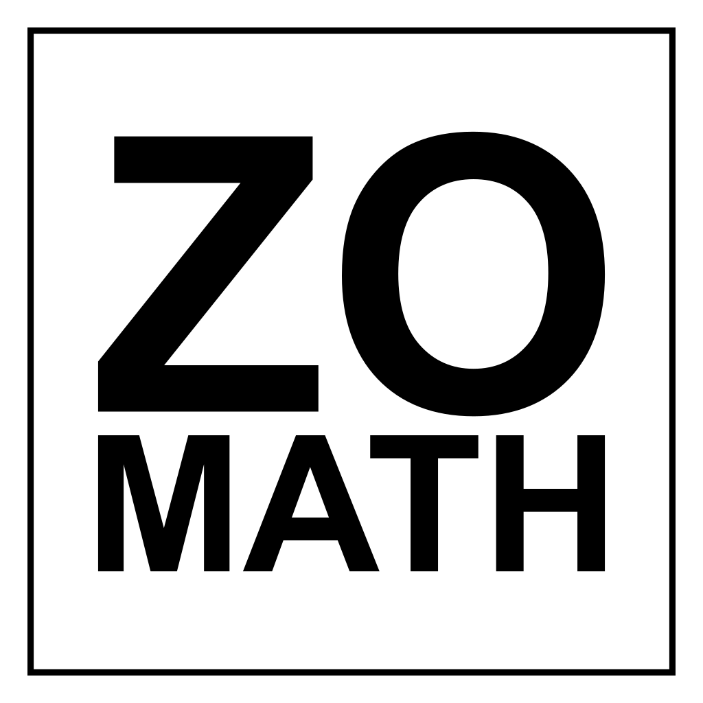

::: {.zo-home}

::: {.zo-home-hero}

::: {.zo-home-hero-inner}

::: {.zo-home-hero-copy}

# ZO Math

::: {.zo-home-tagline}
Học toán từ gốc, nhìn lại bằng chính tư duy của mình.
:::

::: {.zo-home-lead}
Một không gian học toán theo tinh thần **lập luận và hiểu nghĩa**:
đi từ chương trình phổ thông, đọc sâu các ý niệm nền tảng, thiết kế khóa học,
và thử nghiệm cách trình bày giúp người học tự dựng lại con đường hiểu.
:::

::: {.zo-home-actions}
[Khởi đầu từ Phổ thông](content/thpt/index.qmd){.zo-home-primary-link}
:::

:::

::: {.zo-home-hero-mark}
{.zo-home-logo}
:::

:::

:::

::: {.zo-home-section}

::: {.zo-home-section-head}

::: {.zo-home-kicker}
Mạch chính
:::

## Chọn mạch phù hợp với nhu cầu hiện tại của bạn

:::

::: {.zo-home-grid}

::: {.zo-home-card}

### [Phổ thông](content/thpt/index.qmd)

Học Toán phổ thông theo tinh thần lập luận và hiểu nghĩa.

:::

::: {.zo-home-card}

### [Đi tìm](content/di_tim/index.qmd)

Đi tìm ý nghĩa của toán học qua những tác phẩm và tác giả mà ZO Math quan tâm.

:::

::: {.zo-home-card}

### [Khóa học](content/khoa_hoc/index.qmd)

Các khóa học do ZO Math thiết kế, lấy tinh thần kiến tạo tri thức làm nguyên tắc xuyên suốt cho từng chủ đề toán học.

:::

::: {.zo-home-card}

### [Kiến tạo](content/kien_tao/index.qmd)

Các chủ đề toán học qua cách viết và cách nhìn của ZO Math.

:::

:::

:::

::: {.zo-home-section}

::: {.zo-home-section-head}

::: {.zo-home-kicker}
Đại diện
:::

## Những nội dung đại diện cho bốn mạch

:::

::: {.zo-representative-list}

::: {.zo-representative-group}

::: {.zo-representative-label}
Phổ thông
:::

::: {.zo-representative-items}

::: {.zo-section-item}
### [Đề thi](content/thpt/de_thi_vao_dai_hoc/index.qmd)

Ôn tập bằng đề thi thật: mỗi câu hỏi được dùng để mài sắc kiến thức, rèn cách lập luận và mở sang những phần liên quan cần củng cố trước ngày thi. 
:::

::: {.zo-section-item}
### [100+ Hàm số](content/thpt/zo_math_100/index.qmd)

Khảo sát hơn 100 hàm số cụ thể để đọc sự biến thiên, hình dáng đồ thị và cách từng ví dụ mở ra cái nhìn khái quát.
:::

:::

:::

::: {.zo-representative-group}

::: {.zo-representative-label}
Đi tìm
:::

::: {.zo-representative-items}

::: {.zo-section-item}
### [Đi tìm Toán học](content/di_tim/di_tim_toan_hoc/di_tim_toan_hoc.qmd)

Một hành trình đọc lại toán học qua những câu hỏi về ý nghĩa, cấu trúc và phương pháp.
:::

::: {.zo-section-item}
### [Đi tìm Xác suất](content/di_tim/di_tim_xac_suat/interpretations_of_probability_translation.qmd)

Một hành trình đọc xác suất từ toán học, triết học và nhận thức luận.
:::

:::

:::

::: {.zo-representative-group}

::: {.zo-representative-label}
Khóa học
:::

::: {.zo-representative-items}

::: {.zo-section-item}
### [Xác suất và Thống kê](content/khoa_hoc/xac_suat_va_thong_ke/index.qmd)

Một lộ trình học về mô hình xác suất, biến ngẫu nhiên, dữ liệu và suy luận thống kê.
:::

::: {.zo-section-item}
### [Lí trí trong thế giới bất định](content/khoa_hoc/li_tri_trong_the_gioi_bat_dinh/gioi_thieu_khoa_hoc.qmd)

Một khóa học về xác suất, công bằng, quyết định và lập luận trong những tình huống không chắc chắn.
:::

:::

:::

::: {.zo-representative-group}

::: {.zo-representative-label}
Kiến tạo
:::

::: {.zo-representative-items}

::: {.zo-section-item}
### [Dịu dàng và gai gốc](content/kien_tao/diu_dang_va_gai_goc/diu_dang_va_gai_goc.qmd)

Một bài viết thử nhìn toán học qua hai phẩm chất tưởng như đối nghịch: dịu dàng và gai gốc.
:::

::: {.zo-section-item}
### [Tiến và thoái](content/kien_tao/tien_va_thoai/index.qmd)

Một chủ đề về cách đi tới và đi lui trong lập luận toán học.
:::

:::

:::

:::

:::

::: {.zo-home-section .zo-home-featured}

::: {.zo-home-section-head}

::: {.zo-home-kicker}
Nội dung nổi bật
:::

## Một vài điểm bắt đầu cụ thể

:::

::: {.zo-feature-list}

::: {.zo-feature-item}
### [100+ Hàm số: Sự biến thiên và đồ thị](content/thpt/zo_math_100/100_ham_so_su_bien_thien_va_do_thi/index.qmd)

Một dự án dài hơi để đọc hàm số qua miền xác định, giới hạn, đạo hàm, biến thiên và đồ thị.
:::

::: {.zo-feature-item}
### [What is Mathematics?](content/di_tim/di_tim_toan_hoc/what_is_mathematics.qmd)

Một điểm vào cho tinh thần đọc sâu: không chỉ học kết quả, mà lần theo cách toán học tự hình thành.
:::

::: {.zo-feature-item}
### [Các diễn giải xác suất](content/di_tim/di_tim_xac_suat/interpretations_of_probability_translation.qmd)

Bản dịch và ghi chú về các cách hiểu xác suất: cổ điển, logic, chủ quan và vật lý.
:::

::: {.zo-feature-item}
### [Bách khoa Kí hiệu Toán học](content/kien_tao/bach_khoa_ky_hieu_toan_hoc/bach_khoa_ky_hieu_toan_hoc.qmd)

Một hướng viết nhằm làm rõ đời sống của ký hiệu: nó ghi gì, che gì, và giúp ta nghĩ ra sao.
:::

:::

:::

::: {.zo-home-section}

::: {.zo-home-section-head}

::: {.zo-home-kicker}
Nhánh đang phát triển
:::

## Những mạch mới sẽ được nối dần vào hệ sinh thái

:::

::: {.zo-section-list}

::: {.zo-section-item}
### [Vì sao đồ thị được vẽ bằng hai trục vuông góc?](content/vi_sao/lop_12/vi_sao_do_thi_ham_so_duoc_ve_bang_hai_truc_vuong_goc/vi_sao_do_thi_duoc_ve_bang_hai_truc_vuong_goc.qmd)

Một bài trong mạch “Vì sao”, đi từ nhu cầu biểu diễn đến cấu trúc của đồ thị hàm số.
:::

::: {.zo-section-item}
### [Luận và hiểu Toán phổ thông](content/kien_tao/luan_va_hieu_toan_pho_thong/luan_va_hieu_toan_pho_thong.qmd)

Một hướng kiến tạo lại toán phổ thông bằng văn bản dài, chậm và có cấu trúc.
:::

::: {.zo-section-item}
### [ZO Chuyển ngữ](content/di_tim/luan_ve_tam_giac_so_hoc/gioi_thieu.qmd)

Các bản dịch, chuyển ngữ và tái trình bày những văn bản toán học có giá trị.
:::

::: {.zo-section-item}
### [Mẫu số liệu ghép nhóm](content/cong_cu/mau_so_lieu_ghep_nhom_dac_trung_do_xu_the_trung_tam/mau_so_lieu_ghep_nhom_dac_trung_do_xu_the_trung_tam.qmd)

Một ghi chú thử nghiệm trong ZO Lab về dữ liệu, bảng ghép nhóm và đặc trưng đo xu thế trung tâm.
:::

:::

:::

::: {.zo-home-section .zo-home-note}

::: {.zo-home-kicker}
Tinh thần học tập
:::

## Học toán bằng lập luận và hiểu nghĩa.

ZO Math không xem toán học như một danh sách công thức cần ghi nhớ. Mỗi bài học cố gắng giữ lại câu hỏi ban đầu: khái niệm ấy xuất hiện từ nhu cầu nào, được dựng lên ra sao, và người học có thể tự mình đi lại con đường ấy để tiếp tục mở rộng đến đâu.

:::

:::
