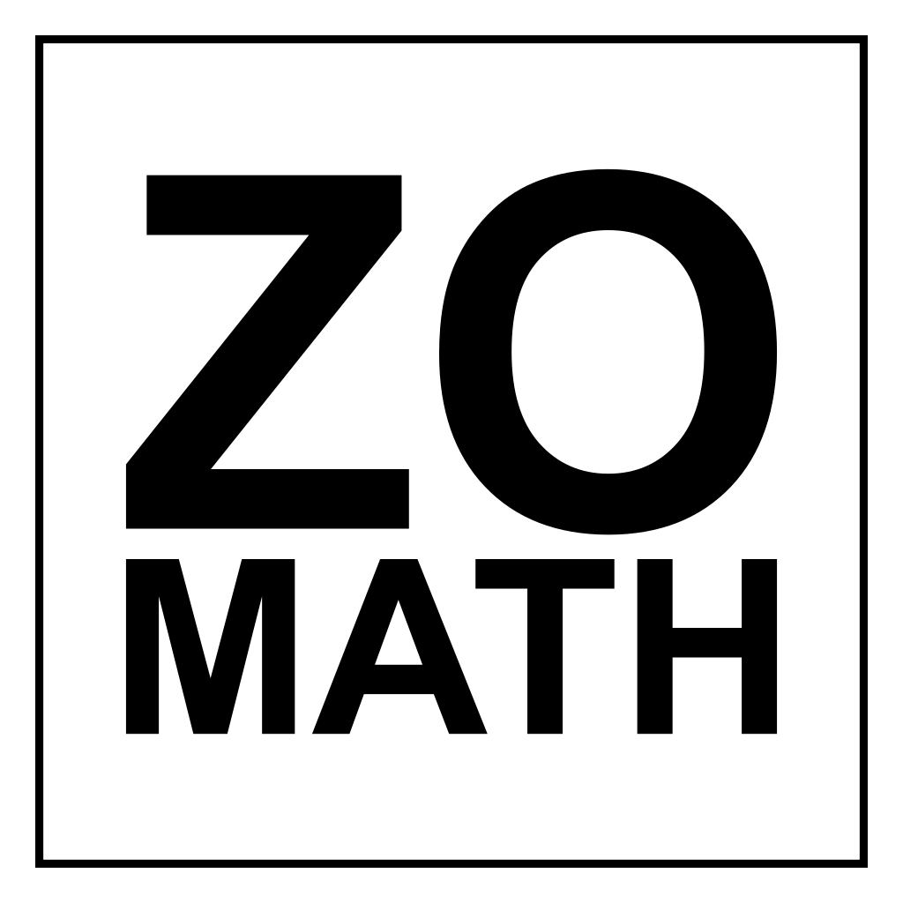

::: {.zo-home}

::: {.zo-home-hero}

::: {.zo-home-hero-inner}

::: {.zo-home-hero-copy}

# ZO Math

::: {.zo-home-tagline}
Học toán để hiểu, suy nghĩ và tự kiểm tra điều mình cho là đúng.
:::

::: {.zo-home-lead}
ZO Math là một không gian giáo dục toán học, nơi kiến thức không chỉ được trình bày để ghi nhớ hay áp dụng, mà còn được tổ chức để người học nhận ra quan hệ và cấu trúc, hiểu vì sao một kết luận đúng, biết khi nào một phương pháp có hiệu lực và có thể tự kiểm tra sự hiểu của mình.

Từ toán phổ thông đến những hướng học sâu hơn, ZO Math xây dựng bài viết, khóa học, video và các tài nguyên học tập nhằm làm cho toán học trở nên có nghĩa và đáng để suy nghĩ.
:::

::: {.zo-home-actions}
[Khởi đầu từ Phổ thông](content/thpt/index.qmd){.zo-home-primary-link}
:::

:::

::: {.zo-home-hero-mark}
{.zo-home-logo}
:::

:::

:::

::: {.zo-home-section}

::: {.zo-home-section-head}

::: {.zo-home-kicker}
Mạch chính
:::

## Các mạch nội dung của ZO Math

:::

::: {.zo-home-grid}

::: {.zo-home-card}

### [Phổ thông](content/thpt/index.qmd)

Giúp người học kết nối điều đang học với tri thức đã có, đi đến những kết luận có căn cứ và tự kiểm tra điều mình cho là đúng.

:::

::: {.zo-home-card}

### [Đi tìm](content/di_tim/index.qmd)

Đi tìm ý nghĩa của toán học qua những tác phẩm và tác giả mà ZO Math quan tâm.

:::

::: {.zo-home-card}

### [Khóa học](content/khoa_hoc/index.qmd)

Các lộ trình học có cấu trúc, giúp người học thấy những ý tưởng liên hệ với nhau và từng bước sử dụng được kiến thức đã học.

:::

::: {.zo-home-card}

### [Kiến tạo](content/kien_tao/index.qmd)

Các chủ đề toán học qua cách viết và cách nhìn của ZO Math.

:::

:::

:::

::: {.zo-home-section}

::: {.zo-home-section-head}

::: {.zo-home-kicker}
Đại diện
:::

## Nội dung đại diện theo mạch

:::

::: {.zo-representative-list}

::: {.zo-representative-group}

::: {.zo-representative-label}
Phổ thông
:::

::: {.zo-representative-items}

::: {.zo-section-item}
### [Đề thi](content/thpt/de_thi_vao_dai_hoc/index.qmd)

Đọc đề thi thật như một bản đồ ôn tập: từ mỗi câu hỏi lần ngược về kiến thức, lập luận và kĩ năng cần củng cố.
:::

::: {.zo-section-item}
### [ZO Math 100+](content/thpt/zo_math_100/index.qmd)

Các chuỗi bài đi qua nhiều trường hợp của cùng một chủ đề để người học có cơ hội so sánh, nhận ra điều lặp lại, phát hiện ngoại lệ và từng bước thấy được những quan hệ, cấu trúc chung.
:::

:::

:::

::: {.zo-representative-group}

::: {.zo-representative-label}
Đi tìm
:::

::: {.zo-representative-items}

<!--
::: {.zo-section-item}
### [Đi tìm Toán học](content/di_tim/di_tim_toan_hoc/di_tim_toan_hoc.qmd)

Một hành trình đọc lại toán học qua những câu hỏi về ý nghĩa, cấu trúc và phương pháp.
:::
-->

<!--
::: {.zo-section-item}
### [Đi tìm Xác suất](content/di_tim/di_tim_xac_suat/interpretations_of_probability_translation.qmd)

Một hành trình đọc xác suất từ toán học, triết học và nhận thức luận.
:::
-->

:::

:::

::: {.zo-representative-group}

::: {.zo-representative-label}
Khóa học
:::

::: {.zo-representative-items}

::: {.zo-section-item}
### [Xác suất và Thống kê](content/khoa_hoc/xac_suat_va_thong_ke/index.qmd)

Một lộ trình học về mô hình xác suất, biến ngẫu nhiên, dữ liệu và suy luận thống kê.
:::

::: {.zo-section-item}
### [Lí trí trong thế giới bất định](content/khoa_hoc/li_tri_trong_the_gioi_bat_dinh/gioi_thieu_khoa_hoc.qmd)

Một khóa học về xác suất, công bằng, quyết định và lập luận trong những tình huống không chắc chắn.
:::

:::

:::

::: {.zo-representative-group}

::: {.zo-representative-label}
Kiến tạo
:::

::: {.zo-representative-items}

::: {.zo-section-item}
### [Dịu dàng và gai gốc](content/kien_tao/diu_dang_va_gai_goc/diu_dang_va_gai_goc.qmd)

Một bài viết thử nhìn toán học qua hai phẩm chất tưởng như đối nghịch: dịu dàng và gai gốc.
:::

::: {.zo-section-item}
### [Tiến và thoái](content/kien_tao/tien_va_thoai/index.qmd)

Một chủ đề về cách đi tới và đi lui trong lập luận toán học.
:::

:::

:::

:::

:::

::: {.zo-home-section .zo-home-featured}

::: {.zo-home-section-head}

::: {.zo-home-kicker}
Nổi bật
:::

## Một số nội dung để bắt đầu

:::

::: {.zo-feature-list}

::: {.zo-feature-item}
### [100+ Hàm số](content/thpt/zo_math_100/100_ham_so_su_bien_thien_va_do_thi/index.qmd)

Khảo sát nhiều hàm số cụ thể để từ sự đa dạng của các trường hợp, người học từng bước nhận ra những quan hệ, cấu trúc và câu hỏi chung của việc học về hàm số.
:::

<!--
::: {.zo-feature-item}
### [What is Mathematics?](content/di_tim/di_tim_toan_hoc/what_is_mathematics.qmd)

Một điểm vào cho tinh thần đọc sâu: không chỉ học kết quả, mà lần theo cách toán học tự hình thành.
:::
-->

<!--
::: {.zo-feature-item}
### [Các diễn giải xác suất](content/di_tim/di_tim_xac_suat/interpretations_of_probability_translation.qmd)

Bản dịch và ghi chú về các cách hiểu xác suất: cổ điển, logic, chủ quan và vật lý.
:::
-->

::: {.zo-feature-item}
### [Bách khoa Kí hiệu Toán học](content/kien_tao/bach_khoa_ky_hieu_toan_hoc/bach_khoa_ky_hieu_toan_hoc.qmd)

Một hướng viết nhằm làm rõ đời sống của ký hiệu: nó ghi gì, che gì, và giúp ta nghĩ ra sao.
:::

:::

:::

::: {.zo-home-section}

::: {.zo-home-section-head}

::: {.zo-home-kicker}
Đang phát triển
:::

## Một số nội dung đang xây dựng

:::

::: {.zo-section-list}

::: {.zo-section-item}
### [Vì sao đồ thị được vẽ bằng hai trục vuông góc?](content/vi_sao/lop_12/vi_sao_do_thi_ham_so_duoc_ve_bang_hai_truc_vuong_goc/vi_sao_do_thi_duoc_ve_bang_hai_truc_vuong_goc.qmd)

Một bài trong mạch “Vì sao”, đi từ nhu cầu biểu diễn đến cấu trúc của đồ thị hàm số.
:::

::: {.zo-section-item}
### [ZO Chuyển ngữ](content/di_tim/luan_ve_tam_giac_so_hoc/gioi_thieu.qmd)

Các bản dịch, chuyển ngữ và tái trình bày những văn bản toán học có giá trị.
:::

::: {.zo-section-item}
### [Mẫu số liệu ghép nhóm](content/cong_cu/mau_so_lieu_ghep_nhom_dac_trung_do_xu_the_trung_tam/mau_so_lieu_ghep_nhom_dac_trung_do_xu_the_trung_tam.qmd)

Một ghi chú thử nghiệm trong ZO Lab về dữ liệu, bảng ghép nhóm và đặc trưng đo xu thế trung tâm.
:::

:::

:::

::: {.zo-home-section .zo-home-note}

::: {.zo-home-kicker}
Tinh thần học tập
:::

## Không chỉ biết cách làm.

ZO Math coi việc học toán là quá trình xây dựng sự hiểu biết cùng với khả năng sử dụng kiến thức. Người học cần có cơ hội nhận ra quan hệ và cấu trúc, đặt câu hỏi, giải thích, kiểm tra một kết luận và biết dựa vào đâu để tin điều mình đang làm là đúng.

Kĩ thuật, tính toán và sự thành thạo vẫn cần thiết. Điều ZO Math muốn tránh là để chúng trở thành những thao tác rời khỏi ý nghĩa, khiến người học có thể làm được một bài nhưng khó giải thích vì sao cách làm ấy có hiệu lực hoặc phải làm gì khi tình huống thay đổi.

Trong môi trường có AI, điều này càng quan trọng: công cụ có thể thực hiện ngày càng nhiều phần của công việc toán học, nhưng người học vẫn cần hiểu điều mình đang làm, kiểm tra điều mình nhận được và chịu trách nhiệm về điều mình khẳng định.

:::

:::
